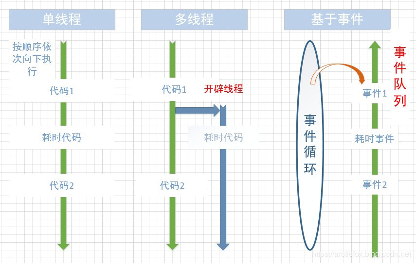
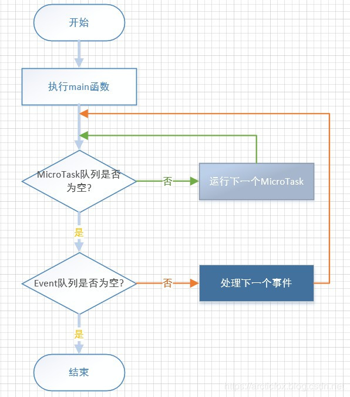

# Dart的异步模型 

## 概述
编程中的代码执行，通常分为同步与异步两种。

### 同步：
简单说，同步就是按照代码的编写顺序，从上到下依次执行，这也是最简单的我们最常接触的一种形式。但是同步代码的缺点也显而易见，如果其中某一行或几行代码非常耗时，那么就会阻塞，使得后面的代码不能被立刻执行。

### 异步：
异步的出现正是为了解决这种问题，它可以使某部分耗时代码不在当前这条执行线路上立刻执行，那究竟怎么执行呢？最常见的一种方案是使用多线程，也就相当于开辟另一条执行线，然后让耗时代码在另一条执行线上运行，这样两条执行线并列，耗时代码自然也就不能阻塞主执行线上的代码了。

`多线程`虽然好用，但是在大量并发时，仍然存在两个较大的缺陷，一个是开辟线程比较耗费资源，线程开多了机器吃不消，另一个则是线程的锁问题，多个线程操作共享内存时需要加锁，复杂情况下的锁竞争不仅会降低性能，还可能造成死锁。因此又出现了基于事件的异步模型。

`异步模型`简单说就是在某个单线程中存在一个事件循环和一个事件队列，事件循环不断的从事件队列中取出事件来执行，这里的事件就好比是一段代码，每当遇到耗时的事件时，事件循环不会停下来等待结果，它会跳过耗时事件，继续执行其后的事件。当不耗时的事件都完成了，再来查看耗时事件的结果。因此，耗时事件不会阻塞整个事件循环，这让它后面的事件也会有机会得到执行。

我们很容易发现，这种基于事件的异步模型，只适合`I/O密集型`的耗时操作，因为I/O耗时操作，往往是把时间浪费在等待对方传送数据或者返回结果，因此这种异步模型往往用于网络服务器并发。如果是`计算密集型`的操作，则应当尽可能利用处理器的多核，实现并行计算。



## Dart的事件循环
Dart是单线程模型，也就没有了所谓的主线程/子线程之分。一旦某个Dart的函数开始执行，它将执行到这个函数结束，也就是Dart的函数不会被其他Dart代码打断。

Dart是事件驱动的体系结构，该结构基于具有单个事件循环和两个队列的单线程执行模型。Dart虽然提供调用堆栈。 但是它使用事件在生产者和消费者之间传输上下文。 事件循环由单个线程支持，因此根本不需要同步和锁定。

**Dart的两个队列分别是:**
- MicroTask queue 微任务队列
- Event queue 事件队列



isolate是有自己的内存和单线程控制的运行实体，isolate类似于线程。 运行中的 Flutter 程序由一个或多个 isolate 组成。我们的代码默认都在 Main isolate中执行。

为了保持高的响应性，特别耗时的任务一般不要放在Main isolate 中。但 isolate 不是本文的重点，在此就不过多赘述。

Dart事件循环执行如上图所示:Main isolate 中有一个Looper，但存在两个Queue:Event Queue 和 Microtask Queue 。 

因为 isolate 是单线程实体，所以 isolate中的代码是按顺序执行的。

所以 dart 中的代码执行优先级可以分为三个级别：(Dart 中事件的执行顺序：Main > MicroTask > EventQueue。)
1. 在 Main 中写代码将最先执行
2. 执行完 Main 中的代码，先查看MicroTask队列是否为空，不是则先执行MicroTask队列
3. 一个MicroTask执行完后，检查有没有下一个MicroTask，直到MicroTask队列为空，才去执行Event队列
4. 在Evnet 队列取出一个事件处理完后，再次返回第一步，去检查MicroTask队列是否为空

Dart中只能知道Event处理的先后顺序，但是并不知道某个Event执行的具体时间点，因为它的处理模型是一个单线程循环，而不是基于时钟调度（即它的执行只是按照Event处理完，就开始循环下一个Event，而与Java中的Thread调度不一样，没有时间调度的概念），也就是我们既是指定另一个Delay Time的Task，希望它在预期的时间后开始执行，它有可能不会在那个时间执行，需要看是否前面的Event是否已经Dequeue。

> 注意：我们可以看出，将任务加入到MicroTask中可以被尽快执行，但也需要注意，当事件循环在处理MicroTask队列时，Event队列会被卡住，应用程序无法处理鼠标单击、I/O消息等等事件。

## 调度任务
注意: 以下调用的方法，都定义在dart:async库中。

### 将任务添加到MicroTask队列有两种方法:
1. 使用 scheduleMicrotask 方法添加
2. 使用Future对象添加

```dart
import  'dart:async';

//我的任务队列
void  myTask(){
    print("this is my task");
}

void  main() {
    # 1. 使用 scheduleMicrotask 方法添加
    scheduleMicrotask(myTask);

    # 2. 使用Future对象添加
    new  Future.microtask(myTask);
}
```

### 将任务添加到Event队列　　
1. 使用Future对象添加

```dart
import  'dart:async';
//我的任务
void  myTask(){
    print("this is my task");
}

void  main() {

 # 1. 使用Future对象添加
  new Future(myTask); 
}
```

编写代码验证以上的结论:
```dart
import 'dart:async'

void main() {

  print('main Start');

  new Future((){
    print('this is my task');
  });

  new Future.microtask((){
    print('this is microtask');
  });

  print('main Stop');
  
}

/*
运行结果：
main start
main stop
this is microtask
this is my task
*/
```

可以看到，代码的运行顺序并不是按照我们的编写顺序来的，将任务添加到队列并不等于立刻执行，它们是异步执行的，当前main方法中的代码执行完之后，才会去执行队列中的任务，且MicroTask队列运行在Event队列之前。

### 延时任务
如需要将任务延伸执行，则可使用Future.delayed方法

```dart
new  Future.delayed(new  Duration(seconds:1),(){
    print('task delayed');
});
```

表示在延迟时间到了之后将任务加入到Event队列。需要注意的是，这并不是准确的，万一前面有很耗时的任务，那么你的延迟任务不一定能准时运行。

```dart
import  'dart:async';
import  'dart:io';

void  main() {
    print("main start");

    new Future.delayed(new  Duration(seconds:1),(){
        print('task delayed');
    });

    new Future((){
        // 模拟耗时5秒
        sleep(Duration(seconds:5));
        print("5s task");
    });

    print("main stop");
}
/*
运行结果：
main start
main stop
5s task
task delayed
*/
```

从结果可以看出，delayed方法调用在前面，但是它显然并未直接将任务加入Event队列，而是需要等待1秒之后才会去将任务加入，但在这1秒之间，后面的new Future代码直接将一个耗时任务加入到了Event队列，这就直接导致写在前面的delayed任务在1秒后只能被加入到耗时任务之后，只有当前面耗时任务完成后，它才有机会得到执行。这种机制使得延迟任务变得不太可靠，你无法确定延迟任务到底在延迟多久之后被执行。

## Future 详解
Future类是对未来结果的一个代理，它返回的并不是被调用的任务的返回值。　　

```dart
//我的任务
void  myTask(){
    print("this is my task");
}

void  main() {
    Future fut = new  Future(myTask);//根据我的任务创建Future对象
}
```

如上代码，Future类实例fut并不是函数myTask的返回值，它只是代理了myTask函数，封装了该任务的执行状态。换种理解方式就是，**Future就是一个受你委托的委托人，你将未来要执行的任务交给他，你告知他任务类型是耗时任务，还是非耗时任务，然后分类放到事件循环中去，当任务完成后，它会第一时间执行回调方法告知你任务完成，或者会等到你委托给他的所有任务都完成了立马告知你。**

### 创建Future
Future的几种创建方法:
- Future()
- Future.microtask()
- Future.sync()
- Future.value()
- Future.delayed()
- Future.error()

其中sync是同步方法，任务会被立即执行:
```dart
import  'dart:async';

void  main() {
    print("main start");

new  Future.sync((){
    print("sync task");
});

new  Future((){
    print("async task");
});

    print("main stop");
}
/*
运行结果：
main start
sync task
main stop
async task
*/
```

### 注册回调
#### 使用then注册回调
当Future中的任务完成后，我们往往需要一个回调，这个回调立即执行，不会被添加到事件队列。
```dart
import 'dart:async';

void main() {
  print("main start");

  Future fut =new Future.value(18);
  // 使用then注册回调
  fut.then((res){
    print(res);
  });

 // 链式调用，可以跟多个then，注册多个回调
  new Future((){
    print("async task");
  }).then((res){
    print("async task complete");
  }).then((res){
    print("async task after");
  });

  print("main stop");
}

/*
运行结果:
main start
main stop
18
async task
async task complete
async task after
*/
```

#### 除了then方法，还可以使用catchError来处理异常，如下
```dart
new Future((){
    print("async task");
  }).then((res){
    print("async task complete");
  }).catchError((e){
    print(e);
  });
```

#### 还可以使用静态方法wait 等待多个任务全部完成后回调。
```dart
import 'dart:async';

void main() {
  print("main start");

  Future task1 = new Future((){
    print("task 1");
    return 1;
  });

  Future task2 = new Future((){
    print("task 2");
    return 2;
  });
    
  Future task3 = new Future((){
    print("task 3");
    return 3;
  });

  Future fut = Future.wait([task1, task2, task3]);
  fut.then((responses){
    print(responses);
  });

  print("main stop");
}

/*
运行结果：
main start
main stop
task 1
task 2
task 3
[1, 2, 3]
*/
```
如上，wait返回一个新的Future，当添加的所有Future完成时，在新的Future注册的回调将被执行。

#### 总结：
Future中的 then 并没有创建新的Event丢到Event Queue中，而只是一个普通的Function，在一个 Future 所有的 Function 执行完后，下一个 Future 才会开始执行。

多个 Future 的执行顺序
 规则一：Future 的执行顺序为Future的在 EventQueue 的排列顺序。类似于 JAVA 中的队列，先来先执行。
 规则二：当任务需要延迟执行时，可以使用 new Future.delay() 来将任务延迟执行。
 规则三： Future 如果执行完才添加 than ，该任务会被放入 microTask，当前 Future 执行完会执行 microTask，microTask 为空后才会执行下一个Future。
 规则四：Future 是链式调用，意味着Future 的 then 未执行完，下一个then 不会执行。

## async 和 await
在Dart1.9中加入了async和await关键字，有了这两个关键字，我们可以更简洁的编写异步代码，而不需要调用Future相关的API。他们允许你像写同步代码一样写异步代码和不需要使用Future接口。

将 async 关键字作为方法声明的后缀时，具有如下意义:
- 被修饰的方法会将一个 Future 对象作为返回值
- 该方法会同步执行其中的方法的代码直到第一个 await 关键字，然后它暂停该方法其他部分的执行；
- 一旦由 await 关键字引用的 Future 任务执行完成，await的下一行代码将立即执行。

```dart
// 导入io库，调用sleep函数
import 'dart:io';

// 模拟耗时操作，调用sleep函数睡眠2秒
doTask() async{
  await sleep(const Duration(seconds:2));
  return "Ok";
}

// 定义一个函数用于包装
test() async {
  var r = await doTask();
  print(r);
}

void main(){
  print("main start");
  test();
  print("main end");
}
/*
运行结果：
main start
main end
Ok
*/
```

注意：需要注意，async 不是并行执行，它是遵循Dart 事件循环规则来执行的，它仅仅是一个语法糖，简化Future API的使用。

## 总结：
- Future中的then并没有创建新的Event丢到Event Queue中，而只是一个普通的Function Call，在FutureTask执行完后，立即开始执行
- 当Future在then函数先已经执行完成了，则会创建一个task，将该task的添加到microtask queue中，并且该任务将会执行通过then传入的函数
- Future只是创建了一个Event，将Event插入到了Event Queue的队尾
- 使用Future.value构造函数的时候，就会和第二条一样，创建Task丢到microtask Queue中执行then传入的函数
- Future.sync构造函数执行了它传入的函数之后，也会立即创建Task丢到microtask Queue中执行
- Future 是链式调用，意味着Future 的 then 未执行完，下一个then 不会执行。
- 一旦某个Dart的函数开始执行，它将执行到这个函数结束，也就是Dart的函数不会被其他Dart代码打断。

## demo

```dart
void testFuture() {
  Future f1 = new Future(() => print('f1'));
  Future f2 = new Future(() =>  null);
  Future f3 = new Future.delayed(Duration(seconds: 1) ,() => print('f2'));
  Future f4 = new Future(() => null);
  Future f5 = new Future(() => null);

  f5.then((_) => print('f3'));
  f4.then((_) {
    print('f4');
    new Future(() => print('f5'));
    f2.then((_) {
      print('f6');
    });
  });
  f2.then((m) {
    print('f7');
  });
  print('f8');
}

/*
com.example.flutter_dart_app I/flutter: f8
com.example.flutter_dart_app I/flutter: f1
com.example.flutter_dart_app I/flutter: f7
com.example.flutter_dart_app I/flutter: f4
com.example.flutter_dart_app I/flutter: f6
com.example.flutter_dart_app I/flutter: f3
com.example.flutter_dart_app I/flutter: f5
com.example.flutter_dart_app I/flutter: f2
*/
```

是不是跟自己的结果大相径庭，别急，看我来慢慢分析： 分析：

1. 首先执行Main 的代码，所以首先输出: 8;
2. 然后参考上面的规则1，Future 1 到 5 是按初始化顺序放入 EventQueue中，所以依次执行Future 1到5 ， 所以输出结果：8，1，7。
3. 参考规则2，f3 延时执行，一定是在最后一个：8，1，7，…，2。
4. 在 f4 中，首先输出 f4 ：8，1，7，4，…，2。
5. 在 f4 的 then 的方法块中，新建了Future, 所以新建的 Future 将在 EventQueue尾部，最后被执行：8，1，7，4，…，5，2。
5. 在 f4 的 then 的方法块中，给 f2 添加了 then ,但此时 f2 已经执行完了，参考规则三，所以 then 中的代码会被放到 microTask 中，在当前 Future 执行完后执行。 因为此时Future f4已经执行完了，所以会处理microTask（microTask优先级高）。结果：8，1，7，4，6，..，5，2。
7. 此时我们的 EventQueue 中还有 f5，和在 f4 中添加的新的Future。 所以我们的最终结果就是：8，1，7，4，6，3，5，2。

是不是有点理解不了，没事，牢记四个规则，自己再算一遍，相信你就了然于胸了。重要要在脑海里有一个 EventQueue 的队列模型，牢记先进先出。

然后来试一试下一题：

多Future 和 多micTask 的执行顺序:
```dart
void testScheduleMicrotatsk() {
  scheduleMicrotask(() => print('Mission_1'));

//注释1
  new Future.delayed(new Duration(seconds: 1), () => print('Mission_2'));

//注释2
  new Future(() => print('Mission_3')).then((_) {
    print('Mission_4');
    scheduleMicrotask(() => print('Mission_5'));
  }).then((_) => print('Mission_6'));

//注释3
  new Future(() => print('Mission_7'))
      .then((_) => new Future(() => print('Mission_8')))
      .then((_) => print('Mission_9'));

//注释4
  new Future(() => print('Mission_10'));

  scheduleMicrotask(() => print('Mission_11'));

  print('Mission_12');
}

/*
I/flutter (19025): Mission_12
I/flutter (19025): Mission_1
I/flutter (19025): Mission_11
I/flutter (19025): Mission_3
I/flutter (19025): Mission_4
I/flutter (19025): Mission_6
I/flutter (19025): Mission_5
I/flutter (19025): Mission_7
I/flutter (19025): Mission_10
I/flutter (19025): Mission_8
I/flutter (19025): Mission_9
Syncing files to device MIX 3...
I/flutter (19025): Mission_2
*/
```

是不是还是没答全对？没关系，很正常，看我慢慢道来：
 分析：

1. 根据 Main > MicroTask > EventQueue。我们首先会得到输出结果：12，1，11。
2. 注释1 的 Future 是延时执行，所以：12，1，11，…，2。
3. 注释2 中创建了 Microtask，Microtask会在该Future执行完后执行，所以：12，1，11，4，6，5，…，2。
4. 重点来了。我们在注释3 的Future 的 then 中新建了Future(输出Mission_8),**新建的 Future 将被加到 EventQueue尾部，并且，注释3的Future后续的then将不再执行，因为这个链被阻塞了！**
   注意对比上一题中的 f4, 上一题中的 f4 是一个 than 方法包裹了代码块。
   此时的结果：12，1，11，4，6，5，7，…，2。
5. 执行完注释4 的 Future，然后会执行我们在注释3 Future 新加入的 Future，之后注释3 的Future不再阻塞，会继续执行，结果： 12，1，11，4，6，5，7，10，8，9，2。


> [Flutter--Dart中的异步](https://www.jianshu.com/p/a4affde4c8ca)
>
> [Flutter 事件机制 - Future 和 MicroTask 全解析](https://cloud.tencent.com/developer/article/1415391)
>
> [Dart之异步编程](https://www.cnblogs.com/lxlx1798/p/11126564.html)


