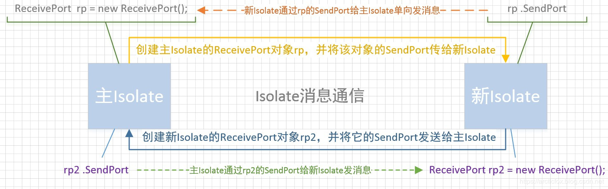
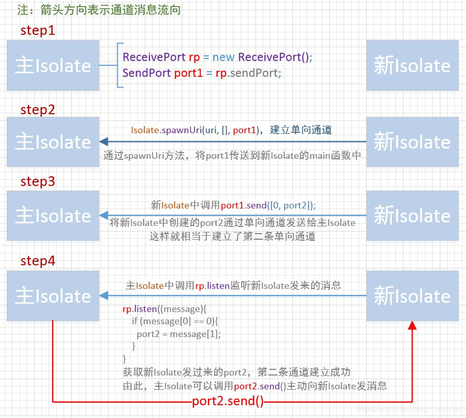

# Isolate

## 概述
将非常耗时的任务添加到事件队列后，仍然会拖慢整个事件循环的处理，甚至是阻塞。可见基于事件循环的异步模型仍然是有很大缺点的，这时候我们就需要Isolate，这个单词的中文意思是隔离。

简单说，可以把Isolate理解为Dart中的线程。但它又不同于线程，更恰当的说应该是微线程，或者说是协程。它与线程最大的区别就是不能共享内存，因此也不存在锁竞争问题，两个Isolate完全是两条独立的执行线，且每个Isolate都有自己的事件循环，他们之间的通信唯一方式只能是通过Port进行，而且Dart中的消息传递总是异步的，所以它的资源开销低于线程。

isolate本身是隔离的意思，有自己的内存和单线程控制的实体，因为isolate之间的内存在逻辑是隔离的，isolate的代码是按顺序执行的。在Dart中并发可以使用用isolate，isolate和Thread很像，但是isolate之间没有共享内存。一个Dart程序是在Main isolate的Main函数开始，我们平时开发中，默认环境就是Main isolate，App的启动入口main函数就是一个isolate，在Main函数结束后，Main isolate线程开始一个一个处理Event Queue中的每一个Event。


## 创建Isolate
从主Isolate创建一个新的Isolate有两种方法

### spawnUri
```dart
static Future<Isolate> spawnUri()
```

spawnUri方法有三个必须的参数:
- 第一个是Uri，指定一个新Isolate代码文件的路径，
- 第二个是参数列表，类型是List<String>，
- 第三个是动态消息。

需要注意，用于运行新Isolate的代码文件中，必须包含一个main函数，它是新Isolate的入口方法，该main函数中的args参数列表，正对应spawnUri中的第二个参数。如不需要向新Isolate中传参数，该参数可传空List

主Isolate中的代码：
```dart
import 'dart:isolate'; 

void main() {
  print("main isolate start");
  create_isolate();
  print("main isolate stop");
}

// 创建一个新的 isolate
create_isolate() async{
  ReceivePort rp = new ReceivePort();
  SendPort port1 = rp.sendPort;

  Isolate newIsolate = await Isolate.spawnUri(new Uri(path: "./other_task.dart"), ["hello, isolate", "this is args"], port1);

  SendPort port2;
  rp.listen((message){
    print("main isolate message: $message");
    if (message[0] == 0){
      port2 = message[1];
    }else{
      port2?.send([1,"这条信息是 main isolate 发送的"]);
    }
  });

  // 可以在适当的时候，调用以下方法杀死创建的 isolate
  // newIsolate.kill(priority: Isolate.immediate);
}
```

创建other_task.dart文件，编写新Isolate的代码:
```dart
import 'dart:isolate';
import  'dart:io';


void main(args, SendPort port1) {
  print("isolate_1 start");
  print("isolate_1 args: $args");

  ReceivePort receivePort = new ReceivePort();
  SendPort port2 = receivePort.sendPort;

  receivePort.listen((message){
    print("isolate_1 message: $message");
  });

  // 将当前 isolate 中创建的SendPort发送到主 isolate中用于通信
  port1.send([0, port2]);
  // 模拟耗时5秒
  sleep(Duration(seconds:5));
  port1.send([1, "isolate_1 任务完成"]);

  print("isolate_1 stop");
}
```

运行主Isolate的结果：
```dart
main isolate start
main isolate stop
isolate_1 start
isolate_1 args: [hello, isolate, this is args]
main isolate message: [0, SendPort]
isolate_1 stop
main isolate message: [1, isolate_1 任务完成]
isolate_1 message: [1, 这条信息是 main isolate 发送的]
```

整个消息通信过程如上图所示：



两个Isolate是通过两对Port对象通信，一对Port分别由用于接收消息的ReceivePort对象，和用于发送消息的SendPort对象构成。其中SendPort对象不用单独创建，它已经包含在ReceivePort对象之中。需要注意，一对Port对象只能单向发消息，这就如同一根自来水管，ReceivePort和SendPort分别位于水管的两头，水流只能从SendPort这头流向ReceivePort这头。因此，两个Isolate之间的消息通信肯定是需要两根这样的水管的，这就需要两对Port对象。

理解了Isolate消息通信的原理，那么在Dart代码中，具体是如何操作的呢？



ReceivePort对象通过调用listen方法，传入一个函数可用来监听并处理发送来的消息。SendPort对象则调用send()方法来发送消息。send方法传入的参数可以是null,num, bool, double,String, List ,Map或者是自定义的类。

在上例中，我们发送的是包含两个元素的List对象，第一个元素是整型，表示消息类型，第二个元素则表示消息内容。

### spawn

```dart
static Future<Isolate> spawn()
```

除了使用spawnUri，更常用的是使用spawn方法来创建新的Isolate，我们通常希望将新创建的Isolate代码和main Isolate代码写在同一个文件，且不希望出现两个main函数，而是将指定的耗时函数运行在新的Isolate，这样做有利于代码的组织和代码的复用。spawn方法有两个必须的参数，第一个是需要运行在新Isolate的耗时函数，第二个是动态消息，该参数通常用于传送主Isolate的SendPort对象。

spawn的用法与spawnUri相似，且更为简洁，将上面例子稍作修改如下
```dart
import 'dart:isolate'; 
import  'dart:io';

void main() {
  print("main isolate start");
  create_isolate();
  print("main isolate end");
}

// 创建一个新的 isolate
create_isolate() async{
  ReceivePort rp = new ReceivePort();
  SendPort port1 = rp.sendPort;

  Isolate newIsolate = await Isolate.spawn(doWork, port1);

  SendPort port2;
  rp.listen((message){
    print("main isolate message: $message");
    if (message[0] == 0){
      port2 = message[1];
    }else{
      port2?.send([1,"这条信息是 main isolate 发送的"]);
    }
  });
}

// 处理耗时任务
void doWork(SendPort port1){
  print("new isolate start");
  ReceivePort rp2 = new ReceivePort();
  SendPort port2 = rp2.sendPort;

  rp2.listen((message){
    print("doWork message: $message");
  });

  // 将新isolate中创建的SendPort发送到主isolate中用于通信
  port1.send([0, port2]);
  // 模拟耗时5秒
  sleep(Duration(seconds:5));
  port1.send([1, "doWork 任务完成"]);

  print("new isolate end");
}

/*
运行结果：
main isolate start
main isolate end
new isolate start
main isolate message: [0, SendPort]
new isolate end
main isolate message: [1, doWork 任务完成]
doWork message: [1, 这条信息是 main isolate 发送的]
*/
```

无论是上面的spawn还是spawnUri，运行后都会创建两个进程，一个是主Isolate的进程，一个是新Isolate的进程，两个进程都双向绑定了消息通信的通道，即使新的Isolate中的任务完成了，它的进程也不会立刻退出，因此，当使用完自己创建的Isolate后，最好调用newIsolate.kill(priority: Isolate.immediate);将Isolate立即杀死。

## Flutter 中创建Isolate
无论如何，在Dart中创建一个Isolate都显得有些繁琐，可惜的是Dart官方并未提供更高级封装。但是，如果想在Flutter中创建Isolate，则有更简便的API，这是由Flutter官方进一步封装ReceivePort而提供的更简洁API。详细API文档

使用compute函数来创建新的Isolate并执行耗时任务
```dart
import 'package:flutter/foundation.dart';
import  'dart:io';

// 创建一个新的Isolate，在其中运行任务doWork
create_new_task() async{
  var str = "New Task";
  var result = await compute(doWork, str);
  print(result);
}


void doWork(String value){
  print("new isolate doWork start");
  // 模拟耗时5秒
  sleep(Duration(seconds:5));

  print("new isolate doWork end");
  return "complete:$value";
}
```

compute函数有两个必须的参数，
- 第一个是待执行的函数，这个函数必须是一个顶级函数，不能是类的实例方法，可以是类的静态方法，
- 第二个参数为动态的消息类型，可以是被运行函数的参数。

需要注意，使用compute应导入'package:flutter/foundation.dart'包。

## 使用场景
Isolate虽好，但也有合适的使用场景，不建议滥用Isolate，应尽可能多的使用Dart中的事件循环机制去处理异步任务，这样才能更好的发挥Dart语言的优势。

那么应该在什么时候使用Future，什么时候使用Isolate呢？一个最简单的判断方法是根据某些任务的平均时间来选择：方法执行在几毫秒或十几毫秒左右的，应使用Future，如果一个任务需要几百毫秒或之上的，则建议创建单独的Isolate。除此之外，还有一些可以参考的场景：
- JSON 解码
- 加密
- 图像处理：比如剪裁
- 网络请求：加载资源、图片


> [Flutter Engine线程管理与Dart Isolate机制](https://www.jianshu.com/p/aaa6a8b1d6b0)
> 
> [Dart之异步编程](https://www.cnblogs.com/lxlx1798/p/11126564.html)


