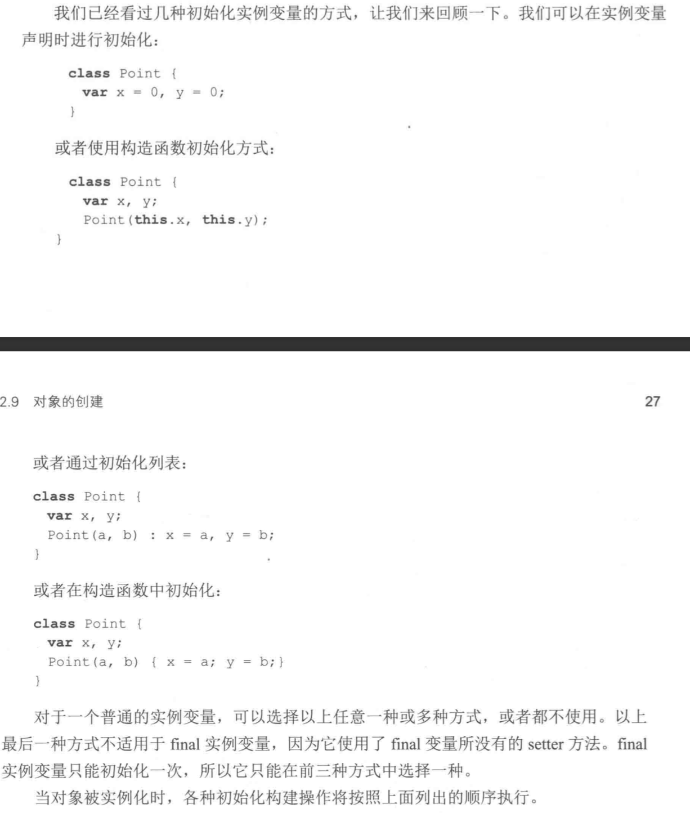

# 类的构造函数

## 概述
Dart语言中的类：
- Dart 语言中所有的对象都是某一个类的实例,所有的类有同一个基类–Object
- 如果一个类没有声明构造函数，默认会有一个无参构造
- Dart 是一种面向对象的语言，并且支持基于mixin的继承方式
- 基于mixin的继承方式具体是指：一个类可以继承自多个父类

通过创建一个和类名相同的函数声明一个构造函数（除此之外还有命名构造函数，所以构造函数的名字可能是ClassName，也可以是ClassName.otherName）。

构造函数通常用来创建一个类的实例。

```dart
class Point {
  num x, y;

  Point(num x, num y) {
    // There's a better way to do this, stay tuned.
    this.x = x;
    this.y = y;
  }
}
```

this关键字指向当前实例

将构造函数的参数赋值给实例变量太常见了，dart有一个语法糖使这种情况更加便捷：
```dart
class Point {
  num x, y;

  // Syntactic sugar for setting x and y
  // before the constructor body runs.
  Point(this.x, this.y);
}
```

## Default constructors 默认的构造函数
如果你不声明构造函数，系统将提供一个默认的构造函数。默认的构造函数没有参数，而且将调用父类的无参数的构造函数。(如果父类没有无参数的构造函数，那子类必须实现构造函数，否则编译报错)

子类的构造函数会默认继承超类的无参构造，如果父超类类没有无参构造必须手动指定其他构造函数。简单点讲：
- 如果超类拥有无参构造，子类的所有构造函数都默认继承这一个无参构造，除非手动指定继承其他构造函数
- 如果超类有带参构造或者命名构造函数，并且没有无参构造。那么子类的构造函数必须手动指定所继承的父类构造函数

具体可以参考以下栗子，生物类biology带有一个默认无参构造，Human带有一个有参构造，其超类带有无参构造所以无所手动指定超类构造函数。而Teacher类继承自Human类，必须指定继承的构造函数

```dart
//生物类，自带一个默认无参构造函数
class Biology {
  Biology() {
    print("this is a biology");
  }
}

//人类，继承自生物类，带有岁数，性别，姓名有参构造，默认继承父类的无参构造
class Human extends Biology {
  int age;
  String name;
  String gender;

  Human(this.age, this.name, this.gender) {
    print(
        "this is a human-> age = ${this.age},name = ${this.name},gender = ${this.gender}");
  }
}

class Teacher extends Human {
  Teacher(int age, String name, String gender) : super(age, name, gender) {
    print(
        "this is a teacher-> age = ${this.age},name = ${this.name},gender = ${this.gender}");
  }
}
```
打印如下:
```dart
main(){
    Teacher(57,"王阳明","男");
}
this is a biology
this is a human-> age = 57,name = 王阳明,gender = 男
this is a teacher-> age = 57,name = 王阳明,gender = 男
```

## Constructors aren’t inherited 构造函数不能继承
子类不能从父类继承构造函数。声明无参数的构造函数的子类只有默认的构造函数，即没有参数、没有名字（相对于命名构造函数）。

默认情况下，子类调用的是父类的无名、无参数的构造函数。

父类中的命名构造函数不能被子类继承。如果想要子类也拥有一个父类一样名字的构造函数，必须在子类中实现这个构造函数。

> 子类不会继承父类的无名有参构造函数和命名构造函数(即子类只能继承父类无名、无参数的构造函数)

```dart
  class Person {
    String firstName;

    // 无参数的，非命名的构造函数
    Person() {
        print('in Person');
    }
  }

  class Son extends Person {
    // 因为父类有无参数的，非命名的构造函数，所以可以不用手动调用父类的构造函数      
    Son.fromDictionary(Map data) {
        print('in Son');
    }
  }
```

如果父类不显示提供无名无参的构造函数，在子类中必须手动调用父类的一个构造函数。这种情况下，调用父类的构造函数的代码放在子类构造函数名后，子类构造函数体前，中间使用 : 分隔
```dart
  class Person {
    String firstName;

    // 命名构造函数
    Person.fromDictionary(Map data) {
        print('in Person');
      }
  }

  class Son extends Person {
    // 父类没有无参数的，非命名的构造函数，所以必须手动调用一个父类的构造函数       
    Son.fromDictionary(Map data) : super.fromDictionary(data) {
        print('in Son');
    }

    /*
    //所以这种写法会报错，因为父类没有无参数的，非命名的构造函数
    Son.fromDictionary(Map data) {
        print('in Son');
    } 
    */         
  }
```


## Named constructors 命名构造函数
通过命名构造函数实现一个类可以有多个构造函数，或者提供更有正对性的构造函数：
```dart
class Point {
  num x, y;

  Point(this.x, this.y);

  // Named constructor
  Point.origin() {
    x = 0;
    y = 0;
  }
}
```

注意：构造函数是不能继承的，所以子类是不能继承父类的命名构造函数的。如果你希望使用父类中的构造函数创建子类的实例，你必须在子类中实现父类中的构造函数。

## Invoking a non-default superclass constructor 调用父类非默认构造函数
默认，子类的构造函数调用父类非命名、无参构造函数。父类的构造函数在构函数体之前调用。如果有初始化列表，初始化在父类构造函数之前执行。总之，执行顺序如下：

1. 初始化列表
2. 父类的无参构造函数
3. 当前类的无参构造函数

如果父类没有未命名、无参构造函数，那么你必须手动调用父类中的一个构造函数。注意：父类的构造函数调用在:之后，构造函数体之前。

在如下的例子中，Employee类的构造函数调用他父类Person的命名构造函数。
```dart
class Person {
  String firstName;

  Person.fromJson(Map data) {
    print('in Person');
  }
}

class Employee extends Person {
  // Person does not have a default constructor;
  // you must call super.fromJson(data).
  Employee.fromJson(Map data) : super.fromJson(data) {
    print('in Employee');
  }
}

main() {
  var emp = new Employee.fromJson({});

  // Prints:
  // in Person
  // in Employee
  if (emp is Person) {
    // Type check
    emp.firstName = 'Bob';
  }
  (emp as Person).firstName = 'Bob';
}
```

因为父类构造函数的参数在调用之前会评估，所以参数可以是表达式，例如一个函数调用。
```dart
class Employee extends Person {
  Employee() : super.fromJson(getDefaultData());
  // ···
}
```

注意：父类构造函数不能使用this.例如，参数可以调用静态方法，但是不能调用实例方法。

## nitializer list 初始化列表
除了调用父类的构造函数，你还可以在执行构造函数体之前初始化实例变量。用逗号分隔每个初始化。

```dart
// Initializer list sets instance variables before
// the constructor body runs.
Point.fromJson(Map<String, num> json)
    : x = json['x'],
      y = json['y'] {
  print('In Point.fromJson(): ($x, $y)');
}
```

注意：初始化表达式的右边不能用this.

在开发期间，你可以在出初始化列表中使用assert校验输入：
```dart
Point.withAssert(this.x, this.y) : assert(x >= 0) {
  print('In Point.withAssert(): ($x, $y)');
}
```

设置final字段时，初始化列表还是很方便的。下面你的例子中，在初始化裂变中初始化三个final变量
```dart
import 'dart:math';

class Point {
  final num x;
  final num y;
  final num distanceFromOrigin;

  Point(x, y)
      : x = x,
        y = y,
        distanceFromOrigin = sqrt(x * x + y * y);
}

main() {
  var p = new Point(2, 3);
  print(p.distanceFromOrigin);
}
```

> final字段还可以通过this.xxx语法糖初始化!但是不可以写在函数体中初始化，因为final字段没有set方法！

## Redirecting constructors 可重定向的构造函数
有时一个构造函数的目的只是重定向到同类的另一个构造函数。一个可重定向函数的函数体是空的，同时构造函数的调用是在冒号之后的。
```dart
class Point {
  num x, y;

  // The main constructor for this class.
  Point(this.x, this.y);

  // Delegates to the main constructor.
  Point.alongXAxis(num x) : this(x, 0);
}
```

## Constant constructors 常量构造函数
如果一个对象是不会改变的，你可以讲这些对象创建为编译时常量，定义const构造函数。而且要确保所有的字段都是final的，且所有字段初始化。

## Factory constructors 工厂构造函数
当你需要构造函数不是每次都创建一个新的对象时，使用factory关键字。例如工程构造函数返回一个在缓存的中的实例或者返回一个子类的实例。

下面的例子说明，从缓存中返回实例：
```dart
class Logger {
  final String name;
  bool mute = false;

  // _cache is library-private, thanks to
  // the _ in front of its name.
  static final Map<String, Logger> _cache =
      <String, Logger>{};

  factory Logger(String name) {
    if (_cache.containsKey(name)) {
      return _cache[name];
    } else {
      final logger = Logger._internal(name);
      _cache[name] = logger;
      return logger;
    }
  }

  Logger._internal(this.name);

  void log(String msg) {
    if (!mute) print(msg);
  }
}
```

注意：
- 工厂构造函数不能使用this。
- 使用factory构造函数必须注意，factory修饰的构造函数的名称必须是该类的类名。

调用工厂构造函数，可以使用new关键字
```dart
var logger = Logger('UI');
logger.log('Button clicked');
```

## 不支持重载
因为Dart不支持重载，所以类名构造函数只能有声明一个，其他构造函数只能以命名构造函数存在。

如下，Animal类只能有一个类名构造函数Animal(this.flyAbility);，再声明一个新的构造函数IDE报错，编译时不会通过。
```dart
class Animal {
  String flyAbility;

  String swimAbility;
  
  Animal(this.flyAbility);
  
  Animal.flyGuy(this.flyAbility);

  Animal.swimGuy(this.swimAbility);
  
}
```

Dart并不支持构造函数的重载，而采用了构造方法使用可选类型参数方案解决！

## 类中字段初始化顺序



> [flutter-dart 类的构造函数](https://juejin.im/post/5b2b4c36f265da59b243cac9)
> 
> [HelloDart-构造函数特性](https://www.jianshu.com/p/7c0a289c612b)
> 
> [彻底理解Dart的构造函数](https://blog.csdn.net/yueluo1990/article/details/86496379)
> 
> [02Dart：并不支持构造函数的重载](https://www.jianshu.com/p/2b109e49ff12)


