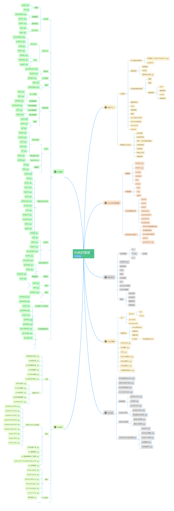

# Go Tips

## :smile:Golang知识图谱


## :smile:bin: 目录里面存放的都是通过 go install 命令安装后，由 Go 命令源码文件生成的可执行文件。
有两种情况下，bin 目录会变得没有意义。

当设置了有效的 GOBIN 环境变量以后，bin 目录就变得没有意义。

如果 GOPATH 里面包含多个工作区路径的时候，必须设置 GOBIN 环境变量，否则就无法安装 Go 程序的可执行文件。

## :smile:Go 语言在多个工作区中查找依赖包的时候是以怎样的顺序进行的？
如果有多个工作区，那么是按照GOPATH里面的先后顺序查找的

## :smile:如果在多个工作区中都存在导入路径相同的代码包会产生冲突吗
不会冲突，那么是按照GOPATH里面的先后顺序查找的

## :smile:代码包的名称一般会与源码文件所在的目录同名。如果不同，import的还是目录名，代码中使用的包名。因为GOPATH的特性，只会按照目录来查找包，但你调用的时候就不能用目录名字来调用了。
在工作区中，一个代码包的导入路径实际上就是从 src 子目录，到该包的实际存储位置的相对路径。

```
import 文件夹的路径

包名.接口名字（）

我们导入的时候肯定是文件的路径，但调用的时候要用在源码文件里面声明的package的名字。
```

## :smile:安装某个代码包而产生的归档文件或可执行文件是与这个代码包同名的。

## :smile:Package flag
```go
我试着把参数增加到两个，然后试试运行结果
func init() {
  flag.StringVar(&name, "name1", "ladies", "The greeting object 1")
  flag.StringVar(&name, "name2", "gentlemen", "The greeting object 2")
}

# go run test.go
Hello gentlemen!
和想像的一样，name2的默认值覆盖了name1的默认值

# go run test.go -name1=Robert
Hello Robert!
和想像的略有不同，只指定了name1，没有指定name2，输出了name1的指定值，name2的默认值没有生效

# go run test.go -name2=Jose
Hello Jose!
没毛病

# go run test.go -name1=Robert -name2=Jose
Hello Jose!
没毛病

# go run test.go -name2=Jose -name1=Robert
Hello Robert!
这有点奇怪了，输出的值是以参数的先后顺序为准的，而不是以flag.StringVar函数的顺序为准的
```

## :smile:代码包声明的基本规则
第一条规则，同目录下的源码文件的代码包声明语句要一致。也就是说，它们要同属于一个代码包。这对于所有源码文件都是适用的。

如果目录中有命令源码文件，那么其他种类的源码文件也应该声明属于main包。这也是我们能够成功构建和运行它们的前提。

第二条规则，源码文件声明的代码包的名称可以与其所在的目录的名称不同。在针对代码包进行构建时，生成的结果文件的主名称与其父目录的名称一致。

对于命令源码文件而言，构建生成的可执行文件的主名称会与其父目录的名称相同，这在我前面的回答中也验证过了。

## :smile:如果需要导入两个代码包，而这两个代码包的导入路径的最后一级是相同的，比如：dep/lib/flag和flag，那么会产生冲突吗？如果会产生冲突，那么怎样解决这种冲突，有几种方式？

import后路径最后一级相同，不一定会冲突。分为两种情况:

- 如果文件夹下文件声明的包名相同，则肯定冲突，会报错redeclared。

- 如果文件夹下文件声明的包名不同，也不会冲突。

冲突解决方案：

1、给包设置别名,调用的时候来区分开不同的package,比如:import(b “bbbb”)

2、导入的点操作，import(. “bbbb”)。这样就可以直接调用bbbb下面的函数而不用再bbbb.funcname的方式调用

3、如果只是想引入某包并没有在代码中实际调用则可以这么处理来避免冲突:import(_ “bbbb”)

4、像第一问一样采取不同的包名声明，毕竟包名不一定要和文件夹名一样

## :smile:在 Go 语言中，变量的类型可以是其预定义的那些类型，也可以是程序自定义的函数、结构体或接口。常量的合法类型不多，只能是那些 Go 语言预定义的基本类型。

## :smile:如果我们在go语言查找标识符范围的时候，用了import . XXXX这种导入方式，如果xxxx和我们的代码包中有变量重复，那么GO会把它当作可重名变量还是冲突？
如果导入的包里面的变量是私有的，也就是小写开头的，那么就不存在重复，但如果是public的，而且是全局的变量那么就会有冲突。但如果是在子模块内，那就不会冲突了。

## :smile:Go 语言内建的基本类型中就存在两个别名类型。byte是uint8的别名类型，而rune是int32的别名类型。


## :smile:[断言类型的语法：x.(T)，这里x表示一个接口的类型，T表示一个类型（也可为接口类型）。一个类型断言检查一个接口对象x的动态类型是否和断言的类型T匹配。](https://www.cnblogs.com/susufufu/archive/2017/08/13/7353290.html)

类型断言分两种情况：
### 第一种，如果断言的类型T是一个具体类型，类型断言x.(T)就检查x的动态类型是否和T的类型相同。

- 如果这个检查成功了，类型断言的结果是一个类型为T的对象，该对象的值为接口变量x的动态值。换句话说，具体类型的类型断言从它的操作对象中获得具体的值。
- 如果检查失败，接下来这个操作会抛出panic，除非用两个变量来接收检查结果，如：f, ok := w.(*os.File)

### 第二种，如果断言的类型T是一个接口类型，类型断言x.(T)检查x的动态类型是否满足T接口。

- 如果这个检查成功，则检查结果的接口值的动态类型和动态值不变，但是该接口值的类型被转换为接口类型T。换句话说，对一个接口类型的类型断言改变了类型的表述方式，改变了可以获取的方法集合（通常更大），但是它保护了接口值内部的动态类型和值的部分。
- 如果检查失败，接下来这个操作会抛出panic，除非用两个变量来接收检查结果，如：f, ok := w.(io.ReadWriter)

### 注意：

- 如果断言的操作对象x是一个nil接口值，那么不论被断言的类型T是什么这个类型断言都会失败。
- 我们几乎不需要对一个更少限制性的接口类型（更少的方法集合）做断言，因为它表现的就像赋值操作一样，除了对于nil接口值的情况。

## :smile:GO语言不存在所谓的继承，更不是通过嵌入实现继承！！
GO语言不存在所谓的继承，只有组合。组合和继承的区别就在于，组合是非侵入式的，而继承是侵入式的。也就是说组合子类不需要关注父类的东西。只需要嵌入进来就可享受父类的一切。

## :smile: 值方法和指针方法之间有什么不同点?
1. 值方法的接收者是该方法所属的那个类型值的一个副本。我们在该方法内对该副本的修改一般 都不会体现在原值上，除非这个类型本身是某个引用类型(比如切片或字典)的别名类型。

而指针方法的接收者，是该方法所属的那个基本类型值的指针值的一个副本。我们在这样的方法内对该副本指向的值进行修改，却一定会体现在原值上。

2. —个自定义数据类型的方法集合中仅会包含它的所有值方法，而该类型的指针类型的方法集合却嚢括了前者的所有方法，包括所有值方法和所有指针方法。

严格来讲，我们在这样的基本类型的值上只能调用到它的值方法。但是，Go语言会适时地为 我们进行自动地转译，使得我们在这样的值上也能调用到它的指针方法。

比如，在Cat类型的变量cat之上，之所以我们可以通过cat.SetName( "monster")修改猫 的名字，是因为Go语言把它自动转译为了(&cat) . SetName("monster11)，即:先取cat 的指针值，然后在该指针值上调用SetName方法。

3. 在后边你会了解到， 一 个类型的方法集合中有哪些方法与它能实现哪些接口类型是息息相关 的。如果一个基本类型和它的指针类型的方法集合是不同的，那么它们具体实现的接口类型的 数量就也会有差异，除非这两个数量都是零。

比如，一个指针类型实现了某某接口类型，但它的基本类型却不一定能够作为该接口的实现类 型。

## :smile:方法隶属的类型其实并不局限于结构体类型，但必须是某个自定义的数据类型，并且不能是任何接口类型。

## :smile:如果处于同一个层级的多个嵌入字段拥有同名的字段或方法，那么从被嵌入类型的值那里，选择此名称的时候就会引发一个编译错误，因为编译器无法确定被选择的成员到底是哪一个。（多个嵌入字段拥有同名的字段或方法没有被调用的话编译是不会报错的）

## :smile:[Golang中的M、P、G](https://blog.csdn.net/u011957758/article/details/83018425)
goroutine想跑起来依赖于以上三个角色。

| 角色 | 简介 | 作用 |  
| - | - | - |
| M | 线程 | 干活的 |
| P | 上下文（调度器） | 包工头 |
| G | goroutine（协程、程序控制的） | 砖头 |

他们之间的调度关系：

1.P依赖于M，而G的执行是需要P来安排的。

2.当没有M供使用的时候，P也是不存在的，此时如果有G产生，会放在一个全局的runqueue队列里头，待执行

3.当M有了，也有了P之后，会从全局队列中获取goroutine放于当前P管理的执行队列中，当遇到调度点，会将当前执行的G放回P管理的执行队列中，继续进行安排下一个执行。

4.当P安排的G执行完了之后，会从全局队列中拿groutine来进行执行，如果没有，则从其他的MP组合中拿一半的groutine来进行执行。

调度点：
- IO操作、select、channel
- 函数调用（是一个调度点，但不一定100%会切）
- runtime.Gosched()
- 等待锁、sleep

## :smile:不要把增加其计数器值的操作和调用其Wait方法的代码，放在不同的 goroutine 中执行。换句话说，要杜绝对同一个WaitGroup值的两种操作的并发执行。

## :smile:在使用WaitGroup值的时候，我们最好用“先统一Add，再并发Done，最后Wait”的标准模式来构建协作流程。
这就带来了一个问题，如果我们不能在一开始就确定执行子任务的 goroutine 的数量，那么使用WaitGroup值来协调它们和分发子任务的 goroutine，就是有一定风险的。一个解决方案是：分批地启用执行子任务的 goroutine。

## :smile:

## :smile:
## :smile:
## :smile:
## :smile:
## :smile:
## :smile:

## :smile:
## :smile:
## :smile:
## :smile:
## :smile:
## :smile:

## :smile:
## :smile:
## :smile:
## :smile:
## :smile:
## :smile:

## :smile:
## :smile:
## :smile:
## :smile:
## :smile:
## :smile:
