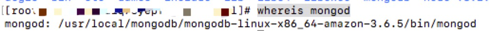

# 阿里云ECS生产环境配置
## 概述
阿里云ECS的操作系统是`CentOS 7.4 64位`，部署的主要环境是`Node`、`MongoDB`、`Redis`。

## 阿里云ECS
- 登录阿里云
- 选择控制台
- 选择云服务器ECS -> 实例 -> 创建实例

阿里云ECS的操作系统是`CentOS 7.4 64位`。配置的话可以按需购买，以后可以随时升降配。

### 远程登录
> 假设阿里云公网地址：116.16.116.116

- web自带的登录：需要输入连接密码和root登录密码。
- mac远程登录：打开终端，输入`ssh root@116.16.116.116`，然后根据提示输入root密码，登录成功会提示`Welcome to Alibaba Cloud Elastic Compute Service !`。

> [Linux命令大全
](http://man.linuxde.net/)
>
> [Linux常用命令大全](https://www.cnblogs.com/yjd_hycf_space/p/7730690.html)
>
> [linux常用基本命令](https://www.cnblogs.com/crazylqy/p/5818745.html)

## Node安装
移动到目录

```
cd /usr/local
```

wget命令下载Node.js安装包

```
wget https://fastdl.mongodb.org/linux/mongodb-linux-x86_64-amazon-3.6.5.tgz
```

解压文件

```
tar zxvf mongodb-linux-x86_64-amazon-3.6.5.tgz
```


配置环境变量

```
vim /etc/profile
```

在最后边添加

```
#set for nodejs
export NODE_HOME=/usr/local/node-v8.2.1-linux-x64
export PATH=$NODE_HOME/bin:$PATH
```

保存退出（:wq）,重启系统配置

```
source /etc/profile
```

使用命令查看版本，出现相应版本号则表示成功

```
node -v
npm -v
```


## MongoDB安装
移动到目录

```
cd /usr/local
```

创建`mongodb`安装目录并进入

```
mkdir mongodb
cd mongodb
```

创建数据和日志存放目录

```
mkdir data
mkdir log
```

wget命令下载`mongodb`

```
wget https://fastdl.mongodb.org/linux/mongodb-linux-x86_64-amazon-3.6.5.tgz
```

解压文件

```
tar zxvf  mongodb-linux-x86_64-amazon-3.6.5.tgz
```

在/usr/local/mongodb/mongodb-linux-x86_64-amazon-3.6.5/bin下新建配置mongodb.conf

```
cd /usr/local/mongodb/mongodb-linux-x86_64-amazon-3.6.5/bin
vi mongodb.conf
```

mongodb.conf内容：

```
port = 27017

dbpath = /usr/local/mongodb/data

logappend = true

fork = true

logpath = /usr/local/mongodb/log/mongodb.log

auth=true
```

配置环境变量

```
vi /etc/profile
```

在最后边添加

```
#set for mongodb
export MONGODB_HOME=/usr/local/mongodb/mongodb-linux-x86_64-amazon-3.6.5
export PATH=$PATH:$MONGODB_HOME/bin
```

保存退出（:wq），重启系统配置

```
source /etc/profile
```

查看`mongod`安装位置

```
whereis mongod
```



启动`mongod`

```
cd /usr/local/mongodb/mongodb-linux-x86_64-amazon-3.6.5/bin
./mongod -f mongodb.conf
```

关闭`mongod`

```
cd /usr/local/mongodb/mongodb-linux-x86_64-amazon-3.6.5/bin
./mongod -f ./mongodb.conf --shutdown
```

连接`mongod`

```
./mongo
```

创建数据库用户

```
use admin
db.createUser({user: "admin",pwd: "123456",roles: [ { role: "userAdminAnyDatabase", db: "admin" } ]})
db.auth('admin','123456')
db.createUser( { user: "tianmuhu", pwd: "123456", roles: [ { role: "readWrite", db: "tianmuhu" }, ] } )
db.auth('tianmuhu','123456')
```

重启数据库，后登录需要：

```
./mongo  127.0.0.1:27017/admin -u admin -p 
```

客户端登录可以使用`Studio 3T`、`Robo 3T`

## Redis安装
移动到目录

```
cd /usr/local
```

wget命令下载redis安装包

```
wget http://download.redis.io/releases/redis-4.0.10.tar.gz
```

解压文件

```
tar xvzf redis-4.0.10.tar.gz
```

进入redis解压目录并且编译安装

```
 cd redis-4.0.10 
 make MALLOC=libc
```

再进入src目录安装

```
 cd src
 make install
```


在src目录下检测是否安装成功：直接启动redis

```
./redis-server
```


上图：redis启动成功，但是这种启动方式需要一直打开窗口，不能进行其他操作，不太方便。按 ctrl + c可以关闭窗口。

以后台进程方式启动redis，修改redis.conf文件的daemonize为yes

```
vi  /usr/local/redis-4.0.10/redis.conf
```

进入src，指定redis.conf文件来启动

```
./redis-server /usr/local/redis-4.0.10/redis.conf
```

关闭redis进程---首先使用ps -aux | grep redis查看redis进程

```
ps -aux | grep redis
```

关闭redis进程---使用kill命令杀死进程

```
kill -9 3228
```


### 设置redis开机自启动
1、在/etc目录下新建redis目录

```
cd /etc
mkdir redis
```

2、将/usr/local/redis-4.0.10/redis.conf 文件复制一份到/etc/redis目录下，并命名为6379.conf　　

```
cp /usr/local/redis-4.0.10/redis.conf /etc/redis/6379.conf
```

3、将redis的启动脚本复制一份放到/etc/init.d目录下

``` 
cp /usr/local/redis-4.0.10/utils/redis_init_script /etc/init.d/redisd
```

4、设置redis开机自启动:先切换到/etc/init.d目录下,然后执行自启命令

```
cd /etc/init.d
chkconfig redisd on
```

如果结果显示`service redisd does not support chkconfig`redisd不支持chkconfig

解决方法：

使用vi编辑redisd文件，在第2行加入如下两行注释，保存退出

```
# chkconfig:   2345 90 10
# description:  Redis is a persistent key-value database
```

注释的意思是，redis服务必须在运行级2，3，4，5下被启动或关闭，启动的优先级是90，关闭的优先级是10。

再次执行开机自启命令，成功。


现在可以直接已服务的形式启动和关闭redis了

启动：

```
service redisd start　
```

关闭：

```
service redisd stop
```


启动的时候遇到报错：


引起这类问题一般都是强制关掉电源或断电造成的，也是没等linux正常关机。

科学的处理办法2种

- 1：可用安装文件启动     redis-server /etc/redis/6379.conf
- 2：shutdown -r now 软重启让系统自动恢复下就行了

### redis.conf 的配置信息 
1、daemonize 如果需要在后台运行，把该项改为yes 
2、pidfile 配置多个pid的地址 默认在/var/run/redis.pid 
3、bind 绑定ip，设置后只接受来自该ip的请求 
4、port 监听端口，默认是6379 
5、loglevel 分为4个等级：debug verbose notice warning 
6、logfile 用于配置log文件地址 
7、databases 设置数据库个数，默认使用的数据库为0 
8、save 设置redis进行数据库镜像的频率。 
9、rdbcompression 在进行镜像备份时，是否进行压缩 
10、dbfilename 镜像备份文件的文件名 
11、Dir 数据库镜像备份的文件放置路径 
12、Slaveof 设置数据库为其他数据库的从数据库 
13、Masterauth 主数据库连接需要的密码验证 
14、Requriepass 设置 登陆时需要使用密码 
15、Maxclients 限制同时使用的客户数量 
16、Maxmemory 设置redis能够使用的最大内存 
17、Appendonly 开启append only模式 
18、Appendfsync 设置对appendonly.aof文件同步的频率（对数据进行备份的第二种方式） 
19、vm-enabled 是否开启虚拟内存支持 （vm开头的参数都是配置虚拟内存的） 
20、vm-swap-file 设置虚拟内存的交换文件路径 
21、vm-max-memory 设置redis使用的最大物理内存大小 
22、vm-page-size 设置虚拟内存的页大小 
23、vm-pages 设置交换文件的总的page数量 
24、vm-max-threads 设置VM IO同时使用的线程数量 
25、Glueoutputbuf 把小的输出缓存存放在一起 
26、hash-max-zipmap-entries 设置hash的临界值 
27、Activerehashing 重新hash

> 参考文档
> 
> [sss](sss)
>
>
>
>
>
>
>
>


