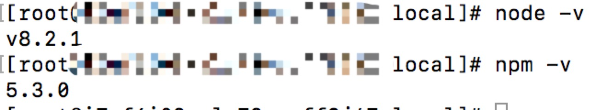

# 阿里云ECS生产环境配置
## 概述
阿里云ECS的操作系统是`CentOS 7.4 64位`，部署的主要环境是`Node`、`MongoDB`、`Redis`。

## 阿里云ECS
- 登录阿里云
- 选择控制台
- 选择云服务器ECS -> 实例 -> 创建实例

阿里云ECS的操作系统是`CentOS 7.4 64位`。配置的话可以按需购买，以后可以随时升降配。

### 远程登录
> 假设阿里云公网地址：116.16.116.116

- web自带的登录：需要输入连接密码和root登录密码。
- mac远程登录：打开终端，输入`ssh root@116.16.116.116`，然后根据提示输入root密码，登录成功会提示`Welcome to Alibaba Cloud Elastic Compute Service !`。

> [Linux命令大全
](http://man.linuxde.net/)
>
> [Linux常用命令大全](https://www.cnblogs.com/yjd_hycf_space/p/7730690.html)
>
> [linux常用基本命令](https://www.cnblogs.com/crazylqy/p/5818745.html)

## Node安装
移动到目录
```
cd /usr/local
```
wget命令下载Node.js安装包
```
wget https://fastdl.mongodb.org/linux/mongodb-linux-x86_64-amazon-3.6.5.tgz
```
解压文件
```
tar zxvf mongodb-linux-x86_64-amazon-3.6.5.tgz
```
配置环境变量
```
vim /etc/profile
```
在最后边添加
```
#set for nodejs
export NODE_HOME=/usr/local/node-v8.2.1-linux-x64
export PATH=$NODE_HOME/bin:$PATH
```
保存退出（:wq）执行命令是更改生效
```
source /etc/profile
```
使用命令查看版本，出现相应版本号则表示成功
```
node -v
npm -v
```



## MongoDB安装
## Redis安装


