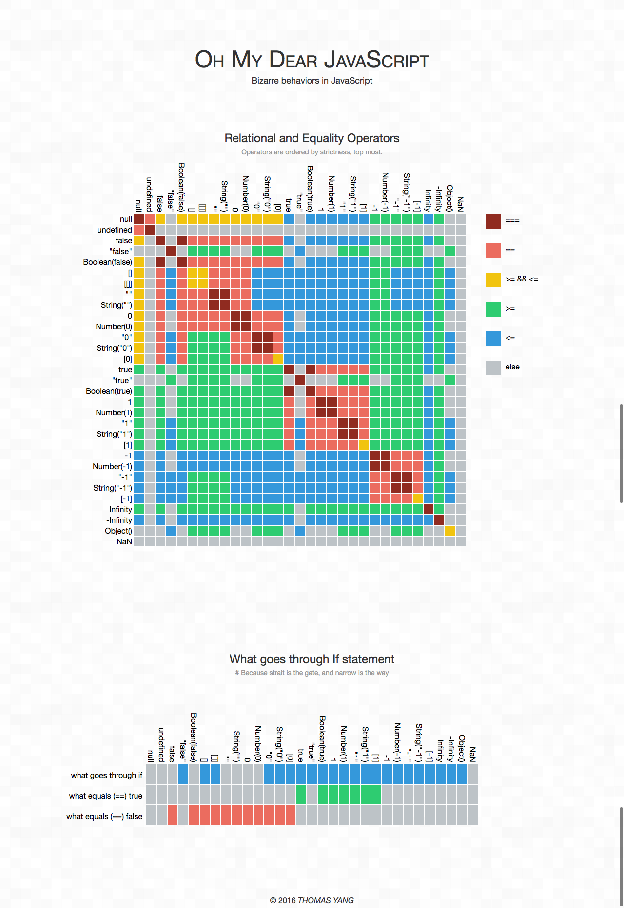

# JavaScript Tips


## :smile:内部函数能访问外部函数的实际变量而无须复制！
```javascript
//错误例子
var add_the_handlers = function (nodes) {
    var i;
    for (i = 0; i < nodes.length; i += 1) {
        nodes[i].onclick = function (e) {
            alert(i);//alert出来的永远是节点的数量
        }
    }
};

//正确的处理
var add_the_handlers = function (nodes) {
    var i;
    for (i = 0; i < nodes.length; i += 1) {
        nodes[i].onclick = function (i) { //辅助函数返回一个绑定了当前i值的函数
            return function (e) {
                alert(i);
            };
        }(i);
    }
};
```

## :smile:布尔值为false
- false
- null
- undefined
- 空字符串''
- 数字 0
- 数字 NaN

## :smile:七个数据类型：
undefined、null、布尔值（Boolean）、字符串（String）、数值（Number）、对象（Object）、ES6 引入了一种新的原始数据类型Symbol。

## :smile:可以通过函数和闭包来构造模块。模块是一个提供接口却隐藏状态与实现的函数或对象。
```javascript
//demo1
Function.prototype.method = function (name, func) {
    this.prototype[name] = func;
    return this;
};

String.method('deentityify', function (  ) {
    var entity = {
        quot: '"',
        lt:   '<',
        gt:   '>'
    };

// Return the deentityify method.
    return function (  ) {
        return this.replace(/&([^&;]+);/g,
            function (a, b) {
                var r = entity[b];
                return typeof r === 'string' ? r : a;
            }
        );
    };
}(  ));

document.writeln(
    '&lt;&quot;&gt;'.deentityify(  ));  // <">
    
//demo2
var serial_maker = function (  ) {
    var prefix = '';
    var seq = 0;
    return {
        set_prefix: function (p) {
            prefix = String(p);
        },
        set_seq: function (s) {
            seq = s;
        },
        gensym: function (  ) {
            var result = prefix + seq;
            seq += 1;
            return result;
        }
    };
}(  );

var seqer = serial_maker(  );
seqer.set_prefix = 'Q';
seqer.set_seq = 1000;
var unique = seqer.gensym(  );    // unique is "Q1000"

```

## :smile: 在JavaScript无法重载或者自定义运算符，包括等号。

## :smile: 函数声明和变量声明的提升
先举一个函数提升的例子。
```javascript
function foo() {
  bar();
  function bar() {
    ……
  }
}
```
var 变量也具有提升的特性。但是把函数赋值给变量以后，提升的效果就会消失。
```javascript
function foo() {
  bar(); // error！
  var bar = function () {
    ……
  }
}
```
上述函数就没有提升效果了。
**函数声明是做了完全提升，变量声明只是做了部分提升。变量的声明才有提升的作用，赋值的过程并不会提升，赋值还在原地。**

**如果变量和函数都存在提升的情况，那么函数提升优先级更高。**

**ES6中引入了 let 和 const 关键字，使用这两个关键字就不会有变量提升了。**

## :smile: ES6引入了块作用域，立即执行函数表达式（IIFE）不再必要了。
```javascript
//ES6之前，
// IIFE 写法
(function () {
  var tmp = ...;
  ...
}());

//ES6
// 块级作用域写法
{
  let tmp = ...;
  ...
}
```

## :smile: 箭头函数this
箭头函数根本就没有自己的 this，导致内部的 this 就是外层代码块的 this，正因为这个特性，也导致了以下的情况都不能使用箭头函数：
1、不能当做构造函数，不能使用 new 命令，因为没有 this，否则会抛出一个错误。
2、不可以使用 argument 对象，该对象在函数体内不存在，非要使用就只能用 rest 参数代替。也不能使用 super，new.target 。
3、不可以使用 yield 命令，不能作为 Generator 函数。
4、不可以使用call()，apply()，bind()这些方法改变 this 的指向。

## :smile: 比较运算


## :smile:  for-in 遍历数组得到的是数组索引字符串
```javascript
var scores = [ 11,22,33,44,55,66,77 ];
var total = 0;
for (var score in scores) {
  total += score;
}
//total 是 ‘00123456’ 
```

数组的遍历

| 循环方式 | 遍历对象 | 副作用
|-|-|-|
| for |  | 写法比较麻烦
| for-in | 索引值(键名)，而非数组元素 | 遍历所有(非索引)属性，以及继承过来的属性（可以用hasOwnProperty()方法排除继承属性），主要是为遍历对象而设计的，不适用于遍历数组
| forEach| 		| 不方便break，continue，return
| for...of| 	内部通过调用 Symbol.iterator 方法，实现遍历获得键值	| 不可遍历普通的对象，因为没有 Iterator 接口

ES6对象的遍历


