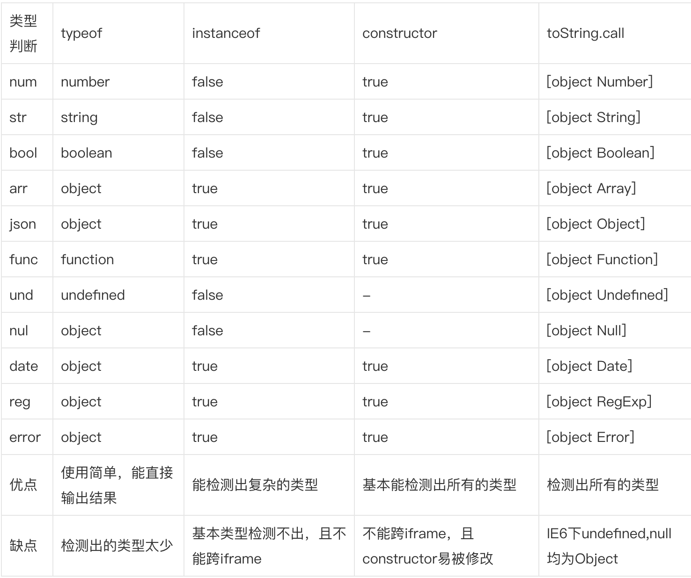

# JavaScript Tips


## :smile:内部函数能访问外部函数的实际变量而无须复制！
```javascript
//错误例子
var add_the_handlers = function (nodes) {
    var i;
    for (i = 0; i < nodes.length; i += 1) {
        nodes[i].onclick = function (e) {
            alert(i);//alert出来的永远是节点的数量
        }
    }
};

//正确的处理
var add_the_handlers = function (nodes) {
    var i;
    for (i = 0; i < nodes.length; i += 1) {
        nodes[i].onclick = function (i) { //辅助函数返回一个绑定了当前i值的函数
            return function (e) {
                alert(i);
            };
        }(i);
    }
};
```

## :smile:布尔值为false
- false
- null
- undefined
- 空字符串''
- 数字 0
- 数字 NaN

JavaScript中的真值示例如下（将被转换为true类型，if 后的代码段将被执行）：
```
if (true)
if ({})
if ([])
if (42)
if ("foo")
if (new Date())
if (-42)
if (3.14)
if (-3.14)
if (Infinity)
if (-Infinity)
```


## :smile:七个数据类型：
undefined、null、布尔值（Boolean）、字符串（String）、数值（Number）、对象（Object）、ES6 引入了一种新的原始数据类型Symbol。

## :smile:javascript中对变量类型的判断
### 1. 使用typeof检测
我们平时用的最多的就是用typeof检测变量类型了。这次，我们也使用typeof检测变量的类型：
```
console.log(
    typeof num, 
    typeof str, 
    typeof bool, 
    typeof arr, 
    typeof json, 
    typeof func, 
    typeof und, 
    typeof nul, 
    typeof date, 
    typeof reg, 
    typeof error
);
// number string boolean object object function undefined object object object object
```
从输出的结果来看，arr, json, nul, date, reg, error 全部被检测为object类型，其他的变量能够被正确检测出来。当需要变量是否是number, string, boolean, function, undefined类型时，可以使用typeof进行判断。其他变量是判断不出类型的，包括null。

还有，typeof是区分不出array和json类型的。因为使用typeof这个变量时，array和json类型输出的都是object。

### 2. 使用instance检测
在 JavaScript 中，判断一个变量的类型尝尝会用 typeof 运算符，在使用 typeof 运算符时采用引用类型存储值会出现一个问题，无论引用的是什么类型的对象，它都返回 "object"。ECMAScript 引入了另一个 Java 运算符 instanceof 来解决这个问题。instanceof 运算符与 typeof 运算符相似，用于识别正在处理的对象的类型。与 typeof 方法不同的是，instanceof 方法要求开发者明确地确认对象为某特定类型。例如：
```
function Person(){

}
var Tom = new Person();
console.log(Tom instanceof Person); // true
```
我们再看看下面的例子：
```
function Person(){

}
function Student(){

}
Student.prototype = new Person();
var John = new Student();
console.log(John instanceof Student); // true
console.log(John instancdof Person);  // true
```
instanceof还能检测出多层继承的关系。

好了，我们来使用instanceof检测上面的那些变量：
```
console.log(
    num instanceof Number,
    str instanceof String,
    bool instanceof Boolean,
    arr instanceof Array,
    json instanceof Object,
    func instanceof Function,
    und instanceof Object,
    nul instanceof Object,
    date instanceof Date,
    reg instanceof RegExp,
    error instanceof Error
)
// num : false 
// str : false 
// bool : false 
// arr : true 
// json : true 
// func : true 
// und : false 
// nul : false 
// date : true 
// reg : true 
// error : true
```
从上面的运行结果我们可以看到，num, str和bool没有检测出他的类型，但是我们使用下面的方式创建num，是可以检测出类型的：
```
var num = new Number(123);
var str = new String('abcdef');
var boolean = new Boolean(true);
```
同时，我们也要看到，und和nul是检测的Object类型，才输出的true，因为js中没有Undefined和Null的这种全局类型，他们und和nul都属于Object类型，因此输出了true。

### 3. 使用constructor检测
在使用instanceof检测变量类型时，我们是检测不到number, 'string', bool的类型的。因此，我们需要换一种方式来解决这个问题。

constructor本来是原型对象上的属性，指向构造函数。但是根据实例对象寻找属性的顺序，若实例对象上没有实例属性或方法时，就去原型链上寻找，因此，实例对象也是能使用constructor属性的。

我们先来输出一下num.constructor的内容，即数字类型的变量的构造函数是什么样子的：
```
function Number() { [native code] }
```
我们可以看到它指向了Number的构造函数，因此，我们可以使用num.constructor==Number来判断num是不是Number类型的，其他的变量也类似：
```
function Person(){

}
var Tom = new Person();

// undefined和null没有constructor属性
console.log(
    Tom.constructor==Person,
    num.constructor==Number,
    str.constructor==String,
    bool.constructor==Boolean,
    arr.constructor==Array,
    json.constructor==Object,
    func.constructor==Function,
    date.constructor==Date,
    reg.constructor==RegExp,
    error.constructor==Error
);
// 所有结果均为true
```
从输出的结果我们可以看出，除了undefined和null，其他类型的变量均能使用constructor判断出类型。

不过使用constructor也不是保险的，因为constructor属性是可以被修改的，会导致检测出的结果不正确，例如：
```
function Person(){

}
function Student(){

}
Student.prototype = new Person();
var John = new Student();
console.log(John.constructor==Student); // false
console.log(John.constructor==Person);  // true
```
在上面的例子中，Student原型中的constructor被修改为指向到Person，导致检测不出实例对象John真实的构造函数。

同时，使用instaceof和construcor,被判断的array必须是在当前页面声明的！比如，一个页面（父页面）有一个框架，框架中引用了一个页面（子页面），在子页面中声明了一个array，并将其赋值给父页面的一个变量，这时判断该变量，Array == object.constructor;会返回false；
原因：

1、array属于引用型数据，在传递过程中，仅仅是引用地址的传递。

2、每个页面的Array原生对象所引用的地址是不一样的，在子页面声明的array，所对应的构造函数，是子页面的Array对象；父页面来进行判断，使用的Array并不等于子页面的Array；切记，不然很难跟踪问题！
### 4. 使用Object.prototype.toString.call
```
console.log(
    Object.prototype.toString.call(num),
    Object.prototype.toString.call(str),
    Object.prototype.toString.call(bool),
    Object.prototype.toString.call(arr),
    Object.prototype.toString.call(json),
    Object.prototype.toString.call(func),
    Object.prototype.toString.call(und),
    Object.prototype.toString.call(nul),
    Object.prototype.toString.call(date),
    Object.prototype.toString.call(reg),
    Object.prototype.toString.call(error)
);
// '[object Number]' '[object String]' '[object Boolean]' '[object Array]' '[object Object]'
// '[object Function]' '[object Undefined]' '[object Null]' '[object Date]' '[object RegExp]' '[object Error]'
```
从输出的结果来看，Object.prototype.toString.call(变量)输出的是一个字符串，字符串里有一个数组，第一个参数是Object，第二个参数就是这个变量的类型，而且，所有变量的类型都检测出来了，我们只需要取出第二个参数即可。或者可以使用Object.prototype.toString.call(arr)=="object Array"来检测变量arr是不是数组。

我们现在再来看看ECMA里是是怎么定义Object.prototype.toString.call的：
```
Object.prototype.toString( ) When the toString method is called, the following steps are taken:
1. Get the [[Class]] property of this object.
2. Compute a string value by concatenating the three strings “[object “, Result (1), and “]”.
3. Return Result (2)
```
上面的规范定义了Object.prototype.toString的行为：首先，取得对象的一个内部属性[[Class]]，然后依据这个属性，返回一个类似于"[object Array]"的字符串作为结果（看过ECMA标准的应该都知道，[[]]用来表示语言内部用到的、外部不可直接访问的属性，称为“内部属性”）。利用这个方法，再配合call，我们可以取得任何对象的内部属性[[Class]]，然后把类型检测转化为字符串比较，以达到我们的目的。
### 对比
我们这里先来对比一下上面所有方法检测出的结果，横排是使用的检测方法， 竖排是各个变量


> 参考 [javascript中对变量类型的判断](https://segmentfault.com/a/1190000002962215)

## :smile:可以通过函数和闭包来构造模块。模块是一个提供接口却隐藏状态与实现的函数或对象。
```javascript
//demo1
Function.prototype.method = function (name, func) {
    this.prototype[name] = func;
    return this;
};

String.method('deentityify', function (  ) {
    var entity = {
        quot: '"',
        lt:   '<',
        gt:   '>'
    };

// Return the deentityify method.
    return function (  ) {
        return this.replace(/&([^&;]+);/g,
            function (a, b) {
                var r = entity[b];
                return typeof r === 'string' ? r : a;
            }
        );
    };
}(  ));

document.writeln(
    '&lt;&quot;&gt;'.deentityify(  ));  // <">
    
//demo2
var serial_maker = function (  ) {
    var prefix = '';
    var seq = 0;
    return {
        set_prefix: function (p) {
            prefix = String(p);
        },
        set_seq: function (s) {
            seq = s;
        },
        gensym: function (  ) {
            var result = prefix + seq;
            seq += 1;
            return result;
        }
    };
}(  );

var seqer = serial_maker(  );
seqer.set_prefix = 'Q';
seqer.set_seq = 1000;
var unique = seqer.gensym(  );    // unique is "Q1000"

```

## :smile: 在JavaScript无法重载或者自定义运算符，包括等号。

## :smile: 函数声明和变量声明的提升
先举一个函数提升的例子。
```javascript
function foo() {
  bar();
  function bar() {
    ……
  }
}
```
var 变量也具有提升的特性。但是把函数赋值给变量以后，提升的效果就会消失。
```javascript
function foo() {
  bar(); // error！
  var bar = function () {
    ……
  }
}
```
上述函数就没有提升效果了。
**函数声明是做了完全提升，变量声明只是做了部分提升。变量的声明才有提升的作用，赋值的过程并不会提升，赋值还在原地。**

**如果变量和函数都存在提升的情况，那么函数提升优先级更高。**

**ES6中引入了 let 和 const 关键字，使用这两个关键字就不会有变量提升了。**

## :smile: ES6引入了块作用域，立即执行函数表达式（IIFE）不再必要了。
```javascript
//ES6之前，
// IIFE 写法
(function () {
  var tmp = ...;
  ...
}());

//ES6
// 块级作用域写法
{
  let tmp = ...;
  ...
}
```

## :smile: 箭头函数this
箭头函数根本就没有自己的 this，导致内部的 this 就是外层代码块的 this，正因为这个特性，也导致了以下的情况都不能使用箭头函数：
1、不能当做构造函数，不能使用 new 命令，因为没有 this，否则会抛出一个错误。
2、不可以使用 argument 对象，该对象在函数体内不存在，非要使用就只能用 rest 参数代替。也不能使用 super，new.target 。
3、不可以使用 yield 命令，不能作为 Generator 函数。
4、不可以使用call()，apply()，bind()这些方法改变 this 的指向。

## :smile: 比较运算


## :smile:  for-in 遍历数组得到的是数组索引字符串
```javascript
var scores = [ 11,22,33,44,55,66,77 ];
var total = 0;
for (var score in scores) {
  total += score;
}
//total 是 ‘00123456’ 
```

**数组的遍历**

| 循环方式 | 遍历对象 | 副作用
|-|-|-|
| for |  | 写法比较麻烦
| for-in | 索引值(键名)，而非数组元素 | 遍历所有(非索引)属性，以及继承过来的属性（可以用hasOwnProperty()方法排除继承属性），主要是为遍历对象而设计的，不适用于遍历数组
| forEach| 		| 不方便break，continue，return
| for...of| 	内部通过调用 Symbol.iterator 方法，实现遍历获得键值	| 不可遍历普通的对象，因为没有 Iterator 接口

**ES6对象的遍历**

| 循环方式 | 遍历对象
|-|-|
| for...in | 循环遍历对象自身的和继承的可枚举属性（不包含Symbol属性））
| Object.key(obj) | 返回一个数组，包括对象自身的(不含继承的)所有可枚举属性(不含Symbol属性)
| Object.getOwnPropertyNames(obj) | 返回一个数组，包含对象自身的所有属性(不含 Symbol 属性，但是包含不可枚举的属性)
| Object.getOwnPropertySymbols(obj) | 返回一个数组，包含对象自身的所有 Symbol 属性
| Reflect.ownKeys(obj) | 返回一个数组，包含对象自身的所有属性，不管属性名是 Symbol 或者字符串或者是否可枚举
| Reflect.enumerate(obj) | 返回一个 Iterator对象，遍历对象自身的和继承的所有可枚举属性(不包含 Symbol 属性)，与 for...in循环相同

**数字遍历对空值的处理**

在 ES5 中：

|方法 | 针对空缺
|-|-|
| forEach() | 遍历时跳过空缺
| every() | 遍历时跳过空缺
| some() | 遍历时跳过空缺
| map() | 遍历时跳过空缺，但是最终结果会保留空缺
| filter() | 去除空缺
| join() | 把空缺，undefined，null转化为空字符串
| toString() | 把空缺，undefined，null转化为空字符串
| sort() | 排序时保留空缺
| apply() | 把每个空缺转化为undefined

在 ES6 中：规定，遍历时不跳过空缺，空缺都转化为undefined

| 方法 | 针对空缺
|-|-|
| Array.from() | 空缺都转化为undefined
| ...(扩展运算符有) | 空缺都转化为undefined
| copyWithin() | 连空缺一起复制
| fill() | 遍历时不跳过空缺，视空缺为正常的元素
| for...of | 遍历时不跳过空缺
| entries() | 空缺都转化为undefined
| keys() | 空缺都转化为undefined
| values() | 空缺都转化为undefined
| find() | 空缺都转化为undefined
| findIndex() | 空缺都转化为undefined p0p0

## :smile: 
只有函数对象才有prototype属性;

所有对象都有constructor属性和__proto__属性(对象从原型对象中继承这个属性)

## :smile: 取整效率
JavaScript中是没有整型概念的，但利用好位操作符可以轻松处理，同时获得效率上的提升。

测试代码：

```javascript
  Benchmark.prototype.setup = function() {       
  var a = 89.938 / 293.3;
  var b = 83784 / 9289.2;
  var c = 7 / 60;     
  };
```  

测试结果：


结果：

`>>> 0` 、`|0` 和`~~` 性能会更好，在处理像素及动画位移等效果的时候会很有用。（[性能测试](https://jsperf.com/math-floor-vs-math-round-vs-parseint/42)）

> Math.floor是向下取整，Math.ceil是向上取整，Math.round是四舍五入，其他都是截断取整。

## :smile: `~`和`!~`
```javascript
if (~names.indexOf(name)){//如果存在则为true
    ...
}    
if (!~names.indexOf(name)){//如果不存在则为true
    ...
}            
```

## :smile: 交换两个变量值
```javascript
let a = 'world', b = 'hello'
[a, b] = [b, a]
console.log(a) // -> hello
console.log(b) // -> world         
```

## :smile: 等待多个请求返回后处理
```javascript
const [user, account] = await Promise.all([
  fetch('/user'),
  fetch('/account')
])     
```

## :smile: debug的时候输出多个变量
```
const a = 5, b = 6, c = 7
console.log({ a, b, c })
// outputs this nice object:
// {
//    a: 5,
//    b: 6,
//    c: 7
// }
```

## :smile: debug的时候输出多个变量
```
const a = 5, b = 6, c = 7
console.log({ a, b, c })
// outputs this nice object:
// {
//    a: 5,
//    b: 6,
//    c: 7
// }
```

## :smile: 合并数组
```
const one = ['a', 'b', 'c']
const two = ['d', 'e', 'f']
const three = ['g', 'h', 'i']
// Old way #1
const result = one.concat(two, three)
// Old way #2
const result = [].concat(one, two, three)
// New
const result = [...one, ...two, ...three]
```

## :smile: 克隆对象或数组
```
const obj = { ...oldObj }
const arr = [ ...oldArr ]
```

## :smile: 
async函数的await命令后面，可以是 Promise 对象和原始类型的值（数值、字符串和布尔值，但这时会自动转成立即 resolved 的 Promise 对象）。

async函数的返回值是 Promise 对象，这比 Generator 函数的返回值是 Iterator 对象方便多了。你可以用then方法指定下一步的操作。

进一步说，async函数完全可以看作多个异步操作，包装成的一个 Promise 对象，而await命令就是内部then命令的语法糖。

## :smile: 例子使用try...catch结构，实现多次重复尝试
```
const superagent = require('superagent');
const NUM_RETRIES = 3;

async function test() {
  let i;
  for (i = 0; i < NUM_RETRIES; ++i) {
    try {
      await superagent.get('http://google.com/this-throws-an-error');
      break;
    } catch(err) {}
  }
  console.log(i); // 3
}

test();
```

## :smile: ES6 的类，完全可以看作构造函数的另一种写法
```
class Point {
  // ...
}

typeof Point // "function"
Point === Point.prototype.constructor // true
```

上面代码表明，类的数据类型就是函数，类本身就指向构造函数。

使用的时候，也是直接对类使用new命令，跟构造函数的用法完全一致。

## :smile: 
任意一个对象的Symbol.iterator方法，等于该对象的遍历器生成函数，调用该函数会返回该对象的一个遍历器对象。

由于 Generator 函数就是遍历器生成函数，因此可以把 Generator 赋值给对象的Symbol.iterator属性，从而使得该对象具有 Iterator 接口

## :smile: 子类继承父类时，new.target会返回子类。利用这个特点，可以写出不能独立使用、必须继承后才能使用的类。
```
class Shape {
  constructor() {
    if (new.target === Shape) {
      throw new Error('本类不能实例化');
    }
  }
}

class Rectangle extends Shape {
  constructor(length, width) {
    super();
    // ...
  }
}

var x = new Shape();  // 报错
var y = new Rectangle(3, 4);  // 正确
```
上面代码中，Shape类不能被实例化，只能用于继承。

注意，在函数外部，使用new.target会报错。

new.target指向当前正在执行的函数。可以看到，在super()执行时，它指向的是子类Rectangle的构造函数，而不是父类Shape的构造函数。也就是说，super()内部的this指向的是Rectangle。

## :smile: Object.getPrototypeOf方法可以用来从子类上获取父类。
```
Object.getPrototypeOf(ColorPoint) === Point
// true
```

## :smile: 
```
<script src="path/to/myModule.js" defer></script>
<script src="path/to/myModule.js" async></script>
```

上面代码中，<script>标签打开defer或async属性，脚本就会异步加载。渲染引擎遇到这一行命令，就会开始下载外部脚本，但不会等它下载和执行，而是直接执行后面的命令。

defer与async的区别是：defer要等到整个页面在内存中正常渲染结束（DOM 结构完全生成，以及其他脚本执行完成），才会执行；async一旦下载完，渲染引擎就会中断渲染，执行这个脚本以后，再继续渲染。一句话，defer是“渲染完再执行”，async是“下载完就执行”。另外，如果有多个defer脚本，会按照它们在页面出现的顺序加载，而多个async脚本是不能保证加载顺序的。

## :smile: 
## :smile: 
## :smile: 
## :smile: 
## :smile: 
## :smile: 
## :smile: 
## :smile: 
## :smile: 
## :smile: 
## :smile: 
## :smile: 

