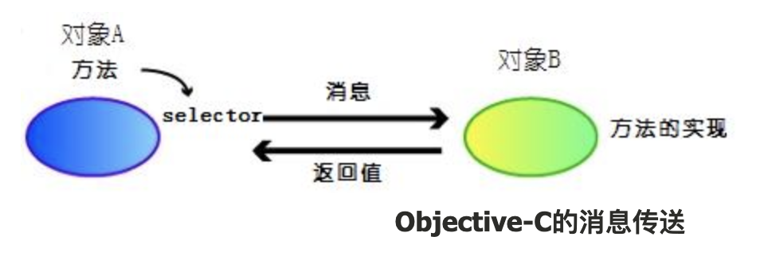

# nil Nil NULL [NSNULL null] SET IMP 等概念

来看看 Objective-C 语言中的头文件 objc.h 的定义 :

```
// objc.h  
  
typedef struct objc_class *Class;  
  
typedef struct objc_object {  
  Class isa;  
} *id;  
  
typedef struct objc_selector  *SEL;  
typedef id      (*IMP)(id, SEL, …);  
typedef signed char   BOOL;  
  
#define YES             (BOOL)1  
#define NO              (BOOL)0  
  
#ifndef Nil  
#define Nil 0   /* id of Nil class */  
#endif  
  
#ifndef nil  
#define nil 0   /* id of Nil instance */  
#endif
```

## id
id和void *并非完全一样。在上面的代码中，id是指向struct objc_object的一个指针，这个意思基本上是说，id是一个指向任何一个继承了Object（或者NSObject）类的对象。需要注意的是id是一个指针，所以你在使用id的时候不需要加星号。比如id foo=nil定义了一个nil指针，这个指针指向NSObject的一个任意子类。而id *foo=nil则定义了一个指针，这个指针指向另一个指针，被指向的这个指针指向NSObject的一个子类。

## nil
nil和C语言的NULL相同，在objc/objc.h中定义。nil表示一个Objctive-C对象，这个对象的指针指向空（没有东西就是空）。

nil的定义是null pointer to object-c object，指的是一个OC对象指针为空，本质就是(id)0，是OC对象的字面0值

## Nil
首字母大写的Nil和nil有一点不一样，Nil定义一个指向空的类（是Class，而不是对象）。

nil完全等同于Nil，只不过由于编程习惯，人们一般把对象置空用nil，把类置空用Nil。

Nil的定义是null pointer to object-c class，指的是一个类指针为空。本质就是(class)0，OC类的字面零值。
```objc
Class class = [NSString class];
if (class != Nil) {
    NSLog(@"class name: %@", class);
}
```

## NULL
这个是从C语言继承来的，就是一个简单的空指针。

NULL的定义是null pointer to primitive type or absence of data，指的是一般的基础数据类型为空，可以给任意的指针赋值。本质就是(void )0，是C指针的字面0值。
```objc
NSInteger *pointerA = NULL;
NSInteger pointerB = 10;
pointerA = &pointerB;
NSLog(@"%ld", *pointerA);
```
我们要尽量不去将NULL初始化OC对象，可能会产生一些异常的错误，要使用nil，NULL主要针对基础数据类型。


## [NSNULL null]
这个才是重点：[NSNull null]和nil的区别在于，nil是一个空对象，已经完全从内存中消失了，而如果我们想表达“我们需要有这样一个容器，但这个容器里什么也没有”的观念时，我们就用到[NSNull null]，它就是为“值为空的对象”。如果你查阅开发文档你会发现NSNull这个类是继承NSObject，并且只有一个“+ (NSNull *) null；”类方法。这就说明NSNull对象拥有一个有效的内存地址，所以在程序中对它的任何引用都是不会导致程序崩溃的。

NSNull主要用在不能使用nil的场景下，比如NSMutableArray是以nil作为数组结尾判断的，所以如果想插入一个空的对象就不能使用nil，NSMutableDictionary也是类似，我们不能使用nil作为一个object，而要使用NSNull

## SEL
SEL是“selector”的一个类型，表示`一个方法的名字`。比如以下方法：

```
-[Foo count] 和 -[Bar count] 使用同一个selector，它们的selector叫做count。
```

在上面的头文件里我们看到，SEL是指向 struct objc_selector的指针，但是objc_selector是什么呢？那么实际上，你使用GNU Objective-C的运行时间库和NeXT Objective-C的运行运行时间库（Mac OS X使用NeXT的运行时间库）时,它们的定义是不一样的。实际上Mac OSX仅仅将SEL映射为`C字符串`。比如，我们定义一个Foo的类，这个类带有一个- (int) blah方法，那么以下代码：

```
NSLog (@"SEL=%s", @selector(blah));  
```

会输出为 SEL=blah。说白了`SEL就是返回方法名`。

这样的机制大大的增加了我们的程序的灵活性，我们可以通过给一个方法传递SEL参数，让这个方法动态的执行某一个方法；我们也可以通过配置文件指定需要执行的方法，程序读取配置文件之后把方法的字符串翻译成为SEL变量然后给相应的对象发送这个消息。

在 Objective-C 运行时库中，selector 是作为数组来管理的。这都是从效率的角度出发：函数调用的时候，不是通过方法名字比较而是指针值的比较来查找方法，由于整数的查找和匹配比字符串要快得多，所以这样可以在某种程度上提高执行的效率。

这样就必须保证所有类中的 selector 须指向同一实体（数组）。一旦有新的类被定义，其中的 selector 也需要映射到这个数组中。

实际情况下，总共有两种 selector 的数组：预先定义好的内置selector数组和用于动态追加的selector数组。

### 内置selector

简单地说，内置的selector就是一个大的字符串数组。定义在objc-sel-table.h文件中:

```
#define NUM_BUILTIN_SELS 16371  
/* base-2 log of greatest power of 2 < NUM_BUILTIN_SELS */  
#define LG_NUM_BUILTIN_SELS 13  
  
static const char * const _objc_builtin_selectors[NUM_BUILTIN_SELS] = {  
    ".cxx_construct",  
    ".cxx_destruct",  
    "CGColorSpace",  
    "CGCompositeOperationInContext:",  
    "CIContext",  
    "CI_affineTransform",  
    "CI_arrayWithAffineTransform:",  
    "CI_copyWithZone:map:",  
    "CI_initWithAffineTransform:",  
    "CI_initWithRect:",  
    "CI_rect",  
    "CTM",  
    "DOMDocument",  
    "DTD",  
    ...  
  
};  
```

 可以看到，数组的大小NUM_BUILTIN_SELS定义为16371。字符串按照字母顺序排序，简单的都是为了运行时检索的速度（二分法查找）。从定义好的 selector 名称我们可以看到一些新的方法名称，比如 CIConetext，CI开头的方法是由Tiger开始导入的程序库。每次系统更新的时候，这个数组也是需要更新的。

 ### 动态追加selector

另一个用于动态追加的 selector,其定义在 objc-sel.m 和 objc-sel-set.m 文件中新的 selector 都被追加到 _buckets 成员中，其中追加和搜索使用 Hash 算法。

```
static struct __objc_sel_set *_objc_selectors = NULL;  
  
struct __objc_sel_set {  
    uint32_t _count;  
    uint32_t _capacity;  
    uint32_t _bucketsNum;  
    SEL *_buckets;  
};
```

## IMP

从上面的头文件中我们可以看到，IMP定义为

```
id (*IMP) (id, SEL, …)。  
```

这样说来，IMP是一个指向函数的指针，这个被指向的函数包括id(“self”指针)，调用的SEL（方法名），再加上一些其他参数。说白了IMP就是实现方法。

我们取得了函数指针之后，也就意味着我们取得了执行的时候的这段方法的代码的入口，这样我们就可以像普通的C语言函数调用一样使用这个函数指针。当然我们可以把函数指针作为参数传递到其他的方法，或者实例变量里面，从而获得极大的动态性。我们获得了动态性，但是付出的代价就是编译器不知道我们要执行哪一个方法所以在编译的时候不会替我们找出错误，我们只有执行的时候才知道，我们写的函数指针是否是正确的。所以，在使用函数指针的时候要非常准确地把握能够出现的所有可能，并且做出预防。尤其是当你在写一个供他人调用的接口API的时候，这一点非常重要。

### 方法的定义
在头文件 objc-class.h 中，有方法的定义 :

```
typedef struct objc_method *Method;  
  
struct objc_method {  
    SEL method_name;  
    char *method_types;  
    IMP method_imp;  
}; 
```

这个定义看上去包括了我们上面说过的其他类型。也就是说，Method（我们常说的方法）表示一种类型，这种类型与selector和实现(implementation)相关。

最初的SEL是方法的名称method_name。char型的method_types表示方法的参数。最后的IMP就是实际的函数指针，指向函数的实现。

## Class的定义

Class（类）被定义为一个指向struct objc_class的指针，在objc/objc-class.h中它是这么定义的：

```
struct objc_class {  
  struct objc_class *isa;                /* metaclass */  
  struct objc_class *super_class;        /* 父类 */  
  const char *name;                      /* 类名称 */  
  long version;                          /* 版本 */  
  long info;                             /* 类信息 */  
  long instance_size;                    /* 实例大小 */  
  struct objc_ivar_list *ivars;          /* 实例参数链表 */  
  struct objc_method_list **methodLists; /* 方法链表 */  
  struct objc_cache *cache;              /* 方法的缓存 */  
  struct objc_protocol_list *protocols;  /* protocol链表 */  
}; 
```

由以上的结构信息，我们可以像类似于C语言中结构体操作一样来使用成员。比如下面取得类的名称:

```
Class cls;  
cls = [NSString class];  
  
printf("class name %s\n", ((struct objc_class*)cls)->name);  
```

平时直接：

```
NSLog(@"class name>> %@",NSStringFromClass([self class]));
```

## 发送消息与函数调用的不同

Objective-C的消息传送如下图所示 :



发送消息的过程，可以总结为以下内容 :

- 首先，指定调用的方法
- 为了方法调用，取得 selector：源代码被编译以后，方法被解释为 selector。这里的 selector 只是单纯的字符串。
- 消息发送给对象B：消息传送使用到了 objc_msgSend 运行时API。这个API只是将 selector 传递给目标对象B。
- 从 selector 取得实际的方法实现：首先，从对象B取得类的信息，查询方法的实现是否被缓存（上面类定义中的struct objc_cache *cache;）。如果没有被缓存，则在方法链表中查询（上面类定义中的struct objc_method_list **methodLists;）。
- 执行
- 利用函数指针，调用方法的实现。这时，第一个参数是对象实例，第二个是 selector。
- 传送返回值

利用 objc_msgSend API 经方法的返回值传送回去。

简单地从上面发送消息的过程可以看到，最终还是以函数指针的方式调用了函数。为什么特意花那么大的功夫绕个大圈子呢？1

这些年，随着程序库尺寸的扩大，动态链接库的使用已经非常普遍。就是说，应用程序本身并不包括库代码，而是在启动时或者运行过程中动态加载程序库。这样一来一方面可以减小程序大小，另一方面可以提升了代码重用（不用再造轮子）。但是，随之带来了向下兼容的问题。

如果程序库反复升级，添加新的方法的时候，开发者与用户间必须保持一致的版本，否则将产生运行时错误。一般，解决这个问题是，调用新定义的方法的时候，实现检查当前系统中是否存在新方法的实现。如果没有，跳过它或者简单地产生警告信息。 Objective-C中的respondsToSelector:方法就可以用来实现这样的动作。

但是，这并不是万全的解决方案。如果应用程序与新的动态程序库（含有新定义的API）一起编译后，新定义的API符号也被包含进去。而这样的应用程序放到比较旧的系统（旧的动态程序库）中运行的时候，因为找不到链接符号，程序将不能启动。这就是 win32系统中常见的「DLL地域」。

为了解决这个问题，Objective-C 编译得到的二进制文件中，函数是作为 selector 来保存的。就是说，不管调用什么函数，二进制文件中不会包含符号信息。为了验证 Objective-C 编译的二进制文件是否包含符号信息，这里用 nm 命令来查看。

源代码如下 :

```
int main (int argc, const char * argv[])  
{  
    NSString*   string;  
    int         length;  
    string = [[NSString alloc] initWithString:@"Objective-C"];  
    length = [string length];  
  
    return  0;  
}  
```

这里调用了 alloc、initWithString:、length 等方法。

```
% nm Test  
         U .objc_class_name_NSString  
00003000 D _NXArgc  
00003004 D _NXArgv  
         U ___CFConstantStringClassReference  
00002b98 T ___darwin_gcc3_preregister_frame_info  
         U ___keymgr_dwarf2_register_sections  
         U ___keymgr_global  
0000300c D ___progname  
000025ec t __call_mod_init_funcs  
000026ec t __call_objcInit  
         U __cthread_init_routine  
00002900 t __dyld_func_lookup  
000028a8 t __dyld_init_check  
         U __dyld_register_func_for_add_image  
         U __dyld_register_func_for_remove_image  
...  
```

可以看到，这里没有alloc、initWithString:、length3个方法的符号。所以，即使我们添加了新的方法，也可以在任何新旧系统中运行。当然，函数调用之前，需要使用 respondsToSelector: 来确定方法是否存在。正是这样的特性，使得程序可以运行时动态地查询要执行的方法，提高了 Objective-C 语言的柔韧性。

## Target-Action Paradigm

Objective-C 语言中，GUI控件对象间的通信利用 Target-Action Paradigm。不像其他事件驱动的 GUI 系统实现的那样，需要以回调函数的形式注册消息处理函数（Win32/MFC，Java AWT, X Window）。Target-Action Paradigm 完全是面向对象的事件传递机制。

例如用户点击菜单的事件，用Target-Action Paradigm来解释就是，调用菜单中被设定目标的Action。这个Action对应的方法不一定需要实现。目标与Action的指定与方法的实现没有关系，源代码编译的时候不会检测，只是在运行时确认（参考前面消息传送的机制）。

运行时，通过respondsToSelector: 方法来检查实现的情况。如果有实现，那么使用performSelector:withObject:来调用具体的Action，像是下面的代码:

```
// 目标对象  
id target;  
// 具体Action的 selector  
SEL action;  
...  
  
// 确认目标是否实现Action  
if ([target respondsToSelector:actioin]) {  
    // 调用具体Action  
    [target performSelector:action withObject:self];  
} 
```

通过这样的架构，利用 setTarget: 可以更该其他的目标，或者 setAction: 变换不同的Action。实现动态的方法调用。

## 总的来说，这里的四个表达没有的值是每个Objective-C程序员都应该知道的：

标志 | 值 | 含义
-|-|-
NULL | (void *)0 | C指针的字面零值
nil | (id)0 | Objective-C对象的字面零值
Nil | (Class)0 | Objective-C类的字面零值
NSNull | [NSNull null] | 用来表示零值的单独的对象


> from
>
> [id nil Nil SET IMP 等概念](https://www.iteye.com/blog/justsee-1620404)
>
> [Objective C 中的nil，Nil，NULL和NSNull理解](https://www.iteye.com/blog/justsee-2160744)