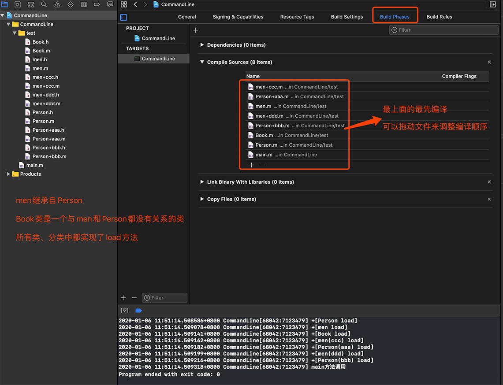

# Objective-C 中 +load 与 +initialize

## 类的加载

在java语言里，可以通过如下代码来实现加载类的时候执行对类的操作，一般叫：类初始块，或者，类加载块。比如：

```java
public class MyClass{    
    static{    
        ……    
    }    
}
```

在objc语言里，对应的机制是，2个类初始化方法，+(void)load和+(void)initialize。

比如：

```objectivec
#import "Constants.h"    
@implementation Constants    
  
+ (void)initialize{    
    NSLog(@"init constants >>>>>>>>>>");    
}    
  
+ (void)load{    
    NSLog(@"load constants >>>>>>>>>>");    
}    
  
@end 
```

## load 

 是加载类的时候，这里是Constants类，就会调用。也就是说，ios应用启动的时候，就会加载所有的类，就会调用这个方法。

 当我们启动程序时，参与了编译的类、分类都会被加载进内存，load方法就是在这个类被加载的时候调用的(前提是这个类有实现load方法)，这个过程与这个类是否被使用是无关的，也就是说如果有一个类(MyClass)即使在整个程序中都没有用到，甚至没有任何一个文件去引入MyClass的头文件，MyClass的的load的方法一样会被调用。等所有的类、分类都加载进内存后才会调用程序的main函数，所以所有类的load方法都是在main函数之前被调用的。而且每个类、分类的load方法只会被调用一次。

### load 注意
- 如果希望在类及其Categorgy中执行不同的初始化的话可以使用+load

- +(void)load; 在Objective-C运行时载入类或者Category时被调用

- 这个方法对动态库和静态库中的类或(Category)都有效.

- 但不同的类之间的+load方法的调用顺序是不确定的，所以不要在此方法中用另一个类。

### load 加载顺序

在Mac OS X 10.5及之后的版本，初始化的顺序如下：

1. 调用所有的Framework中的初始化方法

2. 调用所有的+load方法

3. 调用C++的静态初始化方及C/C++中的__attribute__(constructor)函数

4.调用所有链接到目标文件的framework中的初始化方法

另外

* 一个类的+load方法在其父类的+load方法后调用

* 一个Category的+load方法在被其扩展的类的自有+load方法后调用

在+load方法中，可以安全地向同一二进制包中的其它无关的类发送消息，但接收消息的类中的+load方法可能尚未被调用。

## initialize 

 这样有个缺点，当加载类需要很昂贵的资源，或者比较耗时的时候，可能造成不良的用户体验，或者系统的抖动。这时候，就要考虑initialize方法了。这个方法可看作类加载的延时加载方法。类加载后并不执行该方法。只有当实例化该类的实例的时候，才会在第一个实例加载前执行该方法。比如：

 [Constants alloc]： alloc将为Constants实例在堆上分配变量。这时调用一次initialize方法，而且仅调用一次，也就是说再次alloc操作的时候，不会再调用initialize方法了。

initialize 会在运行时仅被触发一次，如果没有向类发送消息的话，这个方法将不会被调用。这个方法的调用是线程安全的。

initialize方法是在类或它的子类收到第一条消息时被调用的，这里的消息就是指实例方法或类方法的调用，所以所有类的initialize调用是在执行main函数之后调用的。而且一个类只会调用一次initialize方法。如果一个类在程序运行过程中一直没有被使用过，那这个类的initialize方法也就不会被调用，这一点和load方法是不一样的。

## 要点：

1、initialize和load，我们并不需要在这两个方法的实现中使用super调用父类的方法。

1.1、如果子类和父类都实现了initialize方法，那么会先调用父类的方法，然后调用子类的方法个(这里注意子类中不需要写[super initialize]来调用父类的方法，通过查看源码得知它是在底层实现过程中主动调用的父类的initialize方法)。

2、load和initialize被调用一次是相对runtime而言 ，你可以当作普通类方法多次调用。

3、类加载到系统的时候就用调用load方法，类首次使用的时候调用initialize方法。

4、load不像普通方法一样遵从那套继承规则，当每个类没有实现 load方法，不管各级超类是否实现，系统都不会调用此类的load方法。initialize与其他方法一样，如果每个类没有实现initialize方法，而超类实现了，那么就会执行超类的这个方法，所以通常会：

```objc
+(void)initialize{  
if(self == [XXXClass clasee])  
//todo  
}  
```

加了这个检测后，只会在期望的那个类被加载的时候执行。

4.1、load方法调用时，每个类都是根据load方法的地址直接调用，而不会走objc_msgSend函数的方法查找流程，也就是说一个类有实现load方法就执行，没有就不执行(没有的话也不会去父类里面查找)。

想要了解更加详细的底层实现流程，可以去看[objc4源码](https://opensource.apple.com/tarballs/objc4/)，这里提供一下相关函数调用流程以便进行源码阅读：
首先从objc-os.mm文件的_objc_init函数开始-->load_images-->prepare_load_methods-->schedule_class_load-->add_class_to_loadable_list-->add_category_to_loadable_list-->call_load_methods-->call_class_loads-->call_category_loads-->(*load_method)(cls, SEL_load)。

4.2、initialize方法的调用和普通方法调用一样，也是走的objc_msgSend流程。所以如果一个类和它的分类都实现了initialize方法，那最终调用的会是分类中的方法。

5、initialize和load的方法必须写的精简。

6、initialize中可以实现无法在编译期初始化的全局变量，load的方法中可以实现swizzling的逻辑。

7、load的调用并不视为类的第一个方法完成，因为load中调用了当前类中的方法，就先去执行initialize方法了。

8、Runtime调用+(void)load时没有autorelease pool(这一点是非常需要注意的，也就是说放在+(void)load中的对象都应该是alloc出来并且不能使用autorelease来释放)。

```objc
@interface MainClass : NSObject  
@end  
  
@implementation MainClass  
  
+ (void) load {  
    NSArray *array = [NSArray array];  
    NSLog(@"%@ %s", array, __FUNCTION__);  
}  
  
@end 
```

objc[84934]: Object 0x10a512930 of class __NSArrayI autoreleased with no pool in place - just leaking - break on objc_autoreleaseNoPool() to debug 2012-09-28 18:07:39.042 ClassMethod[84934:403] ( ) +[MainClass load]
其原因是runtime调用+(void)load的时候，程序还没有建立其autorelease pool，所以那些会需要使用到autorelease pool的代码，都会出现异常。这一点是非常需要注意的，也就是说放在+(void)load中的对象都应该是alloc出来并且不能使用autorelease来释放。

9、load方法调用的顺序：父类(Superclass)的方法优先于子类(Subclass)的方法，类中的方法优先于类别(Category)中的方法。（+load方法不像普通方法一样，它不遵循那套继承规则。如果某个类本身没有实现+load方法，那么不管其它各级超类是否实现此方法，系统都不会调用。+load方法调用顺序是：SuperClass -->SubClass --> CategaryClass。

10、所有类别(Category)中的load方法都会执行。

11、最后一个类别(Category)中的initialize方法会覆盖之前类别和类中的initialize方法。

12、+initialize方法和+load方法还有个区别，就是运行期系统完整度上来讲，此时可以安全使用并调用任意类中的任意方法。而且，运行期系统也能确保+initialize方法一定会在“线程安全的环境”中执行，这就是说，只有执行+initialize的那个线程可以操作类或类实例，其他线程都要阻塞等着+initialize执行完。

13、虽然使用initialize要比使用load安全(因为在调用initialize时所有类已经被加载进内存了)，但我们还是要尽量少用initialize这个方法个，尤其要谨慎在分类中实现initialize方法，因为如果在分类中实现了，本类实现的initialize方法将不会被调用。实际开发中initialize方法一般用于初始化全局变量或静态变量。


## demo

### load



首先说明一下几个类的关系：Person类有aaa和bbb两个分类，men类继承自Person类，men也有2个分类ccc和ddd，Book类和前面这些类没有任何关系。

#### 解释：

- 编译顺序从上到下，上面先编译，下面后编译。由于先执行类的load再执行分类的load，最先参与编译的类是men，而men继承自Person，所以最先执行Person的load(虽然Person是后参与编译的，但是它是父类，所以会先执行)，然后再执行men的load。接着参与编译的是Book类，所以紧接着就是执行Book的load。再接着参与编译的类就是Person，由于它的load方法已经执行过了，此时就不会执行了。
- 所有的类的load方法都执行完后开始执行分类的load，分类参与编译的顺序是men+ccc-->Person+aaa-->men+ddd-->Person+bbb，所以分类的load方法个也是按照这个顺序执行。

#### 说明：

一个程序中如果所有的类、分类都实现了load方法，那么所有的load方法都会被调用。它们的执行顺序遵循以下规则：

- 先执行所有类的load方法，再执行所有分类的load方法。
- 执行类的load方法时，是按照参与编译的顺序，先编译的类先执行，但是如果某个类是继承自另一个类，那么会先执行父类的load方法个再执行自己的load方法。
- 执行分类的load方法时，是按照分类参与编译的顺序，先编译的分类先执行。

关于编译顺序，我们可以在项目的Build Phases --> Compile Sources查看，最上面的就最先编译，我们可以拖动文件来调整编译顺序。

### initialize

父类Person实现了initialize，PersonSub1和PersonSub2这两个子类也实现了initialize，PersonSub3和PersonSub4这两个子类没有实现了initialize，按照下面的顺序实例化对象：

```objc
PersonSub1 *ps1 = [[PersonSub1 alloc] init];
Person *person = [[Person alloc] init];
PersonSub2 *ps2 = [[PersonSub2 alloc] init];
PersonSub3 *ps3 = [[PersonSub3 alloc] init];
PersonSub4 *ps4 = [[PersonSub4 alloc] init];

// ***************打印结果***************
2020-01-06 15:52:38.429218+0800 CommandLine[68706:7207027] +[Person initialize]
2020-01-06 15:52:38.429250+0800 CommandLine[68706:7207027] +[PersonSub1 initialize]
2020-01-06 15:52:38.429287+0800 CommandLine[68706:7207027] +[PersonSub2 initialize]
2020-01-06 15:52:38.429347+0800 CommandLine[68706:7207027] +[Person initialize]
2020-01-06 15:52:38.429380+0800 CommandLine[68706:7207027] +[Person initialize]
```

看到这个运行结果，有人就有疑问了：不是说一个类只会调用一次initialize方法吗，为什么这里Person的initialize方法被调用了3次？

这里就需要讲解一下底层源码的执行流程了，每个类都有一个标记记录这个类是否调用过initialize，我这里就用一个BOOL类型的isInitialized来表示，然后用selfClass来表示自己的类，用superClass来表示父类，下面我用伪代码来描述一下底层源码执行流程：

```objc
// 如果自己没有调用过initialize就执行里面的代码
if(!selfClass.isInitialized){ 
    if(!superClass.isInitialized){
        // 如果父类没有执行过initialize就给父类发消息(一旦成功执行initialize就将父类的isInitialized置为YES)
        objc_msgSend(superClass,@selector(initialize));
    }
    // 再给自己的类发消息(一旦成功执行initialize就将自己类的isInitialized置为YES)
    objc_msgSend(selfClass,@selector(initialize));
}
```

接下来我来按照这个流程来解释一下上面运行的结果：

- 首先PersonSub1被使用，而此时PersonSub1的isInitialized为NO，而且父类Person的isInitialized也为NO，所以先给父类发消息执行initialize，执行完后Person的isInitialized变为YES。然后PersonSub1执行自己的initialize，执行完后PersonSub1的isInitialized变为YES。所以这一步先打印+[Person initialize]，然后打印+[PersonSub1 initialize]。
- 然后是Person实例化，此时Person的isInitialized为YES，所以不会再调用initialize。所以这一步什么都没打印。
- 接着是PersonSub2实例化，此时PersonSub2的isInitialized为NO，父类Person的isInitialized为YES，所以只有PersonSub2会执行initialize，执行完后PersonSub2的isInitialized变为YES。所以这一步打印的是+[PersonSub2 initialize]。
- 再接着是PersonSub3实例化，此时PersonSub3的isInitialized为NO，父类Person的isInitialized为YES，所以只有PersonSub3会执行initialize，但是由于PersonSub3没有实现initialize，它就会去父类找这个方法的实现，找到后就执行父类Person的initialize(注意这里是PersonSub3执行的Person中的initialize，而不是Person执行的)，执行完后PersonSub3的isInitialized变为YES。所以这一步打印的是+[Person initialize]。(注意这里打印的是方法信息，表示执行的是Person中的initialize，而不是说是Person调用的initialize)。
- 最后是PersonSub4实例化，这一步过程和上面一步是一样的，执行完后PersonSub4的isInitialized变为YES。这一步打印的是+[Person initialize]。

所以最后的结果就是Person、PersonSub1、PersonSub2、PersonSub3、PersonSub4这5个类都执行了一次initialize，虽然从运行结果来看Person的initialize执行了3次，其实后面2次是PersonSub3和PersonSub4调用的。


> [Objective-C 中 +load 与 +initialize](https://www.iteye.com/blog/justsee-1630979)
>
> [testLoadInitialize.zip](testLoadInitialize.zip)
