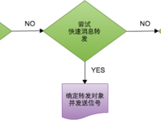
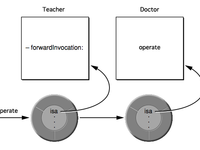

# Objective-C 的“多继承”

当单继承不够用，很难为问题域建模时，我们通常都会直接想到多继承。多继承是从多余一个直接基类派生类的能力，可以更加直接地为应用程序建模。但是Objective-C不支持多继承，由于消息机制名字查找发生在运行时而非编译时，很难解决多个基类可能导致的二义性问题。不过其实 Objective-C 也无需支持多继承，我们可以找到如下几种间接实现多继承目的的方法：

- 消息转发
- delegate和protocol
- 类别

## 消息转发

当向someObject发送某消息，但runtime system在当前类和父类中都找不到对应方法的实现时，runtime system并不会立即报错使程序崩溃，而是依次执行下列步骤：



分别简述一下流程：
    
1.动态方法解析：向当前类发送 resolveInstanceMethod: 信号，检查是否动态向该类添加了方法。（迷茫请搜索：@dynamic）

2.快速消息转发：检查该类是否实现了 forwardingTargetForSelector: 方法，若实现了则调用这个方法。若该方法返回值对象非nil或非self，则向该返回对象重新发送消息。

3.标准消息转发：runtime发送methodSignatureForSelector:消息获取Selector对应的方法签名。返回值非空则通过forwardInvocation:转发消息，返回值为空则向当前对象发送doesNotRecognizeSelector:消息，程序崩溃退出。

顾名思义，我们可以利用上述过程中的2、3两种方式来完成消息转发。

### 快速消息转发
快速消息转发的实现方法很简单，只需要重写 - (id)forwardingTargetForSelector:(SEL)aSelector  方法即可。

我来举个简单的例子，比如现有2个类：Teacher 和 Doctor，Doctor可以做手术（operate方法）。

```
@interface Teacher : NSObject   
   
@end   
 
@interface Doctor : NSObject   
   
- (void)operate;   
@end 
```

通过快速消息转发，可以很轻松的让teacher调用doctor的方法做手术。

Teacher类需要实现将消息转发给Doctor：

```
- (id)forwardingTargetForSelector:(SEL)aSelector   
{   
    Doctor *doctor = [[Doctor alloc]init];   
    if ([doctor respondsToSelector:aSelector]) {   
        return doctor;   
    }   
    return nil;   
}  
```

虽然消息可以动态转发传递，但是编辑器的静态检查是绕不过的，那么问题来了，既然Teacher类没有实现operate方法又该如何声明呢？

到目前为止，我只想到下面2种方法：

声明方法1 ———— 类别
```
@interface Teacher (DoctorMethod)   
- (void)operate;   
   
@end 
```

声明方法2 ———— 导入头文件、调用时强转类型

Teacher类头文件需要包含Doctor头文件，告诉编译器去Doctor.h中可以找到operator方法的声明，并且在调用时强转类型。
```
Teacher *teacher = [[Teacher alloc]init];   
[(Doctor *)teacher operate];  
```

有兴趣可以思考一个问题：如果将其类型转成 id ，也可以编译通过，并实现转发。可是会带来什么隐患呢？

方法1使用类别足够清晰简便，为什么还要提出办法2呢 ？ 我的想法是，方法1的弊端是抛出来的方法是定死的，而且在.h里露着；方法2就相对灵活，而且隐藏了我要转发的消息。


### 标准消息转发
标准消息转发需要重写 methodSignatureForSelector: 和 forwardInvocation: 两个方法即可。

发流程如图所示：
 


转发重写方法：

```
- (NSMethodSignature *)methodSignatureForSelector:(SEL)aSelector   
{   
    NSMethodSignature* signature = [super methodSignatureForSelector:aSelector];   
    if (signature==nil) {   
        signature = [someObj methodSignatureForSelector:aSelector];   
    }   
    NSUInteger argCount = [signature numberOfArguments];   
    for (NSInteger i=0 ; i<argCount ; i++) {   
    }   
       
    return signature;   
}   
   
- (void)forwardInvocation:(NSInvocation *)anInvocation   
{   
    SEL seletor = [anInvocation selector];   
    if ([someObj respondsToSelector:seletor]) {   
        [anInvocation invokeWithTarget:someObj];   
    }   
       
}   
```

### 两种消息转发方式的比较

- 快速消息转发：简单、快速、但仅能转发给一个对象。
- 标准消息转发：稍复杂、较慢、但转发操作实现可控，可以实现多对象转发。

## delegate和protocol

委托是Objective-C中最常用的一种回调机制。用法我觉得没什么好说的，总结一下该机制特点：
委托协助主体完成操作任务，将需要定制化的操作预留给委托对象来自定义实现，类似子类化主体。
除此之外，可以用作事件监听。
一时还真想不出来了…

## 类别
个人认为类别是Objective-C设计的一大精髓，也是我爱上Objective-C的最大理由。
 
类别是个强大的东西，它既可以为类添加方法，也可以添加实例。一定有不少人不认同，想提醒我：类别的局限性之一就是无法向类中添加新的实例变量。 背书真心毁人，听我举个例子慢慢说。
    
重新再来个Teacher类：
```
@interface Teacher : NSObject   
{   
    NSUInteger age;   
}   
   
@end 
```

光有个年龄还不能满足对teacher的描述，我想加个profession实例来存teacher的专业。直观的想法是子类化Teacher，其实也可以用类别。
 
你需要了解一下 runtime 编程知识，关注一下 objc_setAssociatedObject 和 objc_getAssociatedObject 。
```
//   
//  Teacher+Profession.m   
//     
   
#import "Teacher+Profession.h"   
#import <objc/runtime.h>   
   
const char *ProfessionType = "NSString *";   
@implementation Teacher (Profession)   
   
-(void)setProf:(NSString*)prof   
{   
    objc_setAssociatedObject(self, ProfessionType, prof, OBJC_ASSOCIATION_RETAIN_NONATOMIC);   
}   
   
-(NSString *)prof   
{   
    NSString *pro = objc_getAssociatedObject(self, ProfessionType);   
    return pro;   
}   
   
@end   
//   
//  Teacher+Profession.m   
//     
   
#import "Teacher+Profession.h"   
#import <objc/runtime.h>   
   
const char *ProfessionType = "NSString *";   
@implementation Teacher (Profession)   
   
-(void)setProf:(NSString*)prof   
{   
    objc_setAssociatedObject(self, ProfessionType, prof, OBJC_ASSOCIATION_RETAIN_NONATOMIC);   
}   
   
-(NSString *)prof   
{   
    NSString *pro = objc_getAssociatedObject(self, ProfessionType);   
    return pro;   
}   
   
@end   
```

现在就可以通过setProf: 和 prof 来存取 teacher 的 profession 值了。

> from
> 
> [Objective-C 的“多继承”](https://www.iteye.com/blog/justsee-2038152)
