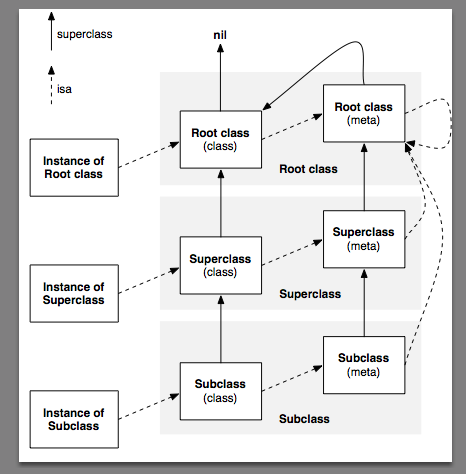

# 对象&类&元类（Object & Class & Meta Class）

作为C语言的超集，面向对象成为Objective-C与C语言的最大区别，因此，对象是Objective-C中最重要的部分之一。目前面向对象的语言有很多，Objective-C中的对象又和其他语言中的对象有什么区别呢？下面来简单介绍Objective-C中对象的实现。

## 1、Objective-C中的类
谁都知道，所有的对象都是由其对应的类实例化而来，`殊不知类本身也是一种对象`，先不要对这句话感到惊讶。

首先我们来关注Objective-C中的类。在Objective-C中，我们用到的几乎所有类都是NSObject类的子类，NSObject类定义格式如下（忽略其方法声明）：
```
@interface NSObject <NSObject> {
Class isa;
}
```
这个Class为何物？在objc.h中我们发现其仅仅是一个结构(struct)指针的typedef定义:
```
typedef struct objc_class *Class;
```
同样的，objc_class又是什么呢？在Objective-C2.0中，objc_class的定义如下：
```
struct objc_class {
Class isa;
}
```
写到这里大家可能就晕了，怎么又有一个isa？？这些isa到底是什么？之间有什么区别和联系？接下来解答这一连串的疑问。

其实在Objective-C中任何的类定义都是对象。即在程序启动的时候任何类定义都对应于一块内存。在编译的时候，编译器会给每一个类生成一个且只生成一个”描述其定义的对象”,也就是苹果公司说的类对象(class object),他是一个单例(singleton), 而我们在C++等语言中所谓的对象，叫做实例对象(instance object)。对于实例对象我们不难理解，但类对象(class object)是干什么吃的呢？我们知道Objective-C是门很动态的语言，因此程序里的所有实例对象(instace object)都是在运行时由Objective-C的运行时库生成的，而这个类对象(class object)就是运行时库用来创建实例对象(instance object)的依据。

再回到之前的问题，肿么这个实例对象(instance object)的isa指针指向的类对象(class object)里面还有一个isa呢？这个类对象(class objec)的isa指向的依然是一个objc-class，它就是“元类对象”(metaclass object)。

它和类对象(class object)的关系是这样的:

## 2、类对象（class object）
### ①类对象的实质
我们知道了：类对象是由编译器创建的，即`在编译时所谓的类，就是指类对象`（官方文档中是这样说的： The class object is the compiled version of the class）。任何直接或间接继承了NSObject的类，它的实例对象(instance objec)中都有一个isa指针，指向它的类对象(class object)。这个`类对象(class object)中存储了关于这个实例对象(instace object)所属的类的定义的一切`：包括变量，方法，遵守的协议等等。因此，类对象能访问所有关于这个类的信息，利用这些信息可以产生一个新的实例，但是类对象不能访问任何实例对象的内容。

当你调用一个 “类方法” 例如 [NSObject alloc],你事实上是发送了一个消息给他的类对象。

### ②类对象和实例对象的区别
当然有区别了，尽管类对象保留了一个类实例的原型，但它并不是实例本身。它没有自己的实例变量，也不能执行那些类的实例的方法（只有实例对象才可以执行实例方法）。然而，类的定义能包含那些特意为类对象准备的方法–类方法（ 而不是的实例方法）。类对象从父类那里继承类方法，就像实例从父类那里继承实例方法一样。
### ③类对象与类名
在源代码中，类对象由类名表示。

在下面的例子中，Retangle类 用从NSObject那里继承来的方法来返回类的版本号：
```
int versionNumber = [Rectangle version];
```
只有在消息表达式中作为接收者，类名才代表类对象。其他地方，你需要要求一个实例或者类返回class id。 响应class消息：
```
id aClass = [anObject class];
id rectClass = [Rectangle class];
```
如同上面的例子显示的那样，类对象像其他对象一样，也是id类型。

总之，类对象是一个功能完整的对象，所以也能被动态识别（dynamically typed），接收消息，从其他类继承方法。特殊之处在于它们是由编译器创建的，缺少它们自己的数据结构(实例变量），只是在运行时产生实例的代理。

## 3、元类对象(metaclass object)
### ①元类对象的实质
实际上，`类对象是元类对象的一个实例`！！元类描述了 一个类对象，就像类对象描述了普通对象一样。不同的是元类的方法列表是类方法的集合，由类对象的选择器来响应。当向一个类发送消息时，objc_msgSend会通过类对象的isa指针定位到元类，并检查元类的方法列表（包括父类）来决定调用哪个方法。元类代替了类对象描述了类方法，就像类对象代替了实例对象描述了实例化方法。

很显然，`元类也是对象，也应该是其他类的实例`，实际上元类是根元类(root class’s metaclass)的实例,而根元类是其自身的实例，即根元类的isa指针指向自身。

类的super_class指向其父类，而元类的super_class则指向父类的元类。元类的super class链与类的super class链平行，所以类方法的继承与实例方法的继承也是并行的。而根元类(root class’s metaclass)的super_class指向根类(root class)，这样，整个指针链就链接起来了！！

记住，当一个消息发送给任何一个对象， 方法的检查 从对象的 isa 指针开始，然后是父类。`实例方法在类中定义， 类方法 在元类和根类中定义。（根类的元类就是根类自己）`。在一些计算机语言的原理中，一个类和元类层次结构可以更自由的组成，更深元类链和从单一的元类继承的更多的实例化的类。Objective-C 的类方法 是使用元类的根本原因，在其他方面试图在隐藏元类。例如 [NSObject class] 完全相等于 [NSObject self]，所以，在形式上他还是返回的 NSObject->isa 指向的元类。 Objective-C语言是一组实用的折中方案。

还有些不明白？ 下面这个图标可能会有些帮助：



综上所述，类对象(class object)中包含了类的实例变量，实例方法的定义，而元类对象(metaclass object)中包括了类的类方法(也就是C++中的静态方法)的定义。类对象和元类对象中当然还会包含一些其它的东西，苹果以后也可能添加其它的内容，但对于我们只需要记住：`类对象存的是关于实例对象的信息(变量，实例方法等)，而元类对象(metaclass object)中存储的是关于类的信息(类的版本，名字，类方法等)`。要注意的是，类对象(class object)和元类对象(metaclass object)的定义都是`objc_class`结构，其不同仅仅是在用途上，比如其中的方法列表在类对象(instance object)中保存的是实例方法(instance method)，而在元类对象(metaclass object)中则保存的是类方法(class method)。关于元类对象可以参考苹果官方文档" The Objective-‐C Programming Language "

## 4、类对象和元类对象的相关方法

### ①object_getClass跟随实例的isa指针，返回此实例所属的类，对于实例对象(instance)返回的是类(class),对于类(class)则返回的是元类(metaclass),

### ②-class方法对于实例对象(instance)会返回类(class),但对于类(class)则不会返回元类(metaclass),而只会返回类本身，即[@"instance" class]返回的是__NSCFConstantString,而[NSString class]返回的是NSString。

### ③class_isMetaClass可判断某类是否为元类.                                     

### ④使用objc_allocateClassPair可在运行时创建新的类与元类对，使用class_addMethod和class_addIvar可向类中增加方法和实例变量，最后使用objc_registerClassPair注册后，就可以使用此类了。看到动态语言牛逼的地方了吗，可以在需要时更改已经定义好的类！Objective-C的类别方法估计底层就是这么实现的，只是不知道为什么类别不能增加实例变量，有高手请留言。

## demo
```
@interface Sark : NSObject
@end

@implementation Sark
@end

int main(int argc, const char * argv[]) {
    @autoreleasepool {
        BOOL res1 = [(id)[NSObject class] isKindOfClass:[NSObject class]];
        BOOL res2 = [(id)[NSObject class] isMemberOfClass:[NSObject class]];

        BOOL res3 = [(id)[Sark class] isKindOfClass:[Sark class]];
        BOOL res4 = [(id)[Sark class] isMemberOfClass:[Sark class]];

        NSLog(@"%d %d %d %d", res1, res2, res3, res4);
    }
    return 0;
}
```

```
运行结果为：

2014-11-05 14:45:08.474 Test[9412:721945] 1 0 0 0
```

### 这里先看几个概念:
什么是 id?

id 在 objc.h 中定义如下:
```
/// A pointer to an instance of a class.
typedef struct objc_object *id;
```
就像注释中所说的这样 id 是指向一个 objc_object 结构体的指针。

id 这个struct的定义本身就带了一个 *, 所以我们在使用其他NSObject类型的实例时需要在前面加上 *， 而使用 id 时却不用。

那么objc_object又是什么呢?

objc_object 在 objc.h 中定义如下:
```
/// Represents an instance of a class.
struct objc_object {
    Class isa;
};
```
这个时候我们知道Objective-C中的object在最后会被转换成C的结构体，而在这个struct中有一个 isa 指针，指向它的类别 Class。

那么什么是Class呢?

在 objc.h 中定义如下:
```
/// An opaque type that represents an Objective-C class.
typedef struct objc_class *Class;
```
我们可以看到 Class本身指向的也是一个C的struct objc_class。

继续看在runtime.h中objc_class定义如下:
```
struct objc_class {
    Class isa  OBJC_ISA_AVAILABILITY;
    #if !__OBJC2__
    Class super_class                                        OBJC2_UNAVAILABLE;
    const char *name                                         OBJC2_UNAVAILABLE;
    long version                                             OBJC2_UNAVAILABLE;
    long info                                                OBJC2_UNAVAILABLE;
    long instance_size                                       OBJC2_UNAVAILABLE;
    struct objc_ivar_list *ivars                             OBJC2_UNAVAILABLE;
    struct objc_method_list **methodLists                    OBJC2_UNAVAILABLE;
    struct objc_cache *cache                                 OBJC2_UNAVAILABLE;
    struct objc_protocol_list *protocols                     OBJC2_UNAVAILABLE;
    #endif
} OBJC2_UNAVAILABLE;
```
该结构体中，isa 指向所属Class， super_class指向父类别。

继续看

下载objc源代码，在 objc-runtime-new.h 中，我们发现 objc_class有如下定义:
```
struct objc_class : objc_object {
    // Class ISA;
    Class superclass;   
    ...
    ...
}
```
豁然开朗，我们看到在Objective-C的设计哲学中，一切都是对象。Class在设计中本身也是一个对象。而这个Class对象的对应的类，我们叫它 Meta Class。即Class结构体中的 isa 指向的就是它的 Meta Class。//struct objc_class : objc_object 

Meta Class

根据上面的描述，我们可以把Meta Class理解为 一个Class对象的Class。简单的说：

当我们发送一个消息给一个NSObject对象时，这条消息会在对象的类的方法列表里查找

当我们发送一个消息给一个类时，这条消息会在类的Meta Class的方法列表里查找

而 Meta Class本身也是一个Class，它跟其他Class一样也有自己的 isa 和 super_class 指针。看下图：


每个Class都有一个isa指针指向一个唯一的Meta Class

每一个Meta Class的isa指针都指向最上层的Meta Class（图中的NSObject的Meta Class）

最上层的Meta Class的isa指针指向自己，形成一个回路

每一个Meta Class的super class指针指向它原本Class的 Super Class的Meta Class。但是最上层的Meta Class的 Super Class指向NSObject Class本身

最上层的NSObject Class的super class指向 nil

### 解惑
为了更加清楚的知道整个函数调用过程，我们使用clang -rewrite-objc main.m重写，可获得如下代码：
```
 BOOL res1 = ((BOOL (*)(id, SEL, Class))(void *)objc_msgSend)((id)((Class (*)(id, SEL))(void *)objc_msgSend)((id)objc_getClass("NSObject"), sel_registerName("class")), sel_registerName("isKindOfClass:"), ((Class (*)(id, SEL))(void *)objc_msgSend)((id)objc_getClass("NSObject"), sel_registerName("class")));

 BOOL res2 = ((BOOL (*)(id, SEL, Class))(void *)objc_msgSend)((id)((Class (*)(id, SEL))(void *)objc_msgSend)((id)objc_getClass("NSObject"), sel_registerName("class")), sel_registerName("isMemberOfClass:"), ((Class (*)(id, SEL))(void *)objc_msgSend)((id)objc_getClass("NSObject"), sel_registerName("class")));

 BOOL res3 = ((BOOL (*)(id, SEL, Class))(void *)objc_msgSend)((id)((Class (*)(id, SEL))(void *)objc_msgSend)((id)objc_getClass("Sark"), sel_registerName("class")), sel_registerName("isMemberOfClass:"), ((Class (*)(id, SEL))(void *)objc_msgSend)((id)objc_getClass("NSObject"), sel_registerName("class")));

 BOOL res4 = ((BOOL (*)(id, SEL, Class))(void *)objc_msgSend)((id)((Class (*)(id, SEL))(void *)objc_msgSend)((id)objc_getClass("Sark"), sel_registerName("class")), sel_registerName("isMemberOfClass:"), ((Class (*)(id, SEL))(void *)objc_msgSend)((id)objc_getClass("NSObject"), sel_registerName("class")));
```

先看前两个调用：

最外层是 objc_msgSend函数，转发消息。

函数第一个参数是 (id)((Class (*)(id, SEL))(void *)objc_msgSend)((id)objc_getClass("NSObject"), sel_registerName("class"))

函数第二个参数是转发的selector

函数第三个参数是 ((Class (*)(id, SEL))(void *)objc_msgSend)((id)objc_getClass("NSObject"), sel_registerName("class"))

我们注意到第一个参数和第三个参数对应重写的是[NSObject class]，即使用objc_msgSend向 NSObject Class 发送 @selector(class) 这个消息

打开objc源代码，在 Object.mm 中发现+ (Class)class实现如下:
```
+ (Class)class {
    return self;
}
```
所以即返回Class类的对象本身。看如下输出:
```
NSLog(@"%p", [NSObject class]);
NSLog(@"%p", [NSObject class]);

2014-11-05 18:48:30.939 Test[11682:865988] 0x7fff768d40f0
2014-11-05 18:48:30.940 Test[11682:865988] 0x7fff768d40f0
```
继续打开objc源代码，在 Object.mm 中，我们发现 isKindOfClass的实现如下:
```
- (BOOL)isKindOf:aClass
{
    Class cls;
    for (cls = isa; cls; cls = cls->superclass) 
        if (cls == (Class)aClass)
            return YES;
    return NO;
}
```
对着上面Meta Class的图和实现，我们可以看出

当 NSObject Class对象第一次进行比较时，得到它的isa为 NSObject的Meta Class， 这个时候 NSObject Meta Class 和 NSObject Class不相等。

然后取NSObject 的Meta Class 的Super class，这个时候又变成了 NSObject Class， 所以返回相等

所以上述第一个输出结果是 YES 。

我们在看下 `isMemberOfClass`的实现:
```
- (BOOL)isMemberOf:aClass
{
    return isa == (Class)aClass;
}
```
综上所述，当前的 isa 指向 NSObject 的 Meta Class， 所以和 NSObject Class不相等。

所以上述第二个输出结果为 NO 。

继续看后面两个调用:

Sark Class 的isa指向的是 Sark的Meta Class，和Sark Class不相等

Sark Meta Class的super class 指向的是 NSObject Meta Class， 和 Sark Class不相等

NSObject Meta Class的 super class 指向 NSObject Class，和 Sark Class 不相等

NSObject Class 的super class 指向 nil， 和 Sark Class不相等

所以后面两个调用的结果都输出为 NO 。

> from
> 
> [对象&类&元类（Object & Class & Meta Class）](https://www.iteye.com/blog/justsee-2163905)