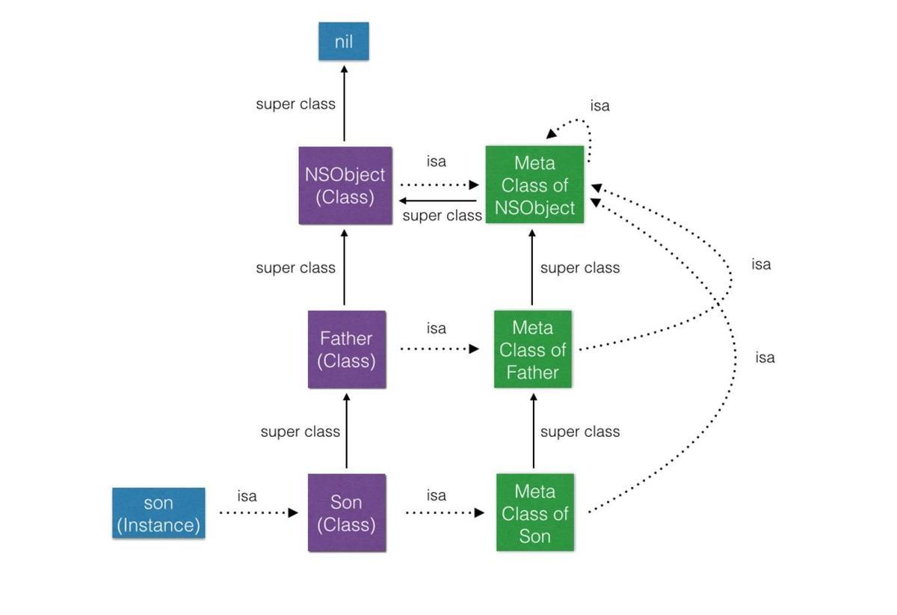

# 2019-09-02-iOS-tips

## :smile:什么时候栈上的Block会复制到堆
- 调用Block的copy实例方法时
- Block作为函数返回值返回时
- 将Block赋值给附有__strong修饰符id类型的类或者Block类型成员变量时
- 在方法名中含有usingBlock的Cocoa框架方法或Grand Central Dispatch 的API中传递Block时

## :smile:const
```
//全局变量，constString1地址不能修改，constString1值能修改
const NSString *constString1 = @"I am a const NSString * string";
//意义同上，无区别
NSString const *constString2 = @"I am a NSString const * string";
// stringConst 地址能修改，stringConst值不能修改
NSString * const stringConst = @"I am a NSString * const string";
```

## :smile:对象类对象元对象



- 每一个Class都有一个isa指针指向一个唯一的Meta Class
- 每一个Meta Class的isa指针都指向最上层的Meta Class，这个Meta Class是NSObject的Meta Class。(包括NSObject的Meta Class的isa指针也是指向的NSObject的Meta Class，也就是自己，这里形成了个闭环)
- 每一个Meta Class的super class指针指向它原本Class的 Super Class的Meta Class (这里最上层的NSObject的Meta Class的super class指针还是指向自己)
- 最上层的NSObject Class的super class指向 nil