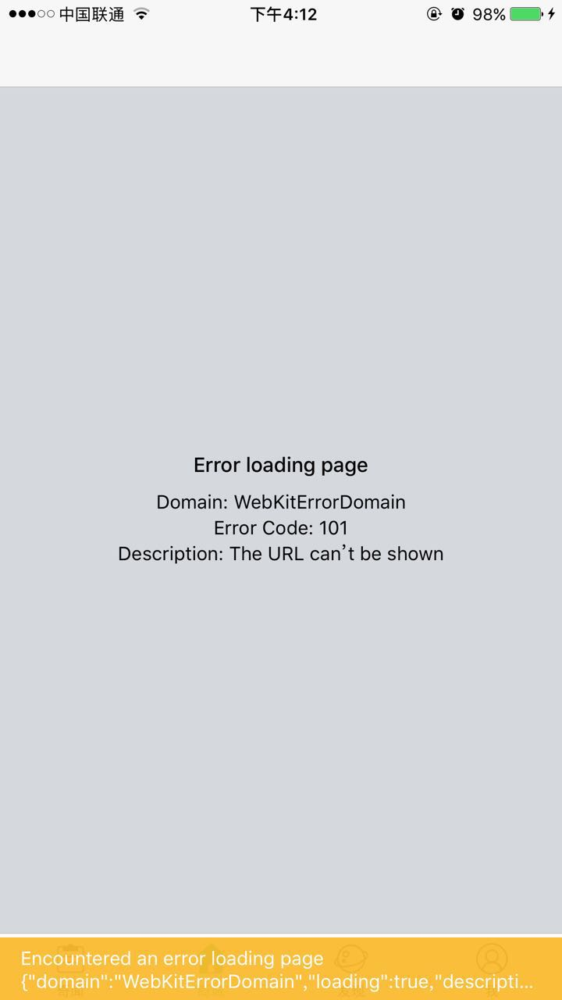

# React Native Tips


## :smile:8081端口占用
```
ERROR Packager can't listen on port 8081
```
fix：

在终端如下操作：

1. lsof -n -i4TCP:8081 列出被占用的端口列表

2. kill -9 <PID> 找到与之对应的PID然后删除即可

3. 重启服务npm start

## :smile:自定义组件报错 has no propType for native prop
解决办法就是在定义js组件属性时，加上:
```javascript
// rn0.44
import { ViewPropTypes } from "react-native";
propTypes: {
    ...ViewPropTypes,
}

// < rn0.44
var View = React.View;
/* later... */
propTypes: {
    ...View.propTypes,
    myProp: PropTypes.string
}
```
## :smile: iOS运行官方的RNTester（0.47.0），报错 #include <boost/iterator/iterator_adaptor.hpp>
iOS RN 0.45以上版本所需的第三方编译库(boost等)，这些库在国内下载都非常困难（一般的翻墙工具都很难下载），未来RN不同版本可能依赖不同版本的第三方编译库，具体所需库和版本请查看ios-install-third-party.sh文件：
```
fetch_and_unpack glog-0.3.4.tar.gz https://github.com/google/glog/archive/v0.3.4.tar.gz "$SCRIPTDIR/ios-configure-glog.sh"
fetch_and_unpack double-conversion-1.1.5.tar.gz https://github.com/google/double-conversion/archive/v1.1.5.tar.gz
fetch_and_unpack boost_1_63_0.tar.gz https://github.com/react-native-community/boost-for-react-native/releases/download/v1.63.0-0/boost_1_63_0.tar.gz
fetch_and_unpack folly-2016.09.26.00.tar.gz https://github.com/facebook/folly/archive/v2016.09.26.00.tar.gz
```
可以去[http://pan.baidu.com/s/1kVDUAZ9](http://pan.baidu.com/s/1kVDUAZ9) 下载boost_1_63_0.tar.gz（去哪个下载那个，我现在缺boost，所以就下载这个）。

- 下载后放入 ~/.rncache 文件夹下，

- 同时解压boost_1_63_0.tar.gz，把解压后的文件夹boost_1_63_0替换掉react-native/third-party/boost_1_63_0

- 最后重新clean ，运行项目。

## :smile:Cannot update during an existing state transition
在render这种需要props和state进行渲染的方法中，不能再对props和state进行更新。React会在props和state改变的时候调用 render进行DOM diff然后渲染，如果在渲染过程中再对props和states进行更改，就陷入死循环了。

例如：

一般的 ListView 中每个 Row 的点击会对应一个 onPress 的事件，例如 push 到下一个 View，这种情况使用 onPress={this.handlePress} ，然后在 handlePress 里进行响应的操作就 OK 了。

在显示 Github 时间线的时候，每个 Row 里会提到多个用户名和仓库名，点击用户名和仓库名时需要做不同的处理。最容易想到的方法就是给 handlePress 传递参数了，如果使用下面的代码：
```
 var action = <View style={styles.action}>
                <Text>{actionDescription}</Text>
                <TouchableOpacity onPress={this.goToUser(this.props.data.name)}><Text>data.payload.member.login</Text></TouchableOpacity>
              <Text> to </Text>
```
点击时同样会报

 Error: Invariant Violation: setState(...): Cannot update ...
因为上面的写法等于是在渲染的时候执行了 this.goToUser，会导致 state 改变。 onPress 应该传递进一个函数，这个函数会在点击的时候执行。一种可行的写法是使用匿名函数封装：
```
 <TouchableOpacity onPress={()=>{
   this.goToUser(this.props.data.name)
  }}>
 </TouchableOpacity>
```
这样就不会在渲染的时候跑里面的函数，也就避免了冲突。

## :smile:WebView加载网页出现：WebKitErrorDomain code101 错误
### iOS环境下
加载有些网页的时候会出现一下



然后正常显示网页。

但是我测试在UIWebView、safari上加载都是正常的。

起初我是通过renderError返回null让错误页面不显示：
```javascript
    renderError={(e) => {
            if (e === 'WebKitErrorDomain') {
              return null
            }
          }}
```

后来通过测试发现出现问题的网页中有私有协议导致的，这些是有协议一般是网页和native交互所定义的。

但是为什么iOS UIWebView不会显示出错呢？UIWebView 应该是内部过滤掉非标准的url 相当于在 webView:shouldStartLoadWithRequest: navigationType:里面return NO。显然facebook在设计这个框架的时候并没有自动处理这些交互请求，需要我们自己处理。

在iOS端可以通过onShouldStartLoadWithRequest很容易的解决：
```javascript
    <WebView
          ref='webView'
          automaticallyAdjustContentInsets={false}
          style={styles.webView}
          source={{ uri: 'http://mall.iqiyi.com' }}
          scalesPageToFit
          renderError={(e) => {
            if (e === 'WebKitErrorDomain') {
              return null
            }
          }}
          onLoadEnd={(e) => this.onLoadEnd(e)}
          onShouldStartLoadWithRequest={(event) => {
            if (event.url.startsWith('http://') || event.url.startsWith('https://')) {
              return true;
            } else {
            // return false
              Linking.canOpenURL(event.url)
                .then(supported => {
                  if (supported) {
                    return Linking.openURL(url);
                  } else {
                    return false;
                  }
                }).catch(err => {
                  return false;
                })
            }
          }} />
```
在android平台并没有onShouldStartLoadWithRequest这个方法，这意味着android下webView与RN交互变得有点麻烦，在不改变java代码的情况下很难处理。
不过github上有个开源的框架[react-native-webview-bridge](https://github.com/alinz/react-native-webview-bridge)使用它可以方便网页和RN之间的数据交换。
```javascript
     <WebViewBridge
                   ref="webviewbridge"
                   style={styles.webView}
                   automaticallyAdjustContentInsets={false}
                   onShouldStartLoadWithRequest={this._onShouldStartLoadWithRequest}
                   onBridgeMessage={this._onBridgeMessage.bind(this)}
                   startInLoadingState={true}
                   domStorageEnabled={true}
                   javaScriptEnabled={true}
                   injectedJavaScript={injectScript}
               >
     </WebViewBridge>
```
在网页加载的时候注入js代码injectScript如下代码
```javascript
 $(function () {
         $("a").click(function(){
           WebViewBridge.send(this.href.toString());
         });
   });
```
a标签点击之后会把send的内容通过onBridgeMessage回调函数返回给RN。再在里面处理即可。

> [[iOS] WebView should handle custom URL scheme correctly #9037](https://github.com/facebook/react-native/issues/9037)
>
> [React Native WebView踩坑记](http://www.jianshu.com/p/f963839fca1a)
>
> [react-native之 WebView 异常bug](http://leonhwa.com/blog/0014905236320002ebb3db97fe64fb3bb6f047eafb1c5de000)

## :smile:封装native组件向js传递数值时，传递的非数字或极值
```
Error calling RCTEventEmitter.receiveEvent folly::toJson: JSON object value was a NaN or INF
```
比如获取avplayer中的duration可能返回一个.nan数值，直接传递给js会报这个错误。

fix：

swift
```swift
if duration.isNaN {
   duration = -1
}
```
oc
```oc
if (!CMTIME_IS_NUMERIC(duration)){
   return [NSNumber numberWithFloat:CMTimeGetSeconds(-1)];
}
```
> oc中测试CMTime 是否是无效的，或者是一个非数字值的宏：[CMTIME_IS_NUMERIC， CMTIME_IS_INVALID，CMTIME_IS_POSITIVE_INFINITY， CMTIME_IS_INDEFINITE](https://developer.apple.com/documentation/coremedia/cmtime-u58#//apple_ref/c/macro/CMTIME_IS_INVALID)
 
> [react-native-video的类似解决](https://github.com/react-native-community/react-native-video/commit/f73b7a04843fb5b17fb4fbedbe593c225594ab3b)


## :smile: rn0.47.1 升级到 rn0.49.5
[官方升级指南](https://facebook.github.io/react-native/docs/upgrading.html)

升级后报错：
```
...
Cannot find module 'imurmurhash'
Cannot find module 'mute-stream'
...
```
安装即可：
```
npm install imurmurhash
npm install mute-stream
```


