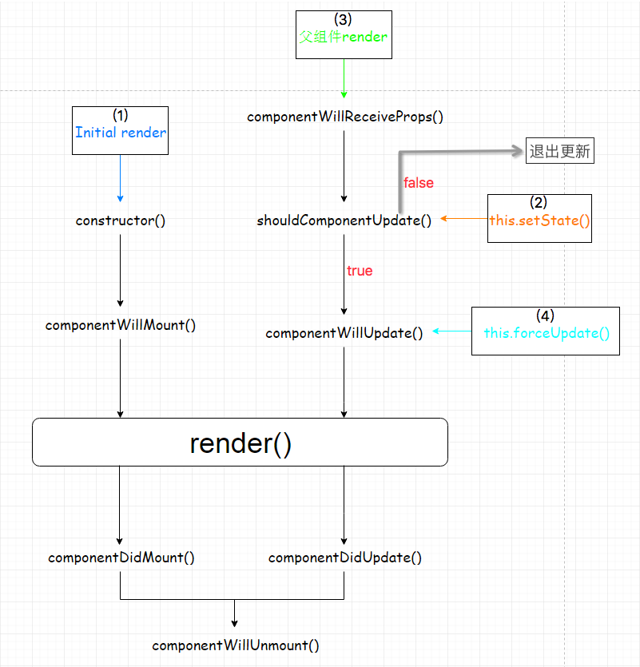
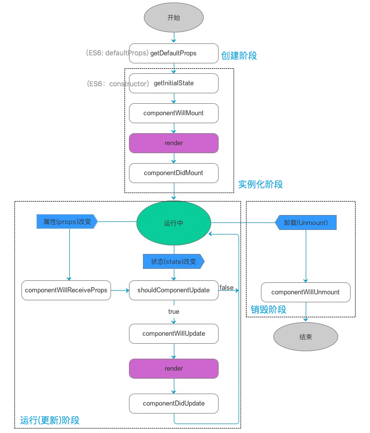

## 组件属性(props)

它是组件的不可变属性（组件自己不可以自己修改props）。

组件自身定义了一组props作为对外提供的接口，展示一个组件时只需要指定props作为节点的属性。

一般组件很少需要对外公开方法（例外：工具类的静态方法等），唯一的交互途径就是props。所以说它也是父组件与子组件通信的桥梁。
组件自己不可以自己修改props（即：props可认为是只读的），只可由其他组件调用它时在外部修改。


## 组件状态(state)

它是组件的内部状态属性，主要用来存储组件自身需要的数据。

初始化时可能由props来决定，之后就完全由组件自身去维护。

组件中由系统定义了setState方法，每次调用setState时都会可能更新组件的状态，触发render方法重新渲染界面。

需要注意的是render方法是被异步调用的，这可以保证同步的多个setState方法只会触发一次render，这样做是有利于提高性能的。


## 组件的生命周期

对于组件的生命周期来说一般分为四个阶段，分别为：
创建阶段、实例化阶段、运行(更新)阶段、销毁阶段。

### 1、创建阶段

该阶段主要发生在创建组件类的时候，在这个阶段中会初始化组件的props属性类型和默认属性。

这里会初始化一些默认的属性，通常会将固定的内容放在这个过程中进行初始化和赋值，一个控件可以利用this.props获取在这里初始化它的属性，由于组件初始化后，再次使用该组件不会调用getDefaultProps函数，所以组件自己不可以自己修改props（即：props可认为是只读的），只可由其他组件调用它时在外部修改。

1）执行propTypes确定props的类型

2）执行defaultProps初始化props的默认值

```javascript
//es6
import PropTypes from 'prop-types';

export default class owen extends Component {
  static propTypes = {
    animateEnd: PropTypes.func,
    age: PropTypes.number
  }

  static defaultProps = {
    animateEnd: function () { },
    age: 10
  }
}
...
```
### 2、实例化阶段

该阶段主要发生在组件类被调用(实例化)的时候。

1)constructor(props)
这里是对控件的一些状态进行初始化，组件每次初始化都会被调用，所以可以将控制控件的状态的一些变量放在这里初始化，如控件上显示的文字，可以通过this.state来获取值，通过this.setState来修改state值。
```javascript
  constructor(props) {
    super(props);
    this.state = {
      name: 'button改变自己state',
      showButton: true
    };
    
  }
```

2)componentWillMount()

准备加载组件。

这个调用时机是在组件创建初始化了状态之后，在第一次绘制 render() 之前。可以在这里做一些业务初始化操作，也可以设置组件状态。这个函数在整个生命周期中只被调用一次。
如果在这个函数里面调用setState，本次的render函数可以看到更新后的state，并且只渲染一次。
```javascript
 componentWillMount() {   
 }
```
3)render()

render是一个组件必须有的方法，形式为一个函数，渲染界面，并返回JSX或其他组件来构成DOM，和Android的XML布局、WPF的XAML布局类似，只能返回一个顶级元素。
```javascript
   render() {
    //此处可以一些计算
    return (
      <View style={styles.container}>
      </View>
    );
  }
```

4)componentDidMount()

调用了render方法后，组件加载成功并被成功渲染出来以后所执行的hook函数，一般会将网络请求等加载数据的操作，放在这个函数里进行，来保证不会出现UI上的错误。可以在这里使用refs!
```javascript
  componentDidMount() {
  }
```
  
### 3、运行(更新)阶段

1)componentWillReceiveProps(nextProps)

父组件发生render的时候子组件就会调用，不管props有没有更新，也不管父子组件之间有没有数据交换。

输入参数 nextProps 是即将被设置的属性，旧的属性还是可以通过 this.props 来获取。

在这个回调函数里面，你可以根据属性的变化，通过调用 this.setState() 来更新你的组件状态，这里调用更新状态是安全的，并不会触发额外的 render() 调用。如下：

```javascript
 componentWillReceiveProps(nextProps) {
 }
```

2)shouldComponentUpdate(nextProps, nextState)

返回布尔值，决定是否需要更新组件。

组件挂载之后，每次调用setState后都会调用shouldComponentUpdate判断是否需要重新渲染组件。

输入参数 nextProps 和上面的 componentWillReceiveProps 函数一样，nextState 表示组件即将更新的状态值。这个函数的返回值决定是否需要更新组件，如果 true 表示需要更新，继续走后面的更新流程。否者，则不更新，直接进入等待状态。

默认情况下，这个函数永远返回 true 用来保证数据变化的时候 UI 能够同步更新。在大型项目中，你可以自己重载这个函数，通过检查变化前后属性和状态，来决定 UI 是否需要更新，能有效提高应用性能。

```javascript
   shouldComponentUpdate(nextProps, nextState) {
    return true
  }
```
3)componentWillUpdate(nextProps, nextState)

shouldComponentUpdate返回true或者调用forceUpdate之后，就会开始准更新组件，并调用 componentWillUpdate()。
输入参数与 shouldComponentUpdate 一样，在这个回调中，可以做一些在更新界面之前要做的事情。需要特别注意的是，在这个函数里面，你就不能使用 this.setState 来修改状态。这个函数调用之后，就会把 nextProps 和 nextState 分别设置到 this.props 和 this.state 中。紧接着这个函数，就会调用 render() 来更新界面了。

```javascript
   componentWillUpdate(nextProps, nextState) {
  }
```

4)render()

再确定需要更新组件时，调用render，根据diff算法，渲染界面，生成需要更新的虚拟DOM数据。

5)componentDidUpdate()

虚拟DOM同步到DOM中后，执行该方法，可以在这个方法中做DOM操作。
除了首次render之后调用componentDidMount，其它render结束之后都是调用componentDidUpdate。
```javascript
    componentDidUpdate() {
  }
```

> componentWillMount、componentDidMount和componentWillUpdate、componentDidUpdate可以对应起来。区别在于，前者只有在挂载的时候会被调用；而后者在以后的每次更新渲染之后都会被调用。


#### 组件更新的方式总结

1)首次渲染Initial Render，即首次加载组件

2)调用this.setState，状态发生改变（并不是一次setState会触发一次render，React可能会合并操作，再一次性进行render）

3)父组件发生更新（一般就是props发生改变，但是就算props没有改变或者父子组件之间没有数据交换也会触发render）

4)调用this.forceUpdate，强制更新

 
 
### 4、销毁阶段

该阶段主要发生组件销亡的时候，触发componentWillUnmount。当组件需要从DOM中移除的时候，通常需要做一些取消事件绑定，移除虚拟DOM中对应的组件数据结构，销毁一些无效的定时器、网络请求等工作，都可以在这个方法中处理。
```javascript
  componentWillUnmount() {
  }
```

## 总结

 生命周期的回调函数总结：
 
| 生命周期 | 调用次数 | 能否使用 setSate()
|-|-|-|
| propTypes | 1(全局调用一次) | 否
| defaultProps | 1(全局调用一次) | 否
| constructor | 1 | 否
| componentWillMount | 1 | 是
| render	 | >=1 | 否
| componentDidMount | 1 | 是
| componentWillReceiveProps | >=0 | 是
| shouldComponentUpdate | >=0 | 否
| componentWillUpdate | >=0 | 否
| componentDidUpdate | >=0 | 否
| componentWillUnmount | 1 | 否

 组件生命周期总体流程图：
  


## 实践(rn0.46.0,es6)

 
 


