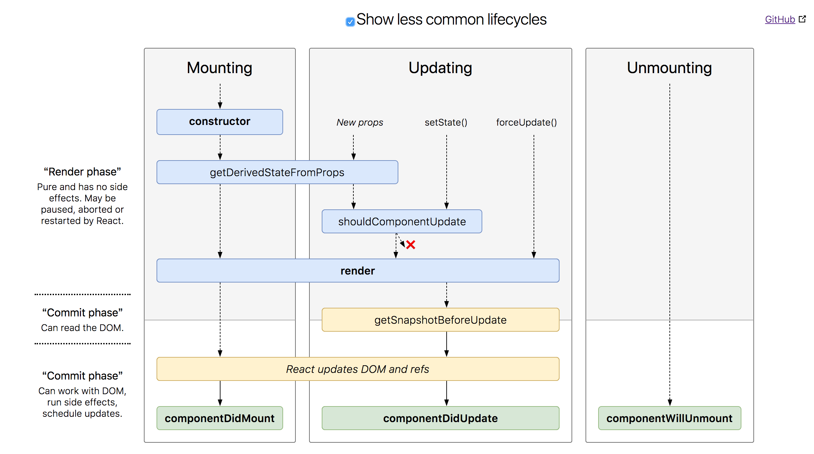

# 组件新生命周期
>  React16对组件的生命周期做了调整，新的声明周期方法会被引入，而旧的会被废弃。


## 组件生命周期概述
### 1.初始化
在组件初始化阶段会执行
1. `constructor`
2. `static getDerivedStateFromProps()`
3. `componentWillMount()` / `UNSAFE_componentWillMount()`
4. `render()`
5. `componentDidMount()`

### 2.更新阶段
`props`或`state`的改变可能会引起组件的更新，组件重新渲染的过程中会调用以下方法：
1. `componentWillReceiveProps()` / `UNSAFE_componentWillReceiveProps()`
2. `static getDerivedStateFromProps()`
3. `shouldComponentUpdate()`
4. `componentWillUpdate()` / `UNSAFE_componentWillUpdate()`
5. `render()`
6. `getSnapshotBeforeUpdate()`
7. `componentDidUpdate()`

### 3.卸载阶段
1. `componentWillUnmount()`

### 4.错误处理
1. `componentDidCatch()`

## react生命周期图示


## 生命周期函数详解
### 1.constructor(props)
react组件的构造函数在挂载之前被调用。在实现`React.Component`构造函数时，需要先在添加其他内容前，调用`super(props)`，用来将父组件传来的`props`绑定到这个类中，使用`this.props`将会得到。

官方建议不要在`constructor`引入任何具有副作用和订阅功能的代码，这些应当在`componentDidMount()`中写入。

`constructor`中应当做些初始化的动作，如：初始化`state`，将事件处理函数绑定到类实例上，但也不要使用`setState()`。如果没有必要初始化state或绑定方法，则不需要构造`constructor`，或者把这个组件换成纯函数写法。

当然也可以利用`props`初始化`state`，在之后修改`state`不会对props造成任何修改，但仍然建议大家提升状态到父组件中，或使用`redux`统一进行状态管理。
```js
constructor(props) {
  super(props);
  this.state = {
    color: props.initialColor
  };
}
```

### 2.static getDerivedStateFromProps(nextProps, prevState)
`getDerivedStateFromProps`在组件实例化后，和接受新的`props`后被调用。他返回一个对象来更新状态，或者返回null表示新的props不需要任何state的更新。

如果是由于父组件的props更改，所带来的重新渲染，也会触发此方法。

调用`steState()`不会触发`getDerivedStateFromProps()`。

### 3. componentWillMount() / UNSAFE_componentWillMount()
`componentWillMount()`将在react未来版本中被弃用。`UNSAFE_componentWillMount()`在组件挂载前被调用，在这个方法中调用`setState()`不会起作用，是由于他在`render()`前被调用。

为了避免副作用和其他的订阅，官方都建议使用`componentDidMount()`代替。这个方法是用于在服务器渲染上的唯一方法。
### 4.render()
`render()`方法是必需的。当他被调用时，他将计算`this.props`和`this.state`，并返回以下一种类型：
1. React元素。通过jsx创建，既可以是dom元素，也可以是用户自定义的组件。
2. 字符串或数字。他们将会以文本节点形式渲染到dom中。
3. Portals。react 16版本中提出的新的解决方案，可以使组件脱离父组件层级直接挂载在DOM树的任何位置。
4. `null`，什么也不渲染
5. 布尔值。也是什么都不渲染，通常后跟组件进行判断。

当返回`null`,`false`,`ReactDOM.findDOMNode(this)`将会返回null，什么都不会渲染。

`render()`方法必须是一个纯函数，他不应该改变`state`，也不能直接和浏览器进行交互，应该将事件放在其他生命周期函数中。
如果`shouldComponentUpdate()`返回`false`，`render()`不会被调用。
#### Fragments
你也可以在`render()`中使用数组，如：(*不要忘记给每个数组元素添加key，防止出现警告*)
```jsx
render() {
  return [
    <li key="A">First item</li>,
    <li key="B">Second item</li>,
    <li key="C">Third item</li>,
  ];
}
```
换一种写法，可以不写key（v16++）
```jsx
render() {
  return (
    <React.Fragment>
      <li>First item</li>
      <li>Second item</li>
      <li>Third item</li>
    </React.Fragment>
  );
}
```
### 5.componentWillReceiveProps()/UNSAFE_componentWillReceiveProps(nextProps)
官方建议使用`getDerivedStateFromProps`函数代替`componentWillReceiveProps()`。当组件挂载后，接收到新的`props`后会被调用。如果需要更新`state`来响应`props`的更改，则可以进行`this.props`和`nextProps`的比较，并在此方法中使用`this.setState()`。

如果父组件会让这个组件重新渲染，即使`props`没有改变，也会调用这个方法。

react不会在组件初始化props时调用这个方法。调用`this.setState`也不会触发。
### 6.shouldComponentUpdate(nextProps, nextState)
调用`shouldComponentUpdate`使react知道，组件的输出是否受`state`和`props`的影响。默认每个状态的更改都会重新渲染，大多数情况下应该保持这个默认行为。

在渲染新的`props`或`state`前，`shouldComponentUpdate`会被调用。默认为`true`。这个方法不会在初始化时被调用，也不会在`forceUpdate()`时被调用。返回`false`不会阻止子组件在`state`更改时重新渲染。

如果`shouldComponentUpdate()`返回`false`，`componentwillupdate`,`render`和`componentDidUpdate`不会被调用。
> 在未来版本，shouldComponentUpdate()将会作为一个提示而不是严格的指令，返回false仍然可能导致组件的重新渲染。

官方并不建议在`shouldComponentUpdate()`中进行深度查询或使用`JSON.stringify()`，他效率非常低，并且损伤性能。
### 7.UNSAFE_componentWillUpdate(nextProps, nextState)
在渲染新的`state`或`props`时，`UNSAFE_componentWillUpdate`会被调用，将此作为在更新发生之前进行准备的机会。这个方法不会在初始化时被调用。

*不能在这里使用this.setState()*，也不能做会触发视图更新的操作。如果需要更新`state`或`props`，调用`getDerivedStateFromProps`。
### 8.getSnapshotBeforeUpdate()
在react `render()`后的输出被渲染到DOM之前被调用。它使您的组件能够在它们被潜在更改之前捕获当前值（如滚动位置）。这个生命周期返回的任何值都将作为参数传递给componentDidUpdate（）。
### 9.componentDidUpdate(prevProps, prevState, snapshot)
在更新发生后立即调用`componentDidUpdate()`。此方法不用于初始渲染。当组件更新时，将此作为一个机会来操作DOM。只要您将当前的props与以前的props进行比较（例如，如果props没有改变，则可能不需要网络请求），这也是做网络请求的好地方。

如果组件实现`getSnapshotBeforeUpdate()`生命周期，则它返回的值将作为第三个“快照”参数传递给`componentDidUpdate()`。否则，这个参数是`undefined`。
### 10.componentWillUnmount()
在组件被卸载并销毁之前立即被调用。在此方法中执行任何必要的清理，例如使定时器无效，取消网络请求或清理在componentDidMount（）中创建的任何监听。
### 11.componentDidCatch(error, info)
*错误边界*是React组件，可以在其子组件树中的任何位置捕获JavaScript错误，记录这些错误并显示回退UI，而不是崩溃的组件树。错误边界在渲染期间，生命周期方法以及整个树下的构造函数中捕获错误。

如果类组件定义了此生命周期方法，则它将成为*错误边界*。在它中调用`setState()`可以让你在下面的树中捕获未处理的JavaScript错误，并显示一个后备UI。只能使用错误边界从意外异常中恢复;不要试图将它们用于控制流程。[详细](https://reactjs.org/blog/2017/07/26/error-handling-in-react-16.html)

错误边界只会捕获树中下面组件中的错误。错误边界本身不能捕获错误。


## 警告
要被废弃的方法：

componentWillMount--使用componentDidMount代替

componentWillUpdate--使用componentDidUpdate代替

componentWillReceiveProps--使用一个新的方法：static getDerivedStateFromProps来代替。

不过这些并不会立刻发生，他们可以用到React 16.4。在React 17里将被彻底移除。如果你开启了StrictMode或者AsyncMode，可以通过这样的方式来使用，但是会收到警告

### static getDerivedStateFromProps
当componentWillReceiveProps我们需要其他的方式根据props的变动更新state。社区决定引入一个新的static方法来处理这个问题。

什么是静态方法？一个静态方法就是存在于类内，而不是类的实例内的方法。静态方法访问不到this，并且在声明的时候有static关键字在前面修饰。

但是，问题来了。既然这个方法没有办法访问this，那么如何调用this.setState呢？答案就是，不调用。这个方法直接返回需要更新的state的数据，或者返回null，如果没有什么需要更新的话。
```
static getDerivedStateFromProps(nextProps, prevState) {
  if(nextProps.currentRow === prevState.lastRow) {
    return null;
  }
 
  return {
    lastRow: nextProps.currentRow,
    isCrollingDown: nextProps.curentRow > prevState.lastRow
  }
}
```
调用这个方法和之前调用this.setState的效果是一样的。只会修改这些返回的值，如果是null的话则不修改state。state的其他值都会保留

### 注意
你需要定义初始state的值。无论是在constructor里，或者是类属性。否则会报警告。

这个方法getDerivedStateFromProps()会在第一次挂载和重绘的时候都会调用到，因此你基本不用在constructor里根据传入的props来setState。

如果定义了getDerivedStateFromProps后，又定义了componentWillReceiveProps。那么，只有前者会被调用，并且你会收到一个警告。

一般你会使用一个回调来保证某些代码实在state更新之后才被调用的。那么，请把这些代码都移到componentDidUpdate里。


## Examples

Let's look at some of the common usage patterns mentioned above and how they might be adapted to the new proposed API.

### Prefetching async data during mount

The purpose of this pattern is to initiate data loading as early as possible. Particularly on slower, mobile devices, there may be several hundred miliseconds between the initial call to `render` and the subsequent `componentDidMount`. This pattern eagerly fetches data without waiting for the did-mount callback.

It is worth noting that in both examples below, the data will not finish loading before the initial render and so a second render pass will be required in either case.

#### Before

```js
class ExampleComponent extends React.Component {
  state = {
    externalData: null,
  };

  componentWillMount() {
    asyncLoadData(this.props.someId).then(externalData =>
      this.setState({ externalData })
    );
  }

  render() {
    if (this.state.externalData === null) {
      // Render loading UI...
    } else {
      // Render real view...
    }
  }
}
```

#### After

```js
class ExampleComponent extends React.Component {
  state = {
    externalData: null,
  };

  componentDidMount() {
    // Wait for earlier pre-fetch to complete and update state.
    // (This assumes some kind of cache to avoid duplicate requests.)
    asyncLoadData(this.props.someId).then(externalData => {
      // Note that if the component unmounts before this request completes,
      // It will trigger a warning, "cannot update an unmounted component".
      // You can avoid this by tracking mounted state with an instance var if desired.
      this.setState({ externalData });
    });
  }

  render() {
    if (this.state.externalData === null) {
      // Prime an external cache as early as possible.
      // (Async request would not complete before render anyway.)
      asyncLoadData(this.props.someId);

      // Render loading UI...
    } else {
      // Render real view...
    }
  }
}
```

### State derived from props/state

The purpose of this pattern is to calculate some values derived from props for use during render.

Typically `componentWillReceiveProps` is used for this, although if the calculation is fast enough it could just be done in `render`.

#### Before

```js
class ExampleComponent extends React.Component {
  state = {
    derivedData: computeDerivedState(this.props)
  };

  componentWillReceiveProps(nextProps) {
    if (this.props.someValue !== nextProps.someValue) {
      this.setState({
        derivedData: computeDerivedState(nextProps)
      });
    }
  }
}
```

#### After

```js
class ExampleComponent extends React.Component {
  // Initialize state in constructor,
  // Or with a property initializer.
  state = {};

  static getDerivedStateFromProps(nextProps, prevState) {
    if (prevState.someMirroredValue !== nextProps.someValue) {
      return {
        derivedData: computeDerivedState(nextProps),
        someMirroredValue: nextProps.someValue
      };
    }

    // Return null to indicate no change to state.
    return null;
  }
}
```

### Adding event listeners/subscriptions

The purpose of this pattern is to subscribe a component to external events when it mounts and unsubscribe it when it unmounts.

The `componentWillMount` lifecycle is often used for this purpose, but this is problematic because any interruption _or_ error during initial mount will cause a memory leak. (The `componentWillUnmount` lifecycle hook is not invoked for a component that does not finish mounting and so there's no safe place to handle unsubscriptions in that case.)

Using `componentWillMount` for this purpose might also cause problems in the context of server-rendering.

#### Before

```js
class ExampleComponent extends React.Component {
  componentWillMount() {
    this.setState({
      subscribedValue: this.props.dataSource.value
    });

    // This is not safe; (it can leak).
    this.props.dataSource.subscribe(this._onSubscriptionChange);
  }

  componentWillUnmount() {
    this.props.dataSource.unsubscribe(this._onSubscriptionChange);
  }

  render() {
    // Render view using subscribed value...
  }

  _onSubscriptionChange = subscribedValue => {
    this.setState({ subscribedValue });
  };
}
```

#### After

```js
class ExampleComponent extends React.Component {
  state = {
    subscribedValue: this.props.dataSource.value
  };

  componentDidMount() {
    // Event listeners are only safe to add after mount,
    // So they won't leak if mount is interrupted or errors.
    this.props.dataSource.subscribe(this._onSubscriptionChange);

    // External values could change between render and mount,
    // In some cases it may be important to handle this case.
    if (this.state.subscribedValue !== this.props.dataSource.value) {
      this.setState({
        subscribedValue: this.props.dataSource.value
      });
    }
  }

  componentWillUnmount() {
    this.props.dataSource.unsubscribe(this._onSubscriptionChange);
  }

  render() {
    // Render view using subscribed value...
  }

  _onSubscriptionChange = subscribedValue => {
    this.setState({ subscribedValue });
  };
}
```

### External function calls (side effects, mutations)

The purpose of this pattern is to send an external signal that something has changed internally (eg in `state`).

The `componentWillUpdate` lifecycle hook is sometimes used for this but it is not ideal because this method may be called multiple times _or_ called for props that are never committed. `componentDidUpdate` should be used for this purpose rather than `componentWillUpdate`.

#### Before

```js
class ExampleComponent extends React.Component {
  componentWillUpdate(nextProps, nextState) {
    if (this.state.someStatefulValue !== nextState.someStatefulValue) {
      nextProps.onChange(nextState.someStatefulValue);
    }
  }
}
```

#### After

```js
class ExampleComponent extends React.Component {
  componentDidUpdate(prevProps, prevState) {
    // Callbacks (side effects) are only safe after commit.
    if (this.state.someStatefulValue !== prevState.someStatefulValue) {
      this.props.onChange(this.state.someStatefulValue);
    }
  }
}
```

### Memoized values derived from `props` and/or `state`

The purpose of this pattern is to memoize computed values based on `props` and/or `state`.

Typically such values are stored in `state`, but in some cases the values require mutation and as such may not seem suited for state (although they could technically still be stored there). An example of this would be an external helper class that calculates and memoizes values internally.

In other cases the value may be derived from `props` _and_ `state`.

#### Before

```js
class ExampleComponent extends React.Component {
  componentWillMount() {
    this._calculateMemoizedValues(this.props, this.state);
  }

  componentWillUpdate(nextProps, nextState) {
    if (
      this.props.someValue !== nextProps.someValue ||
      this.state.someOtherValue !== nextState.someOtherValue
    ) {
      this._calculateMemoizedValues(nextProps, nextState);
    }
  }

  render() {
    // Render view using calculated memoized values...
  }
}
```

#### After

```js
class ExampleComponent extends React.Component {
  render() {
    // Memoization that doesn't go in state can be done in render.
    // It should be idempotent and have no external side effects or mutations.
    this._calculateMemoizedValues(this.props, this.state);

    // Render view using calculated memoized values...
  }
}
```

### Initializing Flux stores during mount

The purpose of this pattern is to initialize some Flux state when a component is mounted.

This is sometimes done in `componentWillMount` which can be problematic if, for example, the action is not idempotent. From the point of view of the component, it's often unclear whether dispatching the action more than once will cause a problem. It's also possible that it does not cause a problem when the component is authored but later does due to changes in the store. Because of this uncertainty, it should be avoided.

We recommend using `componentDidMount` for such actions since it will only be invoked once.

#### Before

```js
class ExampleComponent extends React.Component {
  componentWillMount() {
    FluxStore.dispatchSomeAction();
  }
}

```

#### After

```js
class ExampleComponent extends React.Component {
  componentDidMount() {
    // Side effects (like Flux actions) should only be done after mount or update.
    // This prevents duplicate actions or certain types of infinite loops.
    FluxStore.dispatchSomeAction();
  }
}
```

# Detailed design

## New static lifecycle methods

### `static getDerivedStateFromProps(nextProps: Props, prevState: State): $Shape<State> | null`

This method is invoked after a component is instantiated and when it receives new props. Return an object to update state in response to prop changes. Return null to indicate no change to state.

If an object is returned, its keys will be merged into the existing state.

Note that React may call this method even if the props have not changed. If calculating derived data is expensive, compare next and previous props to conditionally handle changes.

## Deprecated lifecycle methods

### `componentWillMount` -> `UNSAFE_componentWillMount`

This method is deprecated and will be removed in the next major version. Read about the motivations behind this change at [fb.me/react-async-component-lifecycle-hooks](https://fb.me/react-async-component-lifecycle-hooks)

As a temporary workaround, you can rename to `UNSAFE_componentWillMount` instead.

### `componentWillUpdate` -> `UNSAFE_componentWillUpdate`

This method is deprecated and will be removed in the next major version. Read about the motivations behind this change at [fb.me/react-async-component-lifecycle-hooks](https://fb.me/react-async-component-lifecycle-hooks)

As a temporary workaround, you can rename to `UNSAFE_componentWillUpdate` instead.

### `componentWillReceiveProps` -> `UNSAFE_componentWillReceiveProps`

This method is deprecated and will be removed in the next major version. Use `static getDerivedStateFromProps()` instead. Read about the motivations behind this change at [fb.me/react-async-component-lifecycle-hooks](https://fb.me/react-async-component-lifecycle-hooks)

As a temporary workaround, you can rename to `UNSAFE_componentWillReceiveProps` instead.

## 参考文档
1. [React v16.3.0: New lifecycles and context API](https://reactjs.org/blog/2018/03/29/react-v-16-3.html#component-lifecycle-changes)
2. [React.Component](https://reactjs.org/docs/react-component.html)
3. [【译】最新版本react组件生命周期详解（v16.3.1）](https://blog.csdn.net/qq_29311407/article/details/79861522)
4. [React 16.3新特性分析](http://www.php.cn/js-tutorial-386621.html)
5. [0006-static-lifecycle-methods](https://github.com/reactjs/rfcs/blob/master/text/0006-static-lifecycle-methods.md)


