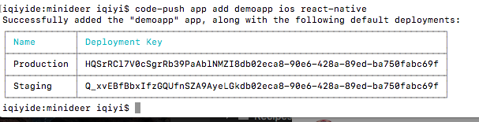
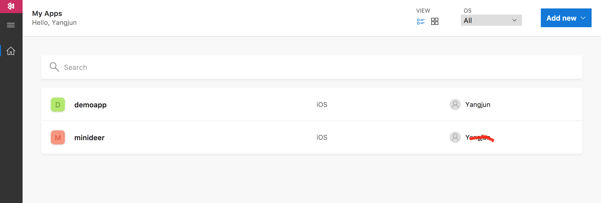
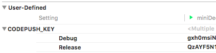
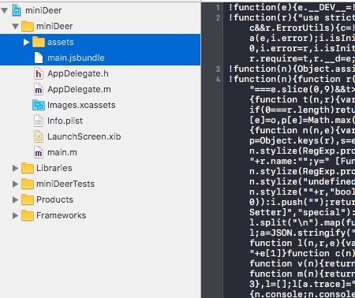

>本文使用最新开发环境开发环境：
>OSX: 10.12.6
>xcode：8.3.3
>react native：0.47.0
>codePush：\^5.0.0-beta"

## CodePush简介
CodePush 是微软提供的一套用于热更新 React Native 和 Cordova 应用的服务。  

CodePush 是提供给 React Native 和 Cordova 开发者直接部署移动应用更新给用户设备的云服务。CodePush 作为一个中央仓库，开发者可以推送更新 (JS, HTML, CSS and images)，应用可以从客户端 SDK 里面查询更新。CodePush 可以让应用有更多的可确定性，也可以让你直接接触用户群。在修复一些小问题和添加新特性的时候，不需要经过二进制打包，可以直接推送代码进行实时更新。

CodePush 可以进行实时的推送代码更新：
  
* 直接对用户部署代码更新  
* 管理 Alpha，Beta 和生产环境应用  
* 支持 React Native 和 Cordova  
* 支持JavaScript 文件与图片资源的更新

## 安装与注册CodePush    
### 安装 CodePush CLI
* 在终端输入 `npm install -g code-push-cli`，就可以安装了。  
* 安装完毕后，输入 `code-push -v`查看版本，如看到版本代表成功。(我安装的是2.0.2-beta)

### 注册CodePush账号  
* 在终端输入`code-push register`，会在浏览器注册页面让你选择授权账号（我选择了github登录）。  
* 授权通过之后，CodePush会告诉你“access key”，复制此key到终端即可完成注册。  
* 然后终端输入`code-push login`进行登陆，登陆成功后，你的session文件将会写在 /Users/你的用户名/.code-push.config。  

**用户操作相关命令**  

* `code-push login` 登陆  
* `code-push loout` 注销  
* `code-push access-key ls` 列出登陆的token  
* `code-push access-key rm <accessKye>` 删除某个 access-key  

## 在CodePush服务器注册app
为了让CodePush服务器知道你的app，我们需要向它注册app： 在终端输入`code-push app add <appName> <os> <platform>`即可完成注册。

示例：
```
  app add MyApp ios react-native      Adds app "MyApp", indicating that it's an iOS React Native app
  app add MyApp windows react-native  Adds app "MyApp", indicating that it's a Windows React Native app
  app add MyApp android cordova       Adds app "MyApp", indicating that it's an Android Cordova app
```
比如你执行`code-push  add demoapp ios react-native`，注册完成之后会返回一套deployment key，该key在后面步骤中会用到：



https://mobile.azure.com/apps 也可以看到你注册的app：



如果你的应用分为Android和iOS版，那么在向CodePush注册应用的时候需要注册两个App获取两套deployment key，app名字不能相同，所以可以选择`-ios,-android`区分。如：
```
code-push  add demoapp-ios ios react-native
code-push  add demoapp-android android react-native
```

**app管理相关命令**   

* `code-push app add` 在账号里面添加一个新的app  
* `code-push app remove` 或者 rm 在账号里移除一个app  
* `code-push app rename` 重命名一个存在app  
* `code-push app list` 或则 ls 列出账号下面的所有app  
* `code-push app transfer` 把app的所有权转移到另外一个账号  

## 集成CodePush SDK  
react native 集成CodePush模块：
```
npm install --save react-native-code-push
```
执行成功后package.json文件中会添加了：
```
	"dependencies": {
		···
		"react-native-code-push": "^5.0.0-beta",
      ···
	},
```
### iOS
CodePush官方提供RNPM、CocoaPods与手动三种在iOS项目中集成CodePush的方式，接下来我就以RNPM的方式来讲解一下如何在iOS项目中集成CodePush（android也支持RNPM集成）：

运行 `rnpm link react-native-code-push`。这条命令将会自动帮我们在iOS（android）文件中添加好设置，同时更新了项目中的配置代码。（在React Native v0.27及以后版本RNPM已经被集成到了 React Native CL中，就不需要再进行安装了。）

>其中iOS中的配置代码更新了AppDelegate.m文件：

```
#import <CodePush/CodePush.h>
···
#ifdef DEBUG
    jsCodeLocation = [[RCTBundleURLProvider sharedSettings] jsBundleURLForBundleRoot:@"index.ios" fallbackResource:nil];
#else
    jsCodeLocation = [CodePush bundleURL];
#endif
···
```
>在终端运行此命令之后，终端会提示让你输入ios和android的deployment key，可以不输入直接单击enter跳过，等会在项目中配置。

**配置Deployment Key**：
1. 选择`Build Settings`页签 ➜ 单击 + 按钮然后选择添加`User-Defined Setting` 
2. 然后输入CODEPUSH_KEY(名称可以自定义)，设置2个deployment key



>提示：你可以通过`code-push deployment ls <APP_NAME> -k`命令来查看deployment key。

3. 打开 Info.plist文件，在CodePushDeploymentKey列的Value中输入`$(CODEPUSH_KEY)`

至此，iOS的配置完成。

## 使用CodePush进行热更新  
在使用CodePush更新你的应用之前需要，先配置一下更新控制策略，即：  

* 什么时候检查更新？（在APP启动的时候？在设置页面添加一个检查更新按钮？）
* 什么时候可以更新，如何将更新呈现给终端用户？  

### 发布更新
CodePush支持两种发布更新的方式，一种是通过`code-push release-react`简化方式，另外一种是通过`code-push release`的复杂方式。

#### 第一种方式：通过`code-push release-react`发布更新

这种方式将打包与发布两个命令合二为一，可以说大大简化了我们的操作流程，建议大家多使用这种方式来发布更新。

命令格式：
```
code-push release-react <appName> <platform>
```

eg:
```
code-push release-react MyApp-iOS ios
code-push release-react MyApp-Android android
```

更多参数配置：

```
code-push release-react MyApp-iOS ios  --t 1.0.0 --dev false --d Production --des "1.优化操作流程" --m true
```
其中参数--t为二进制(.ipa与apk)安装包的的版本；--dev为是否启用开发者模式(默认为false)；--d是要发布更新的环境分Production与Staging(默认为Staging)；--des为更新说明；--m 是强制更新。

关于`code-push release-react`更多可选的参数，可以在终端输入`code-push release-react`进行查看。

另外，我们可以通过`code-push deployment ls <appName>`来查看发布详情与此次更新的安装情况。
 
#### 第二中方式：通过`code-push release`发布更新
 
需要先执行`react-native bundle`打包资源：

```
react-native bundle --entry-file index.ios.js --bundle-output ./bundles/main.jsbundle --platform ios --assets-dest ./bundles --dev false
```
**bundle资源放入项目：**



**bundle资源通过CodePush发布更新，在终端输入：** 
`code-push release <应用名称> <Bundles所在目录> <对应的应用版本> --deploymentName： 更新环境
--description： 更新描述  --mandatory： 是否强制更新`
  
eg:  
`code-push release Demoapp ./bundles/index.android.bundle 1.0.6 --deploymentName Production  --description "1.支持文章缓存。" --mandatory true`

**注意：**  
1. CodePush默认是更新 staging 环境的，如果是staging，则不需要填写 deploymentName。     
2. 如果有 mandatory 则Code Push会根据mandatory 是true或false来控制应用是否强制更新。默认情况下mandatory为false即不强制更新。      
3. 对应的应用版本（targetBinaryVersion）是指当前app的版本(对应build.gradle中设置的versionName "1.0.6")，也就是说此次更新的js/images对应的是app的那个版本。不要将其理解为这次js更新的版本。
如客户端版本是 1.0.6，那么我们对1.0.6的客户端更新js/images，targetBinaryVersion填的就是1.0.6。     
4. 对于对某个应用版本进行多次更新的情况，CodePush会检查每次上传的 bundle，如果在该版本下如1.0.6已经存在与这次上传完全一样的bundle(对应一个版本有两个bundle的md5完全一样)，那么CodePush会拒绝此次更新。
5. 在终端输入 `code-push deployment history <appName> Staging` 可以看到Staging版本更新的时间、描述等等属性。  

**部署APP相关命令**
* code-push deployment add <appName> 部署  
* code-push deployment rename <appName> 重命名  
* code-push deployment rm <appName> 删除部署  
* code-push deployment ls <appName> 列出应用的部署情况  
* code-push deployment ls <appName> -k 查看部署的key  
* code-push deployment history <appName> <deploymentNmae> 查看历史版本(Production 或者 Staging)    

## 开发与测试
### 开发
上面提到`rnpm link react-native-code-push`执行往后，AppDelegate.m文件更新了：

```
#import <CodePush/CodePush.h>
···
#ifdef DEBUG
    jsCodeLocation = [[RCTBundleURLProvider sharedSettings] jsBundleURLForBundleRoot:@"index.ios" fallbackResource:nil];
#else
    jsCodeLocation = [CodePush bundleURL];
#endif
···
```

下面更新js文件：
```
    ···
    constructor(props) {
        super(props);
        registerApp('wx94071fc9a6634781');
        const appId = 'qlJun5W9xYIdpi1nS8vepcDA-gzGzoHsz';
        const appKey = 'phlBacJt2JNSXW9RVuKl7KMQ';
        AV.init({ appId, appKey });

        ConfigManager.shareInstance().fetchAppConfig()

        CodePush.sync({
            deploymentKey: '12343kvGomTxA-AQtfd1234MxL12342eca8-90e6-428a-89ed-ba750111119f',
            updateDialog: null,
            installMode: CodePush.InstallMode.ON_NEXT_RESTART,
            mandatoryInstallMode: CodePush.InstallMode.ON_NEXT_RESTART,
        });

    }
    ···
    
    let codePushOptions = { checkFrequency: CodePush.CheckFrequency.MANUAL };
    App = CodePush(codePushOptions)(App);
    AppRegistry.registerComponent('miniDeer', () => App);
```
这段代码是每次启动app的时候检查更新和下载，如果有更新就下载好了，等下次启动的时候更新。具体js的代码可以参考[https://github.com/Microsoft/react-native-code-push/blob/master/Examples/CodePushDemoApp/demo.js](https://github.com/Microsoft/react-native-code-push/blob/master/Examples/CodePushDemoApp/demo.js)

### 调试
**iOS**

1. iOS调试需要在AppDelegate.m中进行如下修改：
```
//#ifdef DEBUG
//    jsCodeLocation = [[RCTBundleURLProvider sharedSettings] jsBundleURLForBundleRoot:@"index.ios" fallbackResource:nil];
//#else
    jsCodeLocation = [CodePush bundleURL];
//#endif
```
让React Native通过CodePush去获取bundle包即可。

2. 打包bundle,并且把bundle和assets放入项目：
```
$ react-native bundle --entry-file index.ios.js --bundle-output ./bundles/main.jsbundle --platform ios --assets-dest ./bundles --dev false
```

3. 发布更新
```
$ code-push release demoApp ./bundles/ 1.0.0 --deploymentName Staging --description "修改了title" --mandatory true

```

4. 发布成功后就可以启动项目测试，等更新成功后就杀掉app重新启动（不要用xcode run）


