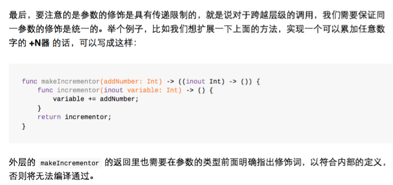
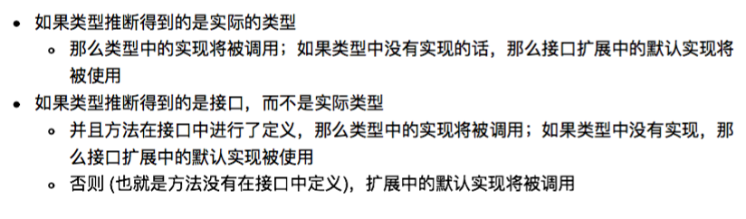
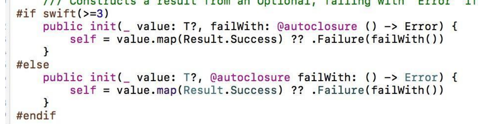
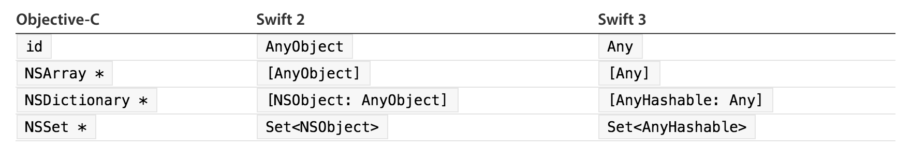
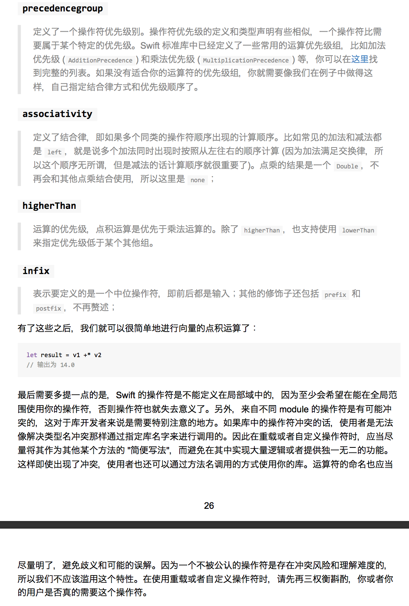

# Swift Tips(version1.2 xcode6.4)

## :smile:颜色转图片
```swift
extension UIImage{  
    static func ls_imageWithColor(color: UIColor) -> UIImage  
    {  
        let imageSize = CGSizeMake(1, 1);  
        UIGraphicsBeginImageContextWithOptions(imageSize, true, 0);  
        color.set();  
        let path = UIBezierPath(rect: CGRectMake(0, 0, imageSize.width, imageSize.height))  
        path.fill()  
        let image = UIGraphicsGetImageFromCurrentImageContext()  
        UIGraphicsEndImageContext()  
        return image  
    }  
      
} 
```

## :smile:方向
```swift
// MARK: - Orientations  
override func shouldAutorotate() -> Bool {  
    return true  
}  
  
override func supportedInterfaceOrientations() -> Int {  
    return UIInterfaceOrientationMask.Portrait.rawValue.hashValue  
}  
```

## :smile:Swift调用oc枚举不识别
```swift
typedef NS_ENUM(NSInteger, EZCameraState)  
{  
    EZCameraStateFront,  
    EZCameraStateBack  
};
```
改为
```swift
typedef NS_ENUM(NSInteger, EZCameraState)  
{  
    Front,  
    Back  
};
```

## :smile: 背景图片不要用(其实以前也是，貌似和Swift没什么关系哈哈)：
```swift
     self.view.backgroundColor = UIColor(patternImage: UIImage(named: "videoAotu")!)//patternImage耗内存
用：
    //改成：
    self.view.layer.contents = UIImage(named: "videoAotu")?.CGImage
```

## :smile: oc中的#pragma mark  在swift中是：//MARK:    其他还有 //TODO:、//FIXME。

## :smile:  在子类必须实现的方法中调用这个函数fatalError("方法未实现")。使用了fatalError方法的地方编译可过。但是在运行的时候会报错！

## :smile: Swift1.2中没有appearanceWhenContainedIn:方法 [详细](https://github.com/easyui/blog/blob/master/Swift/2015-07-13-Swift-appearanceWhenContainedIn%5BVersion1.2,Xcode6.4%5D.md)

## :smile: Swift单例
```swift
class LSHostAppManager{  
      
    class func shareInstance()->LSHostAppManager{  
        struct LSSingleton{  
            static var predicate:dispatch_once_t = 0  
            static var instance:LSHostAppManager? = nil  
        }  
        dispatch_once(&LSSingleton.predicate,{  
            LSSingleton.instance=LSHostAppManager()  
            }  
        )  
        return LSSingleton.instance!  
    }  
}  
```

```swift
struct StructSingleton{  
    static func shareInstance()->StructSingleton{  
        struct YRSingleton{  
            static var predicate:dispatch_once_t = 0  
            static var instance:StructSingleton? = nil  
        }  
        dispatch_once(&YRSingleton.predicate,{  
                YRSingleton.instance=StructSingleton()  
            }  
        )  
        return YRSingleton.instance!  
    }  
}   
```

# Swift Tips(version2.0+ xcode7.0+) 
## :smile:


## :smile:打印多重Optional
```swift
var literalNil: String?? = nil

//对于上面变量po只会输出nil
(lldb) po literalNil 
nil

//但使用 fr v -r 或 fr v -R 可以打印详细信息
(lldb) fr v -r  literalNil
(String??) literalNil = nil
(lldb) fr v -R  literalNil
(Swift.Optional<Swift.Optional<Swift.String>>) literalNil = None {
  Some = Some {
    Some = {
      _core = {
        _baseAddress = {
          _rawValue = 0x0000000000000000
        }
        _countAndFlags = {
          value = 0
        }
        _owner = None {
          Some = {
            instance_type = 0x0000000000000000
          }
        }
      }
    }
  }
}
```
## :smile:Protocol扩展


## :smile:Swift 2.2 已将协议中 associated types 的关键字由 typealias 替换为 associatedtype
 
## :smile:Swift 2.2 ==比较符支持元组类型
 
## :smile:Swift 2.2 增加#if swift 语法判断当前swift版本
```swift
#if swift(>=2.2)  
  
#else  
  
#endif 
```
 
## :smile: Swift 2.2 从 Swift 2.2 开始我们使用 #selector 来从暴露给 Objective-C 的代码中获取一个 selector。类似地，在 Swift 里对应原来 SEL 的类型是一个叫做 Selector 的结构体。
 
## :smile:Swift 2.2 func 参数修饰var废弃，若要参数还是可变的话只能使用inout关键字
 
## :smile:Swift 2.2 #file#line#column#function编译标记替代原来的 __FILE__  __LINE__ __COLUMN__ __FUNCTION__

# Swift Tips(version3.0+ xcode8.0+) 

## :smile:新的访问控制fileprivate和open
现在的访问权限则依次为：open，public，internal，fileprivate，private。
 
在swift 3中，新增加了一个 fileprivate来显式的表明，这个元素的访问权限为文件内私有。过去的private对应现在的fileprivate。现在的private则是真正的私有，离开了这个类或者结构体的作用域外面就无法访问。

`open`

- open 修饰的 class 在 Module 内部和外部都可以被访问和继承
- open 修饰的 func 在 Module 内部和外部都可以被访问和重载（override）
 
`Public`
- public 修饰的 class 在 Module 内部可以访问和继承，在外部只能访问
- public 修饰的 func 在 Module 内部可以被访问和重载（override）,在外部只能访问


## :smile:Swift3中闭包默认是不逃逸的(@noescape)，所以逃逸闭包需要加@escaping
```swift
func doWork(block: ()->()) {  
    block()  
}  
  
func doWorkAsync(block: @escaping ()->()) {  
    DispatchQueue.main.async {  
        block()  
    }  
} 
```

> 1、在逃逸闭包中引用self和其成员，必须强制写self

```swift
class S {  
    var foo = "foo"  
      
    func method1() {  
        doWork {  
            print(foo)  
        }  
        foo = "bar"  
    }  
      
    func method2() {  
        doWorkAsync {  
            print(self.foo)  
        }  
        foo = "bar"  
    }  
      
    func method3() {  
        doWorkAsync {  
            [weak self] _ in  
            print(self?.foo)  
        }  
        foo = "bar"  
    }  
      
    deinit {  
        print("deinit")  
    }  
} 
```
> 2、如果在协议或父类中定义了接受@escaping参数的逃逸闭包，那实现协议的类型和继承这个父类的子类中也必须申明@escaping，否则被认为是不同的函数签名

## :smile:兼容swift2.3和swift3


## :smile:在 Swift 3 编译器下，如果一个 func 返回了一个对象，而你没有使用它时，会有一个 WARNING。

例如：
```swift
navigationController?.popViewController(animated: true)
```
得到警告：
```
Expression of type 'UIViewController?' is unused
```

两种方法可以解决这个 WARNING：

- 在 func 定义的前面，加上 @discardableResult 的修饰符，代表可以不使用返回值，这样编译器就不会有警告了。
- 通过 _ 来省略掉返回值。

```swift
func ffff() -> Int{  
     return 33  
 }  
   
 @discardableResult func aaaa() -> Int{  
     return 33  
 }  
  
 _ = ffff()  
 aaaa() 
```


## :smile:Any和AnyObject
这两个类型都是Swift中很早就出现的类型，但是我们经常使用AnyObject,很少使用Any。AnyObject类似于OC中的id类型，表示任意的class的实例对象，但是在Swift中，例如我们常见的String和Array都变为结构体了，而且在Swift3.0中，更多的类型或者枚举被写为结构体了，AnyObject的适用范围变相被削弱了，所以在Swift3.0的API中曾经许多AnyOjbect的类型被替换为Any了。

那为什么之前我们在 Swift 2 里可以用 [AnyObject] 声明数组，并且在里面放 Int、String 等 struct 类型呢？这是因为 Swift 2 中，会针对这些 Int、String 等 struct 进行一个 Implicit Bridging Conversions，在 Array 里插入他们时，编译器会自动将其 bridge 到 Objective-C 的 NSNumber、NSString 等类型，这就是为什么我们声明的 [AnyObject] 里可以放 struct 的原因。

但在 Swift 3 当中，为了达成一个门真正的跨平台语言，相关提案将 Implicit Bridging Conversions 给去掉了。所以如果你要把 String 这个 struct 放进一个 [AnyObject] 里，一定要 as NSString，这些转换都需要显示的进行了——毕竟 Linux 平台默认没有 Objective-C runtime。这样各平台的表现更加一致。当然这是其中一个目标，具体可见[0116-id-as-any](https://github.com/apple/swift-evolution/blob/master/proposals/0116-id-as-any.md)和相关提案的讨论。

[Objective-C id as Swift Any](https://developer.apple.com/swift/blog/?id=39):




## :smile:Foundation框架部分类名去掉NS前缀

## :smile:Foundation中数据引用类型改为值类型（class改成struct）
注重安全的swift中变量声明时要表明是否可变，不变用let,可变用var。然而由于swift设计之初就要考虑兼容OC的这个历史包袱，很多类型都沿用了OC的类型。只有几个基础类型重写声明成了值类型（struct），比如：String,Array。

引用类型的let和值类型的let在逻辑上有着根本的不同。值类型的不可变就如字面意义，数据不能被更改；而引用类型的不可变只要保证指向的实例不变就可以了，实例本身的属性是可以改变的。

一些原有的OC的foundation表示数据的引用类型在swift的行为就和期待的不同了，比如：
```swift
let date = NSDate()
date.addingTimeInterval(1000)
```
这样的写法是可以编译通过的。然而确和我们期望的结果不同。我们声明了一个不可变的日期，然而在 addingTimeInterval后日期已经被改变了。

所以在3.0中把原有的很多表示数据的引用类型在增加了对应的值类型。

更改的如下：

Value Type | Class Type
---------- |--------------------
AffineTransform | NSAffineTransform
CharacterSet | NSCharacterSet, NSMutableCharacterSet
Date | NSDate
DateComponents | NSDateComponents
Data | NSData, NSMutableData
IndexSet | NSIndexSet, NSMutableIndexSet
IndexPath | NSIndexPath
Notification | NSNotification
PersonNameComponents | NSPersonNameComponents
URL | NSURL
URLComponents | NSURLComponents
URLQueryItem | NSURLQueryItem
UUID | NSUUID

[SE0069-Mutability and Foundation Value Types](https://github.com/apple/swift-evolution/blob/master/proposals/0069-swift-mutability-for-foundation.md)

[Swift 3必看：foundation中数据引用类型改为值类型](http://www.jianshu.com/p/70684b2e0c15)

## :smile:Swift 3.0 中NSNotification和Notification创建时，通知的name参数类型都变为“Notification.Name”类型
```swift
NotificationCenter.default.post(name: .AppDidReceivedRemoteNotificationDeviceToken, object: nil, userInfo: [Notification.Key.AppDidReceivedRemoteNotificationDeviceTokenKey: tokenString])  
  
extension Notification.Name {  
    static let AppDidReceivedRemoteNotificationDeviceToken = Notification.Name(rawValue: "com.ouka.usernotification.AppDidReceivedRemoteNotificationDeviceToken")  
}  
```
## :smile:where的改变
`if…where和guard…where的变化`

Swift3.0中对where关键字的使用场景进行了一些调整，在Swift2.3中，我们常这样写：
```swift
// Swift2.3  
var value: Int?  
var num: Int?  
  
if let v = value, n = num where v > n {  
     print("value > num")  
}  
  
value = 1  
num = 2  
  
guard let v = value, n = num where v > n else {  
     print("value < num")  
     return  
}  
```
在Swift3.0中，应该这样实现：
```swift
var value: Int?  
var num: Int?  
  
if let v = value, let n = num, v > n {  
    print("value > num")  
}  
  
value = 1  
num = 2  
  
guard let v = value, let n = num, v > n else {  
    print("value < num")  
    return  
}  
```

`Generic 声明中where位置改变`

在 generic 声明中，where 语句被移到了最后。Swift 3 之前，我们可能这么声明一个 generic 的方法：
```swift
func anyCommonElements<T : SequenceType, U : SequenceType where  
        T.Generator.Element: Equatable,
        T.Generator.Element == U.Generator.Element>(lhs: T, _ rhs: U) -> Bool {
    ...
}
```
Swift 3 中，正确的语法应该是：
```swift
func anyCommonElements<T : Sequence, U : Sequence>(lhs: T, _ rhs: U) -> Bool
    where
    T.Iterator.Element: Equatable,
    T.Iterator.Element == U.Iterator.Element {
//        ...
    return true
}
```

## :smile:在Swift2.3中，官方使用的枚举值首字母使用大写，在Swift3.0中，统一将官方使用的枚举值首字母改为了小写。虽然自定义的枚举中枚举值首字母依然可以使用大写，但是为了和官方风格保持一致，建议枚举值首字母使用小写。

## :smile:++和--是继承自C语言中的运算符，在Swift3.0中被移除，建议使用 x += 1来代替

## :smile:运算符的左右两边必须不能为optional

## :smile:移除带有条件和自增的 for-loops C 风格循环：for (int i = 0; i < array.count; i++)

## :smile:[0049](https://github.com/apple/swift-evolution/blob/master/proposals/0049-noescape-autoclosure-type-attrs.md) – 将 @noescape 和 @autoclosure 转变为类型特性
```swift
func noEscape(f: @noescape () -> ()) {}
func noEscape(f: @autoclosure () -> ()) {}
```
就是将这些参数用以描述被传递的实际函数，而不是放在外面

## :smile:[0053](https://github.com/apple/swift-evolution/blob/master/proposals/0053-remove-let-from-function-parameters.md) – 从函数参数中移除 let 的显式使用

## :smile:[0003](https://github.com/apple/swift-evolution/blob/master/proposals/0003-remove-var-parameters.md) – 从函数参数中移除 var
```swift
func double(let input: Int) -> Int {
    // ...
}
```
这是一个很有意思的特性。我不知道各位是否有深入思考过这种特性的意义，不过当您在 Swift 当中调用一个方法的时候，方法将会将您所传递的参数拷贝出一个不可修改的副本。这里真正所暗示的是 let 这个单词，虽然没有人会主动写下这个这个词，因为 let 是默认的行为。这个 let 已经不复存在了。

这是 Swift 当中最近的一个变化。之所以会推出这个变化是因为同时也从函数参数中移除 var：

这个提案将 var 从函数参数当中移除掉了，他们说：一旦我们移除了 var，那么我们是不是也要把 let 移除掉？我们中的很多人都一脸懵逼，什么？之前还可以在这里写 let？
```swift
func double(var input: Int) -> Int {
    input = input * 2
    return input
}
```
举个例子，在这个方法中我获取了 input 这个参数，然后我想要让其翻倍然后作为返回值返回，要记住我是对一个不可修改的副本进行操作的，因此我是没办法修改 input 的值的。因此，如果我们不想再声明一个新的变量的话，我们之前会选择再声明中使用 var，以让其变成一个可修改的副本。

但是这仍然是一个副本，不过它现在可以修改了，因此我就可以修改它的值。这段代码目前是没法用了。var 已经被移除掉了，我们必须要在这里显式声明一个新的变量。
```swift
func double(input: Int) -> Int {
    var localInput = input
    localInput = localInput * 2
    return localInput
}
```
在这里，我创建了一个名为 localInput 的可修改副本。我使用 input 对其进行赋值，这样我就可以对可修改副本进行操作了。不过绝大多数人可能会选择这样子做：
```swift
func double(input: Int) -> Int {
    var input = input
    input = input * 2
    return input
}
```
他们使用相同的名称来创建变量，这就是一种被称为“命名遮罩(name shadowing)”的特性，而不是使用其他的名称来为局部变量命名。这会让一些人感到困惑；当然也有许多人喜欢这样做。之所以会迷惑人的原因在于：两个输入当中的值截然不同。右边的那个 input 值是参数值，而左边的 input 则是能够被改变的值。

在这个例子当中，可能并不太让人困惑。我觉得为了让语法更为清晰，我们应该使用 var input 的方式，这样就不必将参数值赋值回 input 当中了，这样我们就可以以之前使用可变参数的方式来使用这个变量了。

## :smile:[0031](https://github.com/apple/swift-evolution/blob/master/proposals/0031-adjusting-inout-declarations.md) – 将 inout 声明调整为类型修饰
虽然我说过参数是一种不可修改的拷贝，因此如果您想要获取一份可修改的拷贝的话，您需要在下面的代码中使用 var 来单独创建一个局部变量。不过如果您切实想要修改您传入的参数值，并禁止拷贝的发生，那么至今为止只能够使用 inout 的方式。
```swift
func double(input: inout Int) {
    input = input * 2
}
```
inout 参数现在不出现在参数名的前面了，不过它也没有跑得太远。现在它成为了类型的一个修饰符，而不是变量名称的一个部分。因此，只需要将其向右边调整一点点就可以了。

之所以做这样的决定，是因为实际上 inout 确实只是一个额外的描述符而已，它并不是参数名的一部分，因此需要把它移到正确的地方。
## :smile:[0035](https://github.com/apple/swift-evolution/blob/master/proposals/0035-limit-inout-capture.md) – inout 限制为只能捕获 @noescape 上下文
```swift
func escape(f: @escaping () -> ()) {}
func example(x: inout Int) {
    escape {  _ = x }
}
```
逃逸闭包使用inout参数x报错：
```
 Playground execution failed: error: escaping.xcplaygroundpage:118:19: error: escaping closures can only capture inout parameters explicitly by value
 escape {  _ = x }
```
因为：假设我有一个名为 escape()的函数，它接受一个简单的方法作为其参数。在 example()方法当中，我引入了 inout 类型的 x 参数，我会在函数当中使用这个参数，也就是将其传递到 escape()当中。

因此，escape()现在就会对 inout x 开始进行操作，而这个时候会造成一个问题，由于 inout 的开销非常大。inout 换句话说会对我传入的变量进行修改，二这个时候我并不知道 example()是否能够继续执行，调用我在 example()本身作用域范围之外的函数。

解决方案1:

使用 @noescape 进行标记
```swift
func escape(f: () -> ()) {}  //默认是@noescape
func example(x: inout Int) {
    escape {  _ = x }
}
```
编译器知道我传递的这个函数不会使用任何作用域范围之外的东西，因此程序就能够正常执行。

解决方案2:
```swift
func escape(f: @escaping () -> ()) {}
func example(x: inout Int) {
    escape {[x] in _ = x }
}
```
如果 example()在 escape()当中使用了这个 inout x，这个时候它不是一个数组，虽然它看起来像。现在这玩意儿叫__捕获列表(capture list)__。当您需要在捕获列表当中将某个量标记为 weak 或者 unowned 的时候，就需要使用这种形式。这里我们只是明确的说：我想要对 x 进行捕获，默认情况下的捕获级别是 strong类型的。这同样也表达了『没错，我是在使用这个 inout x，但是我准备在这里捕获它的现有值。』这样做就会对传递给 inout 的变量创建一份拷贝，这样就不用担心会发生问题了。

TEST:
```swift
func escape(f: @escaping () -> ()) {}
func noEscape( f: () -> ()) {}
 
func example(x:inout Int) {
//    escape { _ = x } // error: closure cannot implicitly capture an inout parameter unless @noescape
    noEscape { _ = x } // OK, closure is @noescape
    escape {[x] in _ = x } // OK, immutable capture
}
 
struct FooS {
    mutating func example() {
//        escape {[weak self] _ in _ = self } // error: closure cannot implicitly capture a mutating self parameter
        noEscape { _ = self } // OK
    }
}
 
 
class FooC {
     func example() {
        escape { _ = self }
        escape {[weak self] in _ = self }
        noEscape { _ = self } // OK
    }
}
```
## :smile:[0002](https://github.com/apple/swift-evolution/blob/master/proposals/0002-remove-currying.md) – 移除柯里化函数声明语法
「移除柯里化(curried)函数声明语法」可能会让很多人感到焦虑，其实完全不必，因为他们误解了这句话的意思，并不是说 Swift 移除了柯里化特性。他们并没有移除柯里化。他们只是将柯里化函数的一种写法移除掉了。
```swift
func curried(x: Int)(y: Int) -> Int {
    return {(y: Int) -> Int in
        return x * y
    }
}
```
举个例子，在这个柯里化函数当中，注意到它接受 X 和 Y，然后返回 Int。如果看得仔细一点，您会发现它其实是先接受一个参数，然后再接受另一个参数，因此需要这样子调用：curried(7)(8)。这很容易让人误解。不是说调用的部分，而是说定义的部分很容易让人误解。这样定义的方式将被移除，因为这里实际发生的只是对 7 进行柯里化而已。
```swift
func curried(x: Int) -> (y: Int) -> Int {
    return {(y: Int) -> Int in
        return x * y
    }
}
```
我向 X 传递 7 这个值，然后我得到一个返回的函数值，这个函数就是将您传递进来的值乘以 y。随后当我传递 8，得到的结果就是 7 x 8.

因此我实际上是将它分成了两部分。我使用了一个柯里化函数来捕获 X。这实际上就是闭包；一旦捕获成功，我再将 Y 传递进去，然后就执行后续的操作。

Swift 核心团队是这么说的：「看吧，这种做法很容易让人迷惑，因为这里出现了一堆堆的括号，让我们更明确一点，要说明您正在做的是什么。比如说您传递了 X 之后，它会返回一个函数，然后再讲这个函数应用到下一个元素当中」。因此，柯里化仍然存在，这是语法发生了变化。

## :smile:[0011](https://github.com/apple/swift-evolution/blob/master/proposals/0011-replace-typealias-associated.md) – 将用于关联类型声明的 typealias 关键字替换为associatedtype
类型别名(Type alias)是一个挺有意思的玩意儿。在 Swift 中类型别名有两种不同的用途：
```swift
protocol Prot {
    associatedtype Container : SequenceType
}
 
extension Prot {
    typealias Element = Container.Generator.Element
}
```
它的作用是：「这是一个占位符。您需要明确告知 Container 随后会关联哪种类型，另一种的用法和 #define很类似，将 Element 作为 Container.Generator.Element 的替代。」Swift 目前这样设计的目的在于要将这两种用途给分离开来，在第一种情况下，它只是一个占位符。随后您需要明确告知它所代表的类型。我们将它从typealias 更改为 associatedtype。

## :smile:[0046](https://github.com/apple/swift-evolution/blob/master/proposals/0046-first-label.md) – 将所有参数标签进行一致化，包括首标签
我们将为所有参数标签进行一致化操作。不知道诸位还记得在 Swift 1 当中，您需要写出函数中的所有参数标签，其中也包括首标签。这个时候您可能会选择将函数放到某个类或者某个方法当中，以确保不写那个讨厌的首标签。在 Swift 2 当中，开发团队将首标签给抛弃掉了，以便统一两者的行为，但是在构造器中仍是不一样的。自 Swift 3 开始，我们将必须写出所有的参数标签。
```swift
// Swift 3.0
func increase(ourNumber: Int, delta: Int) -> Int {
 
}
 
increase(ourNumber: 6, delta: 3)
```
比如说这个例子当中，当我们调用这个方法的时候，delta 在 Swift 2 当中是必须要写出来的，但是ourNumber 是不会显现的。自 Swift 3 开始，outNumber 作为首标签就必须要写出来了。所有的参数标签都必须这么做。
「但是 Daniel」，您可能会问了，「有些时候我不想让这个首标签显示出来。」好吧，您仍然可以使用下划线来将其隐藏掉。
```swift
// Swift 3.0
func increase(_ ourNumber: Int, delta: Int) -> Int {
 
}
increase(6, delta: 3)
```
## :smile:根据 Side Effect 来决定命名
Mutating 方法的命名应该是一个动词，而 non-mutating 应该用 ed/ing 形式的词。如 array.sort() 是对 array 本身进行排序，而 array.sorted() 则是返回一个新的 Array。
很多方法的名字都大大缩短，比如原来 stringByAppendingString(aString: String)变成 appending(_ aString: String)。
还有很多条目这里不一一列举，感兴趣的可以官方的 [Design Guidelines](https://swift.org/documentation/api-design-guidelines/)
## :smile:Implicitly Unwrapped Optional
原来隐式解析 Optional 类型没有了，但其语法还在。
```swift
let x: Int! = 5    
let y = x    
let z = x + 0
```
 x 的声明后面有个 !，看起来像个 IUO，但其实是一个 optional 类型。x 赋值给 y，y 是 Int?，因为这里不需要进行强制的解析。但 z 是一个 Int，因为这里需要解析 x 里的值才能进行加法运算。
 
## :smile:Swift 3.0操作符定义时需要指定优先级组，而不是直接定义[https://github.com/apple/swift-evolution/blob/master/proposals/0077-operator-precedence.md](https://github.com/apple/swift-evolution/blob/master/proposals/0077-operator-precedence.md)
```swift
struct Vector2D {
    var x = 0.0
    var y = 0.0
}

precedencegroup DotProductPrecedence {
    associativity: none
    higherThan: MultiplicationPrecedence
}

infix operator +*: DotProductPrecedence

func +* (left: Vector2D, right: Vector2D) -> Double {
    return left.x * right.x + left.y * right.y
}

let result = v1 +* v2

```




## :smile:
swift2.3中获取类的字符串：
String(VRPlayerViewController)
swift3中获取类的字符串：
String(describing: VRPlayerViewController.self)

## :smile:
在swift3中，-objc_setAssociatedObject绑定Block闭包编译报错：

Showing Recent Issues Command failed due to signal: Segmentation fault: 11

解决方法：把block强转AnyObject
 objc_setAssociatedObject(self,&AssociatedKeys.LeftActionBlockKey, block as! AnyObject, objc_AssociationPolicy.OBJC_ASSOCIATION_RETAIN_NONATOMIC)

## :smile:dispatch_once被废弃
[Swift 3必看：从使用场景了解GCD新API](http://www.jianshu.com/p/fc78dab5736f)

建议就是一些初始化场景就用懒加载（开始推荐大家使用全局let变量，懒加载的全局变量或者静态成员来完成）:
```swift
// Static properties (useful for singletons).
class Object {
 
    static let sharedInstance = Object() //static 默认带有 lazy 特性 而且还是原子的
 
    lazy var __once: () = {[weak self] in              self?.dataProvider.selectVoiceOverStream(self?.dataProvider.channelItem?.selectedChannelOutputStream?.outputStreamId ??    "",needAutoRefresh: true)
        }()
}
 
 
// Global constant.
let constant = Object()
 
// Global variable.
var variable: Object = {
    let variable = Object()
    variable.doSomething()
    return variable
}()
 
//但是可以通过给DispatchQueue实现一个扩展方法来实现原有的功能:
public extension DispatchQueue {
 
    private static var _onceTracker = [String]()
 
    /**
     Executes a block of code, associated with a unique token, only once.  The code is thread safe and will
     only execute the code once even in the presence of multithreaded calls.
 
     - parameter token: A unique reverse DNS style name such as com.vectorform.<name> or a GUID
     - parameter block: Block to execute once
     */
    public class func once(token: String, block:()->Void) {
        objc_sync_enter(self)
        defer { objc_sync_exit(self) }
 
        if _onceTracker.contains(token) {
            return
        }
 
        _onceTracker.append(token)
        block()
    }
}
//使用字符串token作为once的ID，执行once的时候加了一个锁，避免多线程下的token判断不准确的问题。
//使用的时候可以传token
DispatchQueue.once(token: "com.vectorform.test") {
    print( "Do This Once!" )
}
//或者使用UUID也可以：
private let _onceToken = NSUUID().uuidString
 
DispatchQueue.once(token: _onceToken) {
    print( "Do This Once!" )
 
}
```
## :smile:dynamicType废除，用type(of:)代替
[SE0096-Converting dynamicType from a property to an operator ](https://github.com/apple/swift-evolution/blob/master/proposals/0096-dynamictype.md)

## :smile:typealias支持泛型
```swift
typealias StringDictionary<T> = Dictionary<String, T>
typealias DictionaryOfStrings<T : Hashable> = Dictionary<T, String>
typealias IntFunction<T> = (T) -> Int
typealias Vec3<T> = (T, T, T)
```
[SE048-Generic Type Aliases](https://github.com/apple/swift-evolution/blob/master/proposals/0048-generic-typealias.md)


