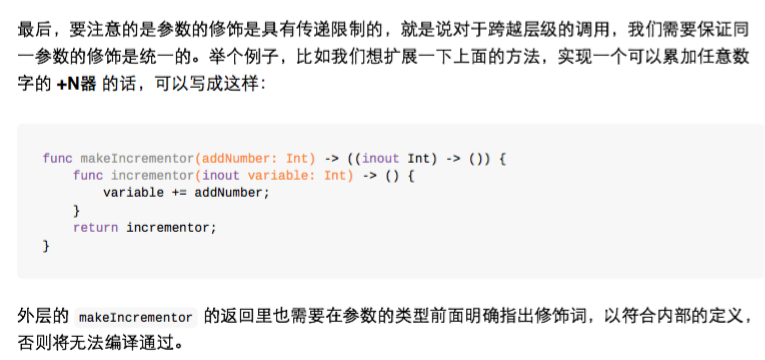
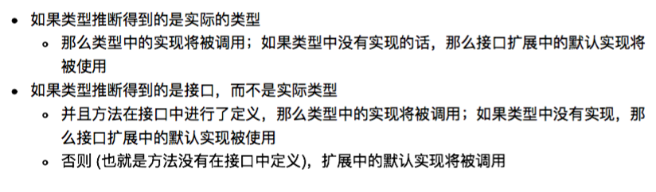
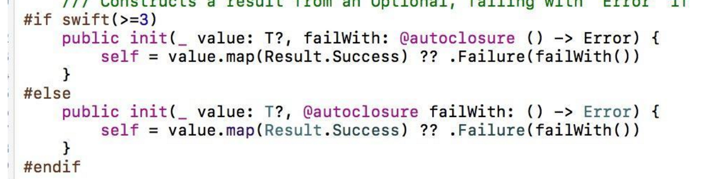
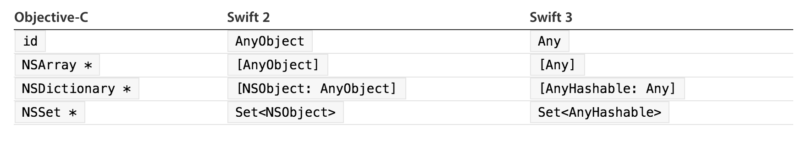
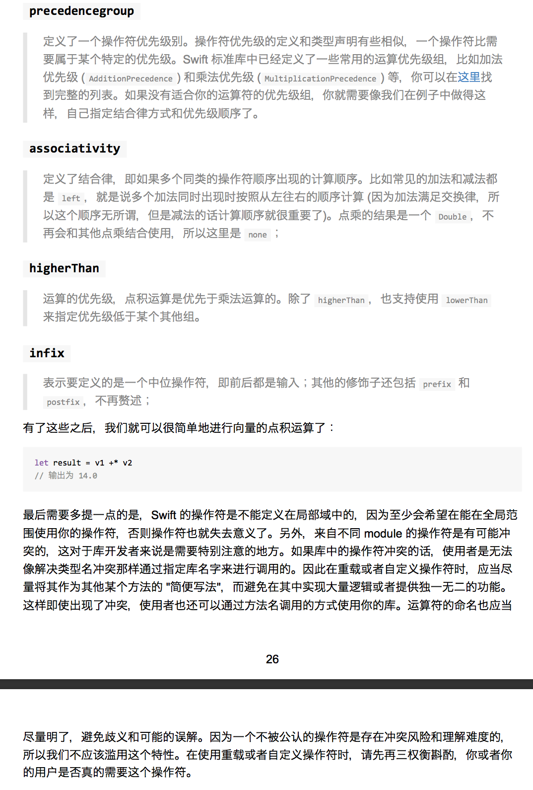

# Swift Tips(version1.2 xcode6.4)[2015-04-08]

## :smile:颜色转图片
```swift
extension UIImage{  
    static func ls_imageWithColor(color: UIColor) -> UIImage  
    {  
        let imageSize = CGSizeMake(1, 1);  
        UIGraphicsBeginImageContextWithOptions(imageSize, true, 0);  
        color.set();  
        let path = UIBezierPath(rect: CGRectMake(0, 0, imageSize.width, imageSize.height))  
        path.fill()  
        let image = UIGraphicsGetImageFromCurrentImageContext()  
        UIGraphicsEndImageContext()  
        return image  
    }  
      
} 
```

## :smile:方向
```swift
// MARK: - Orientations  
override func shouldAutorotate() -> Bool {  
    return true  
}  
  
override func supportedInterfaceOrientations() -> Int {  
    return UIInterfaceOrientationMask.Portrait.rawValue.hashValue  
}  
```

## :smile:Swift调用oc枚举不识别
```swift
typedef NS_ENUM(NSInteger, EZCameraState)  
{  
    EZCameraStateFront,  
    EZCameraStateBack  
};
```
改为
```swift
typedef NS_ENUM(NSInteger, EZCameraState)  
{  
    Front,  
    Back  
};
```

## :smile: 背景图片不要用(其实以前也是，貌似和Swift没什么关系哈哈)：
```swift
     self.view.backgroundColor = UIColor(patternImage: UIImage(named: "videoAotu")!)//patternImage耗内存
用：
    //改成：
    self.view.layer.contents = UIImage(named: "videoAotu")?.CGImage
```

## :smile: oc中的#pragma mark  在swift中是：//MARK:    其他还有 //TODO:、//FIXME。

## :smile:  在子类必须实现的方法中调用这个函数fatalError("方法未实现")。使用了fatalError方法的地方编译可过。但是在运行的时候会报错！

## :smile: Swift1.2中没有appearanceWhenContainedIn:方法 [详细](https://github.com/easyui/blog/blob/master/Swift/2015-07-13-Swift-appearanceWhenContainedIn%5BVersion1.2,Xcode6.4%5D.md)

## :smile: Swift单例
```swift
class LSHostAppManager{  
      
    class func shareInstance()->LSHostAppManager{  
        struct LSSingleton{  
            static var predicate:dispatch_once_t = 0  
            static var instance:LSHostAppManager? = nil  
        }  
        dispatch_once(&LSSingleton.predicate,{  
            LSSingleton.instance=LSHostAppManager()  
            }  
        )  
        return LSSingleton.instance!  
    }  
}  
```

```swift
struct StructSingleton{  
    static func shareInstance()->StructSingleton{  
        struct YRSingleton{  
            static var predicate:dispatch_once_t = 0  
            static var instance:StructSingleton? = nil  
        }  
        dispatch_once(&YRSingleton.predicate,{  
                YRSingleton.instance=StructSingleton()  
            }  
        )  
        return YRSingleton.instance!  
    }  
}   
```

# Swift Tips(version2.0+ xcode7.0+)[2015-09-16] 
## :smile:


## :smile:打印多重Optional
```swift
var literalNil: String?? = nil

//对于上面变量po只会输出nil
(lldb) po literalNil 
nil

//但使用 fr v -r 或 fr v -R 可以打印详细信息
(lldb) fr v -r  literalNil
(String??) literalNil = nil
(lldb) fr v -R  literalNil
(Swift.Optional<Swift.Optional<Swift.String>>) literalNil = None {
  Some = Some {
    Some = {
      _core = {
        _baseAddress = {
          _rawValue = 0x0000000000000000
        }
        _countAndFlags = {
          value = 0
        }
        _owner = None {
          Some = {
            instance_type = 0x0000000000000000
          }
        }
      }
    }
  }
}
```
## :smile:Protocol扩展


## :smile:Swift 2.2 已将协议中 associated types 的关键字由 typealias 替换为 associatedtype
 
## :smile:Swift 2.2 ==比较符支持元组类型
 
## :smile:Swift 2.2 增加#if swift 语法判断当前swift版本
```swift
#if swift(>=2.2)  
  
#else  
  
#endif 
```
 
## :smile: Swift 2.2 从 Swift 2.2 开始我们使用 #selector 来从暴露给 Objective-C 的代码中获取一个 selector。类似地，在 Swift 里对应原来 SEL 的类型是一个叫做 Selector 的结构体。
 
## :smile:Swift 2.2 func 参数修饰var废弃，若要参数还是可变的话只能使用inout关键字
 
## :smile:Swift 2.2 #file#line#column#function编译标记替代原来的 __FILE__  __LINE__ __COLUMN__ __FUNCTION__

# Swift Tips(version3.0+ xcode8.0+)[2015-09-16] 

## :smile:新的访问控制fileprivate和open
现在的访问权限则依次为：open，public，internal，fileprivate，private。
 
在swift 3中，新增加了一个 fileprivate来显式的表明，这个元素的访问权限为文件内私有。过去的private对应现在的fileprivate。现在的private则是真正的私有，离开了这个类或者结构体的作用域外面就无法访问。

`open`

- open 修饰的 class 在 Module 内部和外部都可以被访问和继承
- open 修饰的 func 在 Module 内部和外部都可以被访问和重载（override）
 
`Public`
- public 修饰的 class 在 Module 内部可以访问和继承，在外部只能访问
- public 修饰的 func 在 Module 内部可以被访问和重载（override）,在外部只能访问


## :smile:Swift3中闭包默认是不逃逸的(@noescape)，所以逃逸闭包需要加@escaping
```swift
func doWork(block: ()->()) {  
    block()  
}  
  
func doWorkAsync(block: @escaping ()->()) {  
    DispatchQueue.main.async {  
        block()  
    }  
} 
```

> 1、在逃逸闭包中引用self和其成员，必须强制写self

```swift
class S {  
    var foo = "foo"  
      
    func method1() {  
        doWork {  
            print(foo)  
        }  
        foo = "bar"  
    }  
      
    func method2() {  
        doWorkAsync {  
            print(self.foo)  
        }  
        foo = "bar"  
    }  
      
    func method3() {  
        doWorkAsync {  
            [weak self] _ in  
            print(self?.foo)  
        }  
        foo = "bar"  
    }  
      
    deinit {  
        print("deinit")  
    }  
} 
```
> 2、如果在协议或父类中定义了接受@escaping参数的逃逸闭包，那实现协议的类型和继承这个父类的子类中也必须申明@escaping，否则被认为是不同的函数签名

## :smile:兼容swift2.3和swift3


## :smile:在 Swift 3 编译器下，如果一个 func 返回了一个对象，而你没有使用它时，会有一个 WARNING。

例如：
```swift
navigationController?.popViewController(animated: true)
```
得到警告：
```
Expression of type 'UIViewController?' is unused
```

两种方法可以解决这个 WARNING：

- 在 func 定义的前面，加上 @discardableResult 的修饰符，代表可以不使用返回值，这样编译器就不会有警告了。
- 通过 _ 来省略掉返回值。

```swift
func ffff() -> Int{  
     return 33  
 }  
   
 @discardableResult func aaaa() -> Int{  
     return 33  
 }  
  
 _ = ffff()  
 aaaa() 
```


## :smile:Any和AnyObject
这两个类型都是Swift中很早就出现的类型，但是我们经常使用AnyObject,很少使用Any。AnyObject类似于OC中的id类型，表示任意的class的实例对象，但是在Swift中，例如我们常见的String和Array都变为结构体了，而且在Swift3.0中，更多的类型或者枚举被写为结构体了，AnyObject的适用范围变相被削弱了，所以在Swift3.0的API中曾经许多AnyOjbect的类型被替换为Any了。

那为什么之前我们在 Swift 2 里可以用 [AnyObject] 声明数组，并且在里面放 Int、String 等 struct 类型呢？这是因为 Swift 2 中，会针对这些 Int、String 等 struct 进行一个 Implicit Bridging Conversions，在 Array 里插入他们时，编译器会自动将其 bridge 到 Objective-C 的 NSNumber、NSString 等类型，这就是为什么我们声明的 [AnyObject] 里可以放 struct 的原因。

但在 Swift 3 当中，为了达成一个门真正的跨平台语言，相关提案将 Implicit Bridging Conversions 给去掉了。所以如果你要把 String 这个 struct 放进一个 [AnyObject] 里，一定要 as NSString，这些转换都需要显示的进行了——毕竟 Linux 平台默认没有 Objective-C runtime。这样各平台的表现更加一致。当然这是其中一个目标，具体可见[0116-id-as-any](https://github.com/apple/swift-evolution/blob/master/proposals/0116-id-as-any.md)和相关提案的讨论。

[Objective-C id as Swift Any](https://developer.apple.com/swift/blog/?id=39):




## :smile:Foundation框架部分类名去掉NS前缀

## :smile:Foundation中数据引用类型改为值类型（class改成struct）
注重安全的swift中变量声明时要表明是否可变，不变用let,可变用var。然而由于swift设计之初就要考虑兼容OC的这个历史包袱，很多类型都沿用了OC的类型。只有几个基础类型重写声明成了值类型（struct），比如：String,Array。

引用类型的let和值类型的let在逻辑上有着根本的不同。值类型的不可变就如字面意义，数据不能被更改；而引用类型的不可变只要保证指向的实例不变就可以了，实例本身的属性是可以改变的。

一些原有的OC的foundation表示数据的引用类型在swift的行为就和期待的不同了，比如：
```swift
let date = NSDate()
date.addingTimeInterval(1000)
```
这样的写法是可以编译通过的。然而确和我们期望的结果不同。我们声明了一个不可变的日期，然而在 addingTimeInterval后日期已经被改变了。

所以在3.0中把原有的很多表示数据的引用类型在增加了对应的值类型。

更改的如下：

Value Type | Class Type
---------- |--------------------
AffineTransform | NSAffineTransform
CharacterSet | NSCharacterSet, NSMutableCharacterSet
Date | NSDate
DateComponents | NSDateComponents
Data | NSData, NSMutableData
IndexSet | NSIndexSet, NSMutableIndexSet
IndexPath | NSIndexPath
Notification | NSNotification
PersonNameComponents | NSPersonNameComponents
URL | NSURL
URLComponents | NSURLComponents
URLQueryItem | NSURLQueryItem
UUID | NSUUID

[SE0069-Mutability and Foundation Value Types](https://github.com/apple/swift-evolution/blob/master/proposals/0069-swift-mutability-for-foundation.md)

[Swift 3必看：foundation中数据引用类型改为值类型](http://www.jianshu.com/p/70684b2e0c15)

## :smile:Swift 3.0 中NSNotification和Notification创建时，通知的name参数类型都变为“Notification.Name”类型
```swift
NotificationCenter.default.post(name: .AppDidReceivedRemoteNotificationDeviceToken, object: nil, userInfo: [Notification.Key.AppDidReceivedRemoteNotificationDeviceTokenKey: tokenString])  
  
extension Notification.Name {  
    static let AppDidReceivedRemoteNotificationDeviceToken = Notification.Name(rawValue: "com.ouka.usernotification.AppDidReceivedRemoteNotificationDeviceToken")  
}  
```
## :smile:where的改变
`if…where和guard…where的变化`

Swift3.0中对where关键字的使用场景进行了一些调整，在Swift2.3中，我们常这样写：
```swift
// Swift2.3  
var value: Int?  
var num: Int?  
  
if let v = value, n = num where v > n {  
     print("value > num")  
}  
  
value = 1  
num = 2  
  
guard let v = value, n = num where v > n else {  
     print("value < num")  
     return  
}  
```
在Swift3.0中，应该这样实现：
```swift
var value: Int?  
var num: Int?  
  
if let v = value, let n = num, v > n {  
    print("value > num")  
}  
  
value = 1  
num = 2  
  
guard let v = value, let n = num, v > n else {  
    print("value < num")  
    return  
}  
```

`Generic 声明中where位置改变`

在 generic 声明中，where 语句被移到了最后。Swift 3 之前，我们可能这么声明一个 generic 的方法：
```swift
func anyCommonElements<T : SequenceType, U : SequenceType where  
        T.Generator.Element: Equatable,
        T.Generator.Element == U.Generator.Element>(lhs: T, _ rhs: U) -> Bool {
    ...
}
```
Swift 3 中，正确的语法应该是：
```swift
func anyCommonElements<T : Sequence, U : Sequence>(lhs: T, _ rhs: U) -> Bool
    where
    T.Iterator.Element: Equatable,
    T.Iterator.Element == U.Iterator.Element {
//        ...
    return true
}
```

## :smile:在Swift2.3中，官方使用的枚举值首字母使用大写，在Swift3.0中，统一将官方使用的枚举值首字母改为了小写。虽然自定义的枚举中枚举值首字母依然可以使用大写，但是为了和官方风格保持一致，建议枚举值首字母使用小写。

## :smile:++和--是继承自C语言中的运算符，在Swift3.0中被移除，建议使用 x += 1来代替

## :smile:运算符的左右两边必须不能为optional

## :smile:移除带有条件和自增的 for-loops C 风格循环：for (int i = 0; i < array.count; i++)

## :smile:[0049](https://github.com/apple/swift-evolution/blob/master/proposals/0049-noescape-autoclosure-type-attrs.md) – 将 @noescape 和 @autoclosure 转变为类型特性
```swift
func noEscape(f: @noescape () -> ()) {}
func noEscape(f: @autoclosure () -> ()) {}
```
就是将这些参数用以描述被传递的实际函数，而不是放在外面

## :smile:[0053](https://github.com/apple/swift-evolution/blob/master/proposals/0053-remove-let-from-function-parameters.md) – 从函数参数中移除 let 的显式使用

## :smile:[0003](https://github.com/apple/swift-evolution/blob/master/proposals/0003-remove-var-parameters.md) – 从函数参数中移除 var
```swift
func double(let input: Int) -> Int {
    // ...
}
```
这是一个很有意思的特性。我不知道各位是否有深入思考过这种特性的意义，不过当您在 Swift 当中调用一个方法的时候，方法将会将您所传递的参数拷贝出一个不可修改的副本。这里真正所暗示的是 let 这个单词，虽然没有人会主动写下这个这个词，因为 let 是默认的行为。这个 let 已经不复存在了。

这是 Swift 当中最近的一个变化。之所以会推出这个变化是因为同时也从函数参数中移除 var：

这个提案将 var 从函数参数当中移除掉了，他们说：一旦我们移除了 var，那么我们是不是也要把 let 移除掉？我们中的很多人都一脸懵逼，什么？之前还可以在这里写 let？
```swift
func double(var input: Int) -> Int {
    input = input * 2
    return input
}
```
举个例子，在这个方法中我获取了 input 这个参数，然后我想要让其翻倍然后作为返回值返回，要记住我是对一个不可修改的副本进行操作的，因此我是没办法修改 input 的值的。因此，如果我们不想再声明一个新的变量的话，我们之前会选择再声明中使用 var，以让其变成一个可修改的副本。

但是这仍然是一个副本，不过它现在可以修改了，因此我就可以修改它的值。这段代码目前是没法用了。var 已经被移除掉了，我们必须要在这里显式声明一个新的变量。
```swift
func double(input: Int) -> Int {
    var localInput = input
    localInput = localInput * 2
    return localInput
}
```
在这里，我创建了一个名为 localInput 的可修改副本。我使用 input 对其进行赋值，这样我就可以对可修改副本进行操作了。不过绝大多数人可能会选择这样子做：
```swift
func double(input: Int) -> Int {
    var input = input
    input = input * 2
    return input
}
```
他们使用相同的名称来创建变量，这就是一种被称为“命名遮罩(name shadowing)”的特性，而不是使用其他的名称来为局部变量命名。这会让一些人感到困惑；当然也有许多人喜欢这样做。之所以会迷惑人的原因在于：两个输入当中的值截然不同。右边的那个 input 值是参数值，而左边的 input 则是能够被改变的值。

在这个例子当中，可能并不太让人困惑。我觉得为了让语法更为清晰，我们应该使用 var input 的方式，这样就不必将参数值赋值回 input 当中了，这样我们就可以以之前使用可变参数的方式来使用这个变量了。

## :smile:[0031](https://github.com/apple/swift-evolution/blob/master/proposals/0031-adjusting-inout-declarations.md) – 将 inout 声明调整为类型修饰
虽然我说过参数是一种不可修改的拷贝，因此如果您想要获取一份可修改的拷贝的话，您需要在下面的代码中使用 var 来单独创建一个局部变量。不过如果您切实想要修改您传入的参数值，并禁止拷贝的发生，那么至今为止只能够使用 inout 的方式。
```swift
func double(input: inout Int) {
    input = input * 2
}
```
inout 参数现在不出现在参数名的前面了，不过它也没有跑得太远。现在它成为了类型的一个修饰符，而不是变量名称的一个部分。因此，只需要将其向右边调整一点点就可以了。

之所以做这样的决定，是因为实际上 inout 确实只是一个额外的描述符而已，它并不是参数名的一部分，因此需要把它移到正确的地方。
## :smile:[0035](https://github.com/apple/swift-evolution/blob/master/proposals/0035-limit-inout-capture.md) – inout 限制为只能捕获 @noescape 上下文
```swift
func escape(f: @escaping () -> ()) {}
func example(x: inout Int) {
    escape {  _ = x }
}
```
逃逸闭包使用inout参数x报错：
```
 Playground execution failed: error: escaping.xcplaygroundpage:118:19: error: escaping closures can only capture inout parameters explicitly by value
 escape {  _ = x }
```
因为：假设我有一个名为 escape()的函数，它接受一个简单的方法作为其参数。在 example()方法当中，我引入了 inout 类型的 x 参数，我会在函数当中使用这个参数，也就是将其传递到 escape()当中。

因此，escape()现在就会对 inout x 开始进行操作，而这个时候会造成一个问题，由于 inout 的开销非常大。inout 换句话说会对我传入的变量进行修改，二这个时候我并不知道 example()是否能够继续执行，调用我在 example()本身作用域范围之外的函数。

解决方案1:

使用 @noescape 进行标记
```swift
func escape(f: () -> ()) {}  //默认是@noescape
func example(x: inout Int) {
    escape {  _ = x }
}
```
编译器知道我传递的这个函数不会使用任何作用域范围之外的东西，因此程序就能够正常执行。

解决方案2:
```swift
func escape(f: @escaping () -> ()) {}
func example(x: inout Int) {
    escape {[x] in _ = x }
}
```
如果 example()在 escape()当中使用了这个 inout x，这个时候它不是一个数组，虽然它看起来像。现在这玩意儿叫__捕获列表(capture list)__。当您需要在捕获列表当中将某个量标记为 weak 或者 unowned 的时候，就需要使用这种形式。这里我们只是明确的说：我想要对 x 进行捕获，默认情况下的捕获级别是 strong类型的。这同样也表达了『没错，我是在使用这个 inout x，但是我准备在这里捕获它的现有值。』这样做就会对传递给 inout 的变量创建一份拷贝，这样就不用担心会发生问题了。

TEST:
```swift
func escape(f: @escaping () -> ()) {}
func noEscape( f: () -> ()) {}
 
func example(x:inout Int) {
//    escape { _ = x } // error: closure cannot implicitly capture an inout parameter unless @noescape
    noEscape { _ = x } // OK, closure is @noescape
    escape {[x] in _ = x } // OK, immutable capture
}
 
struct FooS {
    mutating func example() {
//        escape {[weak self] _ in _ = self } // error: closure cannot implicitly capture a mutating self parameter
        noEscape { _ = self } // OK
    }
}
 
 
class FooC {
     func example() {
        escape { _ = self }
        escape {[weak self] in _ = self }
        noEscape { _ = self } // OK
    }
}
```
## :smile:[0002](https://github.com/apple/swift-evolution/blob/master/proposals/0002-remove-currying.md) – 移除柯里化函数声明语法
「移除柯里化(curried)函数声明语法」可能会让很多人感到焦虑，其实完全不必，因为他们误解了这句话的意思，并不是说 Swift 移除了柯里化特性。他们并没有移除柯里化。他们只是将柯里化函数的一种写法移除掉了。
```swift
func curried(x: Int)(y: Int) -> Int {
    return {(y: Int) -> Int in
        return x * y
    }
}
```
举个例子，在这个柯里化函数当中，注意到它接受 X 和 Y，然后返回 Int。如果看得仔细一点，您会发现它其实是先接受一个参数，然后再接受另一个参数，因此需要这样子调用：curried(7)(8)。这很容易让人误解。不是说调用的部分，而是说定义的部分很容易让人误解。这样定义的方式将被移除，因为这里实际发生的只是对 7 进行柯里化而已。
```swift
func curried(x: Int) -> (y: Int) -> Int {
    return {(y: Int) -> Int in
        return x * y
    }
}
```
我向 X 传递 7 这个值，然后我得到一个返回的函数值，这个函数就是将您传递进来的值乘以 y。随后当我传递 8，得到的结果就是 7 x 8.

因此我实际上是将它分成了两部分。我使用了一个柯里化函数来捕获 X。这实际上就是闭包；一旦捕获成功，我再将 Y 传递进去，然后就执行后续的操作。

Swift 核心团队是这么说的：「看吧，这种做法很容易让人迷惑，因为这里出现了一堆堆的括号，让我们更明确一点，要说明您正在做的是什么。比如说您传递了 X 之后，它会返回一个函数，然后再讲这个函数应用到下一个元素当中」。因此，柯里化仍然存在，这是语法发生了变化。

## :smile:[0011](https://github.com/apple/swift-evolution/blob/master/proposals/0011-replace-typealias-associated.md) – 将用于关联类型声明的 typealias 关键字替换为associatedtype
类型别名(Type alias)是一个挺有意思的玩意儿。在 Swift 中类型别名有两种不同的用途：
```swift
protocol Prot {
    associatedtype Container : SequenceType
}
 
extension Prot {
    typealias Element = Container.Generator.Element
}
```
它的作用是：「这是一个占位符。您需要明确告知 Container 随后会关联哪种类型，另一种的用法和 #define很类似，将 Element 作为 Container.Generator.Element 的替代。」Swift 目前这样设计的目的在于要将这两种用途给分离开来，在第一种情况下，它只是一个占位符。随后您需要明确告知它所代表的类型。我们将它从typealias 更改为 associatedtype。

## :smile:[0046](https://github.com/apple/swift-evolution/blob/master/proposals/0046-first-label.md) – 将所有参数标签进行一致化，包括首标签
我们将为所有参数标签进行一致化操作。不知道诸位还记得在 Swift 1 当中，您需要写出函数中的所有参数标签，其中也包括首标签。这个时候您可能会选择将函数放到某个类或者某个方法当中，以确保不写那个讨厌的首标签。在 Swift 2 当中，开发团队将首标签给抛弃掉了，以便统一两者的行为，但是在构造器中仍是不一样的。自 Swift 3 开始，我们将必须写出所有的参数标签。
```swift
// Swift 3.0
func increase(ourNumber: Int, delta: Int) -> Int {
 
}
 
increase(ourNumber: 6, delta: 3)
```
比如说这个例子当中，当我们调用这个方法的时候，delta 在 Swift 2 当中是必须要写出来的，但是ourNumber 是不会显现的。自 Swift 3 开始，outNumber 作为首标签就必须要写出来了。所有的参数标签都必须这么做。
「但是 Daniel」，您可能会问了，「有些时候我不想让这个首标签显示出来。」好吧，您仍然可以使用下划线来将其隐藏掉。
```swift
// Swift 3.0
func increase(_ ourNumber: Int, delta: Int) -> Int {
 
}
increase(6, delta: 3)
```
## :smile:根据 Side Effect 来决定命名
Mutating 方法的命名应该是一个动词，而 non-mutating 应该用 ed/ing 形式的词。如 array.sort() 是对 array 本身进行排序，而 array.sorted() 则是返回一个新的 Array。
很多方法的名字都大大缩短，比如原来 stringByAppendingString(aString: String)变成 appending(_ aString: String)。
还有很多条目这里不一一列举，感兴趣的可以官方的 [Design Guidelines](https://swift.org/documentation/api-design-guidelines/)
## :smile:Implicitly Unwrapped Optional
原来隐式解析 Optional 类型没有了，但其语法还在。
```swift
let x: Int! = 5    
let y = x    
let z = x + 0
```
 x 的声明后面有个 !，看起来像个 IUO，但其实是一个 optional 类型。x 赋值给 y，y 是 Int?，因为这里不需要进行强制的解析。但 z 是一个 Int，因为这里需要解析 x 里的值才能进行加法运算。
 
## :smile:Swift 3.0操作符定义时需要指定优先级组，而不是直接定义[https://github.com/apple/swift-evolution/blob/master/proposals/0077-operator-precedence.md](https://github.com/apple/swift-evolution/blob/master/proposals/0077-operator-precedence.md)
```swift
struct Vector2D {
    var x = 0.0
    var y = 0.0
}

precedencegroup DotProductPrecedence {
    associativity: none
    higherThan: MultiplicationPrecedence
}

infix operator +*: DotProductPrecedence

func +* (left: Vector2D, right: Vector2D) -> Double {
    return left.x * right.x + left.y * right.y
}

let result = v1 +* v2

```





## :smile:
swift2.3中获取类的字符串：
String(VRPlayerViewController)
swift3中获取类的字符串：
String(describing: VRPlayerViewController.self)

## :smile:
在swift3中，-objc_setAssociatedObject绑定Block闭包编译报错：

Showing Recent Issues Command failed due to signal: Segmentation fault: 11

解决方法：把block强转AnyObject
 objc_setAssociatedObject(self,&AssociatedKeys.LeftActionBlockKey, block as! AnyObject, objc_AssociationPolicy.OBJC_ASSOCIATION_RETAIN_NONATOMIC)

## :smile:dispatch_once被废弃
[Swift 3必看：从使用场景了解GCD新API](http://www.jianshu.com/p/fc78dab5736f)

建议就是一些初始化场景就用懒加载（开始推荐大家使用全局let变量，懒加载的全局变量或者静态成员来完成）:
```swift
// Static properties (useful for singletons).
class Object {
 
    static let sharedInstance = Object() //static 默认带有 lazy 特性 而且还是原子的
 
    lazy var __once: () = {[weak self] in              self?.dataProvider.selectVoiceOverStream(self?.dataProvider.channelItem?.selectedChannelOutputStream?.outputStreamId ??    "",needAutoRefresh: true)
        }()
}
 
 
// Global constant.
let constant = Object()
 
// Global variable.
var variable: Object = {
    let variable = Object()
    variable.doSomething()
    return variable
}()
 
//但是可以通过给DispatchQueue实现一个扩展方法来实现原有的功能:
public extension DispatchQueue {
 
    private static var _onceTracker = [String]()
 
    /**
     Executes a block of code, associated with a unique token, only once.  The code is thread safe and will
     only execute the code once even in the presence of multithreaded calls.
 
     - parameter token: A unique reverse DNS style name such as com.vectorform.<name> or a GUID
     - parameter block: Block to execute once
     */
    public class func once(token: String, block:()->Void) {
        objc_sync_enter(self)
        defer { objc_sync_exit(self) }
 
        if _onceTracker.contains(token) {
            return
        }
 
        _onceTracker.append(token)
        block()
    }
}
//使用字符串token作为once的ID，执行once的时候加了一个锁，避免多线程下的token判断不准确的问题。
//使用的时候可以传token
DispatchQueue.once(token: "com.vectorform.test") {
    print( "Do This Once!" )
}
//或者使用UUID也可以：
private let _onceToken = NSUUID().uuidString
 
DispatchQueue.once(token: _onceToken) {
    print( "Do This Once!" )
 
}
```
## :smile:dynamicType废除，用type(of:)代替
[SE0096-Converting dynamicType from a property to an operator ](https://github.com/apple/swift-evolution/blob/master/proposals/0096-dynamictype.md)

## :smile:typealias支持泛型
```swift
typealias StringDictionary<T> = Dictionary<String, T>
typealias DictionaryOfStrings<T : Hashable> = Dictionary<T, String>
typealias IntFunction<T> = (T) -> Int
typealias Vec3<T> = (T, T, T)
```
[SE048-Generic Type Aliases](https://github.com/apple/swift-evolution/blob/master/proposals/0048-generic-typealias.md)

## :smile:将flatten()重命名为joined()

# Swift Tips(version4.0+ xcode9.0+)[2017-09-19]

## :smile:Xcode 9 中同时集成了 Swift 3.2 和 Swift 4。
- Swift 3.2 完全兼容 Swift 3.1，并会在过时的语法或函数上报告警告。
- Swift 3.2 具有 Swift 4 的一些写法，但是性能不如 Swift 4。
- Swift 3.2 和 Swift 4 可以混合编译，可以指定一部分模块用 Swift 3.2 编译，一部分用 Swift 4 编译。
- 迁移到 Swift 4 后能获得 Swift 4 所有的新特性，并且性能比 Swift 3.2 好。

## :smile:dynamic
Swift 3中dynamic是自带@objc，但是Swift 4中，dynamic不在包含@objc了。所以有些需要使用到@objc标明的方法，在Swift 4得补回去。

## :smile:@objc
在项目中想把 Swift 写的 API 暴露给 Objective-C 调用，需要增加 @objc。在 Swift 3 中，编译器会在很多地方为我们隐式的加上 @objc，例如当一个类继承于 NSObject，那么这个类的所有方法都会被隐式的加上 @objc。
```swift
class MyClass: NSObject {
    func print() { ... } // 包含隐式的 @objc
    func show() { ... } // 包含隐式的 @objc
}
```
这样很多并不需要暴露给 Objective-C 也被加上了 @objc。大量 @objc 会导致二进制文件大小的增加。

在 Swift 4 中，隐式 @objc 自动推断只会发生在很少的当必须要使用 @objc 的情况，比如：

1、复写父类的 Objective-C 方法

2、符合一个 Objective-C 的协议

其它大多数地方必须手工显示的加上 @objc。

减少了隐式 @objc 自动推断后， Music app 的包大小减少了 5.7%。
## :smile:The use of Swift 3 @objc inference in Swift 4 mode is deprecated. Please address deprecated @objc inference warnings, test your code with “Use of deprecated Swift 3 @objc inference” logging enabled, and then disable inference by changing the "Swift 3 @objc Inference" build setting to "Default" for the "ProjectName" target.
到target->build setting->swift3 @objc inference 设置为off 

## :smile:枚举更swift化
AVMetadataCommonKeyTitl -> AVMetadataKey.commonKeyTitle

AVMetadataKeySpaceCommon -> AVMetadataKeySpace.common
## :smile:AVPlayerLayer的videoGravity属性(其实是iOS11的变化)
swift3
```swift
 /*!
    	@property		videoGravity
    	@abstract		A string defining how the video is displayed within an AVPlayerLayer bounds rect.
    	@discusssion	Options are AVLayerVideoGravityResizeAspect, AVLayerVideoGravityResizeAspectFill 
     					and AVLayerVideoGravityResize. AVLayerVideoGravityResizeAspect is default. 
    					See <AVFoundation/AVAnimation.h> for a description of these options.
     */
    open var videoGravity: String  
```
swift4
```swift
    /*!
    	@property		videoGravity
    	@abstract		A string defining how the video is displayed within an AVPlayerLayer bounds rect.
    	@discusssion	Options are AVLayerVideoGravityResizeAspect, AVLayerVideoGravityResizeAspectFill 
     					and AVLayerVideoGravityResize. AVLayerVideoGravityResizeAspect is default. 
    					See <AVFoundation/AVAnimation.h> for a description of these options.
     */
    open var videoGravity: AVLayerVideoGravity
```
## :smile:extension 中可以访问 private 的属性
```swift
struct Date {
    private let secondsSinceReferenceDate: Double
}
extension Date: Equatable {
    static func ==(lhs: Date, rhs: Date) -> Bool {
        return lhs.secondsSinceReferenceDate == rhs.secondsSinceReferenceDate
    }
}
extension Date: Comparable {
    static func <(lhs: Date, rhs: Date) -> Bool {
        return lhs.secondsSinceReferenceDate < rhs.secondsSinceReferenceDate
    }
}
```
但是在 Swift 3 中，编译就报错了，因为 extension 中无法获取到 secondsSinceReferenceDate 属性，因为它是 private 的。于是在 Swift 3 中，必须把 private 改为 fileprivate，且在同一个文件里。

在 Swift 4 中，private 的属性的作用域扩大到了 extension 中

## :smile: Associated Type 可以追加 Where 约束语句
```swift
   protocol Sequence {
    associatedtype Element where Self.Element == Self.Iterator.Element
    // ...
   }
```
它限定了 Sequence 中 Element 这个类型必须和 Iterator.Element 的类型一致。

通过 where 语句可以对类型添加更多的约束，使其更严谨，避免在使用这个类型时做多余的类型判断。
## :smile: 类型和协议的组合类型
在 Swift 4 中，可以把类型和协议用 & 组合在一起作为一个类型使用，就可以像下面这样写了：
```swift
protocol Shakeable {
    func shake()
}

extension UIButton: Shakeable { /* ... */ }
extension UISlider: Shakeable { /* ... */ }

func shakeEm(controls: [UIControl & Shakeable]) {
    for control in controls where control.isEnabled {
        control.shake()
    }// Objective-C API
@interface NSCandidateListTouchBarItem<CandidateType> : NSTouchBarItem
@property (nullable, weak) NSView <NSTextInputClient> *client;
@end
}
```

在 Swift 4 中，这类 API 做了优化，改成了这样类型的声明就更加严谨了：
```swift
class NSCandidateListTouchBarItem<CandidateType: AnyObject> : NSTouchBarItem {
    var client: (NSView & NSTextInputClient)?
}
```
## :smile: KVC：新的 Key Paths 语法
Swift 3 中 Key Paths 的写法：
```swift
class Kid: NSObject {
    @objc var nickname: String = ""
    @objc var age: Double = 0.0
    @objc var friends: [Kid] = []
}

var ben = Kid(nickname: "Benji", age: 5.5)

let kidsNameKeyPath = #keyPath(Kid.nickname)

let name = ben.valueForKeyPath(kidsNameKeyPath)
ben.setValue("Ben", forKeyPath: kidsNameKeyPath)
```
上面是在swift3中使用的方法,在oc中能够很好的运行,可在swift中它有着明显的不足:

1.返回值是Any类型,错误的赋值可能导致运行时错误

2.这个类必须继承NSObject,而swift是可以不继承自任何类的

Swift 4 中创建一个 KeyPath 用 `\` 作为开头：
```
\Kid.nickname
```
上面的代码在 Swift 4 中就可以这样写：
```swift
struct Kid {
    var nickname: String = ""
    var age: Double = 0.0
    var friends: [Kid] = []
}

var ben = Kid(nickname: "Benji", age: 8, friends: [])

let name = ben[keyPath: \Kid.nickname]
ben[keyPath: \Kid.nickname] = "BigBen"
```
相比 Swift 3，Swift 4 的 Key Paths 具有以下优势：

- 类型可以定义为 class、struct
- 定义类型时无需加上 @objcMembers、dynamic 、@objc等关键字
- 性能更好
- 类型安全和类型推断，例如 ben.valueForKeyPath(kidsNameKeyPath) 返回的类型是 Any，ben[keyPath: \Kid.nickname] 直接返回 属性的 类型
- 可以在所有值类型上使用

## :smile: KVO
依然只有 NSObject 才能支持 KVO。

Swift 4中的一个对此有影响的改变是继承 NSObject 的 swift class 不再默认全部 bridge 到 OC。

然而 KVO 又是一个纯 OC 的特性，所以如果是 swift class 需要在声明的时候增加 @objcMembers 关键字。否则在运行的时候你会得到一个 error：
```
fatal error: Could not extract a String from KeyPath 
Swift.ReferenceWritableKeyPath
```

一个好消息是不需要在对象被回收时手动 remove observer。但是这也带来了另外一个容易被忽略的事情：观察的闭包没有被强引用，需要我们自己添加引用，否则当前函数离开后这个观察闭包就会被回收了。KVO 之后返回的是一个 NSKeyValueObservation 实例，需要自己控制这个实例的生命周期。
```swift
@objcMembers class OCClass: NSObject {
    dynamic var name: String
 
    init(name: String) {
        self.name = name
    }
}
 
class ViewController: UIViewController {
 
    var swiftClass: OCClass!
    var ob: NSKeyValueObservation!
 
    override func viewDidLoad() {
        super.viewDidLoad()
 
        swiftClass = OCClass(name: "oc")
        ob = swiftClass.observe(\.name) { (ob, changed) in
            let new = ob.name
            print(new)
        }
        swiftClass.name = "swift4"
    }
}
```
## :smile: 下标支持泛型
有时候会写一些数据容器，Swift 支持通过下标来读写容器中的数据，但是如果容器类中的数据类型定义为泛型，以前的下标语法就只能返回 Any，在取出值后需要用 as? 来转换类型。Swift 4 定义下标也可以使用泛型了。
```swift
struct GenericDictionary<Key: Hashable, Value> {
    private var data: [Key: Value]

    init(data: [Key: Value]) {
        self.data = data
    }

    subscript<T>(key: Key) -> T? {
        return data[key] as? T
    }
}

let dictionary = GenericDictionary(data: ["Name": "Xiaoming"])

let name: String? = dictionary["Name"] // 不需要再写 as? String
```
## :smile: Unicode 字符串在计算 count 时的正确性改善
在 Unicode 中，有些字符是由几个其它字符组成的，比如 é 这个字符，它可以用 \u{E9} 来表示，也可以用 e 字符和上面一撇字符组合在一起表示 \u{65}\u{301}。

考虑以下代码：
```swift
var family = "👩"
family += "\u{200D}👩"
family += "\u{200D}👧" 
family += "\u{200D}👦"

print(family)
print(family.characters.count)
```
这个 family 是一个由多个字符组合成的字符，打印出来的结果为 👩‍👩‍👧‍👦。上面的代码在 Swift 3 中打印的 count 数是 4，在 Swift 4 中打印出的 count 是 1。

## :smile:去掉 characters
Swift 3 中的 String 需要通过 characters 去调用的属性方法，在 Swift 4 中可以通过 String 对象本身直接调用，例如：
```swift
let values = "one,two,three..."
var i = values.characters.startIndex

while let comma = values.characters[i..<values.characters.endIndex].index(of: ",") {
    if values.characters[i..<comma] == "two" {
        print("found it!")
    }
    i = values.characters.index(after: comma)
}
```
Swift 4 可以把上面代码中的所有的 characters 都去掉，修改如下：
```swift
let values = "one,two,three..."
var i = values.startIndex

while let comma = values[i...<values.endIndex].index(of: ",") {
    if values[i..<comma] == "two" {
        print("found it!")
    }
    i = values.index(after: comma)
}
```
## :smile:新增了一个语法糖 ... 可以对字符串进行单侧边界取子串
swift3:
```swift
let values = "abcdefg"
let startSlicingIndex = values.index(values.startIndex, offsetBy: 3)
let subvalues = values[startSlicingIndex..<values.endIndex]
// defg
```
swift4:
```swift
let values = "abcdefg"
let startSlicingIndex = values.index(values.startIndex, offsetBy: 3)
let subvalues = values[startSlicingIndex...] // One-sided Slicing
// defg
```

## :smile:多行字符串字面量
Swift 3 中写很长的字符串只能写在一行,字符串中间有换行只能通过添加 \n 字符来代表换行。

Swift 4 可以把字符串写在一对 """ 中，这样字符串就可以写成多行。
```swift
func tellJoke(name: String, character: Character) {
    let punchline = name.filter { $0 != character }
    let n = name.count - punchline.count
    let joke = """
        Q: Why does \(name) have \(n) \(character)'s in their name?
        A: I don't know, why does \(name) have \(n) \(character)'s in their name?
        Q: Because otherwise they'd be called \(punchline).
        """
    print(joke)
}
tellJoke(name: "Edward Woodward", character: "d")
```

## :smile:Encoding 、 Decoding and Codable
当需要将一个对象持久化时，需要把这个对象序列化，往常的做法是实现 NSCoding 协议，写过的人应该都知道实现 NSCoding 协议的代码写起来很痛苦，尤其是当属性非常多的时候。几年前有一个工具能自动生成 Objective-C 的实现 NSCoding 协议代码，当时用着还不错，但后来这个工具已经没有人维护很久了，而且不支持 Swift。

Swift 4 中引入了 Codable 帮我们解决了这个问题。
```swift
struct Language: Codable {
    var name: String
    var version: Int
}
```
我们想将这个 Language 对象的实例持久化，只需要让 Language 符合 Codable 协议即可，Language 中不用写别的代码。符合了 Codable 协议以后，可以选择把对象 encode 成 JSON 或者 PropertyList。

Encode 操作如下：
```swift
let swift = Language(name: "Swift", version: 4)
if let encoded = try? JSONEncoder().encode(swift) {
    // 把 encoded 保存起来
}
```
Decode 操作如下：
```swift
if let decoded = try? JSONDecoder().decode(Language.self, from: encoded) {
    print(decoded.name)
}
```

## :smile:Sequence 改进
Swift 3:
```swift
protocol Sequence {
    associatedtype Iterator: IteratorProtocol
    func makeIterator() -> Iterator
}
```
Swift 4:
```swift
protocol Sequence {
    associatedtype Element
    associatedtype Iterator: IteratorProtocol where Iterator.Element == Element
    func makeIterator() -> Iterator
}
```
由于 Swift 4 中的 associatedtype 支持追加 where 语句，所以 Sequence 做了这样的改进。
Swift 4 中获取 Sequence 的元素类型可以不用 Iterator.Element，而是直接取 Element。

SubSequence 也做了修改：
```swift
protocol Sequence {
    associatedtype SubSequence: Sequence 
        where SubSequence.SubSequence == SubSequence,
              SubSequence.Element == Element
}
```
通过 where 语句的限定，保证了类型正确，避免在使用 Sequence 时做一些不必要的类型判断。

Collection 也有一些类似的修改。
## :smile:Protocol-oriented integers
整数类型符合的协议有修改，新增了 FixedWidthInteger 等协议，具体的协议继承关系如下：
```
+-------------+   +-------------+
        +------>+   Numeric   |   | Comparable  |
        |       |   (+,-,*)   |   | (==,<,>,...)|
        |       +------------++   +---+---------+
        |                     ^       ^
+-------+------------+        |       |
|    SignedNumeric   |      +-+-------+-----------+
|     (unary -)      |      |    BinaryInteger    |
+------+-------------+      |(words,%,bitwise,...)|
       ^                    ++---+-----+----------+
       |         +-----------^   ^     ^---------------+
       |         |               |                     |
+------+---------++    +---------+---------------+  +--+----------------+
|  SignedInteger  |    |  FixedWidthInteger      |  |  UnsignedInteger  |
|                 |    |(endianness,overflow,...)|  |                   |
+---------------+-+    +-+--------------------+--+  +-+-----------------+
                ^        ^                    ^       ^
                |        |                    |       |
                |        |                    |       |
               ++--------+-+                +-+-------+-+
               |Int family |-+              |UInt family|-+
               +-----------+ |              +-----------+ |
                 +-----------+                +-----------+
```
## :smile:NSNumber bridging and Numeric types
```swift
let n = NSNumber(value: 999)
let v = n as? UInt8 // Swift 4: nil, Swift 3: 231
```
在 Swift 4 中，把一个值为 999 的 NSNumber 转换为 UInt8 后，能正确的返回 nil，而在 Swift 3 中会不可预料的返回 231。
## :smile:MutableCollection.swapAt(::)
MutableCollection 现在有了一个新方法 swapAt(::) 用来交换两个位置的值，例如：
```swift
var mutableArray = [1, 2, 3, 4]
mutableArray.swapAt(1, 2)
print(mutableArray)
// 打印结果：[1, 3, 2, 4]
```
## :smile:自动清除冗余代码减小包大小
得益于 Swift 的静态语言特性，每个函数的调用在编译期间就可以确定。因此在编译完成后可以检测出没有被调用到的 swift 函数，优化删除后可以减小最后二进制文件的大小。这个功能在 XCode 9 和 Swift 4 中终于被引进。相较于 OC 又多了一个杀手级特性。

那么为什么 OC 做不到这点呢？因为在 OC 中调用函数是在运行时通过发送消息调用的。所以在编译期并不确定这个函数是否被调用到。因为这点在混合项目中引发了另外一个问题：swift 函数怎么知道是否被 OC 调用了呢？出于安全起见，只能保留所有可能会被 OC 调用的 swift 函数（标记为 @objc 的）。

在 swift 3 中除了手动添加 @objc 声明函数支持 OC 调用还有另外一种方式：继承 NSObject。class 继承了 NSObject 后，编译器就会默认给这个类中的所有函数都标记为 @objc ，支持 OC 调用。然而在实际项目中，一个 swift 类虽然继承了 NSObject，但是其中还是有很多函数不会在 OC 中被调用，这里有很大的优化空间。于是根据 SE160 的建议，苹果修改了自动添加 @objc 的逻辑：一个继承 NSObject 的 swift 类不再默认给所有函数添加 @objc。只在实现 OC 接口和重写 OC 方法时才自动给函数添加 @objc 标识。

XCode 9会在运行过程中自行检测类中函数是被 OC 调用，然后提示添加 @objc。

## :smile:Swift4.0中不再允许复写扩展中的方法(包括实例方法、static方法、class方法)


> 参考
> 
> [Swift.org](https://swift.org/)
> 
> [swift-evolution](https://github.com/apple/swift-evolution)
> 
> [最全的 Swift 4 新特性解析](http://www.jianshu.com/p/c4f5db08bcab)
> 
> [iOS 11 的一些玩意儿：Swift 4](https://addicechan.github.io/swift4/)
>
> [Swift 4新知：自动清除冗余代码减小包大小](http://www.jianshu.com/p/6c5b45d9d042)

## :smile:Swift 4.1引入了compactMap
为什么要有CompactMap？

原因1：

旧版的flatMap有两个功能：降维 和 过滤nil（违背了单一职责原则）

1.降维
```
let arr = [[1, 2, 3], [4, 5]]

let newArr = arr.flatMap { $0 }
// newArr 的值为 [1, 2, 3, 4, 5]
```

2.过滤nil
```
let arr = [1, 2, 3, nil, nil, 4, 5]

let newArr = arr.flatMap { $0 }
// newArr 的值为 [1, 2, 3, 4, 5]
```

原因2：

除了违背单一职责原则，flatMap还包含了隐藏逻辑。
对可选的二维数组进行flatMap会得到什么结果呢？
```
let arr1 = [[1, 2, 3], [4, 5], nil]
let flatArr1 = arr1.flatMap{$0}
        
let arr2 = [[1, 2, 3], [4, 5]]
let flatArr2 = arr2.flatMap{$0}

print(flatArr1)  //[[1, 2, 3], [4, 5]]
print(flatArr2)  //[1, 2, 3, 4, 5]
```

显而易见，flatMap隐藏了逻辑“如果是可选类型，过滤nil，不降纬；否则降维”

由此提出compactMap，以区分降维和过滤nil:

compactMap -> 过滤nil

flatMap -> 降维

## :smile:增加了条件编译判断项：canImport() 和 targetEnvironment()
新增的canImport()可以判定是否可以引入某个模块。比如通过CocoaPods安装Alamofire后，使用该语句判断是否可以正确引入：

```
#if canImport(Alamofire) //判断是否可引入Alamofire模块
    class classWithAlamofire{
        //......
    }
#endif
```

新增的targetEnvironment()可以判定运行环境是否为虚拟机，当处于虚拟机环境时返回true, 其他情况返回false。它目前有效的参数只有simulator：

```
#if targetEnvironment(simulator)
    class classForSimulator{
        //......
    }
#endif

```

## :smile:递归的协议约束(Recursive 递归在我们平时的编程中通常是指函数对自己的调用，所以，当这个概念用在协议定义时，可以理解为协议中对自己的访问。它赋予了协议可以强制要求属性、方法参数和方法返回值也遵循本协议的能力。举个例子：
```

protocol ExampleProtocol {
    associatedtype T: ExampleProtocol //关联类型为协议本身
    func doSomething() -> T //要求方法返回的对象也遵循本协议
}
```

以上例子中，我们使用associatedtype关键字定义关联类型时，关联的类型为协议本身，并将它作为一个方法的返回类型。以此便限定了方法的实现者必须返回遵循该协议的对象。协议实现者例子：

```
struct Example:ExampleProtocol {
    func doSomething() -> Example { //方法的返回对象也必须遵循了ExampleProtocol协议。
        return Example()
    }
}
```

## :smile:[在Swift 4.2中新增的一个新的CaseIterable协议](../2020-03-05-CaseIterable协议.md)
定义的枚举遵循CaseIterable协议后, 编译时Swift 会自动合成一个allCases属性，是包含枚举的所有case项的数组

这个allCases的自动合成仅替换没有参数的case值, 但是如果需要你需要所有case值, 可以重写allCases属性自己添加

如果有枚举项标记为unavailable，则默认无法合成allCases，只能依靠自己来手动合成

## :smile:#warning和#error编译指令
- [SE-0196](https://github.com/apple/swift-evolution/blob/master/proposals/0196-diagnostic-directives.md)介绍新的编译指令来强制Xcode在build时生成警告或错误信息
- 这两个指令是#warning和#error，前者会强制Xcode在生成你的代码时发出一个警告，后者会发出一个编译错误这样你的代码就完全不能编译
- #warning主要用于提醒你或者别人一些工作还没有完成，Xcode模板常使用#warning标记一些你需要替换成自己代码的方法存根(method stubs)。
- #error主要用于如果你发送一个库，需要其他开发者提供一些数据。比如，一个网络 API的认证密码，你需要用户输入它们自己的密码，就使用#error在继续之前强制他们更改这行代码
- #warning和#error可以和已存的#if编译指令共同使用，并且只有在条件为true时才会激活。

## :smile:[@dynamicMemberLookup与](../2020-03-06-@dynamicMemberLookup与@dynamicCallable.md)

## :smile:

## :smile:

## :smile:

> [Swift 4.2 新特性更新](https://www.jianshu.com/p/86ca289a6e47)

> [WWDC 2018：Swift 更新了什么？](https://juejin.im/post/5b1cb5805188257d507be5d4#heading-19)

 
# Swift Tips(version5.0+ xcode10.2+)[2019-03-25]


## :smile:Swift5:稳定的 ABI 与二进制兼容性
Swift 5 兼容 Swift 4、Swift 4.1 和 Swift 4.2，Xcode 10.2 中包含了一个代码迁移器，可以自动处理许多迁移需要用到的源码更改。

## :smile:[SE-0200](https://github.com/apple/swift-evolution/blob/master/proposals/0200-raw-string-escaping.md) 原始字符串添加了创建原始字符串的功能，其中\和""被解释为这些文字符号本身，而不是转义字符或字符串终止符。这使得许多功能更加容易实现，比如正则表达式。要使用原始字符串，请在字符串前放置一个或多个#号，如下所示：

```
//正则表达式 regex1 == regex2
    let regex1 = "\\\\[A-Z]+[A-Za-z]+\\.[a-z]+"
    let regex2 = #"\\[A-Z]+[A-Za-z]+\.[a-z]+"#
    
 let keypaths = #"Swift 中的 keypaths 格式像这样: \Person.name ."#
 
 //原始字符串中包含#
 let anotherString = ##"这是一个包含“#”的原始字符串"##
 //多行字符串的原始字符串
 let multiline = #"""
    这是一个多行字符串：,
    “我才是
    多行字符串”。
    """#
 
 //原始字符串中插值
  let answer = 42
    let dontpanic = #"宇宙的终极答案是：\#(answer)."#
```

> 请注意，我如何使用\(answer)来使用字符串插值\(answer)将被解释为字符串中的字符，因此当您希望在原始字符串中进行字符串插值时，必须添加额外的`#'

## :smile:[SE-0235](https://github.com/apple/swift-evolution/blob/master/proposals/0235-add-result.md) 在标准库中引入“Result”类型，使我们能够更简单、更清晰地处理复杂代码（如异步API）中的错误。

swift的“Result”类型实现为具有两种情况的枚举：“success”和“failure”。两者都是使用泛型实现的，这样它们就可以有一个相关值，但是“failure”必须是符合swift的“Error”类型。(如果你之前使用过这个库[Result](https://github.com/antitypical/Result)，你会发现他们几乎一模一样)

## :smile:[SE-0228](https://github.com/apple/swift-evolution/blob/master/proposals/0228-fix-expressiblebystringinterpolation.md)新增表达通过字符串插值协议ExpressibleByStringInterpolation
旧_ExpressibleByStringInterpolation协议已被删除; 任何使用此协议的代码都需要针对新设计​​进行更新。一个#if compiler块可用于条件化4.2和5.0之间的代码，例如：

```
#if compiler(<5.0)
extension MyType : _ExpressibleByStringInterpolation { ... }
#else
extension MyType : ExpressibleByStringInterpolation { ... }
#endif
```

## :smile:[SE-0216](https://github.com/apple/swift-evolution/blob/master/proposals/0216-dynamic-callable.md)新增语法糖 @dynamicCallable，@dynamicallable是swift 4.2的@dynamicmemberlookup的扩展，其作用相同：使swift代码更容易与动态语言（如python和javascript）一起工作。

## :smile:SE-0192新增 @unknown 关键字
此关键词可以用在switch语句中，Swift它要求所有switch语句覆盖所有情况，但有时我们需要忽略一些枚举值，我们使用default去处理忽略的情况，但当我们新增一个枚举类型，我们的switch语句没有更改，他也不再会提示错误，因为default以及处理了新的情况，为了更好地提示开发者使用@unknown default和原default具有相同的功能，并且编译器回升弄成一个警告⚠️提醒用户没有处理所有情况：

```
enum PasswordError: Error {
        case short
        case obvious
        case simple
    }
    //这个方法没有任何提示
    func showOld(error: PasswordError) {
        switch error {
        case .short:
            print("Your password was too short.")
        case .obvious:
            print("Your password was too obvious.")
        default:
            print("Your password was too simple.")
        }
    }
    
    func showNew(error: PasswordError) {
        switch error { //此行警告⚠️Switch must be exhaustive
        case .short:
            print("Your password was too short.")
        case .obvious:
            print("Your password was too obvious.")
        @unknown default:
            print("Your password wasn't suitable.")
        }
    }
```

## :smile:[SE-0230](https://github.com/apple/swift-evolution/blob/master/proposals/0230-flatten-optional-try.md)修改try的嵌套方式:返回值非嵌套可选

```
struct User {
    var id: Int
    init?(id: Int) {
        if id < 1 {
            return nil
        }
        self.id = id
    }
    func getMessages() throws -> String {
        // complicated code here
        return "No messages"
    }
}

let user = User(id: 1)
let messages = try? user?.getMessages()
struct User {
    var id: Int
    init?(id: Int) {
        if id < 1 {
            return nil
        }
        self.id = id
    }
    func getMessages() throws -> String {
        // complicated code here
        return "No messages"
    }
}

let user = User(id: 1)
let messages = try? user?.getMessages()
```

在swift4.2中上方代码中messages的类型将会是一个String??类型，在swift5中你会得到一个String？类型，这意味着，链式调用不会再使可选值发生嵌套。

## :smile:[SE-0213](https://github.com/apple/swift-evolution/blob/master/proposals/0213-literal-init-via-coercion.md)通过字面量强制初始化,
如果T符合其中一个ExpressibleBy*协议并且literal是一个文字表达式，那么T(literal)将使用一个和T的类型相同的构造方法，而不是使用T的默认构造函数

```
struct Q: ExpressibleByStringLiteral {
  typealias StringLiteralType =  String
  var question: String

  init?(_ possibleQuestion: StringLiteralType) {
    return nil
  }
  init(stringLiteral str: StringLiteralType) {
    self.question = str
  }
}

_ = Q("ultimate question")    // 'nil'
_ = "ultimate question" as Q  // Q(question: 'ultimate question')
```

## :smile:[SR-5719](https://bugs.swift.org/browse/SR-5719)在Swift 5模式下，@autoclosure参数不能再转发到另一个函数调用中的@autoclosure参数。相反，必须使用（）显式调用函数值；调用本身被包装在隐式闭包中，以确保与swift 4模式中的行为相同。

```
func foo(_ fn: @autoclosure () -> Int) {}
func bar(_ fn: @autoclosure () -> Int) {
  foo(fn)   // ❌ `fn` can't be forwarded and has to be called
  foo(fn()) // ✅
}
```

## :smile:[不透明类型](../2020-03-06-不透明类型.md)：Swift 5.1 在 协议上的改进：Opaque Result Type 不透明结果类型。这个特性增强了 Swift 泛型的能力，影响了 SwiftUI 的设计。

## :smile:@UserDefault
在以前，会有这样的代码：
```
static var usesTouchID: Bool {
   get {
     return UserDefaults.standard.bool(forKey: "USES_TOUCH_ID")
   }
   set {
     UserDefaults.standard.set(newValue, forKey: "USES_TOUCH_ID")
   }
}

static var isLoggedIn: Bool {
   get {
     return UserDefaults.standard.bool(forKey: "LOGGED_IN")
   }
   set {
     UserDefaults.standard.set(newValue, forKey: "LOGGED_IN")
   }
}
```

现在，使用 Swift5.1 可以这样了：
```
// Using UserDefault property wrapper to declare and access properties
@UserDefault("USES_TOUCH_ID", defaultValue: false)
static var usesTouchID: Bool
@UserDefault("LOGGED_IN", defaultValue: false)
static var isLoggedIn: Bool

if !isLoggedIn && usesTouchID {
 !authenticateWithTouchID()
}
```

问题来了：@UserDefault 哪里来的？UserDefault 其实是一个泛型结构体，如下所示：
```
// The purpose of property wrappers is to wrap a property, specify its access patterns
@propertyWrapper
struct UserDefault<T> {
 let key: String
 let defaultValue: T
 init(_ key: String, defaultValue: T) {
 …
   UserDefaults.standard.register(defaults: [key: defaultValue])
 }

 var value: T {
   get {
     return UserDefaults.standard.object(forKey: key) as? T ?? defaultValue
   }
   set {
     UserDefaults.standard.set(newValue, forKey: key)
   }
 }
}
```

定义以上内容之后，我们就可以使用 @UserDefault 这种方式了。

## :smile:使用属性默认值优化结构体的默认构造方法
swift5.1之后，编译器在为我们生成构造函数时，将自动结合对应属性的默认值，生成优化后的构造方法，如下：
```
struct Song {
    var id : String?
    var name : String = "Song Name"
    var url : String?

    // auto-generated 
    init(id:String,name:String="Song Name",url:String){
        ...
    }
}
```

## :smile:[Swift5将 DictionaryLiteral 重命名为:KeyValuePairs](../2020-03-06-KeyValuePairs是轻量化的有序键值对(key-value)集合.md)

## :smile:[@dynamicCallable](../2020-03-06-@dynamicMemberLookup与@dynamicCallable.md)

## :smile:

## :smile: