# 一文看破Swift枚举本质

## 前言
随着Swift5.0版本release之后，abi也变得逐渐稳定起来，加上Swift语法简洁、安全、语法糖丰富等特性，越来越多的开发者们开始拥抱、学习Swift。对于拥有丰富开发经验的开发者们来说，学习一门新的语言是非常容易的，我们可以非常快的掌握新语言的语法、API，非常快速的进行开发，但作为一名优秀的开发者学会使用语法是不够的，我们要想真正的精通一门语言，需要的是既要知其然也要知其所以然，我们不仅要掌握它的使用，更要知道它的原理，知道现象背后的本质。

## 枚举
在Swift中枚举不仅仅只是一个用来区分类型的常量了，枚举的功能被大大的加强。枚举可以设置原始值，添加关联值，甚至可以添加计算属性(不能添加存储属性)，定义方法，实现协议，其功能仅次于一个class对象了，那么Swift的枚举到底是怎样实现这些功能的呢？我们今天就将通过分析内存布局、查看SIL源码等方式来探索一下枚举的底层到底是什么样子的。

### 0x1准备

#### 🔶1.SIL （Swift Intermediate Language）

Swift语言和OC语言一样，它们的编译都是构建在LLVM架构上的，如同OC的编译过程先被LLVM的编译器前端clang编译成c/c++，再被编译成LLVM后端语言LLVM IR一样，Swift也有着类似的设计，Swift会先经过一个Swift特有的编译器前端(Swift compiler)，把Swift编译成中间语言SIL，进行一些编译优化之后，接着也被编译成LLVM IR，IR最终都会被编译成不同架构的汇编语言。

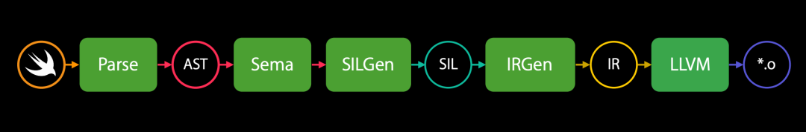

#### 🔶2.内存

无论我们使用什么语言来开发应用程序，一个程序运行之后它的内存空间一定都是由下面这几部分组成的：

栈：存放函数中定义的临时变量

堆：存放class对象，alloca/malloc等函数分配的内存空间

全局区：代码中定义的全局变量

常量区：字符串常量、const修饰常量

代码段(文本段)：存放开发者编写的代码 (不是我们理解的源代码，而是编译后的010101机器码，汇编代码)

所以我们也可以通过直接查看内存中存储的数据来分析一些语法的底层原理。

#### 🔶查看Swift中一个变量的内存数据

##### 🔺a、获取一个变量占用的内存大小
在C/OC中我们可以直接使用sizeof获取一个变量所占用的内存大小，在Swift中这种方式是不能使用的，Swift提供了一个MemLayout的Api用来获取内存信息。

Memlayout.size(ofValue value: T) // 获取变量实际占用的内存大小

Memlayout.stride(ofValue value: T)     // 获取创建变量所需要的分配的内存大小

MemoryLayout.alignment(ofValue: T) // 获取变量的内存对齐数

通常为了提高cpu对内存访问的效率，在分配内存空间时都会进行内存对齐操作，所以size指的是变量实际所占用的内存大小，stride指的是经过内存对齐后创建变量需要开辟的内存空间大小，但实际上多余出来的内存空间并没有使用，仅仅是为了将内存对齐而已。

```
enum Color {
   case red
   case yellow
   case blue
}

func testEnum() {
    let i: Int = 1
    print(MemoryLayout.size(ofValue: i))       // 8
  
    let color = Color.blue
    print(MemoryLayout.alignment(ofValue: color))  // 1
    print(MemoryLayout.size(ofValue: color))       // 1
    print(MemoryLayout.stride(ofValue: color))     // 1
}
```
通过MemoryLayout我们可以得知一个Int类型的变量占用8个字节（以下所有测试数据都是基于64位系统），而一个Color枚举变量的只需要占用一个字节的空间。

##### 🔺b、获取变量地址

我们已经知道了一个Color枚举变量在内存中只需要占用一个字节，毋庸置疑这一个字节是存储在栈空间上的，但这个字节里存放的数据到底是什么？

我们怎么样才能查看到这1个字节里的数据呢？

通常如果我们知道了一个内存地址，我们可以通过下面两种方式查看地址对应内存空间存放的数据：

1、我们可以在xcode -> Debug -> Debug workflow -> View Memory中输入内存地址定位到那块内存空间

2、在lldb中使用指令memory read + 内存地址读取指针对应的内存。也可以直接使用指令x简化书写，效果等同于memory read

现在问题就变成我们该如何获取Swift变量的内存地址了，但由于xcode对Swift语言做了非常多的封装和屏蔽，断点调试时，我们不能直接像oc/c语言那样直接看到枚举变量的地址，我们只能通过Swift的方式获取内存地址。

```
func getPointer<T>(of value: inout T) -> UnsafeRawPointer {
  return withUnsafePointer(to: &value, { UnsafeRawPointer($0) })
}
```

为了方便使用，我们定义一个获取变量内存地址的函数，这里不再详细讲解这个函数，不清楚的同学可以先去学习一下Swift的指针语法。

##### 🔺c、查看内存数据

```
func testEnum() {
    var color = Color.blue
    let p = getPointer(of: &color)
    print(p)
}
```

知道如何获取Swift变量的地址之后我们就可以开始测试了，直接运行testEnum函数断点查看到print的位置，然后进行memory read。

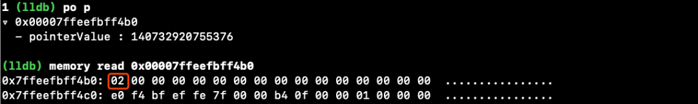

上面我们知道Color枚举只占用一个字节，所以我们只需要查看第1个字节的数据：可以看到原来color变量在内存中的真实存储数据是0x2，同样的我们也可以测试到Color.red在内存中的值是0x0，yellow在内存中的值是0x1。

所以我们可以得知：当我们在function中定义let color = Color.blue的本质就是在栈空间分配了1个字节的空间，这个内存空间存储了一个数据0x2。blue是2，red是0，yellow是1，所以原来简单类型的枚举<无关联值>和OC语言中的枚举内存结构基本类似，其实就是从0开始的整型数据，只不过Swift编译器做了一些优化，会根据枚举值的数量自动决定枚举值所占用的内存大小，因为我们定义的Color枚举只有三种类型，1个字节就足够存下了，所以就只占用一个字节就好了。

⚠提醒：Swift和OC混编时，Swift中的enum要想在OC中使用，需要添加@objc修饰符，而添加完@objc修饰符之后，swift的枚举占用的内存大小就不是由枚举类型的数目决定的了，而是固定为和Int类型大小一致。

### 0x2原始值

```
enum Color: String {
 case red = "I am red"
  case yellow
  case blue
}
```

Swift中的枚举支持定义一个原始值，那么原始值的本质又是什么东东？

如果当我们设置原始值为String时，枚举变量的内存中的数据就变成了String了吗？

我们接着使用和第一部分一样的探索方式，先获取到变量的指针，然后查看内存中的值，这时我们发现设置原始值既不会改变枚举变量的大小，也没有改变枚举变量在内存中的值，也就是设置了原始值没有影响枚举在内存中的任何数据，那就奇怪了，那原始值被存到了什么地方？

其实熟悉原始值使用语法的同学都知道，枚举的原始值并不是直接拿来使用的，而是通过枚举的一个名为rawValue的属性才可以访问到的，我们是不是可以根据刚才看到的内存结构大胆的猜测一下：是不是定义枚举变量时，原始值并不会被存储在枚举的内存空间中，而有可能只是编译器帮我们生成了一个rawValue的计算属性，然后在计算属性的内部判断枚举自身的类型来返回不同的原始值。

```
enum Color: String {
    case red = "I am red"
    case yellow
    case blue
  
    // 猜测伪代码  
    var rawValue: String {
        switch self {
        case .red:
            return "I am red"
        case .yellow:
            return "yellow" // 没有设置，则使用枚举名字填充
        case .blue:
            return "blue" // 没有设置，则使用枚举名字填充
        default:
            break
        }
    }
}
```

上面仅仅是我们的猜想，这里我们先不做证实，等下面我们探索完计算属性的原理之后可以再来证实我们的猜想。

### 0x3关联值

```
enum Color {
    case red(val: Int)
    case yellow(val: Bool)
    case blue
}
```

除了支持设置原始值以外，枚举类型还支持绑定关联值，关联值又是怎么实现的呢？

下面我们先来查看一下绑定了关联值的枚举所占用的内存大小。

```
var c1 = Color.red(val: 3)
let p1 = getPointer(of: &c1)
print(MemoryLayout.size(ofValue: c1)) // 9

var c2 = Color.yellow(val: true)
let p2 = getPointer(of: &c2)
print(MemoryLayout.size(ofValue: c2)) // 9

var c3 = Color.blue
let p3 = getPointer(of: &c3)
print(MemoryLayout.size(ofValue: c3)) // 9
```

可以看到三种类型的Color输出的size都是9，为什么都是9个字节呢？

那么关联值的实现是不是也可能像原始值那样，是编译器帮我们生成一些计算属性、方法之类的，帮我们保存关联值？仔细思考一下答案应该是否定的，关联值是不同于原始值的，因为原始值是一个确定值，在程序编译时期就可以确定下来的值，而关联值是不确定的，每一个枚举变量绑定的关联值都是不同的，值是在程序运行的时候才能确定的，我们可以使用case le语法从枚举中解析出不同的关联值， 那么这个关联值一定是和枚举变量有密切关联的，所以关联值是不是被直接存放在枚举变量中呢？我们分析一下red枚举，一个Int类型在64位系统占用8个字节，除此之外通过第一部分的学习我们知道枚举自己还需要一个字节来区分枚举类型（Color只有三个类型，只需要一个字节就能存放所有类型），所以8 + 1 = 9，正好可以解释c1变量的大小为什么是9。

大家会接着疑惑为什么c2、c3也占用9个字节呢？按照刚才的计算法则Bool变量只占1个字节，加上枚举自身的一个字节应该是1 + 1 = 2个字节就可以了，为什么还需要占用9个字节呢？这个时候我们不能只考虑自身所占用的数据大小，大家想一下枚举的一些使用场景，比如如果我们要将c2重新赋值为其他的类型如c2=Color.red(val: 4)，c2的两个字节还够用吗，又比如我们定义一个枚举数组，如果每一个元素的占用的内存大小都不一样，数组该怎么根据下标寻址呢，所以枚举枚举变量的size是固定的，而大小是取决于需要占用内存空间最大的那个类型。

我们不能只是猜测就结束了，接下来要证实我们的猜测

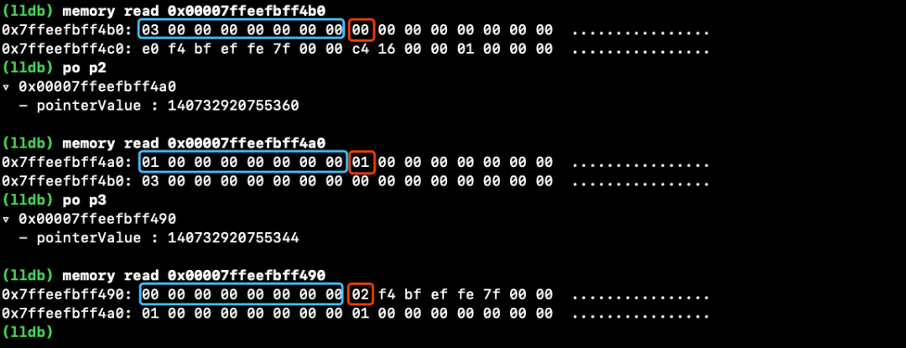

红色区域存放就是枚举的类型，蓝色区域就是用来存放关联值，结果和我们分析的是完全一致的。

🔺补充：关联值在swift语言中的应用

可选类型是swift为了安全推出的一种新的类型，可以使我们很好的避免空指针问题，那么可选类型的本质又是什么呢？

我们通过MemoryLaout查看一个Int的size=8，而一个Int?的size=9，可选类型比非可选多了1个字节，why?

```
@frozen public enum Optional<Wrapped> : ExpressibleByNilLiteral {

    /// The absence of a value.
    ///
    /// In code, the absence of a value is typically written using the `nil`
    /// literal rather than the explicit `.none` enumeration case.
    case none

    /// The presence of a value, stored as `Wrapped`.
    case some(Wrapped)

    /// Creates an instance that stores the given value.
    public init(_ some: Wrapped)
}
```

查看Optional的源码得知，其实在swift中可选类型就是一个添加了关联值的枚举，例如:

Int?就等价于 Optional<Int>

let age: Int? = 2 就等价于 let age: Optional<Int> = Optional.some(2)

ExpressibleByNilLiteral是一个nil的字面量协议，代表可以使用nil这个关键字来进行初始化，Optional实现了这个协议的方法init(nilLiteral: ()) { self = .none }，所以let age: Int? = nil就等价于 let age: Optional<Int> = Optional.init(nilLiteral: ())。

只是编译器在背后帮我们做了一些转换而已。

### 0x4计算属性、方法

```
enum Color {
    case red
    case yellow
    case blue
  
    var intValue: Int {
        return 100
    }
    func desc() -> String {
        return "desc"
    }
    static func staticDesc() -> String {
        return "staticDesc"
    }
}
```

我们分别测试调用枚举的"实例方法"(Instance Method)和"类型方法"(Type Method)。

```
func testEnum() {
    let c = Color.red
    let s1 = c.desc()       // "desc"
    let s2 = Color.staticDesc()  // "staticDesc"
}
```

枚举又不是一个对象，为什么能有"实例方法"和"类型方法"呢，这个时候我们通过查看内存的方式就不好使了，我们需要借助sil大法了，直接通过swiftc命令将Swift文件编译成sil文件。

#### ⚠注意

1、swiftc是Xcode自带的命令不需要我们安装；我这里的main.swift文件是一个只是依赖了Foundation库的文件，直接使用-emit-sil就可以了，如果大家编译iOS项目中的Swift源文件可能会报错，因为iOS项目依赖了UIKit或者其他库，需要额外指定-target和-sdk。

2、SIL语法这里不做讲解了，我们不需要理解每一个指令什么意思，只需能结合注释看懂个大概就可以了。

下面简单介绍几个常见的指令：

- %0、%1 ...：这些其实就是临时变量

- function_ref：可以理解为获取函数地址

- apply x(y)：apply就代表执行某个函数， x代表那个函数 ，y指的是参数

下面我们打开终端输入swiftc -emit-sil main.swift -o mian.sil，然后打开main.sil查找testEnum()函数

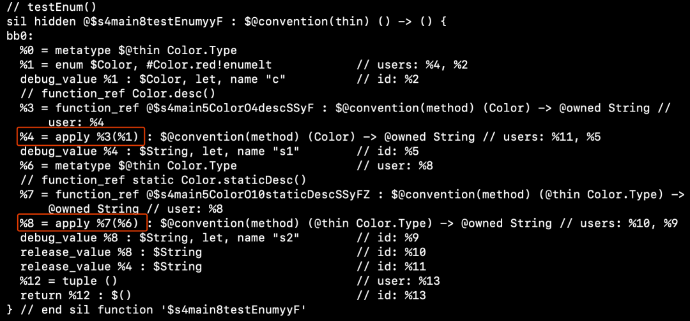

看源码已知%1 = Color.red，%3 = @$s4main5ColorO4descSSyF，再查看第一个红框位置，那么apply%3(%1)不就是执行@$s4main5ColorO4descSSyF函数吗。

我们再来查看一下@$s4main5ColorO4descSSyF函数的实现

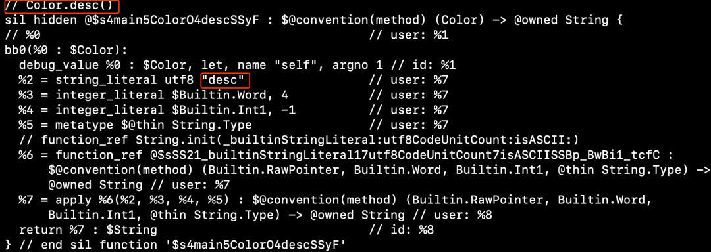

从这个函数上面的注释上就已经可以看出来了，这个函数其实就是编译之后的Color.desc方法， 上面的代码有点繁杂，其实中间的代码主要是在进行字符串的创建，我们可以用简单的伪代码来描述一下。

```
func @$s4main5ColorO4descSSyF(_ self: Color) {
   return "desc"
}
```

其实就是编译器把Color的"实例方法"desc()编译成了一个包含了很多层命名空间名字的函数(为了防止编译生成的函数重名)，然后添加了一个Color类型的参数，而参数的名字叫做self(这样在函数的内部就可以通过self访问当前枚举)，在调用枚举"实例方法"的地方就是调用此函数只不过将当前枚举当做参数传递了进去。

同样的我们查看一下static方法的SIL代码

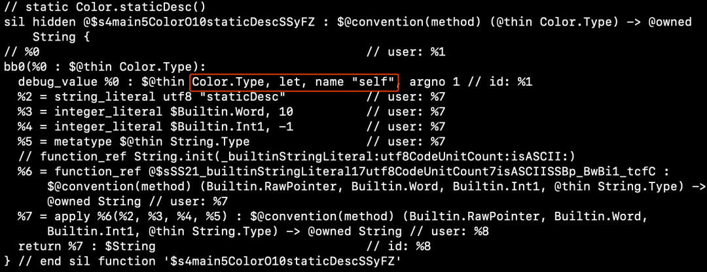

我们也用伪代码来描述一下

```
func @$s4main5ColorO10staticDescSSyFZ(_ self: Color.Type) {
  return "staticDesc"
}
```

其实static方法也没什么特殊，也是被编译成了一个函数，只是这次是把Color.Type当做参数self传递了进去。

接下来我们再来分析一下计算属性又是怎么实现的？计算属性是属性吗？

```
func testEnum() {
    let c = Color.red
    let v = c.intValue
}
```

废话不多说直接编译成sil文件查找源码

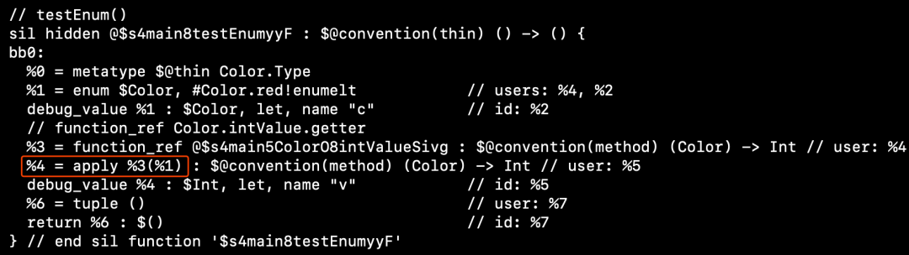

在testEnum方法这里我们又看到了熟悉的apply指令，所以使用计算属性的本质还是调用函数，调用c.intValue本质就是调用@$s4main5ColorO8intValueSivg函数，我们可以追踪一下@$s4main5ColorO8intValueSivg的实现看看

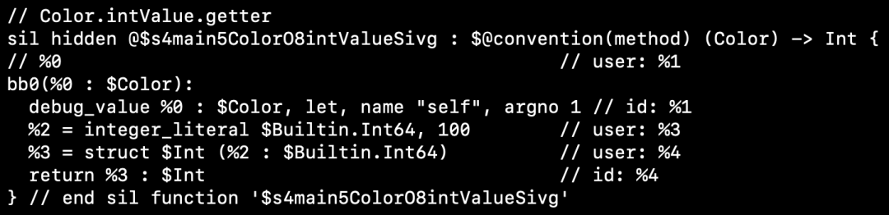

当然这个只是计算属性的getter方法(我们的intValue是实现了get)，看到%2 = 100的时候我们可以大胆的肯定我们的猜测，其实计算属性被编译之后和实例方法基本类似，都是生成了一个参数类型为Color参数名字为self的函数，在调用计算属性的地方就是调用了函数。

在了解了计算属性的原理之后，现在我们可以通过SIL来验证一下第二部分里面我们对原始值的猜测了，看看原始值是不是就是生成了一个rawValue的计算属性呢。

```
enum Color: Int{
    case red = 3
    case yellow = 2
    case blue = 4
}
```

直接编译成SIL文件

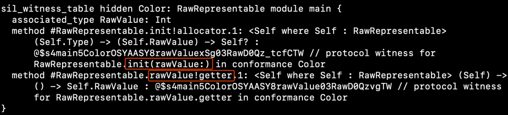

在文件的末尾我们发现了一个叫做sil_witness_table Color: RawRepresentable的东西，这个table里面存放了两个我们非常熟悉的method：init(rawValue)、rawValue!getter，这不就是枚举设置了原始值之后就可以调用的方法和属性吗？

我们查看一下rawValue对应的@$s4mian5ColorO8rawValueSivg函数。

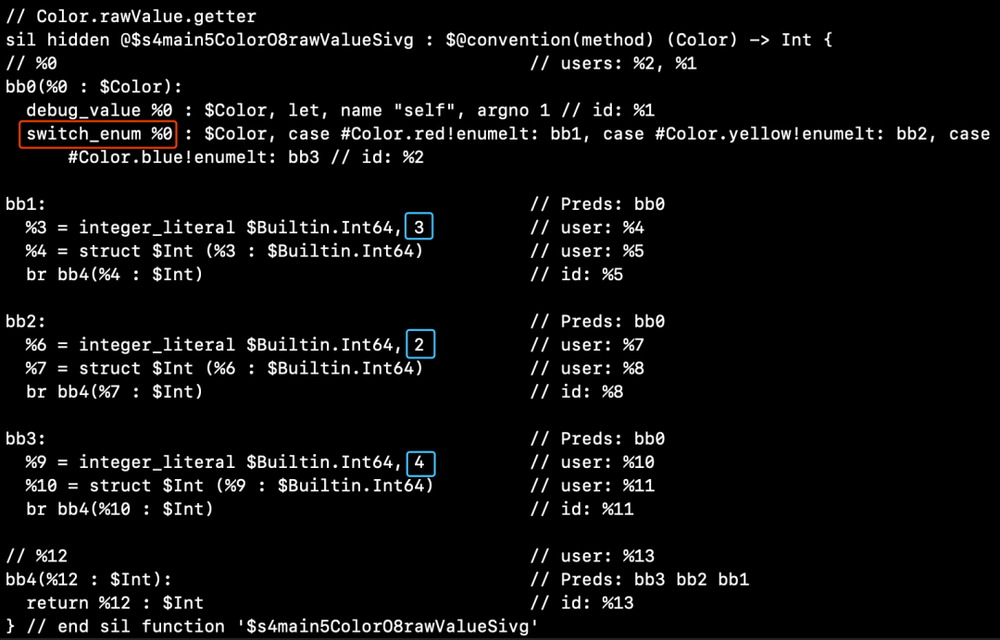

通过SIL代码确实证明了我们的猜想，给枚举添加原始值原来就是编译器帮我们实现了RawRepresentable协议，实现了rawValue、init(_ rawValue)函数，rawValue函数在内部对self参数进行switch判断，以此返回不同的的原始值。

### 0x5默认协议

继续看一看枚举中还有那些不为人知的秘密？

大家有没有发现一个现象：我们定义的简单枚举类型<没有关联值>默认就可以进行==、!=运算，要知道在Swift语言中==不再是一个运算符了，==是一个函数，是属于Equatable协议中的一个函数，但我们的枚举又没有实现Equatable怎么也可以进行比较呢？

我们先将枚举还原成最简单的状态

```
enum Color {
  case red
  case yellow
  case blue
}
```

直接编译成sil查看源码，在文件的最下面发现这两个table

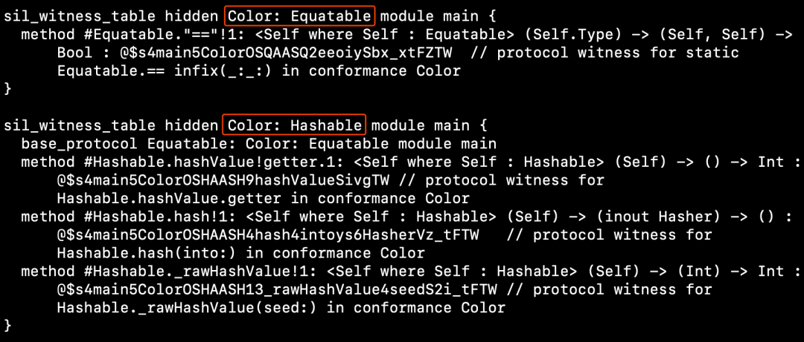

原来编译器默认会帮我们实现Hashable/Equatable协议，这就是为什么我们的枚举可以调用hashValue属性，可以进行==运算的原因。接着我们给枚举添加关联值后再试一下，这个时候你会发现编译器什么协议也没帮我们添加，想必大家在开发过程中也发现了，设置关联值之后的枚举确实是不能进行==运算的，大家猜想一下是为什么呢，为什么设置了关联值编译器就不帮我们实现协议了呢

其实通过第二三部分的探索我们大概可以知道答案了，还是要从枚举底层的内存结构来看，枚举在没有绑定关联值的时候，本身其实就是一个整型值，类似Int，Swift系统的Int默认也是实现了Hashable/Equatable协议的，系统当然可以像对待Int一样帮我们实现Hashable/Equatable协议，而当我们添加了关联值之后，枚举在的内存中的数据结构就是由枚举本身和关联值两部分组成了，编译器是不能确定具体要怎么样比较，怎么样hash了，则需要由我们开发者自己实现了。

## 总结

对于枚举的探索就到这里了，下面来总结一下我们学到的知识吧。

1、简单枚举<没有关联值>的本质就是一个整型值，整型值的大小取决于该枚举所定义的类型的数量。

2、给枚举添加原始值不会影响枚举自身的任何结构，设置原始值其实是编译器帮我们添加了rawValue属性，init(rawValue)方法(RawRepresentable协议)。

3、添加关联值会影响枚举内存结构，关联值被储存在枚举变量中，枚举变量的大小取决于占用内存最大的那个类型。

4、添加/调用"实例方法"、"类型方法"、计算属性以及实现协议的本质都是添加/调用函数。

5、对于没有添加关联值的枚举系统会默认帮我们实现Hashable/Equatable协议。

【参考资料】
SIL指令：https://github.com/apple/swift/blob/master/docs/SIL.rst

> [原文：搜狐技术产品的一文看破Swift枚举本质](https://mp.weixin.qq.com/s/Gx7L_Ev0DV19mLYMnH-R1Q)