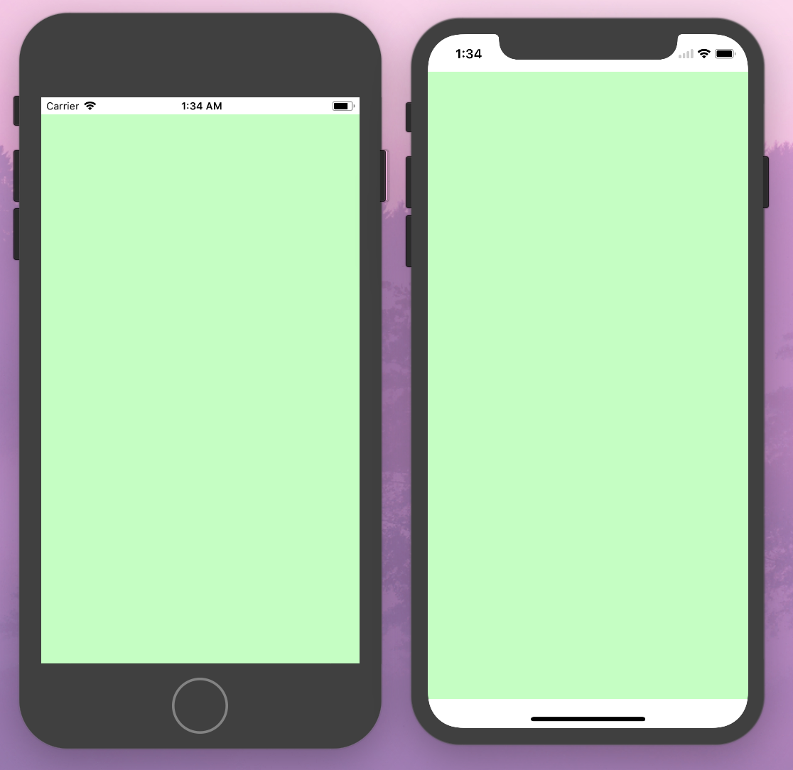
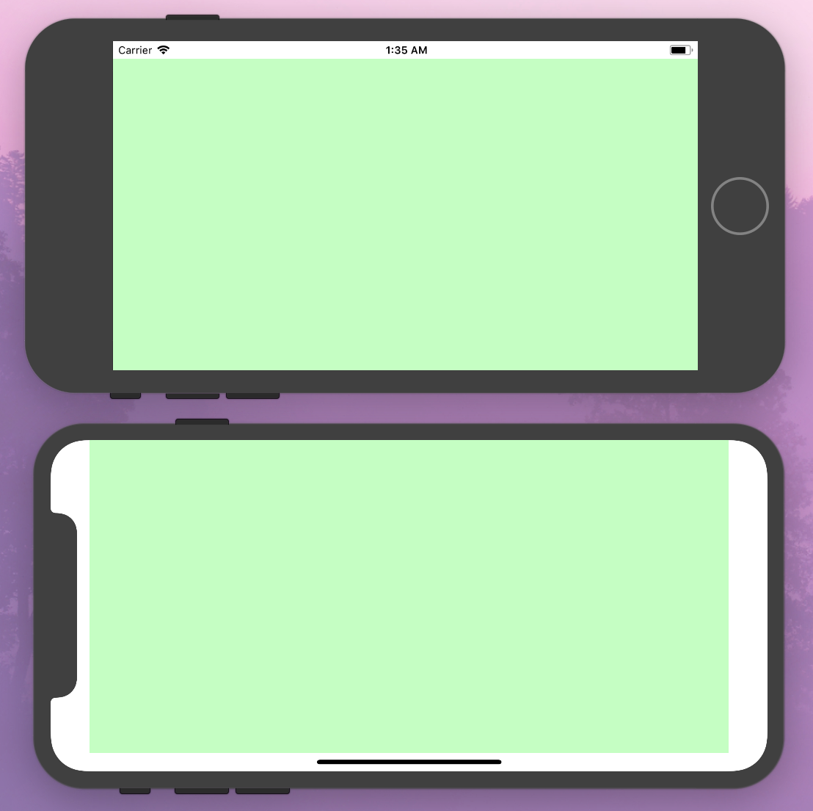
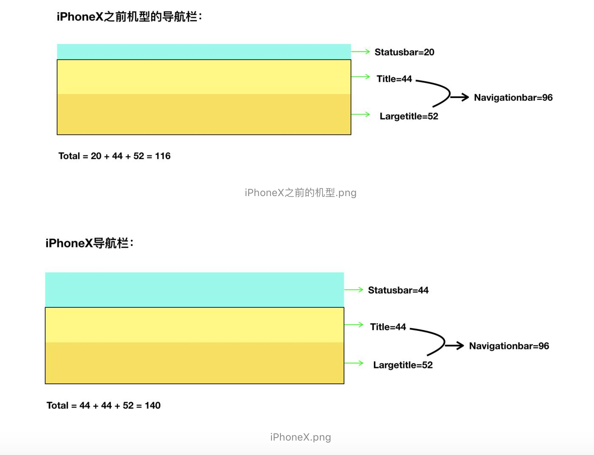
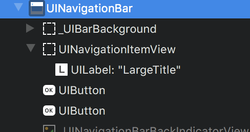
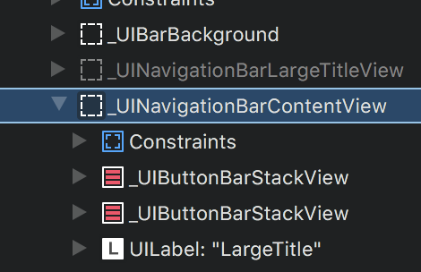
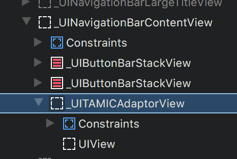

# 2017-09-27-iOS11-sdk11-xcode9-iphone8/8+/x适配

## :smile:[《Human Interface Guidelines - iPhone X》](https://developer.apple.com/ios/human-interface-guidelines/overview/iphone-x/)
## :smile:[《Human Interface Guidelines - What's New in iOS 11》](https://developer.apple.com/ios/human-interface-guidelines/overview/whats-new/) 
## :smile:AVAssetTrack中mediaType: String --> AVMediaType
## :smile:AVPlayer中isClosedCaptionDisplayEnabled: Deprecated
## :smile:AVPlayerLayer中videoGravity: String --> AVLayerVideoGravity

## :smile:App 在 iPhone X 适配全屏
如果你的 App 在 iPhone X 上运行发现没有充满屏幕，上下有黑边，说明你没有使用 storyboard 做 LaunchImage，而是用的 Assets。Assets 的解决办法是添加一张尺寸为1125x2436的LaunchImage。

## :smile:tableView的section头和尾为0
iOS11以前想要实现section头和尾为0，代码中把tableView的heightForFooterInSection和heightForHeaderInSection设置成0.1即可：

```
- (CGFloat)tableView:(UITableView *)tableView heightForHeaderInSection:(NSInteger)section {
        return 0.0001;
}

- (CGFloat)tableView:(UITableView *)tableView heightForFooterInSection:(NSInteger)section {
    return 0.0001;
}
```

但是在iOS11上发生tableView头尾出现空白间距，原因是代码中只实现了heightForHeaderInSection（heightForFooterInSection）方法，而没有实现viewForHeaderInSection（viewForFooterInSection）方法。那样写是不规范的，只实现高度，而没有实现view，但代码这样写在iOS11之前是没有问题的，在iOS11中如果不实现 viewForHeaderInSection:和 viewForFooterInSection: ，则heightForHeaderInSection:和heightForFooterInSection:不会被调用，导致它们都变成了默认高度，这是因为tableView在iOS11默认使用Self-Sizing，tableView的estimatedRowHeight、estimatedSectionHeaderHeight、 estimatedSectionFooterHeight三个高度估算属性由默认的0变成了UITableViewAutomaticDimension（iOS11之前是0），解决办法是

方法一：

添加上viewForHeaderInSection（viewForFooterInSection）方法后会执行heightForHeaderInSection（heightForFooterInSection）问题就解决了。

方法二：
或者添加以下代码关闭估算行高，问题也得到解决：

```
_tableView.estimatedRowHeight = 0;
_tableView.estimatedSectionHeaderHeight = 0;
_tableView.estimatedSectionFooterHeight = 0;
```

> PS:iOS11下，如果没有设置estimateRowHeight的值，也没有设置rowHeight的值，那contentSize计算初始值是 44 x cell的个数，如下图：rowHeight和estimateRowHeight都是默认值UITableViewAutomaticDimension 而rowNum = 15；则初始contentSize = 44  15 = 660；

## :smile:oc也开始支持新api判断系统版本`@available(iOS 11.0, *) `

## :smile:iPhone X规则
iPhone X 的屏幕宽度同 iPhone 6、iPhone 6s、iPhone 7 和 iPhone 8 的 4.7 英寸屏幕宽度相同，即 375pt。屏幕垂直高度增加了 145pt，这意味着增加了 20% 的可视空间。

> 竖屏规格：1125px × 2436px (375pt × 812pt @3x)
> 横屏规格：2436px × 1125px (812pt × 375pt @3x)


## :smile:iPhone X中横屏不会显示statusbar
在UIViewController中设置了都显示statusbar：

```swift
    override open var prefersStatusBarHidden: Bool{
       return false
    }
```
在除了iPhoneX的其他设备上横屏都能显示statusbar（无论是iOS11还是iOS10等），但是在iPhoneX上横屏是不显示statusbar的。

## :smile:iOS 7 之后苹果给 UIViewController 引入了 topLayoutGuide 和 bottomLayoutGuide 两个属性来描述不希望被透明的状态栏或者导航栏遮挡的最高位置(status bar, navigation bar, toolbar, tab bar 等)。这个属性的值是一个 length 属性( topLayoutGuide.length)。 这个值可能由当前的 ViewController 或者 NavigationController 或者 TabbarController 决定。 iOS 11 开始弃用了这两个属性， 并且引入了 Safe Area 这个概念。苹果建议: 不要把 Control 放在 Safe Area 之外的地方。

```swift
 // These objects may be used as layout items in the NSLayoutConstraint API
    @available(iOS, introduced: 7.0, deprecated: 11.0)
    open var topLayoutGuide: UILayoutSupport { get }

    @available(iOS, introduced: 7.0, deprecated: 11.0)
    open var bottomLayoutGuide: UILayoutSupport { get }
```

## :smile:UIView 中的 safe area
iOS 11 中 UIViewController 的 topLayoutGuide 和 bottonLayoutGuide 两个属性被 UIView 中的 safeAreaInsets和safeAreaLayoutGuide 替代了，即 insets 或者 layout guide:

```swift
    @available(iOS 11.0, *)
    open var safeAreaInsets: UIEdgeInsets { get }
    
    @available(iOS 11.0, *)
    open var safeAreaLayoutGuide: UILayoutGuide { get }
```
这个属性表示相对于屏幕四个边的间距。



竖屏下safeAreaInsets的值是：

UIEdgeInsets(top: 44.0, left: 0.0, bottom: 34.0, right: 0.0)

UIEdgeInsets(top: 20.0, left: 0.0, bottom: 0.0, right: 0.0)

> 无论statuabra显示还不是显示，iPhone X的self.view.safeAreaInsets.top 都是44.
> iPhone X来电或者热点不会导致状态栏高度变化
> TabBar高度增加了34像素
> ToolBar高度不变，只是向上偏移了34像素



横屏下safeAreaInsets的值是：

UIEdgeInsets(top: 20.0, left: 0.0, bottom: 0.0, right: 0.0)

UIEdgeInsets(top: 0.0, left: 44.0, bottom: 21.0, right: 44.0)


> PS: safeAreaInsets和safeAreaLayoutGuide属性只有在viewSafeAreaInsetsDidChange()方法时才生效，哪怕你更改additionalSafeAreaInsets属性后也不是马上生效的，也是在viewSafeAreaInsetsDidChange()方法时才生效。所以当UIViewController调用viewDidLoad时它的所有子视图的safeAreaInsets属性都等于UIEdgeInsetsZero,是无法通过当前视图控制器的子视图获取到safeAreaInsets的, 不过获取当前window对象的safeAreaInsets属性用来计算也是可以的, 但是不建议这么做, 一个视图控制器的子视图的处理当然要以它所在的控制器为准。

## :smile:frame设置布局的时候要考虑safe area
例如：

```swift
let insets = UIApplication.shared.delegate?.window??.safeAreaInsets ?? UIEdgeInsets.zero
            
view1.frame = CGRect(
    x: insets.left,
    y: insets.top,
    width:view.bounds.width - insets.left - insets.right,
    height: 200)

view2.frame = CGRect(
    x: insets.left,
    y: screenH - insets.bottom - 200,
    width:view.bounds.width - insets.left - insets.right,
    height: 200)
```


## :smile:UIViewController的additionalSafeAreaInsets属性可以更改安全区域：

```
    /* Custom container UIViewController subclasses can use this property to add to the overlay
     that UIViewController calculates for the safeAreaInsets for contained view controllers.
     */
    @available(iOS 11.0, *)
    open var additionalSafeAreaInsets: UIEdgeInsets
```

比如用来测试你的 app 是否支持 iPhone X。在没有 iPhone X 也不方便使用模拟器的时候， 这个设置这个属性来实现：

```swift
//竖屏
additionalSafeAreaInsets.top = 24.0
additionalSafeAreaInsets.bottom = 34.0

//竖屏, status bar 隐藏
additionalSafeAreaInsets.top = 44.0
additionalSafeAreaInsets.bottom = 34.0

//横屏
additionalSafeAreaInsets.left = 44.0
additionalSafeAreaInsets.bottom = 21.0
additionalSafeAreaInsets.right = 44.0
```

## :smile:安全区域被更改后出发回调

```swift
// UIView
@available(iOS 11.0, *)
open func safeAreaInsetsDidChange()

//UIViewController
@available(iOS 11.0, *)
open func viewSafeAreaInsetsDidChange()
```


viewSafeAreaInsetsDidChange 是在 viewWillAppear之后，viewWillLayoutSubviews之前被调用：

```
viewDidLoad()---UIEdgeInsets(top: 0.0, left: 0.0, bottom: 0.0, right: 0.0)
willMove(toParentViewController:)---UIEdgeInsets(top: 0.0, left: 0.0, bottom: 0.0, right: 0.0)
viewWillDisappear---Optional("rootVC")---UIEdgeInsets(top: 44.0, left: 0.0, bottom: 34.0, right: 0.0)
viewWillAppear---UIEdgeInsets(top: 0.0, left: 0.0, bottom: 0.0, right: 0.0)
viewSafeAreaInsetsDidChange()---UIEdgeInsets(top: 44.0, left: 0.0, bottom: 34.0, right: 0.0)
viewWillLayoutSubviews()---UIEdgeInsets(top: 44.0, left: 0.0, bottom: 34.0, right: 0.0)
viewDidLayoutSubviews()---UIEdgeInsets(top: 44.0, left: 0.0, bottom: 34.0, right: 0.0)
viewWillLayoutSubviews()---UIEdgeInsets(top: 44.0, left: 0.0, bottom: 34.0, right: 0.0)
viewDidLayoutSubviews()---UIEdgeInsets(top: 44.0, left: 0.0, bottom: 34.0, right: 0.0)
viewDidAppear---UIEdgeInsets(top: 44.0, left: 0.0, bottom: 34.0, right: 0.0)
viewDidDisappear---Optional("rootVC")---UIEdgeInsets(top: 44.0, left: 0.0, bottom: 34.0, right: 0.0)
didMove(toParentViewController:)---UIEdgeInsets(top: 44.0, left: 0.0, bottom: 34.0, right: 0.0)
```

## :smile:UIScrollView 的 contentInsetAdjustmentBehavior
iOS 7 中引入 UIViewController 的 automaticallyAdjustsScrollViewInsets 属性在 iOS11 中被废弃掉了。取而代之的是 UIScrollView 的 contentInsetAdjustmentBehavior

```swift
@available(iOS 11.0, *)
public enum UIScrollViewContentInsetAdjustmentBehavior : Int {    
    case automatic          //default value
    case scrollableAxes
    case never
    case always
}

@available(iOS 11.0, *)
open var contentInsetAdjustmentBehavior: UIScrollViewContentInsetAdjustmentBehavior
```

Content Insets Adjustment Behavior

- never 不计算内边距。

> adjustedContentInset = contentInset,adjustContentInset值不受SafeAreaInset值的影响。

- scrollableAxes content insets 只会针对 scrollview 滚动方向做调整，自动计算内边距。

> 在可滚动方向上adjustedContentInset = safeAreaInset + contentInset，在不可滚动方向上adjustedContentInset = contentInset；依赖于scrollEnabled和alwaysBounceHorizontal / vertical = YES，scrollEnabled默认为yes，所以大多数情况下，计算方式还是adjustedContentInset = safeAreaInset + contentInset
 
- always content insets 会针对两个方向都做调整，根据safeAreaInsets 计算内边距

> adjustedContentInset = safeAreaInset + contentInset

- automatic 这是默认值。当下面的条件满足时， 它跟 always 是一个意思

  - 能够水平滚动，不能垂直滚动
  - scroll view 是 当前 view controller 的第一个视图
  - 这个controller 是被navigation controller 或者 tab bar controller 管理的
  - automaticallyAdjustsScrollViewInsets 为 true
  
  在其他情况下 automoatc 跟 scrollableAxes 一样

## :smile:iOS 11 中 UIScrollView 新加了一个属性: adjustedContentInset

```swift
@available(iOS 11.0, *)
open var adjustedContentInset: UIEdgeInsets { get }
```

表示contentView.frame.origin偏移了scrollview.frame.origin多少；是系统计算得来的，计算方式由contentInsetAdjustmentBehavior决定。


在同时有 navigation vc 中套 tab bar vc 的 view controller 中添加一个全屏 scrollview 然后分别打印两个值:

```swift
//iOS 10

//scrollView.contentInset
UIEdgeInsets(top: 88.0, left: 0.0, bottom: 83.0, right: 0.0)

//iOS 11
//view.safeAreaInsets
UIEdgeInsets(top: 88.0, left: 0.0, bottom: 83.0, right: 0.0)

//scrollView.contentInset
UIEdgeInsets(top: 0.0, left: 0.0, bottom: 0.0, right: 0.0)
//scrollView.adjustedContentInset
UIEdgeInsets(top: 88.0, left: 0.0, bottom: 83.0, right: 0.0)
```

然后再设置:

```swift
// 给 scroll view 的四个方向都加 10 的间距
scrollView.contentInset = UIEdgeInsets(top: 10, left: 10, bottom: 10, right: 10)
```

打印:

```swift
//iOS 10

//scrollView.contentInset
UIEdgeInsets(top: 98.0, left: 10.0, bottom: 93.0, right: 10.0)

//iOS 11
//view.safeAreaInsets
UIEdgeInsets(top: 88.0, left: 0.0, bottom: 83.0, right: 0.0)

//scrollView.contentInset
UIEdgeInsets(top: 10.0, left: 10.0, bottom: 10.0, right: 10.0)
//scrollView.adjustedContentInset
UIEdgeInsets(top: 98.0, left: 10.0, bottom: 93.0, right: 10.0)
```

由此可见，在 iOS 11 中 scroll view 实际的 content inset 可以通过 adjustedContentInset 获取。这就是说如果你要适配 iOS 10 的话。这一部分的逻辑是不一样的。


系统还提供了两个方法来监听这个属性的改变:

```swift
//UIScrollView
@available(iOS 11.0, *)
open func adjustedContentInsetDidChange()

//UIScrollViewDelegate
@available(iOS 11.0, *)
optional public func scrollViewDidChangeAdjustedContentInset(_ scrollView: UIScrollView)
```

## :smile:UITableView的Safe Area
### iOS11 UITableView新属性insetsContentViewsToSafeArea
假如你设置一个tableview为VC view的大小相同，但是你会发现把iPhoneX横屏后header、footer和cell中的内容也缩进到安全区域中，但其实cell大小还是原来那么大，是 cell 的 contntView自动缩成安全区域的宽度。这是因为 UITableView 中新引入的属性insetsContentViewsToSafeArea管理的:

```swift
@available(iOS 11.0, *)
open var insetsContentViewsToSafeArea: Bool
```

他默认值是true，如果设置成false，iPhoneX横屏后内容就在安全区域外面了，没有自动缩进。也就是说在 iOS 11 下, 并不需要改变 header/footer/cell 的布局， 系统会自动区适配 safe area

> 需要注意的是, Xcode 9 中使用 IB 拖出来的 TableView 默认的边框是 safe area 的。所以实际运行起来 tableview 都是在 safe area 之内的。

### Table Views：separatorInset 扩展
iOS 7 引入separatorInset属性，用以设置 cell 的分割线边距，在 iOS 11 中对其进行了扩展。可以通过新增的UITableViewSeparatorInsetReference枚举类型的separatorInsetReference属性来设置separatorInset属性的参照值。

```
typedef NS_ENUM(NSInteger, UITableViewSeparatorInsetReference) {  
UITableViewSeparatorInsetFromCellEdges,   //默认值，表示separatorInset是从cell的边缘的偏移量
UITableViewSeparatorInsetFromAutomaticInsets  //表示separatorInset属性值是从一个insets的偏移量
}
```

总结：

- separatorInset 被自动地关联到 safe area insets，因此，默认情况下，表视图的整个内容避免了其根视图控制器的安全区域的插入。
- UITableviewCell 和 UITableViewHeaderFooterView的 content view 在安全区域内；因此你应该始终在 content view 中使用add-subviews操作。
- 所有的 headers 和 footers 都应该使用UITableViewHeaderFooterView，包括 table headers 和 footers、section headers 和 footers。
## :smile:iOS11 UICollectionViewFlowLayout新属性sectionInsetReference

```swift
@property (nonatomic) UICollectionViewFlowLayoutSectionInsetReference sectionInsetReference API_AVAILABLE(ios(11.0), tvos(11.0)) API_UNAVAILABLE(watchos);
```

## :smile:tableview 滑动操作 cell
### 一开始编辑cell可以是实现下面三个代理来实现删除，添加等操作：

```oc
- (UITableViewCellEditingStyle)tableView:(UITableView *)tableView editingStyleForRowAtIndexPath:(NSIndexPath *)indexPath

- (NSString *)tableView:(UITableView *)tableView titleForDeleteConfirmationButtonForRowAtIndexPath:(NSIndexPath *)indexPath


- (void)tableView:(UITableView *)tableView commitEditingStyle:(UITableViewCellEditingStyle)editingStyle forRowAtIndexPath:(NSIndexPath *)indexPath
```
### 在iOS8之后，苹果官方增加了UITableVIew的右滑操作接口，即新增了一个代理方法(tableView: editActionsForRowAtIndexPath:)和一个类(UITableViewRowAction)，代理方法返回的是一个数组，我们可以在这个代理方法中定义所需要的操作按钮(删除、置顶等)，这些按钮的类就是UITableViewRowAction。这个类只能定义按钮的显示文字、背景色、和按钮事件。并且返回数组的第一个元素在UITableViewCell的最右侧显示，最后一个元素在最左侧显示。


### 从iOS 11开始有了一些改变，首先是可以给这些按钮添加图片了，然后是如果实现了以下两个iOS 11新增的代理方法，将会取代(tableView: editActionsForRowAtIndexPath:)代理方法：

```oc
// Swipe actions
// These methods supersede -editActionsForRowAtIndexPath: if implemented
- (nullable UISwipeActionsConfiguration *)tableView:(UITableView *)tableView leadingSwipeActionsConfigurationForRowAtIndexPath:(NSIndexPath *)indexPath
- (nullable UISwipeActionsConfiguration *)tableView:(UITableView *)tableView trailingSwipeActionsConfigurationForRowAtIndexPath:(NSIndexPath *)indexPath
```

这两个代理方法返回的是UISwipeActionsConfiguration类型的对象，创建该对象及赋值可看下面的代码片段:

```oc
- ( UISwipeActionsConfiguration *)tableView:(UITableView *)tableView trailingSwipeActionsConfigurationForRowAtIndexPath:(NSIndexPath *)indexPath {
    //删除
    UIContextualAction *deleteRowAction = [UIContextualAction contextualActionWithStyle:UIContextualActionStyleDestructive title:@"delete" handler:^(UIContextualAction * _Nonnull action, __kindof UIView * _Nonnull sourceView, void (^ _Nonnull completionHandler)(BOOL)) {
        [self.titleArr removeObjectAtIndex:indexPath.row];
        completionHandler (YES);
    }];
    deleteRowAction.image = [UIImage imageNamed:@"icon_del"];
    deleteRowAction.backgroundColor = [UIColor blueColor];

    UISwipeActionsConfiguration *config = [UISwipeActionsConfiguration configurationWithActions:@[deleteRowAction]];
        config.performsFirstActionWithFullSwipe = false;//禁止划动删除，iOS11默认打开
    return config;
}
```

> PS:iOS11默认是划动可以删除的，如果需要和以前版本交互一样的话，必须实现- ( UISwipeActionsConfiguration *)tableView:(UITableView *)tableView trailingSwipeActionsConfigurationForRowAtIndexPath:(NSIndexPath *)indexPath ，把UISwipeActionsConfiguration对象的performsFirstActionWithFullSwipe属性设置为false


## :smile:ARKit
ARKit 框架提供了两种 AR 技术，一种是基于3D场景(SceneKit)实现的增强现实，一种是基于2D场景(SpriteKit)实现的增强现实。

要想显示 AR 效果，必须要依赖于苹果的游戏引擎框架（3D引擎 SceneKit，2D引擎 SpriteKit），主要原因是游戏引擎才可以加载物体模型。

虽然ARKit框架中视图对象继承于 UIView，但是由于目前 ARKit 框架本身只包含相机追踪，不能直接加载物体模型，所以只能依赖于游戏引擎加载 ARKit。

另外需要说明的一点是，ARKit 虽然是 iOS11 新出的框架，但并不是所有的 iOS11 系统都可以使用，而是必须要是处理器 A9 及以上才能够使用，苹果从 iPhone 6S 开始使用 A9 处理器，也就是 iPhone 6 及以前的机型无法使用 ARKit。

## :smile:PDFKit
iOS 11 后苹果在 iOS 平台开放了 PDFKit SDK，这是一个在 MacOS 上已经长期存在的框架，但却在 iOS 上姗姗来迟。可以使用这个框架显示和操作 pdf 文件，你可以使用 PDFKit 实现显示 pdf 文档、显示缩略图、展开大纲和搜索文字等功能。

## :smile:Core ML & Vision
- Core ML 让我们更容易在 App 中使用训练过的模型。
- Vision 让我们轻松访问苹果的模型，用于面部检测、面部特征点、文字、矩形、条形码和物体。

## :smile:IdentityLookup
可以自己开发一个 App Extension 来拦截系统 SMS 和 MMS 的信息。系统的信息 App 在接到未知的人的短信时，会询问所有开启的过滤扩展，如果扩展表示该消息应当被拦截，那么这则信息将不会传递给你。

## :smile:DeviceCheck
通过使用 DeviceCheck 你能够在某种程度上追踪到这个手机使用了你开发 App 的情况(即使这个 App 被卸载,或者机器被刷机)。DeviceCheck 允许你通过你的服务器与 Apple 服务器通讯，并为单个设备设置两个 bit 的数据（没错，就是 2bit，00 01 10 11 四种可能）。这样即使 App 被卸载重装，被刷机，App后台照样可以拿到之前设置的状态。

## :smile:Drag and Drop
Drag 和 drop 是分开实现的，可以只实现其中一个。分别使用 UIDragInteraction 和 UIDropInteraction 来实现，有点类似于 UIGestureRecognizer，需要添加到 view 上。

实现 drag：

```
let drag = UIDragInteraction(delegate: self)
iconView.addInteraction(drag)
```

需要添加到可以拖动的 view 上，对于其代理 UIDragInteractionDelegate：

- 必须提供拖动条目的数据（Provide data for dragged item）
- 可自定义动画（Customize lift animation）
- 可自定义预览（Customize preview）

实现 drop：

```
let drop = UIDropInteraction(delegate: self)
iconContainerView.addInteraction(drop)
```

需要添加到容纳拖拽条目的 view 上，对于其代理 UIDropInteractionDelegate：

- 根据拖拽条目的移动更新 UI（Update UI as drag moves）
- 条目放下时接受数据（Receive data on drop）
- 可以自定义条目放下时的动画（Customize drop animation）
 
TableView、CollectionView、TextView、TextField 和 WebView 有内建支持。

和 UIPasteConfiguration 整合（没有发现 UIPasteConfiguration 的信息，应该也是 iOS 11 加入的新类）。

## :smile:iOS11 之后 UINavigationBar 和 UIToolbar 支持 Auto Layout ，开发者必须要提供自定义视图的 size。
如果自定义 titleView 中使用了 Auto Layout，那么通过设置自定义 titleView 的 frame 的方式来设定 size 在某些场景下可能就不再合适了，开发者应该着重注意下自定义 view 内部的约束（具体案例将在下文中阐述）。如图 1 所示，我们可以通过以下三种方式来提供 size：

- 约束自身宽高；
- 实现 intrinsicContentSize 方法；

```
- (CGSize)intrinsicContentSize {
    return UILayoutFittingExpandedSize;
}
```

- 利用子视图宽高及间距来约束 titleView；


## :smile:UITableView在行高优化
UITableView 除了继承自 UIScrollView 的特性外，还有自身 API 的变动。新系统中，UITableView 开启了估算行高，estimatedRowHeight、 estimatedSectionHeaderHeight、estimatedSectionFooterHeight 不再默认是 0，而是 UITableViewAutomaticDimension（这个值打印输出是 -1），这一举措旨在帮助开发者提高性能，减少 heightForRowAtIndexPath: 方法的的调用次数，但是这样会导致 API 执行顺序发生变化。在没有开启估算行高之前 tableView 总是先执行：

```swift
    optional public func tableView(_ tableView: UITableView, heightForRowAt indexPath: IndexPath) -> CGFloat
```

再执行

```swift
    @available(iOS 2.0, *)
    public func tableView(_ tableView: UITableView, cellForRowAt indexPath: IndexPath) -> UITableViewCell
```

设备测试调用log:

```
heightForRowAt
heightForRowAt
heightForRowAt
cellForRowAt
heightForRowAt
```

而开启估算行高之后 tableView 会先执行：
```swift
   @available(iOS 2.0, *)
    public func tableView(_ tableView: UITableView, cellForRowAt indexPath: IndexPath) -> UITableViewCell
```

再执行

```swift
    optional public func tableView(_ tableView: UITableView, heightForRowAt indexPath: IndexPath) -> CGFloat
```

方法调用次数减少且调用顺序变为:

```
cellForRowAt
heightForRowAt
```

由此可见：

```swift
    optional public func tableView(_ tableView: UITableView, heightForRowAt indexPath: IndexPath) -> CGFloat
```

的调用次数大大减少。但是如果开发者实现：

```swift
    @available(iOS 7.0, *)
    optional public func tableView(_ tableView: UITableView, estimatedHeightForRowAt indexPath: IndexPath) -> CGFloat
```

方法，那么无论是否关闭 estimatedRowHeight，API 的调用顺序和调用次数都是一样的:

```
estimatedHeightForRowAt
estimatedHeightForRowAt
estimatedHeightForRowAt
cellForRowAt
heightForRowAt
```

因此我们要注意新系统中 API 执行顺序和执行次数的变化。

除此之外我们还应该注意在开启预估高度tableView.estimatedSectionHeaderHeight = UITableViewAutomaticDimension; 的情况下，如果不实现

```swift
    @available(iOS 2.0, *)
    optional public func tableView(_ tableView: UITableView, viewForHeaderInSection section: Int) -> UIView? 
```

和

```swift
    @available(iOS 2.0, *)
    optional public func tableView(_ tableView: UITableView, viewForFooterInSection section: Int) -> UIView?
```

那么

```swift
    @available(iOS 2.0, *)
    optional public func tableView(_ tableView: UITableView, heightForHeaderInSection section: Int) -> CGFloat
```

和

```swift
    @available(iOS 2.0, *)
    optional public func tableView(_ tableView: UITableView, heightForFooterInSection section: Int) -> CGFloat
```

是不会被执行的。


> PS:由于 iOS11 默认开启了 estimatedRowHeight，导致cellForRowAt比heightForRowAt先执行，注意下业务逻辑。

## :smile:新iPhone的名称
- @"iPhone10,1" : @"iPhone 8",
- @"iPhone10,4" : @"iPhone 8",
- @"iPhone10,2" : @"iPhone 8 Plus",
- @"iPhone10,5" : @"iPhone 8 Plus",
- @"iPhone10,3" : @"iPhone X",
- @"iPhone10,6" : @"iPhone X",

## :smile:无线调试功能(iPhone的电池...)可在Window  -->Devices and Simulators中勾选那两个选项。前提是此设备已run过并处于同一局域网下。

## :smile:在Asset中，可以创建颜色了。右键选择New Color set，填充RGBA值或十六进制值即可。使用中直接使用新的colorwithname，参数填入创建时的名字即可。不过记得区分系统版本。

## :smile:command键复原。可在Preferences --> Navigation -->Commadn-click 中选择Jumps to Defintion即可。

## :smile:位置权限
在IOS11，原有的NSLocationAlwaysUsageDeion被降级为NSLocationWhenInUseUsageDeion。因此，在原来项目中使用requestAlwaysAuthorization获取定位权限，而未在plist文件中配置NSLocationAlwaysAndWhenInUseUsageDeion，系统框不会弹出。建议新旧key值都在plist里配置，反正我试下来是没有问题，唯一的区别是使用requestAlwaysAuthorization获取权限 IOS11系统弹框会把几种权限级别全部列出，供用户选择，显然更人性化了。

快去更新你的info.plist
```
    <!-- 位置 -->
    <key>NSLocationUsageDescription</key>
    <string>获取地理位置，精准推送服务</string>
    <!-- 在使用期间访问位置 -->
    <key>NSLocationWhenInUseUsageDescription</key>
    <string>获取地理位置，精准推送服务</string>
    <!-- 始终访问位置 -->
    <key>NSLocationAlwaysUsageDescription</key>
    <string>App需要您的同意,才能始终访问位置</string>
    <!-- iOS 11访问位置 -->
    <key>NSLocationAlwaysAndWhenInUseUsageDeion</key>
    <string>App需要您的同意,才能始终访问位置</string>
```

## :smile:UINavigationBar结构改变

### UINavigationBar的新属性prefersLargeTitles

```swift
    /// When set to YES, the navigation bar will use a larger out-of-line title view when requested by the current navigation item. To specify when the large out-of-line title view appears, see UINavigationItem.largeTitleDisplayMode. Defaults to NO.
    @available(iOS 11.0, *)
    open var prefersLargeTitles: Bool
```

iOS11设置为true，会出现大标题，高度为52。
```swift       self.navigationController?.navigationBar.prefersLargeTitles = true
```



如果想要在控制不同页面大标题的显示，可以通过设置当前页面的navigationItem的largeTitleDisplayMode属性

```
typedef NS_ENUM(NSInteger, UINavigationItemLargeTitleDisplayMode) {
  /// 自动模式依赖上一个 item 的特性
  UINavigationItemLargeTitleDisplayModeAutomatic,
  /// 针对当前 item 总是启用大标题特性
  UINavigationItemLargeTitleDisplayModeAlways,
  /// Never 
  UINavigationItemLargeTitleDisplayModeNever,
}
```

### Navigation 集成 UISearchController
把你的UISearchController赋值给navigationItem，就可以实现将UISearchController集成到Navigation。

```
navigationItem.searchController  //iOS 11 新增属性
navigationItem.hidesSearchBarWhenScrolling //决定滑动的时候是否隐藏搜索框；iOS 11 新增属性
```

### UINavigationController和滚动交互

滚动的时候，以下交互操作都是由UINavigationController负责调动的：

1、 UIsearchController搜索框效果更新

2、 大标题效果的控制

3、 Rubber banding效果 //当你开始往下拉，大标题会变大来回应那个滚轮

所以，如果你使用navigation bar，组装push和pop体验，你不会得到searchController的集成、大标题的控制更新和Rubber banding效果，因为这些都是由UINavigationController控制的。

### 导航栏的图层变化
iOS11之前导航栏的title是添加在UINavigationItemView上面，而navigationBarButton则直接添加在navigationBar上面；如果设置了titleView，则titleView也是直接添加在navigationBar上面，如图:



在iOS11之后，苹果添加了新的类来管理，navigationBar会添加在_UIButtonBarStackView上面，而_UIButtonBarStackView则添加在_UINavigationBarContentView上面；如果没有给titleView赋值，则titleView会直接添加在_UINavigationBarContentView上面，如果赋值给了titleView，则会新生成_UITAMICAdaptorView，把titleView添加在这个类上面，这个类会添加在_UINavigationBarContentView上面，如下图:





### 导航栏的边距变化

在iOS11对导航栏里面的item的边距也做了调整，titleView调整最大的宽带，边距在iPhone6p上是20p，在iPhone6p以下是16p；在iOS11以下，这个边距分别是12p和8p；

如果设置了左右navigationBarButton，则在iOS11里，navigationBarButton的边距是20p和16p;在iOS11以下，也是20p和16p；

如果同时设置了titleView和navigationBarButton，则在iOS11以下，它们之间的间距是6p，在iOS11则无间距。


## :smile:[home指示器](https://github.com/easyui/blog/blob/master/iOS/2017-10-20-iPhoneX%E6%8C%87%E7%A4%BA%E6%9D%A1.md)

## :smile:边缘手势控制:推迟系统（通知中心和控制中心的）手势识别

```swift
    // Override to return a child view controller or nil. If non-nil, that view controller's screen edges deferring system gestures will be used. If nil, self is used. Whenever the return value changes, -setNeedsScreenEdgesDeferringSystemGesturesUpdate should be called.
    @available(iOS 11.0, *)
    open func childViewControllerForScreenEdgesDeferringSystemGestures() -> UIViewController?

    
    // Controls the application's preferred screen edges deferring system gestures when this view controller is shown. Default is UIRectEdgeNone.
    @available(iOS 11.0, *)
    open func preferredScreenEdgesDeferringSystemGestures() -> UIRectEdge

    
    // This should be called whenever the return values for the view controller's screen edges deferring system gestures have changed.
    @available(iOS 11.0, *)
    open func setNeedsUpdateOfScreenEdgesDeferringSystemGestures()
}
```

例如：

```
- (UIRectEdge)preferredScreenEdgesDeferringSystemGestures
{
    return UIRectEdgeTop;
}
```

设置后下拉状态栏只会展示指示器，继续下拉才能将通知中心拉出来。如果返回UIRectEdgeNone则会直接下拉出来。


## :smile:layout margins
基于约束的Auto Layout，使我们搭建能够动态响应内部和外部变化的用户界面。Auto Layout为每一个view都定义了margin。margin指的是控件显示内容部分的边缘和控件边缘的距离。 可以用layoutMargins或者layoutMarginsGuide属性获得view的margin,margin是视图内部的一部分。layoutMargins允许获取或者设置UIEdgeInsets结构的margin。layoutMarginsGuide则获取到只读的UILayoutGuide对象。

在iOS11新增了一个属性：directional layout margins，该属性是NSDirectionalEdgeInsets结构体类型的属性：

```
typedef struct NSDirectionalEdgeInsets {  
    CGFloat top, leading, bottom, trailing;
} NSDirectionalEdgeInsets API_AVAILABLE(ios(11.0),tvos(11.0),watchos(4.0));
```

layoutMargins是UIEdgeInsets结构体类型的属性：

```
typedef struct UIEdgeInsets {
  CGFloat top, left, bottom, right;
} UIEdgeInsets;
```

从上面两种结构体的对比可以看出，NSDirectionalEdgeInsets 属性用leading 和 trailing 取代了之前的 left 和 right。

还有其他一些更新。自从引入layout margins，当将一个view添加到viewController时，viewController会修复view的layoutMargins为UIKit定义的一个值，这些调整对外是封闭的。从iOS11开始，这些不再是一个固定的值，它们实际是最小值，你可以改变你的view的layoutMargins为任意一个更大的值。而且，viewController新增了一个属性：viewRespectsSystemMinimumLayoutMargins，如果你设置该属性为”false”，你就可以改变你的layout margins为任意你想设置的值，包括0。

## :smile:一些宏

```
// 判断是否是iPhone X
#define iPhoneX ([UIScreen instancesRespondToSelector:@selector(currentMode)] ? CGSizeEqualToSize(CGSizeMake(1125, 2436), [[UIScreen mainScreen] currentMode].size) : NO)

// 状态栏高度
#define STATUS_BAR_HEIGHT (iPhoneX ? 44.f : 20.f)

// 导航栏高度
#define NAVIGATION_BAR_HEIGHT (iPhoneX ? 88.f : 64.f)

// tabBar高度
#define TAB_BAR_HEIGHT (iPhoneX ? (49.f+34.f) : 49.f)

// home indicator
#define HOME_INDICATOR_HEIGHT (iPhoneX ? 34.f : 0.f)

#define ViewSafeAreInsets(view) ({UIEdgeInsets insets; if(@available(iOS 11.0, *)) {insets = view.safeAreaInsets;} else {insets = UIEdgeInsetsZero;} insets;})
```


