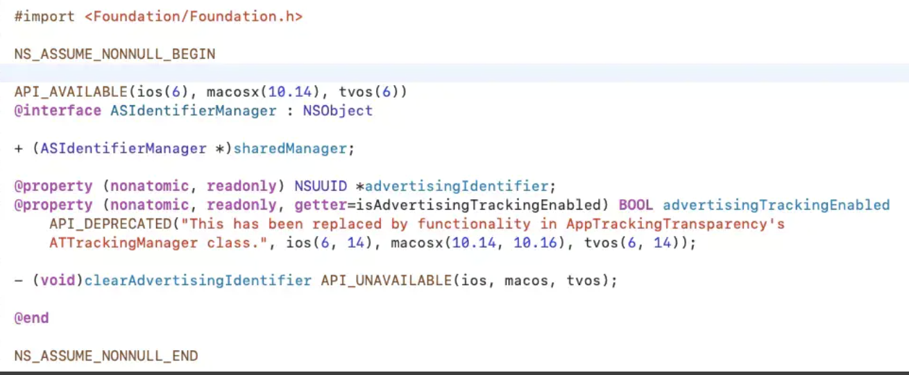
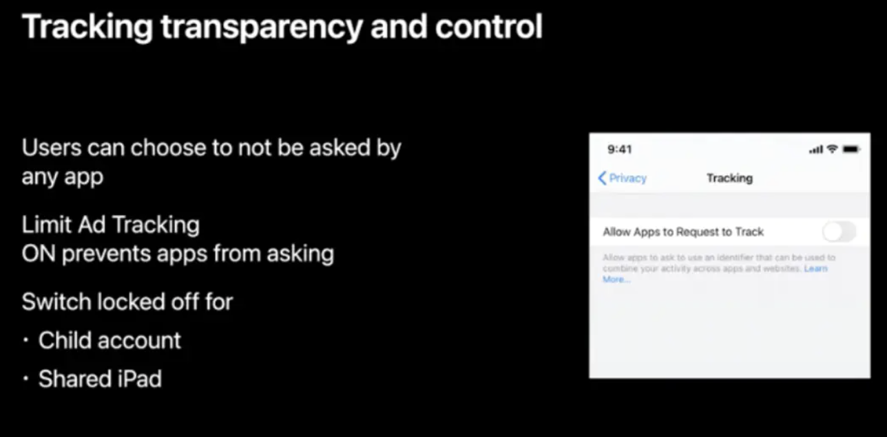
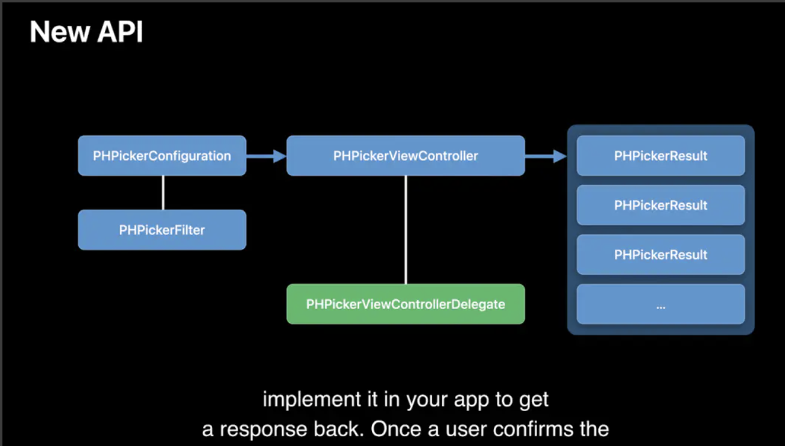
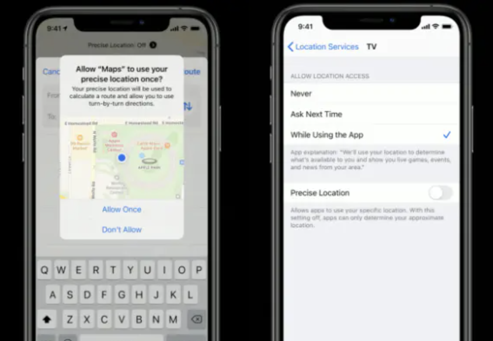
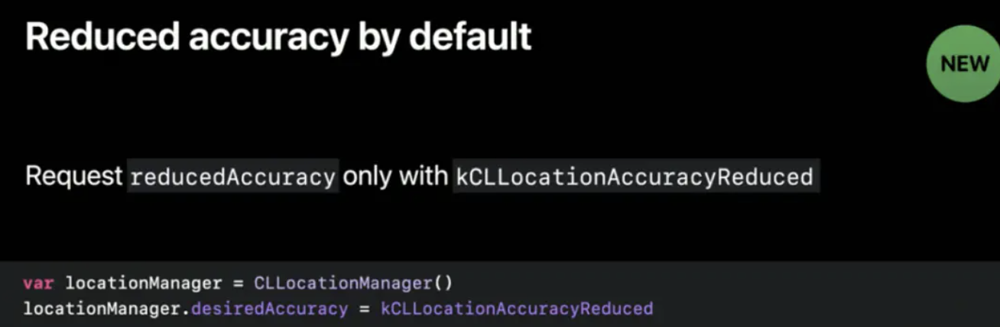
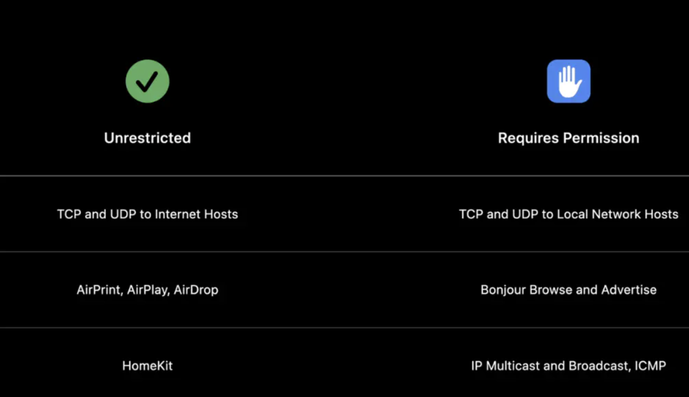
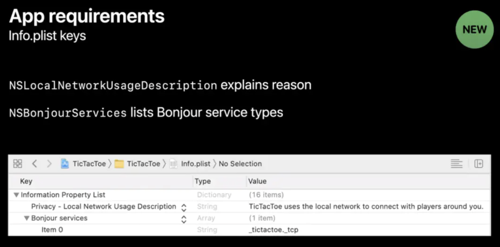
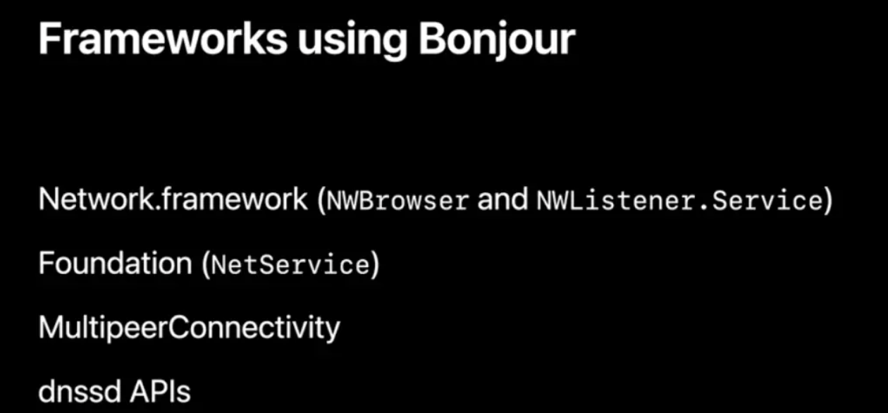
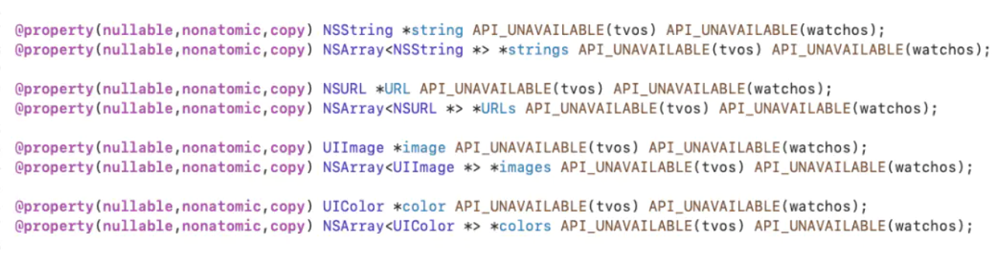

# 2019-09-27-iOS14-sdk14-xcode12适配

## :smile:老款的机型适配
其中iOS14 适配机型包括 iPod touch(7th)、iPhone 6s、iPhone 6s Plus、iPhone SE(2016)、iPhone 7、iPhone 7 Plus、iPhone 8、iPhone 8 Plus、iPhone X、iPhone XR、iPhone XS、iPhone XS Max、iPhone 11、iPhone 11 Pro、iPhone 11 Pro Max、iPhone SE(2020)。

## :smile:KVC 不允许访问 UIPageControl的pageImage、currentPageImage，新增了API：preferredIndicatorImage设置image
iOS14不允许以KVC形式访问 UIPageControl的pageImage、_currentPageImage
在iOS14下设置UIPageControl的pageimage，会导致奔溃，不能再用了。
```
if (@available(iOS 14.0,*)) {
   pageControl.preferredIndicatorImage = [self imageWithColor:[UIColor whiteColor]];
   pageControl.currentPageIndicatorTintColor = [UIColor redColor];
   pageControl.pageIndicatorTintColor = [UIColor blueColor];
}else{
   [pageControl setValue:[UIImage imageNamed:@"pageControllDot"]forKeyPath:@"pageImage"];
   [pageControl setValue:[UIImage imageNamed:@"pageControllCurrent"]forKeyPath:@"currentPageImage"];
}
```

## :smile:UIDatePickerStyle枚举新增UIDatePickerStyleInline
iOS 14 中，UIDatePicker UI样式更新了：
```
    UIDatePickerStyleInline API_AVAILABLE(ios(14.0)) API_UNAVAILABLE(tvos, watchos),
```
并且为默认样式。如果想使用原来的播轮样式，需要设置
```
    _pickerView.preferredDatePickerStyle = UIDatePickerStyleWheels;
```

> preferredDatePickerStyle 为 iOS 13.4 新增属性

## :smile:UITableViewCell 的 contentView 会置于自定义控件的上层
在 iOS14 中，UITableViewCell 中如果有直接添加在 cell 上的控件，也就是使用 [self addSubview:] 方式添加的控件，会显示在 contentView 的下层。

contentView 会阻挡事件交互，使所有事件都响应 tableView:didSelectRowAtIndexPath: 方法，如果 customView 存在交互事件将无法响应。如果 contentView 设置了背景色，还会影响界面显示。

解决方案就是将 customView 放在 contentView 上，使 contentView 作为 UITableViewCell 默认的 fatherView。

## :smile:广告标识IDFA权限
 IDFA 全称为 Identity for Advertisers ，即广告标识符。用来标记用户，目前最广泛的用途是用于投放广告、个性化推荐等。

 在 iOS13 及以前，系统会默认为用户开启允许追踪设置，我们可以简单的通过代码来获取到用户的 IDFA 标识符。

```
if ([[ASIdentifierManager sharedManager] isAdvertisingTrackingEnabled]) {
    NSString *idfaString = [[ASIdentifierManager sharedManager] advertisingIdentifier].UUIDString;
    NSLog(@"%@", idfaString);
}
```

 但是在 iOS14 中，这个判断用户是否允许被追踪的方法已经废弃。



 iOS14 中，系统会默认为用户关闭广告追踪权限。




 

iOS14以上系统，需要先请求跟踪权限，用户同意后才能获取到广告标识。在info.plist文件里添加跟踪权限请求描述文字。

IDFA默认关闭，需要向用户申请获取权限，需要在info.plist中明示用户申请权限：
```
key : NSUserTrackingUsageDescription
value: “获取设备信息用以精准推送您喜欢的内容”（用于显示给用户的话术）
```
申请代码：
```
// 调用request会弹窗提示用户是否授权，点拒绝则无法读取
[ATTrackingManager requestTrackingAuthorizationWithCompletionHandler:^(ATTrackingManagerAuthorizationStatus status) {
        if (status == ATTrackingManagerAuthorizationStatusAuthorized) {
            // 已授权
            NSString *idfa = [[ASIdentifierManager sharedManager].advertisingIdentifier UUIDString];
        } else {
            // 此时用户点击拒绝则无法读取
            NSString *idfa = [[ASIdentifierManager sharedManager].advertisingIdentifier UUIDString];
        }
    }];
```

**注意：** 

需要用户在手机中打开追踪开关，该开关默认关闭（正式版延期至2021年，目前依然可读取）。

如果用户不打开该开关则无法获取idfa，也无法申请权限。

另外需要引入系统库FrameWork: AppTrackingTransparency

**备注：**

首先分总开关和小开关，总开关为设置里面的隐私开关，关闭后无论APP怎么处理都无法获取idfa，只有在APP设置中开关开启的状态下才能进行其它操作。下面介绍一下总开关开启的情况下：

### IOS 14以前：
即便IDFA的状态为ATTrackingManagerAuthorizationStatusAuthorized，依然可以强制读取IDFA。

### IOS 14以后：
如果APP不进行request idfa操作，那么默认开关是开启的，此时我们获取idfa状态，是未授权（ATTrackingManagerAuthorizationStatusAuthorized），但是可以不进行if判断强制读取。
如果APP进行了request idfa操作，那么会弹窗提醒用户，此时用户如果点了拒绝，那么idfa无法读取，强制读取亦失效。但是在APP弹窗之前是可以读取idfa的，所以如果APP是在使用期间进行request，那么request之前其实是可以拿到idfa并存储下来。

综合来说，目前的情形是不建议做弹窗授权，弹窗了反而会有无法读取的可能。

## :smile:xcode12 sdk编译出来的架构没有x86_64
该问题未验证:网络上发现的.copy过来共勉。

在xcode更新完，项目里面构建的framework在模拟器运行失败，报没有x86_64架构，编译后通过 lipo -info指令发现只有arm64的架构，没有x86_64的架构。

解决方法：
在VALID_ARCHS中加入了x86_64之后我这里就可以正常运行了

## :smile: 支持画中画
### 1.开启后台模式
勾选`Audio, AirPlay and Picture in Picture`

### 2.导入框架#import <AVKit/AVKit.h> 创建AVPictureInPictureController
注：如果是使用系统播放器AVPlayerViewController，设置allowsPictureInPicturePlayback = YES即可

```
//1.判断是否支持画中画功能
if ([AVPictureInPictureController isPictureInPictureSupported]) {
    //2.开启权限
    @try {
        NSError *error = nil;
        [[AVAudioSession sharedInstance] setCategory:AVAudioSessionOrientationBack error:&error];
        [[AVAudioSession sharedInstance] setActive:YES error:&error];
    } @catch (NSException *exception) {
        NSLog(@"AVAudioSession发生错误");
    }
    self.pipVC = [[AVPictureInPictureController alloc] initWithPlayerLayer:self.player];
    self.pipVC.delegate = self;
}
```

### 3.开启或关闭画中画
```
if (self.pipVC.isPictureInPictureActive) {
    [self.pipVC stopPictureInPicture];
} else {
    [self.pipVC startPictureInPicture];
}
```

### 4.代理 AVPictureInPictureControllerDelegate

```

//即将开启画中画
- (void)pictureInPictureControllerWillStartPictureInPicture:(AVPictureInPictureController *)pictureInPictureController;
// 已经开启画中画
- (void)pictureInPictureControllerDidStartPictureInPicture:(AVPictureInPictureController *)pictureInPictureController;
// 开启画中画失败
- (void)pictureInPictureController:(AVPictureInPictureController *)pictureInPictureController failedToStartPictureInPictureWithError:(NSError *)error;
// 即将关闭画中画
- (void)pictureInPictureControllerWillStopPictureInPicture:(AVPictureInPictureController *)pictureInPictureController;
// 已经关闭画中画
- (void)pictureInPictureControllerDidStopPictureInPicture:(AVPictureInPictureController *)pictureInPictureController;
// 关闭画中画且恢复播放界面
- (void)pictureInPictureController:(AVPictureInPictureController *)pictureInPictureController restoreUserInterfaceForPictureInPictureStopWithCompletionHandler:(void (^)(BOOL restored))completionHandler;
```

值得注意的是，关闭画中画会执行
pictureInPictureController:restoreUserInterfaceForPictureInPictureStopWithCompletionHandler: 这个代理方法，用来恢复播放界面的

### 全局画中画注意点

1. 通过一个全局变量持有画中画控制器，可以在pictureInPictureControllerWillStartPictureInPicture持有，pictureInPictureControllerDidStopPictureInPicture释放；

2. 有可能不是点画中画按钮，而是从其它途径来打开当前画中画控制器，可以在viewWillAppear 进行判断并关闭；

3. 已有画中画的情况下开启新的画中画，需要等完全关闭完再开启新的，防止有未知的错误出现，因为关闭画中画是有过程的；

4. 如果创建AVPictureInPictureController并同时开启画中画功能，有可能会失效，出现这种情况延迟开启画中画功能即可。

## :smile:隐私：上传 AppStore
更加严格的隐私审核，可以让用户在下载 App 之前就知道此 App 将会需要哪些权限。目前苹果商店要求所有应用在上架时都必须提供一份隐私政策。如果引入了第三方收集用户信息等SDK，都需要向苹果说明是这些信息的用途。

## :smile:隐私：相册
iOS14 新增了“Limited Photo Library Access” 模式，在授权弹窗中增加了 Select Photo 选项。用户可以在 App 请求调用相册时选择部分照片让 App 读取。从 App 的视⻆来看，你的相册里就只有这几张照片，App 无法得知其它照片的存在。

### iOS14 中当用户选择
“PHAuthorizationStatusLimited” 时，如果未进行适配，有可能会在每次触发相册功能时都进行弹窗询问用户是否需要修改照片权限。

### 对于这种情况可通过在 Info.plist 中设置
“PHPhotoLibraryPreventAutomaticLimitedAccessAlert”的值为 YES 来阻止该弹窗反复弹出，并且可通过下面这个 API 来主动控制何时弹出PHPickerViewController 进行照片选择

```
[[PHPhotoLibrary sharedPhotoLibrary] presentLimitedLibraryPickerFromViewController:self];
```

### 在 iOS14 中官方推荐使用 PHPicker 来替代原 API 进行图片选择。PHPicker 为独立进程，会在视图最顶层进行展示，应用内无法对其进行截图也无法直接访问到其内的数据。

- UIImagePickerController -> PHPickerViewController， UIImagePickerViewController 功能受限，每次只能选择一张图片，将逐渐被废弃。

```
typedef NS_ENUM(NSInteger, UIImagePickerControllerSourceType) {
    UIImagePickerControllerSourceTypePhotoLibrary API_DEPRECATED("Will be removed in a future release, use PHPicker.", ios(2, API_TO_BE_DEPRECATED)),
    UIImagePickerControllerSourceTypeCamera,
    UIImagePickerControllerSourceTypeSavedPhotosAlbum API_DEPRECATED("Will be removed in a future release, use PHPicker.", ios(2, API_TO_BE_DEPRECATED)),
} API_UNAVAILABLE(tvos);
```

- PHPicker 支持多选，支持搜索，支持按 image，video，livePhotos 等进行选择。

### 新API及迁移demo:



```
@interface ViewController () <PHPickerViewControllerDelegate>
  
@property (weak, nonatomic) IBOutlet UIImageView *imageView;
@property (nonatomic, strong) NSArray<NSItemProvider *> *itemProviders;
  
@end
  
@implementation ViewController
  
  - (void)viewDidLoad {
      [super viewDidLoad];
      // Do any additional setup after loading the view.
}
  
  - (IBAction)button:(id)sender {
      // 以下 API 仅为 iOS14 only
      PHPickerConfiguration *configuration = [[PHPickerConfiguration alloc] init];
      configuration.filter = [PHPickerFilter videosFilter]; // 可配置查询用户相册中文件的类型，支持三种
    configuration.selectionLimit = 0; // 默认为1，为0时表示可多选。
  
      PHPickerViewController *picker = [[PHPickerViewController alloc] initWithConfiguration:configuration];
      picker.delegate = self;
      // picker vc，在选完图片后需要在回调中手动 dismiss
    [self presentViewController:picker animated:YES completion:^{
  
      }];
  }
  
#pragma mark - Delegate
  
  - (void)picker:(PHPickerViewController *)picker didFinishPicking:(NSArray<PHPickerResult *> *)results {
      [picker dismissViewControllerAnimated:YES completion:nil];
      if (!results || !results.count) {
          return;
      }
      NSItemProvider *itemProvider = results.firstObject.itemProvider;
      if ([itemProvider canLoadObjectOfClass:UIImage.class]) {
          __weak typeof(self) weakSelf = self;
          [itemProvider loadObjectOfClass:UIImage.class completionHandler:^(__kindof id<NSItemProviderReading>  _Nullable object, NSError * _Nullable error) {
              if ([object isKindOfClass:UIImage.class]) {
                  __strong typeof(self) strongSelf = weakSelf;
                  dispatch_async(dispatch_get_main_queue(), ^{
                      strongSelf.imageView.image = (UIImage *)object;
                  });
              }
          }]; 
      }
    }
```

### 需要注意的是，在 limit Photo 模式下，AssetsLibrary 访问相册会失败；在 writeOnly 模式下，AssetLibrary 也会有显示问题。建议还在使用 AssetsLibrary 的同学尽快迁移到新 API。

### 授权相关：旧 API 废弃，增加 PHAccessLevel 参数。如果再使用以前的API来获取权限状态，PHAuthorizationStatusLimited 状态下也会返回

```
typedef NS_ENUM(NSInteger, PHAccessLevel) {
  PHAccessLevelAddOnly = 1, // 仅允许添加照片
  PHAccessLevelReadWrite = 2, // 允许访问照片，limitedLevel 必须为 readWrite
} API_AVAILABLE(macos(10.16), ios(14), tvos(14));

// 查询权限
PHAccessLevel level = PHAccessLevelReadWrite;
PHAuthorizationStatus status = [PHPhotoLibrary authorizationStatusForAccessLevel:level];
  switch (status) {
      case PHAuthorizationStatusLimited:
          NSLog(@"limited");
          break;
      case PHAuthorizationStatusDenied:
          NSLog(@"denied");
          break;
      case PHAuthorizationStatusAuthorized:
          NSLog(@"authorized");
          break;
      default:
          break;
}

// 请求权限，需注意 limited 权限尽在 accessLevel 为 readAndWrite 时生效
[PHPhotoLibrary requestAuthorizationForAccessLevel:level handler:^(PHAuthorizationStatus status) {
  switch (status) {
      case PHAuthorizationStatusLimited:
          NSLog(@"limited");
          break;
      case PHAuthorizationStatusDenied:
          NSLog(@"denied");
          break;
      case PHAuthorizationStatusAuthorized:
          NSLog(@"authorized");
          break;
      default:
          break; 
  }
}];
```

## :smile: 新api：PHPicker

### 现状
绝大多数的 App 都要和相册打交道，选择照片或者视频，要么用来发个朋友圈，要么是放到什么地方做个背景。从 AssertLibrary 到 Photos 框架，苹果已经在多年之前就给相册相关的 API 做过一次大升级了。

通过 Photos 框架，只需要通过下面几步就可以从相册获取到内容了

- 1、获取相册权限
- 2、建立 UI 展示相册内容
- 3、响应用户操作，获取照片或视频的 PHAsset 对象
- 4、通过 PHImageManager 导出照片或者视频

作为一个合格的开发者，对上面这些步骤基本上都能驾轻就熟了。不过虽然看似简单的几步，其实依然存在着巨大的工作量，特别是建立 UI 并展示相册内容这一条，如果要做到细节完善、体验顺畅，基本上属于一个小型 App 的工作量了。所以很多时候我们会选择使用一些第三方的框架，目前可供选择的优秀作品也很多。看起来感觉岁月静好，可以结束工作去泡咖啡了 :)

### 变化
然而，事情总是在变化的，一向在折腾之路上狂奔的苹果这次依然没有让我们失望，在相册相关的 API 上带来了两个重大变动：

#### 1、相册权限变动
Photos 框架提供了查询相册授权情况的 api，我们可以通过 PHPhotoLibrary 的 authorizationStatus 方法来查询当前的相册授权情况。查询结果 PHAuthorizationStatus 是个枚举，定义如下：
```
public enum PHAuthorizationStatus : Int {

    @available(iOS 8, *)
    case notDetermined = 0

    @available(iOS 8, *)
    case restricted = 1

    @available(iOS 8, *)
    case denied = 2

    @available(iOS 8, *)
    case authorized = 3
}

```
从 iOS 8 引入 Photos 框架一开始，相册权限就存在这几种状态：

- notDetermined

状态不明确，用户还没有明确授权或拒绝访问，这时候我们一般通过调用 requestAuthorization 方法来显示权限询问弹窗，让用户授权访问。

- restricted

没有访问权限，这个状态表示设备因为特殊原因被禁止访问相册，可能是基于家长控制设置的权限，也可能是当前设备隶属于某个组织，而组织在权限描述文件中禁止了这台设备的相册权限。

这个状态下，用户也无法主动开启相册权限，所以此时唯一能做的就是告诉用户无法获取相册内容。

- denied

禁止访问，这个状态表示用户在上一次询问相册权限时明确选择了禁止。这时候我们可以选择提示用户无法访问，或者提示用户主动去设置中开启权限。

- authorized

允许访问，这个状态表示用户明确同意了相册的授权，此时我们就可以通过 PHAssetCollection 和 PHAsset 相关的 api 来获取相册和其中的照片了。

原本这一切可以很完美的运转，但是如果在 Xcode 12 中查看PHAuthorizationStatus 的定义，会看到从 iOS 14 开始，苹果引入了一个新的权限状态：limited
 
**有限访问权限** 
苹果在每一年的 WWDC 都特别强调用户隐私，到了今年，苹果终于对相册动手了。现有的方案虽然看起来很完美，但是存在一个重大的隐患：用户往往只需要从相册选一张照片上传，可此时 App 却获取了整个相册所有照片的数据！！

这时候如果开发者没有守住节操底线，那么用户的所有生活照片甚至是私密照片都存在严重的泄漏风险。

新引入的有限访问权限正是为了解决这个问题。在 iOS 14 下，当我们通过 requestAuthorization 向用户获取权限时，弹窗中多了一个选项：“选择部分照片”，此时系统会在 App 进程之外弹出相册让用户选择授权给当前 App 访问的照片。用户完成选择后，App 通过相册相关的 api 就只能获取到指定的这几张照片，这有效的保护了用户的隐私。

不过，这个设计虽然保护了用户的隐私，但是从 App 的角度来看却引入了新的问题：如果我们还是用原先的那一套流程来获取照片，那么在用户选择了部分权限的情况下，每次弹出相册后用户都无法选择其他的照片，解决办法是再次弹出权限询问，让用户选择或者更换指定的照片，然后再回到我们的相册 UI，继续之后的流程。。。

这一套流程明显变得更加复杂并且奇怪了。。。而且作为一个开发者，始终不能忘了用户是不了解技术细节的，在用户的角度来看，他可能会觉得很奇怪：“为什么我每次都只能选这两张照片？这 App 有什么毛病？” 而如果你选择每次都但窗询问权限，那么当用户耐心耗尽的那一天，就是你的 App 被卸载之时。。。

> 基于从 Beta 版就开始使用 iOS 14 的体验，升级之后所有 App 的第一次访问相册时都会弹窗询问权限，目测 iOS 14 应该是重置了所有 App 的相册授权状态。

#### 2、新的相册组件
好在苹果还是给开发者留了一扇窗的，那就是这篇文章要讲的主题，新成员：PHPicker。

其实上面在用户选择部分照片时，我们就已经接触到这玩意儿了：系统在 App 内部额外弹出的相册，本质上就是一个 PHPicker。

苹果在宣传中说它是基于系统的相册 App 的，具有与系统相册一致的 UI 和操作方式，可以保证用户体验的一致性。并且和相册 App 一样，支持通过人物、地点等关键信息来搜索照片。并且 PHPicker 是在独立进程中运行的，与宿主 App 无关，宿主 App 也无法通过截屏 api 来获取当前屏幕上的照片信息。为了保护用户隐私，苹果真的是在各种细节上严防死守。

既然在用户授权时可以在 App 中弹出这个选择器，那么我们的 App 是否可以主动发起这个弹窗呢？答案是：PHPickerViewController

#### 3、PHPickerViewController
PHPickerViewController 是整个 PHPicker 组件的核心，PHPicker 隶属于 PhothsUI 库，使用之前需要先导入：
```
import PhotosUI
```
先来查看这个类的定义：

```
@available(iOS 14, *)
public class PHPickerViewController : UIViewController {
}

@available(iOS 14, *)
extension PHPickerViewController {

    /// The configuration passed in during initialization.
    public var configuration: PHPickerConfiguration { get }

    /// The delegate to be notified.
    weak public var delegate: PHPickerViewControllerDelegate?

    /// Initializes new picker with the `configuration` the picker should use.
    public convenience init(configuration: PHPickerConfiguration)
}
```

太简单了！这个类的定义中居然没有任何声明，只是表示了一下自己继承自 UIViewControlelr，以及在扩展中暴露了两个属性和一个构造器。。。

**PHPickerConfiguration**

查看 PHPickerConfiguration 的定义，发现这里东西稍微多了一点：
1、 preferredAssetRepresentationMode: PHPickerConfiguration.AssetRepresentationMode

presentationMode 用来指定导出结果的表示形式，默认值是 automatic, 此时系统会自动执行一些转码之类的操作，并且在注释中明确说了这个模式的实际表现会在之后的发布中修改。。。

果然这种表述就是坑的表现：目前官方论坛上有用户反馈，使用了缺省的 automatic 模式后，从相册导出视频的过程变得巨慢。

对此官方的回复是 automatic 模式可能会在导出时对视频进行转码处理，如果 App 本地能够处理 HEVC 格式的视频，可以指定为 current 模式来跳过转码的过程。

> 这一条是我在集成过程中遇到的最大的坑之一了，实际测试中，两分钟的原始视频（大约200到300M），使用 automatic 自动转码模式，导出过程耗时达到了难以置信的 5分钟！而改为 current 模式跳过转码之后，导出过程几乎无感（5s以内）。 由于我们的 App 本身会将导出的视频压缩转码后再上传，因此果断选择了 current 模式

关于 compatible 模式，注释中用了充满玄学的说法: 尽量选择最合适的形式。由于 PHPicker 相关的资料目前还太少，这个模式的运作方式暂时还摸不清楚，欢迎掉过坑的同学来补充 :)

2、selectionLimit

这个设置很好理解，限制用户最多可以选择的数量

3、filter: PHPickerFilter

filter 提供了有限的筛选模式设置，目前可以指定筛选照片、视频、LivePhoto 几种类型，或者任何他们的组合。 这一点上目前还是比较欠缺的，比如说发送朋友圈时需要限制用户只能上传一分钟以内的视频，原来我们具有完全相册访问权限的时候，可以在展示的时候直接过滤掉超过一分钟的视频，或者将他们标志为不可选。 目前 PHPicker 并没有提供更详细的筛选配置，所以应对这种需求折中的方法是将视频导出之后获取视频的时长，如果超过限制则提示用户。

**弹出选择器**
弹出窗口其实没什么好说的，PHPickerViewController 本身还是一个 ViewController，设置好相应的属性和 delegate 后，简单的调用 present 就可以了。

```
delegate: PHPickerViewControllerDelegate
```

PHPickerViewController 依然是通过 delegate 属性来向宿主 App 返回用户选择的结果。

看定义同样很简单，PHPickerViewControllerDelegate 只定义了一个方法：
```
public protocol PHPickerViewControllerDelegate : AnyObject {

    /// Called when the user completes a selection or dismisses `PHPickerViewController` using the cancel button.
    ///
    /// The picker won't be automatically dismissed when this method is called.
    func picker(_ picker: PHPickerViewController, didFinishPicking results: [PHPickerResult])
}
```

用户完成选择后，该方法会触发，用户选择的结果会以 PHPickerResult 数组的形式传入，每一个 PHPickerResult 都对应一个照片、视频或者 LivePhoto 的数据。

> 需要注意的是，注释中明确说明了 PHPickerViewController 不会自动关闭，用户需要在选择完毕后，自行调用 dismiss 方法来关闭选择器。

PHPickerResult 的定义一如既往的的“简洁”，只有 itemProvider 和 assetIdentifier 两个属性，剩下的是继承的 Equatable 和 Hashable 协议的实现。

- assetIdentifier

这是选中对象对应的 PHAsset 的 id，可以用这个 id 通过 PHAset 的相关 api 来进行其他操作。不过苹果在 WWDC 的介绍视频中明确强调了如果要访问 PHAsset 的额外信息，依然需要获取到相册权限后才可以执行。

- itemProvider

NSItemProvider 是一个 iOS 8.0 就存在了的 api，上一次使用还是在 iOS 11 引入 Drag & Drop 的时候了。不过用法依然是一致的：故名思议，这个对象就是用来向我们提供另一个对象的（好像有点绕？） 通过 itemProvider 的 api，我们可以获取到最终的结果，不过这里有点小麻烦：针对照片、视频和 LivePhoto 三种媒体类型，分别要使用不同的 api 来获取

**获取照片**

获取照片比较简单，通过 NSItemProvider 的 loadObject 方法，并且指定 Class 类型为 UIImage，就可以在回调中得到 UIImage 类型的照片了：

```
provider.loadObject(ofClass: UIImage.self) { (image, error) in
  // do someting with results
}
```

**获取 LivePhoto**

获取 LivePhoto 与获取照片类似，只是需要将 UIImage 替换为 PHLivePhoto。之后你可以通过 PHLivePhotoView 来显示。或者通过 PHAssetResourceManager 获取 LivePhoto 的原始数据。

**获取视频**

苹果在 WWDC 视频中只演示了如果使用 PHPickerViewController 获取相册照片，但对于如何获取视频只字未提，这就比较尴尬了。目前跟进 PHPicker 的开发者还不多，基本上都搜不到相关资料，一番折腾之后，终于在官方论坛零星找到了几条关于获取视频的讨论。

查看了相关对话之后，总算摸清了获取视频的套路，要稍微复杂一点：框架开发者明确指出需要使用 loadFileRepresentation 方法来加载大文件，例如视频：

```
provider.loadFileRepresentation(forTypeIdentifier: "public.movie") { url, error in
  // do something with results
}
```

loadFileRepresentation 的使用方式与 UIImage 类似，但需要额外传入一个参数 forTypeIdentifier 来指定文件类型，指定为 public.movie 可以覆盖相册中的 .mov 和 .mp4 类型。

与照片不同的是，这个 api 返回的是一个 URL 类型的临时文件路径，苹果在这个 API 的说明中指出：系统会把请求的文件数据复制到这个路径对应的地址，并且在回调执行完毕后删除临时文件。

> 如果你需要在异步线程中对这个文件进行处理，那么需要再复制一次，将文件放到不会被系统自动删除的路径下，并且在处理完毕后自行删除。

**关于 iCloud**
iOS 相册提供了 iCloud 同步功能，如果用户开启了相册同步，那么相册中的照片、视频或者 LivePhoto 有可能会被上传到 iCloud，而本地只保存有缩略图，当请求某张照片时，相册会先从 iCloud 下载，然后再返回数据。

原先具有完整访问权限时，App 可以获得资源是否存在 iCloud 的状态，并且在下载时获得进度信息。由于 PHPicker 向 App 隐藏了所有隐私信息，因此我们无法再得知资源的 iCloud 同步状态，PHPicker 会自动从 iCloud 下载资源，并且完成之后通过 delegate 回调将数据返回。

不过这里有另外一个坑，不知道是因为工期问题还是苹果员工偷懒，目前宿主 App 是无法从 PHPicker 中获取到 iCloud 的下载进度信息的。

> 这是 PHPicker 的另一个大坑，这种情况下，如果用户选择了比较大的视频，或者是网络状态不好的话，视频导出依然需要耗费非常长的时间，并且没有进度信息！只能期待 iOS 的后续版本能够将将这一环补充完整了。

### 总结
PHPicker 的集成本身很简单，但是存在一些坑需要注意。简单总结一下优缺点：

**优点**
- 保护用户隐私（初期可以作为 App 的宣传点？）

- 不需要频繁询问相册权限，对于用户体验提升较大

- 行为逻辑与系统相册保持一致，降低了用户的学习成本

- 集成简单，在最低支持版本 iOS 14 之后，可以抛弃权限验证相关代码和第三方照片库（似乎很遥远）

**缺点**
- 太过简单，缺少细节的筛选配置比如视频时长等

- iCloud 大文件下载缺少进度信息（这个缺陷似乎把优点中的用户体验提升干掉了。。。）

## :smile:隐私：定位
 在 iOS13 及以前，App 请求用户定位授权时为如下形态：一旦用户同意应用获取定位信息，当前应用就可以获取到用户的精确定位。

 iOS14 新增用户大致位置选项可供用户选择，原因是大多数 App 实际上并不需要获取用户到用户最准确的定位信息。iOS14 授权弹窗新增的 Precise的开关默认会选中精确位置。用户通过这个开关可以进行更改，当把这个值设为 On 时，地图上会显示精确位置；切换为Off时，将显示用户的大致位置。

 对于对用户位置敏感度不高的 App 来说，这个似乎无影响，但是对于强依赖精确位置的 App 适配工作就显得非常重要了。可以通过用户在 “隐私设置” 中设置来开启精确定位，但是可能用户宁可放弃使用这个应用也不愿意开启。这个时候，iOS14 在 CLLocationManager 新增两个方法可用于向用户申请临时开启一次精确位置权限。

```
- (void)requestTemporaryFullAccuracyAuthorizationWithPurposeKey:(NSString *)purposeKey completion:(void(^ _Nullable)(NSError * _Nullable))completion API_AVAILABLE(ios(14.0), macos(11.0), watchos(7.0), tvos(14.0));


- (void)requestTemporaryFullAccuracyAuthorizationWithPurposeKey:(NSString *)purposeKey API_AVAILABLE(ios(14.0), macos(11.0), watchos(7.0), tvos(14.0));
```

使用方式也很简单，需要首先在 Info.plist 中配置“NSLocationTemporaryUsageDescriptionDictionary”字典中需要配置 key 和 value 表明使用位置的原因，以及具体的描述。
```
<key>NSLocationTemporaryUsageDescriptionDictionary</key>
		<dict>
			<key>Purpose1</key>
			<string>Purpose1TranslatedPhrase</string>
			<key>Purpose2</key>
			<string>Purpose2TranslatedPhrase</string>
		</dict>
```
在本例中，key 即为获取用户权限时传的 "purposeKey"，最终呈现给用户的就是左图，右图为当App主动关闭精确定位权限申请。



```
[self.mgr requestTemporaryFullAccuracyAuthorizationWithPurposeKey:@"purposeKey"];
```

 对于地理位置不敏感的App 来说，iOS14 也可以通过直接在 info.plist 中添加 NSLocationDefaultAccuracyReduced 为 true 默认请求大概位置。

 这样设置之后，即使用户想要为该 App 开启精确定位权限，也无法开启。

 也可以直接通过API来根据不同的需求设置不同的定位精确度。



```
self.locationManager = [[CLLocationManager alloc] init];
self.locationManager.desiredAccuracy = kCLLocationAccuracyReduced;
```

 需要注意的是，当 App 在 Background 模式下，如果并未获得精确位置授权，那么 Beacon 及其他位置敏感功能都将受到限制。

## :smile:隐私：Local Network
 iOS8 - iOS13 ，用户在不同的网络间切换和接入时，mac 地址都不会改变，这也就使得网络运营商还是可以通过 mac 地址对用户进行匹配和用户信息收集，生成完整的用户信息。iOS14 提供 Wifi 加密服务，每次接入不同的 WiFi 使用的 mac 地址都不同。每过 24 小时，mac 地址还会更新一次。需要关注是否有使用用户网络 mac 地址的服务。



 在 "隐私设置" 中也可以查看和修改具体有哪些 App 正在使用 LocalNetwork

 如果应用中需要使用 LocalNetwork 需要在 Info.plist 中配置两个选项，详细描述为什么需要使用该权限，以及需要列出具体使用 LocalNetwork 的服务列表。



 对于使用了下列包含 Bonjour 的 framework，都需要更新描述.



## :smile:隐私： Wi-Fi Address
 iOS8 - iOS13 ，用户在不同的网络间切换和接入时，mac 地址都不会改变，这也就使得网络运营商还是可以通过 mac 地址对用户进行匹配和用户信息收集，生成完整的用户信息。iOS14 提供 Wifi 加密服务，每次接入不同的 WiFi 使用的 mac 地址都不同。每过 24 小时，mac 地址还会更新一次。需要关注是否有使用用户网络 mac 地址的服务。

 并且用户也可以自行选择是否开启 private Wi-Fi address

- [为了降低这一隐私风险，iOS 14、iPadOS 14 和 watchOS 7 会在每个 Wi-Fi 网络上使用不同的 MAC 地址。这个唯一的静态 MAC 地址是您设备的私有 Wi-Fi 地址，仅用于相应网络。](https://support.apple.com/zh-cn/HT211227)

## :smile:隐私：剪切板
 在 iOS14 中，读取用户剪切板的数据会弹出提示。

 弹出提示的原因是使用 UIPasteboard 访问用户数据，访问以下数据都会弹出 toast 提示。



 兼容方案：如果应用访问剪切板仅仅用于判断是否为URL格式，则 iOS14 新增了两个 API 可以用于规避该提示。如果应用想直接访问剪切板的数据，暂时可能无法做到规避该提示。iOS14 新增两种

UIPasteboardDetectionPattern。

```
typedef NSString * UIPasteboardDetectionPattern NS_TYPED_ENUM API_AVAILABLE(ios(14.0));

/// NSString value, suitable for implementing "Paste and Go"
UIKIT_EXTERN UIPasteboardDetectionPattern const UIPasteboardDetectionPatternProbableWebURL API_AVAILABLE(ios(14.0));

/// NSString value, suitable for implementing "Paste and Search"
UIKIT_EXTERN UIPasteboardDetectionPattern const UIPasteboardDetectionPatternProbableWebSearch API_AVAILABLE(ios(14.0));
```

 上面的两个 API 可用于规避提示，但只能用于判断剪切板中是否有 URL，并不是真正的访问剪贴板数据，也拿不到剪切板的真实数据。下面两个 API 可以获得具体的 URL 信息，但是会触发剪切板提示。并且实测当用户剪切板中包含多个 URL 时只会返回第一个。

```
- (void)detectPatternsForPatterns:(NSSet<UIPasteboardDetectionPattern> *)patterns
                completionHandler:(void(^)(NSSet<UIPasteboardDetectionPattern> * _Nullable,
                                           NSError * _Nullable))completionHandler NS_REFINED_FOR_SWIFT API_AVAILABLE(ios(14.0));
            

- (void)detectPatternsForPatterns:(NSSet<UIPasteboardDetectionPattern> *)patterns
                        inItemSet:(NSIndexSet * _Nullable)itemSet
                completionHandler:(void(^)(NSArray<NSSet<UIPasteboardDetectionPattern> *> * _Nullable,
                                           NSError * _Nullable))completionHandler NS_REFINED_FOR_SWIFT API_AVAILABLE(ios(14.0));
```

 使用示例

```
NSSet *patterns = [[NSSet alloc] initWithObjects:UIPasteboardDetectionPatternProbableWebURL, nil];
[[UIPasteboard generalPasteboard] detectPatternsForPatterns:patterns completionHandler:^(NSSet<UIPasteboardDetectionPattern> * _Nullable result, NSError * _Nullable error) {
    if (result && result.count) {
            // 当前剪切板中存在 URL
    }
}];
```
## :smile:隐私：相机和麦克风
 iOS14 中 App 使用相机和麦克风时会有图标提示以及绿点和黄点提示，并且会显示当前是哪个 App 在使用此功能。我们无法控制是否显示该提示。

 会触发录音小黄点的代码示例：
```
AVAudioRecorder *recorder = [[AVAudioRecorder alloc] initWithURL:recorderPath settings:nil error:nil];
[recorder record];
```

 触发相机小绿点的代码示例:
```
AVCaptureDeviceInput *videoInput = [[AVCaptureDeviceInput alloc] initWithDevice:videoCaptureDevice error:nil];
AVCaptureSession *session = [[AVCaptureSession alloc] init];
if ([session canAddInput:videoInput]) {
    [session addInput:videoInput];
}
[session startRunning];
```

## :smile:
## :smile:
## :smile:
## :smile:
## :smile:
## :smile:
## :smile:
## :smile:
## :smile:
## :smile:
## :smile:
## :smile:
## :smile:
## :smile:
## :smile:
## :smile:
## :smile:
## :smile:
## :smile:
## :smile:
## :smile:
## :smile:
## :smile:
## :smile:
## :smile:
## :smile:
## :smile:

## 引用：
- [iOS 14 - 使用 PHPicker 选择照片和视频](https://me.harley-xk.studio/posts/202009241518)
- [iOS14 隐私适配及部分解决方案](https://www.jianshu.com/p/1803bd950b90)
- [iOS14画中画功能实现](https://www.jianshu.com/p/c664c376f137)
- [iOS14适配](https://www.jianshu.com/p/bf1c4ad44f5e?utm_campaign=shakespeare)