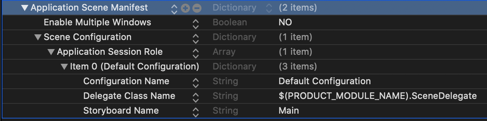
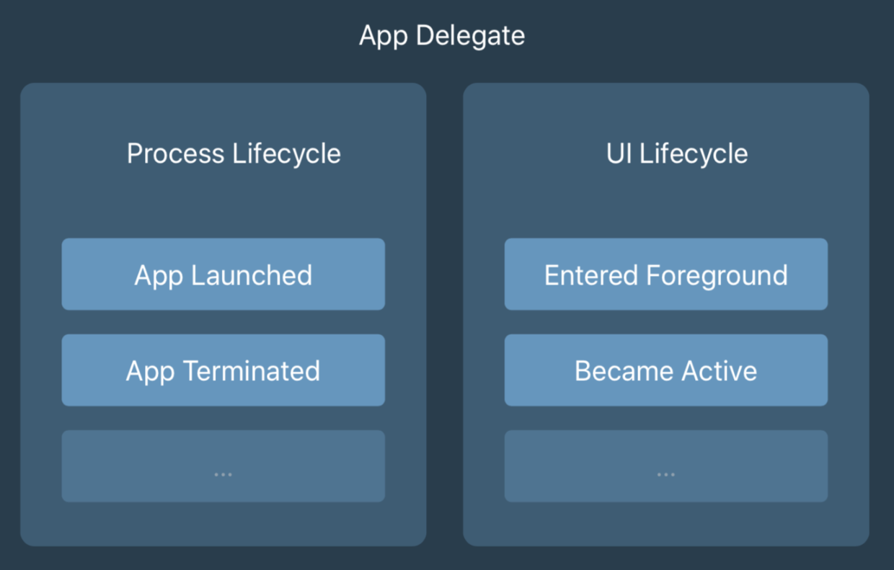
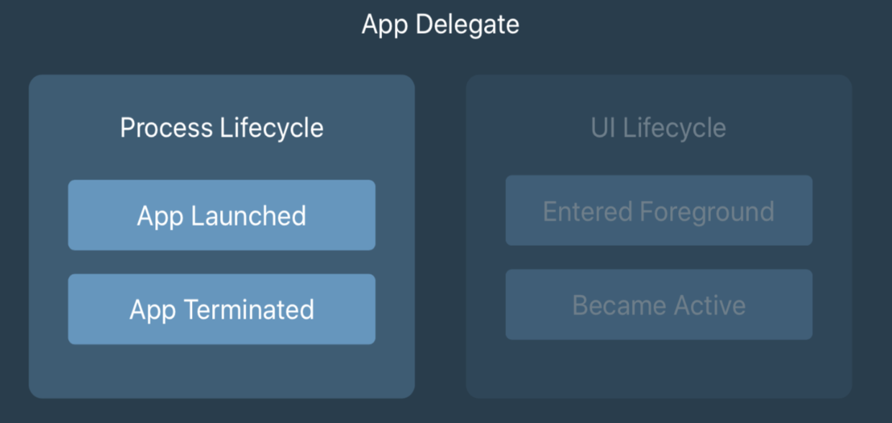
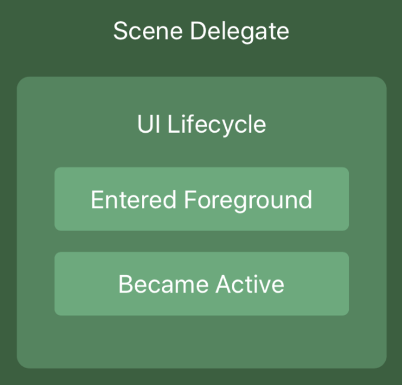

# AppDelegate和SceneDelegate

## app生命周期概述
- Not running（未运行）：程序未运行
- Inactive（未激活）：程序在前台运行，但没有接收到事件。在没有事件处理情况下程序通常停留在这个状态。
- Active ( 激活 ): 程序在前台运行而且接收到了事件。这也是前台的一个正常的模式。
- Backgroud ( 后台 ): 程序在后台而且能执行代码，大多数程序进入这个状态后会在在这个状态上停留一会。时间到之后会进入挂起状态(Suspended)。有的程序经过特殊的请求后可以长期处于Backgroud状态。
- Suspended ( 挂起 ): 程序在后台但是却不能执行代码。系统会自动把程序变成这个状态而且不会发出通知。当挂起时，程序还是停留在 内存中的，当系统内存低时，系统就把挂起的程序清除掉，为前台程序提供更多的内存。


## Xcode11、iOS13
在新的Xcode11当中创建新的项目，会看到自动生成AppDelegate.swift与SceneDelegate.swift文件。
除了这两个委托文件之外，Xcode还做了其他一些事情。打开Info.plist，会看到一个叫做Application Scene Manifest的新key。

Enable Multiple Windows默认键值为NO，如果设置为YES则允许你的app在ipadOS中多开。
Application Session Role数组中：
- Configuration的名称，必须是唯一的
- scene的代理类名，通常为SceneDelegate。
- scene用于创建初始UI的storyboard名称。(不使用可以不设置)

### AppDelegate中的SceneDelegate、UISceneSession和Application Scene Manifest是如何一起创建多窗口应用的呢？
- 首先，我们看SceneDelegate类。 它管理scene的生命周期，处理各种响应，诸如 sceneDidBecomeActive(:) and sceneDidEnterBackground(:)之类的事件。
- 然后，我们再看看AppDelegate类中的新函数。 它管理场景会话（scene sessions），提供scene的配置数据，并响应用户丢弃scene的事件。
- 最后，我们看了一下Application Scene Manifest。 它列出了应用程序支持的scene，并可以将它们连接到delegate类并初始化storyboard。

## AppDelegate的新职责
AppDelegate仍然是iOS 13中应用程序的主要入口点。Apple为几个应用程序级生命周期事件调用AppDelegate方法。在Apple的默认模板中，你会发现三个Apple认为对你来说很重要的方法:

```
func application(_:didFinishLaunchingWithOptions:) -> Bool
func application(_:configurationForConnecting:options:) -> UISceneConfiguration
func application(_:didDiscardSceneSessions:)
```
当你的应用程序刚刚启动，func application(_ :didFinishLaunchingWithOptions:) -> Bool 被调用。此方法用于执行应用程序设置。在ios12或更早的版本中，你可能已经使用这个方法来创建和配置一个UIWindow对象，并将一个UIViewController实例分配给window以使它出现。

如果你的应用程序正在使用scene，你的AppDelegate将不再负责这一操作。由于应用程序现在可以有多个窗口，或者uiscenes处于active状态，因此在AppDelegate中管理单个window对象没有多大意义。

当你的app被期望提供一个新的scene或window供iOS显示时，就会调用func application(_ :configurationForConnecting:options:) -> UISceneConfiguration。`注意，当你的应用程序启动时，这个方法不会被调用，它只会被调用来获取和创建新的场景。 `

AppDelegate模板中的最后一个方法是func application(_ :didDiscardSceneSessions:)。每当用户丢弃一个scene时，就会调用此方法，例如在多任务窗口中将该场景滑走。

>> Tip: 需要注意的是，如果你目前使用AppDelegate来管理应用的状态栏外观，你可>> 能需要在ios13中做一些改变。在ios13中，一些状态栏相关的方法已经被弃用。

## SceneDelegate的职责
当AppDelegate是负责应用程序生命周期的对象时，SceneDelegate负责屏幕上显示的内容（scenes or windows）。

当你处理scene时，对你的用户来说看起来像window的东西实际上被称为UIScene，它是由UISceneSession管理的。当我们提到windows时，我们实际上指的是UISceneSession对象

在创建项目时创建的SceneDelegate.swift文件中有几个默认的方法:
```
scene(_:willConnectTo:options:)
sceneDidDisconnect(_:)
sceneDidBecomeActive(_:)
sceneWillResignActive(_:)
sceneWillEnterForeground(_:)
sceneDidEnterBackground(_:)
```

如果你熟悉iOS 13之前的AppDelegate，这些方法看起来应该很熟悉。

scene(:willConnectTo:options:)，它是UISceneSession生命周期中调用的第一个方法。
scene(:willConnectTo:options:)的默认实现会创建你的初始内容视图(content view) (如果你使用的是SwiftUI，就会创建ContentView)，并创建一个新的UIWindow，然后设置window的rootViewController，并让这个window成为关键窗口。您可以将此窗口视为用户看到的窗口。不幸的是，事实并非如此。Windows在ios13之前就已经出现了，它们代表应用程序运行的视口（viewport）。UISceneSession控制用户看到的可见窗口，你创建的UIWindow是你的应用的容器视图(container view)。

除了设置初始视图外，还可以使用scene(_:willConnectTo:options:)来恢复场景UI，以防scene在过去断开连接。例如，因为它被发送到后台。你也可以读取connectionOptions对象来查看你的scene是由于一个切换请求或者打开一个URL而创建的。

一旦你的scene连接好了，scene生命周期中的下一个方法就是 sceneWillEnterForeground 。此方法在你的scene将要走上舞台时调用。这可能是当你的应用从后台过渡到前台，或者它只是第一次被激活。接下来，调用sceneDidBecomeActive。这是你的scene设置，可视化，并准备被使用的地方。

一个更有趣的方法是sceneDidDisconnect。当你的场景被发送到后台时，iOS可能会决定断开并清除你的场景以释放资源。这并不意味着你的应用程序被杀死或不再运行，它只是意味着传递给这个方法的场景不再活跃，并将从其会话断开。

>> Tip:会话本身并不一定要丢弃，iOS可能会决定在任何时候将场景重新连接到场景会话，例如当用户再次将特定场景带到前台时。

sceneDidDisconnect(_:)中要做的最重要的事情是放弃你不需要保留的任何资源。这些数据可以很容易地从磁盘或网络加载，也可以很容易地重新创建。但是要确保你保留了那些无法轻松重新创建的数据，比如用户在场景中提供的任何输入，这些输入在他们返回场景时仍然存在，具体的实现方法后续再深入研究。

Apple 建议我们把视图层级相关的方法从 didFinishLanchingWithOptions 迁移到 SceneDelegate 中的 willConnectTo 方法中。这样做有两个好处:
- 首先可以提高预览结果呈现的速度
- 其次在应用进入后台时，不会做一些额外的操作，只会做一些必要的操作，使应用快速进入睡眠状态，以节省耗电.


iOS13之前，appDelegate的职责全权处理App生命周期和UI生命周期；


iOS13之后，appDelegate的职责是：
- 处理 App 生命周期
- 新的 Scene Session 生命周期

- 所有UI生命周期交给SceneDelegate处理，appDelegate不在负责UI生命周期



## 测试（swiftvchello project）

### 启动app
```
AppDelegate.swift[31], application(_:didFinishLaunchingWithOptions:): 
AppDelegate.swift[42], application(_:configurationForConnecting:options:): 
SceneDelegate.swift[20], scene(_:willConnectTo:options:): 
ViewController.swift[20], viewDidLoad(): 
ViewController.swift[36], viewWillAppear(_:): 
SceneDelegate.swift[58], sceneWillEnterForeground(_:): 
ViewController.swift[26], viewWillLayoutSubviews(): 
ViewController.swift[31], viewDidLayoutSubviews(): 
SceneDelegate.swift[42], sceneDidBecomeActive(_:): 
ViewController.swift[42], viewDidAppear(_:): 
```

### 1下拉左侧、下拉右侧、上拉底部后不松开：
```
SceneDelegate.swift[50], sceneWillResignActive(_:): 
```

### 2.0下拉左侧、下拉右侧、上拉底部后松开后都是恢复原来状态(即下拉返回，上拉的也返回)：
```
SceneDelegate.swift[42], sceneDidBecomeActive(_:): 
```

### 2.1下拉左侧后显示通知:
```
SceneDelegate.swift[42], sceneDidBecomeActive(_:): 
SceneDelegate.swift[50], sceneWillResignActive(_:): 
```

### 2.1下拉右侧显示快捷键:
```
无
```

### 2.1上拉底部显示切换状态
```
无
```

### 3下拉左侧、下拉右侧、上拉底部后显示各自状态之后返回原界面（同2.0）：
```
SceneDelegate.swift[42], sceneDidBecomeActive(_:): 
```

### 3.1在上拉底部显示切换状态直接上滑kill app
```
SceneDelegate.swift[34], sceneDidDisconnect(_:): 
ViewController.swift[48], viewWillDisappear(_:): 
ViewController.swift[55], viewDidDisappear(_:): 
ViewController.swift[13], deinit: 
AppDelegate.swift[63], applicationWillTerminate(_:): 
```

>> 没有执行application(_:didDiscardSceneSessions:): 

### 4上滑直接回到手机主界面
```
SceneDelegate.swift[50], sceneWillResignActive(_:): 
SceneDelegate.swift[67], sceneDidEnterBackground(_:): 
ViewController.swift[26], viewWillLayoutSubviews(): 
ViewController.swift[31], viewDidLayoutSubviews(): 
ViewController.swift[26], viewWillLayoutSubviews(): 
ViewController.swift[31], viewDidLayoutSubviews(): 
```

### 5手机主界面返回app
```
SceneDelegate.swift[58], sceneWillEnterForeground(_:): 
SceneDelegate.swift[42], sceneDidBecomeActive(_:): 
```

### swiftui项目,启动：
```
AppDelegate.swift[32], application(_:didFinishLaunchingWithOptions:): 
SceneDelegate.swift[21], scene(_:willConnectTo:options:): 
SceneDelegate.swift[62], sceneWillEnterForeground(_:): 
ContentView.swift[16], body: 1
ContentView.swift[19], body: 2
SceneDelegate.swift[48], sceneDidBecomeActive(_:): 
```

### swiftui项目,在app切换状态上滑kill app：
SceneDelegate.swift[39], sceneDidDisconnect(_:): 
AppDelegate.swift[56], applicationWillTerminate(_:): 

>> 没有执行application(_:didDiscardSceneSessions:): 


demo：
[swiftvchello.zip](swiftvchello.zip) , [swiftuihello.zip](swiftuihello.zip)

thx:
[iOS App生命周期及AppDelegate、SceneDelegate](https://www.cnblogs.com/Jamwong/p/12347288.html)


