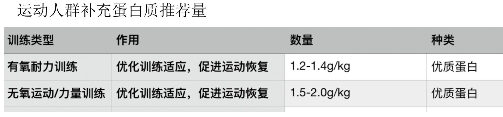
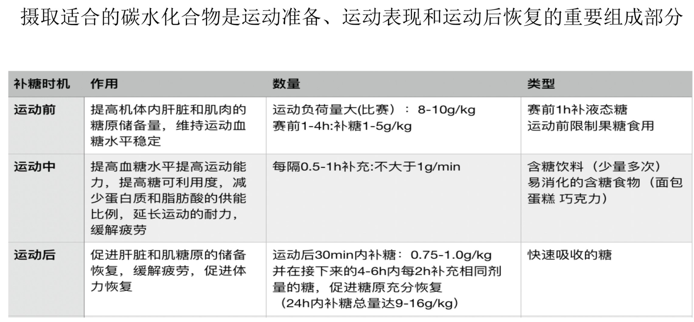

# fitness tips

## :smile:资源
- [ACE-CPT-Notes/ACE 私人教练课程笔记](https://github.com/easyui/ACE-CPT-Notes)

## :smile:蛋白质在人体内最终消化成氨基酸
## :smile:大米缺少一种必须氨基酸：赖氨酸
## :smile:碳水化合物最终都是转化为葡萄糖
## :smile:力量训练首先消耗肌肉里的肌糖原，所以肌糖原充足有利于提升训练效率,其次消耗肝脏中的糖原，最后是血液中的糖原。
## :smile:血糖指数（GI）
血糖指数（GI）:反映人体吸收50g碳水化合物后血液中血糖水平上升速率的指标。

高GI：>70 ,中GI: 55~70 ,低GI: <55
## :smile:矿物质的常量元素：钾，钙，钠，镁，磷，硫，氯，剩余其他都是微量元素。
## :smile:运动人群蛋白质补充量

## :smile:肌肉、肝脏、血液中都能存储碳水化合物。
## :smile:运动的糖原补充

## :smile:能量单位
营养学上所用能量单位常以千卡（kcal）表示，相当于1个大气压下将1000g水升高1℃所需要的能量。

> 1kcal = 4.184kj
## :smile:参与供能的营养素有哪些，每克各供给能量是多少？
- 碳水化合物（1g碳水化合物提供4kcal能量）
- 脂肪（1g脂肪提供9kcal能量）
- 蛋白质（1g蛋白质提供4kcal能量）

> 碳水化合物、脂类、蛋白质都是宏量营养素，矿物质、维生素都是微量营养素。

## :smile:七大营养素有哪些？哪些是宏量营养素，哪些是微量营养素？
- 蛋白质（宏量营养素）
   - 完全蛋白质：肉、蛋、乳、大豆
   - 半完全蛋白质：小麦中麦胶蛋白
   - 不完全蛋白质：玉米中玉米蛋白质、动物结缔组织、肉皮中胶质蛋白、豌豆中豆球蛋白
- 碳水化合物（宏量营养素）
   - 单糖：葡萄糖、果糖、半乳糖
   - 双糖：麦芽糖、蔗糖、乳糖
   - 多糖：淀粉、糖原、膳食纤维
- 脂类（宏量营养素）
   - 脂肪（甘油酯）
      - 甘油
      - 脂肪酸
         - 饱和脂肪酸
         - 不饱和脂肪酸
            - 单不饱和脂肪酸
            - 多不饱和脂肪酸
   - 类脂
      - 磷脂（卵磷脂、脑磷脂及神经磷脂）
      - 固醇类（胆固醇、类固醇激素、维生素D及胆汁酸的前体）
- 矿物质（微量营养素）
   - 常量元素：钾、钙、钠、镁、磷、硫、氯
   - 微量元素：铁、锌、碘、硒、氟、铜、钼、锰、铬等
- 维生素（微量营养素）
   - 水溶性维生素：维生素b族，维生素c
   - 脂溶性维生素：维生素a、d、e、k
- 水
- 膳食纤维
   - 可溶性纤维
   - 不可溶性纤维
## :smile:内旋：又叫前旋，外旋：又叫后旋
## :smile:正常成年人安静时的脉压为30-40毫米汞柱
## :smile:正常人安静时心率约在60-100次每分钟
## :smile:
## :smile:
