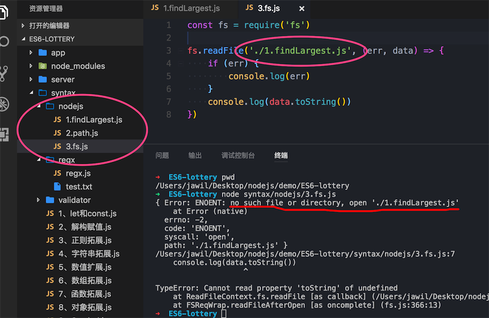
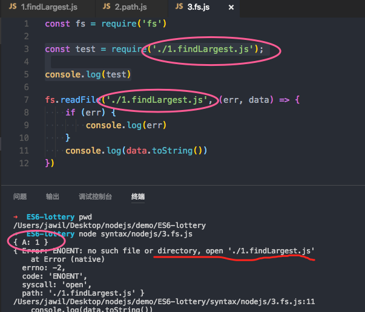
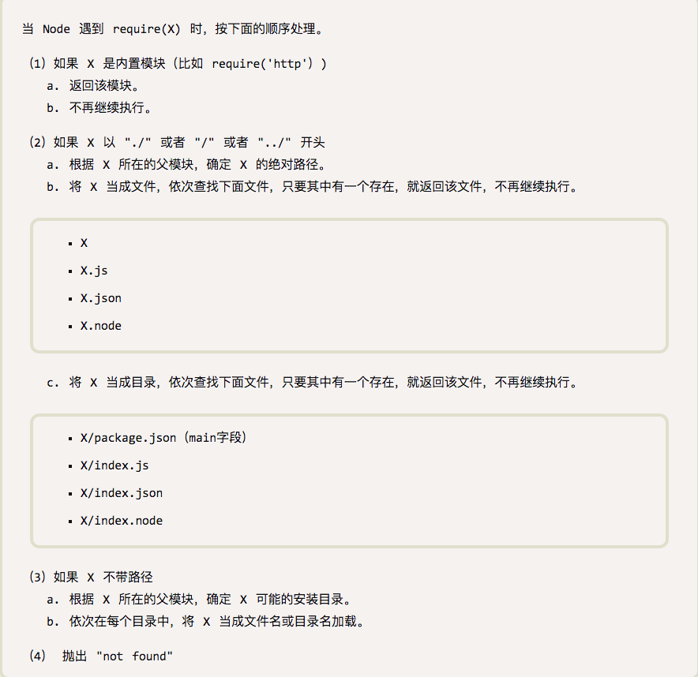

# __dirname、__filename、process.cwd()

## 缘由
说一下当时的情形：



我纳闷的很半天，我明明就是读取当前目录下的`1.findLargest.js`，为什么提示找不到这个文件，运行了几遍，死活找不到`1.findLargest.js`这个文件。

后来才发现是因为运行这个文件不是从当前目录运行了，从图中可以看出，当前的目录是`/Users/jawil/Desktop/nodejs/demo/ES6-lottery/syntax/nodejs`，而我运行这个脚本的目录是`/Users/jawil/Desktop/nodejs/demo/ES6-lottery`；这就是问题的所在了。不过为什么运行脚本的位置也会影响这个路径呢，且往下看。

## 探索
计算机不会欺骗人，一切按照规则执行，说找不到这个文件，那肯定就是真的找不到，至于为什么找不到，那就是因为我们理解有偏差，我最初理解的`./`是当前执行js文件所在的文件夹的绝对路径，然后Node.js的理解却不是这样的，我们慢慢往下看。

Node.js中的文件路径大概有 `__dirname`, `__filename`, `process.cwd()`, `./` 或者 `../`，前三个都是绝对路径，为了便于比较，`./` 和 `../` 我们通过 `path.resolve('./')`来转换为绝对路径。

简单说一下这几个路径的意思，：

```
__dirname：    获得当前执行文件所在目录的完整目录名
__filename：   获得当前执行文件的带有完整绝对路径的文件名
process.cwd()：获得当前执行node命令时候的文件夹目录名 
./：           文件所在目录
```

先看一看我电脑当前的目录结构：

```
syntax/
    -nodejs/
        -1.findLargest.js
        -2.path.js
        -3.fs.js
    -regs
        -regx.js
        -test.txt
```

在 path.js 里面我们写这些代码，看看输出是什么：

```
const path = require('path')
console.log('__dirname：', __dirname)
console.log('__filename：', __filename)
console.log('process.cwd()：', process.cwd())
console.log('./：', path.resolve('./'))
```

在当前目录下也就是nodejs目录运行 node path.js，我们看看输出结果：

```
__dirname：     /Users/jawil/Desktop/nodejs/demo/ES6-lottery/syntax/nodejs
__filename：    /Users/jawil/Desktop/nodejs/demo/ES6-lottery/syntax/nodejs/2.path.js
process.cwd()： /Users/jawil/Desktop/nodejs/demo/ES6-lottery/syntax/nodejs
./：            /Users/jawil/Desktop/nodejs/demo/ES6-lottery/syntax/nodejs
```

然后在 项目根目录ES6-lottery 目录下运行 node syntax/nodejs/2.path.js，我们再来看看输出结果：

```
__dirname：     /Users/jawil/Desktop/nodejs/demo/ES6-lottery/syntax/nodejs
__filename：    /Users/jawil/Desktop/nodejs/demo/ES6-lottery/syntax/nodejs/2.path.js
process.cwd()： /Users/jawil/Desktop/nodejs/demo/ES6-lottery
./：            /Users/jawil/Desktop/nodejs/demo/ES6-lottery
```

答案显而易见？我们可以通过上面的例子对比，暂时得出表面的结论：

```
__dirname: 总是返回被执行的 js 所在文件夹的绝对路径
__filename: 总是返回被执行的 js 的绝对路径
process.cwd(): 总是返回运行 node 命令时所在的文件夹的绝对路径
./: 跟 process.cwd() 一样，返回 node 命令时所在的文件夹的绝对路径
```

## 深入
但是，我们再来看看这个例子，我们在上面的例子加几句代码，然后：

我们在1.findLargest.js先加这句代码

```
exports.A = 1;
```

再来在刚才报错的3.fs.js里面加这两句代码看看：

```
const test = require('./1.findLargest.js');

console.log(test)
```

运行node syntax/nodejs/3.fs.js，最后看看结果：



## 再次疑惑

为什么都是读取./1.findLargest.js文件，一样的路径，为什么require能获取到，而readFile读取不到呢？

于是查了不少资料，看到了一些关于require引入模块的机制，从中学到了不少，也明白了为什么是这样。

我们先了解一下require() 的基本用法：

下面的内容来自[require() 源码解读](http://www.ruanyifeng.com/blog/2015/05/require.html),由阮一峰翻译自《Node使用手册》。



我们从第（2）小条的a部分可以看出：

```
（2）如果 X 以 "./" 或者 "/" 或者 "../" 开头 
　　a. 根据 X 所在的父模块，确定 X 的绝对路径。
　　b. 将 X 当成文件，依次查找下面文件，只要其中有一个存在，就返回该文件，不再继续执行。
```

const test = require('./1.findLargest.js')按照上面规则翻译一遍就是:

1、 根据1.findLargest.js所在的父模块，确定1.findLargest.js的绝对路径为/Users/jawil/Desktop/nodejs/demo/ES6-lottery/syntax/nodejs，关于其中的寻找细节这里不做探讨。

2、 先把1.findLargest.js当成文件，依次查找当前目录下的1.findLargest.js，找到了，就返回该文件，不再继续执行。

根据require的基本规则，对于上面出现的情形也就不足为奇了，更多require的机制和源码解读，请移步：[require() 源码解读](http://www.ruanyifeng.com/blog/2015/05/require.html)。

### 那么关于 ./ 正确的结论是：
在 require() 中使用是跟 __dirname 的效果相同，不会因为启动脚本的目录不一样而改变，在其他情况下跟 process.cwd() 效果相同，是相对于启动脚本所在目录的路径。

## 总结：

- __dirname： 获得当前执行文件所在目录的完整目录名
- __filename： 获得当前执行文件的带有完整绝对路径的文件名
- process.cwd()：获得当前执行node命令时候的文件夹目录名
- ./： 不使用require时候，./与process.cwd()一样，使用require时候，与__dirname一样

只有在 require() 时才使用相对路径(./, ../)的写法，其他地方一律使用绝对路径，如下：

```
// 当前目录下
 path.dirname(__filename) + '/path.js'; 
// 相邻目录下
 path.resolve(__dirname, '../regx/regx.js');
```

最后看看改过之后的结果，不会报错找不到文件了，不管在哪里执行这个脚本文件，都不会出错了，防止以后踩坑。


PS:
> process.cwd()是程序的执行路径，__filename和_dirname是js文件有的属性，区别就很明显了


转自：[Node.js的__dirname，__filename，process.cwd()，./的一些坑](https://github.com/jawil/blog/issues/18)

